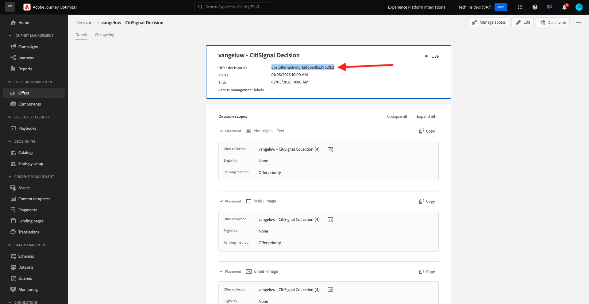

# 如何衡量完成情况？

转到[https://certification.adobe.com](https://certification.adobe.com)并导航到课程&#x200B;**XXX**。

要完成模块，您需要提供完成证明。

以下是每个模块的预期完成校样。

## 开始使用

模块&#x200B;**快速入门**&#x200B;的预期完成证明是您创建的Web演示系统项目的ID。

Web格式的演示系统项目的ID如下所示： `--demoProfileLdap-- - OCUC`。

## 1.1 Adobe Experience Platform数据收集和Web SDK扩展

模块&#x200B;**Data Collection &amp; Web SDK**&#x200B;的预期完成证明是Web的数据收集属性的名称。

Web格式的数据收集属性的名称如下所示： `--demoProfileLdap-- - Demo System (05/02/2022) (enablement) 1644046719474`。

## 1.2数据摄取

模块&#x200B;**数据摄取**&#x200B;的预期完成证明是您创建的2个数据集的数据集ID。

数据集ID格式如下所示： **5f069724723ef41916a8b5d2**。

`--demoProfileLdap-- - Demo System - Event Dataset for Website`

`--demoProfileLdap-- - Demo System - Profile Dataset for Website`

## 1.3联合受众构成

模块&#x200B;**联合受众组合**&#x200B;的预期完成证明是……

## 2.1实时客户资料

模块&#x200B;**实时客户资料**&#x200B;的预期完成证明是您通过UI `--demoProfileLdap-- - Male customers with interest in Montana Wind Jacket`创建的区段的&#x200B;**区段ID**。

区段ID格式如下所示： **8cb7034d-d4ae-4d26-a61f-a76559c12457**。

## 2.2智能服务

模块&#x200B;**Intelligent Services**&#x200B;的预期完成证明是&#x200B;**产品购买倾向客户人工智能服务**&#x200B;的ID。

格式如下所示： **12729**，您可以在打开服务后从URL中检索它。

## 2.3 Real-Time CDP：构建受众并采取行动！

模块&#x200B;**Real-Time CDP**&#x200B;的预期完成证明是&#x200B;**Adobe Target活动**&#x200B;的ID。

格式如下所示： **111804**。

## 2.4 Real-Time CDP：Audience Activation到Microsoft Azure事件中心

模块&#x200B;**RTCDP： EventHub**&#x200B;的预期完成证明是Adobe Experience Platform中&#x200B;**Microsoft Azure事件中心**&#x200B;目标的ID。

您可以在此找到&#x200B;**Microsoft Azure事件中心目标ID**，它类似于&#x200B;**fa3f7ce5-86fd-4096-bf7c-e586fdc096ba**：

## 2.5 Real-Time CDP连接：事件转发

模块&#x200B;**RTCDP连接**&#x200B;的预期完成证明是您的&#x200B;**事件转发属性ID**。

您可在以下位置找到&#x200B;**事件转发属性ID**，它类似于&#x200B;**PR40f44184c888472e9c19d8d602aab0de**：

## 2.6将数据从Apache Kafka流式传输到Real-Time CDP

模块&#x200B;**Apache Kafka**&#x200B;的预期完成证明是源连接器`--demoProfileLdap-- - Kafka`的ID。

ID类似于&#x200B;**f843d50a-ee30-4ca8-a766-0e4f3d29a2f7**，您可以在此处找到它：

## 3.1 Adobe Journey Optimizer：编排

模块&#x200B;**AJO：业务流程**&#x200B;的预期完成证明是您`--demoProfileLdap--AccountCreationEvent`的eventID。

格式如下所示： **227402c540eb8f8855c6b2333adf6d54d7153d9d7d56fa475a6866081c574736**。

## 3.2 Adobe Journey Optimizer：外部数据源和自定义操作

模块&#x200B;**AJO：自定义操作**&#x200B;的预期完成证明是事件`--demoProfileLdap--GeofenceEntry`的eventID。

格式如下所示： **fa42ab7982ba55f039eacec24c1e32e5c51b310c67f0fa559ab49b89b63f4934**。

## 3.3 Adobe Journey Optimizer：Offer decisioning

模块&#x200B;**AJO：优惠**&#x200B;的预期完成证明是您创建的&#x200B;**优惠决策**&#x200B;的ID。

您可在以下位置找到与此&#x200B;**xcore:offer-activity:1122fcc4603ea499**&#x200B;类似的&#x200B;**优惠决策ID**：

## 3.4 Adobe Journey Optimizer：基于事件的历程

模块&#x200B;**AJO： Events**&#x200B;的预期完成证明是您`--demoProfileLdap--StoreEntryEvent`的eventID。

格式如下所示： **e3a8f0bdc0b609667cd96a72a6b1e5aafa0ddaf6ccf121c574e6a2030860a633**。

## 4.1Customer Journey Analytics：使用Analysis Workspace构建功能板

模块&#x200B;**CJA**&#x200B;的预期完成证明是项目`--demoProfileLdap-- - Omnichannel Analysis`的ID。

格式如下所示： **6217344f6249ac70c726db60**，打开项目后，可以在URL中找到它。

## 4.2Customer Journey Analytics：使用BigQuery Source Connector在Adobe Experience Platform中摄取和分析Google Analytics数据

模块&#x200B;**CJA： BigQuery**&#x200B;的预期完成证明是您的&#x200B;**BigQuery** — 连接的ID。

您可在以下位置找到&#x200B;**BigQuery连接ID**，它类似于&#x200B;**85a2394d-8b94-410c-a239-4d8b94b10c38**：

## 5.1查询服务

模块&#x200B;**查询服务**&#x200B;的预期完成证明是`--demoProfileLdap--_callcenter_interaction_analysis`的数据集ID — 完成模块后获得的数据集。

格式如下所示： **62076f68f14a9d194995d4e2**。

[返回所有模块](./overview.md)
