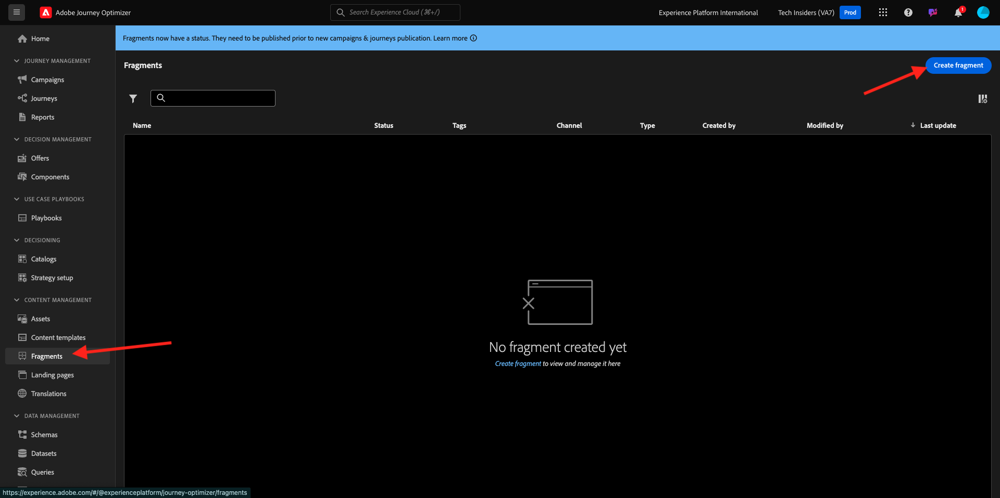
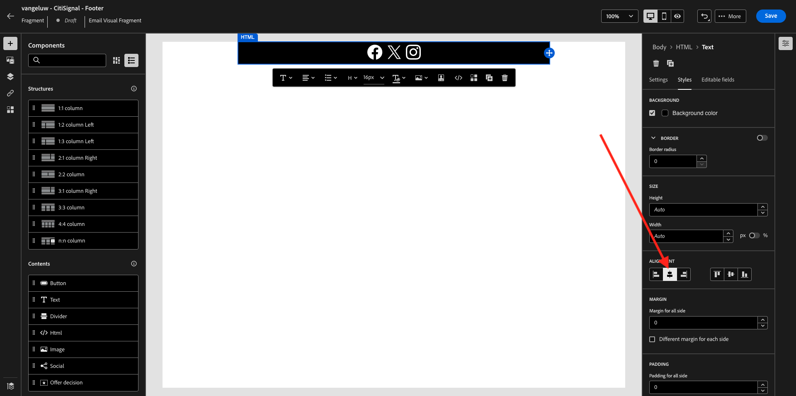

# 3.1.2创建要在消息中使用的片段

在本练习中，您将配置2个片段，1个片段用于可重用的页眉，1个片段用于可重用的页脚。

通过转到[Adobe Experience Cloud](https://experience.adobe.com)登录Adobe Journey Optimizer。 单击&#x200B;**Journey Optimizer**。


您将被重定向到Journey Optimizer中的&#x200B;**主页**&#x200B;视图。 首先，确保使用正确的沙盒。 要使用的沙盒名为`--aepSandboxName--`。


## 3.1.2.1创建您的标头片段

在左侧菜单中，单击&#x200B;**片段**。 片段是Journey Optimizer中可重用的组件，可避免重复并便于将来进行应当影响所有消息的更改，例如对电子邮件中的页眉或页脚的更改。

单击&#x200B;**创建片段**。



输入名称`--aepUserLdap-- - CitiSignal - Header`并选择&#x200B;**类型：可视片段**。 单击&#x200B;**创建**。


你会看到这个。 在左侧菜单中，您将找到可用于定义电子邮件结构（行和列）的结构组件。

将&#x200B;**1:1列**&#x200B;从菜单拖放到画布中。 这将是徽标图像的占位符。


接下来，您可以使用内容组件在这些块中添加内容。 将&#x200B;**Image**&#x200B;组件拖放到第一行的第一个单元格中。 单击&#x200B;**浏览**。


然后，您会看到一个弹出窗口打开，其中显示了您的AEM Assets Media Library。 转到文件夹&#x200B;**citi-signal-images**，单击以选择图像&#x200B;**CitiSignal-Logo-White.png**，然后单击&#x200B;**选择**。

>[!NOTE]
>
>如果您在AEM Assets库中看不到Citi Signal图像，您可以在[此处](../../../assets/ajo/CitiSignal-images.zip)找到它们。 将它们下载到桌面，创建文件夹&#x200B;**citi-signal-images**，然后上传该文件夹中的所有图像。


你会看到这个。 您的图像是白色的，尚未显示。 您现在应该定义背景颜色，以使图像正确显示。 单击&#x200B;**样式**，然后单击&#x200B;**背景颜色**&#x200B;框。


在弹出窗口中，将&#x200B;**十六进制**&#x200B;颜色代码更改为&#x200B;**#8821F4**，然后通过单击&#x200B;**100%**&#x200B;字段来更改焦点。 然后，您会看到应用于图像的新颜色。


现在这个图像也有点大。 让我们将&#x200B;**宽度**&#x200B;切换器滑动到&#x200B;**40%**&#x200B;以更改宽度。


您的标头片段现已准备就绪。 单击&#x200B;**保存**，然后单击箭头返回上一屏幕。


您的片段需要先发布，然后才能使用。 单击&#x200B;**Publish**。


几分钟后，您会看到片段的状态已更改为&#x200B;**实时**。
接下来，您应该为电子邮件的页脚创建新片段。 单击**创建片段**。


## 3.1.2.2创建页脚片段

单击&#x200B;**创建片段**。


输入名称`--aepUserLdap-- - CitiSignal - Footer`并选择&#x200B;**类型：可视片段**。 单击&#x200B;**创建**。


你会看到这个。 在左侧菜单中，您将找到可用于定义电子邮件结构（行和列）的结构组件。

将&#x200B;**1:1列**&#x200B;从菜单拖放到画布中。 这将是页脚内容的占位符。


接下来，您可以使用内容组件在这些块中添加内容。 将&#x200B;**HTML**&#x200B;组件拖放到第一行的第一个单元格中。 单击组件以将其选中，然后单击&#x200B;**&lt;/>**&#x200B;图标以编辑HTML源代码。


你会看到这个。


复制以下HTML代码片段并将其粘贴到Journey Optimizer中的&#x200B;**编辑HTML**&#x200B;窗口中。

```html
<!--[if mso]><table cellpadding="0" cellspacing="0" border="0" width="100%"><tr><td style="text-align: center;" ><![endif]-->
<table style="width: auto; display: inline-block;">
  <tbody>
    <tr class="component-social-container">
      <td style="padding: 5px">
        <a style="text-decoration: none;" href="https://www.facebook.com" data-component-social-icon-id="facebook">
        
        </a>
      </td>
      <td style="padding: 5px">
        <a style="text-decoration: none;" href="https://x.com" data-component-social-icon-id="twitter">
        
        </a>
      </td>
      <td style="padding: 5px">
        <a style="text-decoration: none;" href="https://www.instagram.com" data-component-social-icon-id="instagram">
         
        </a>
      </td>
    </tr>
  </tbody>
</table>
<!--[if mso]></td></tr></table><![endif]-->
```

你就能拥有这个了。 在第7、12和17行，您现在需要使用AEM Assets库中的资源插入图像文件。


确保光标位于第7行，然后单击左侧菜单中的&#x200B;**Assets**。 单击&#x200B;**打开资产选择器**&#x200B;以选择您的图像。


打开文件夹&#x200B;**citi-signal-images**，然后单击选择图像&#x200B;**Icon_Facebook.png**。 单击&#x200B;**选择**。


确保光标位于第12行，然后单击&#x200B;**打开资产选择器**&#x200B;以选择图像。


打开文件夹&#x200B;**citi-signal-images**，然后单击选择图像&#x200B;**Icon_X.png**。 单击&#x200B;**选择**。


确保光标位于第17行，然后单击&#x200B;**打开资产选择器**&#x200B;以选择图像。


打开文件夹&#x200B;**citi-signal-images**，然后单击选择图像&#x200B;**Icon_Instagram.png**。 单击&#x200B;**选择**。


你会看到这个。 单击&#x200B;**保存**。


然后你就可以回到编辑器中了。 您的图标尚未显示，因为背景和图像文件全部为白色。 若要更改背景颜色，请转到&#x200B;**样式**&#x200B;并单击&#x200B;**背景颜色**&#x200B;复选框。


将&#x200B;**十六进制**&#x200B;颜色代码更改为&#x200B;**#000000**。


将对齐方式更改为居中。



让我们在页脚中添加一些其他部分。 将&#x200B;**Image**&#x200B;组件拖放到刚刚创建的HTML组件上方。 单击&#x200B;**浏览**。


单击选择图像文件&#x200B;**`CitiSignal_Footer_Logo.png`**&#x200B;并单击&#x200B;**选择**。


转到&#x200B;**样式**&#x200B;并单击&#x200B;**背景颜色**&#x200B;复选框，让我们将其再次更改为黑色。 将&#x200B;**十六进制**&#x200B;颜色代码更改为&#x200B;**#000000**。


将宽度更改为&#x200B;**20%**&#x200B;并验证对齐方式是否设置为居中。


接下来，将&#x200B;**Text**&#x200B;组件拖放到您创建的HTML组件下。 单击&#x200B;**浏览**。


通过替换占位符文本来复制并粘贴以下文本。

```
1234 N. South Street, Anywhere, US 12345

Unsubscribe

©2024 CitiSignal, Inc and its affiliates. All rights reserved.
```

将&#x200B;**文本对齐方式**&#x200B;设置为居中。


将&#x200B;**字体颜色**&#x200B;更改为白色，**#FFFFFF**。


将&#x200B;**背景颜色**&#x200B;更改为黑色，**#000000**。


选择页脚中的文本&#x200B;**取消订阅**，然后单击菜单栏中的&#x200B;**链接**&#x200B;图标。 将&#x200B;**Type**&#x200B;设置为&#x200B;**外部选择退出/取消订阅**，并将URL设置为&#x200B;**https://aepdemo.net/unsubscribe.html**（取消订阅链接不允许有空白URL）。


你就能拥有这个了。 您的页脚现已准备就绪。 单击&#x200B;**保存**，然后单击箭头返回上一页。


单击&#x200B;**Publish**&#x200B;发布您的页脚，以便将其用在电子邮件中。


几分钟后，您会看到页脚的状态已更改为&#x200B;**实时**。


您现在已经完成了此练习。

下一步： [3.1.3创建您的历程和电子邮件](./ex3.md)

[返回模块3.1](./journey-orchestration-create-account.md)

[返回所有模块](../../../overview.md)
