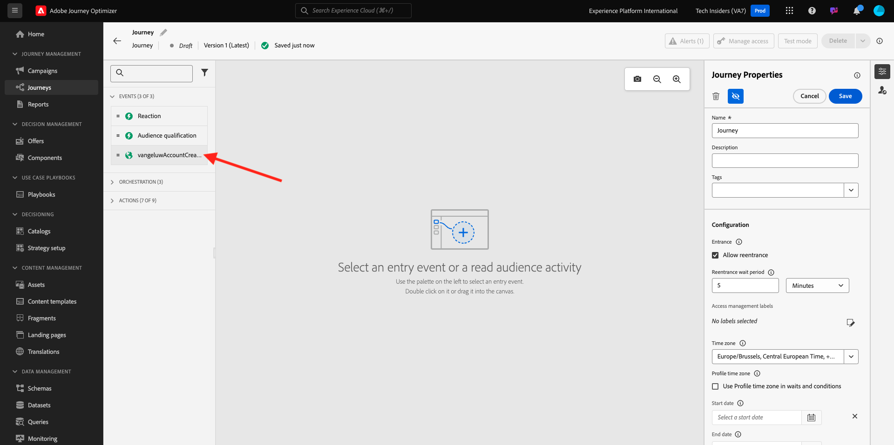
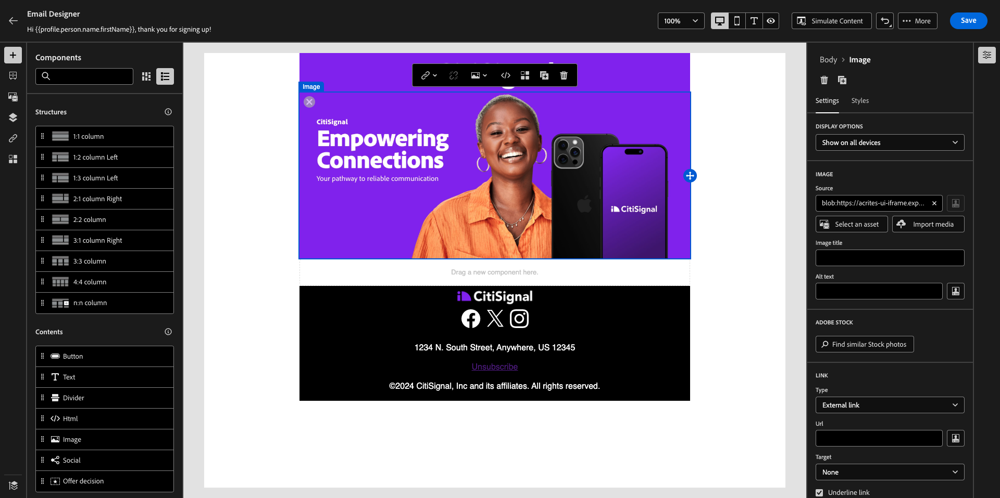

# 3.1.2创建历程和电子邮件

在本练习中，您将配置历程以及当有人在演示网站上创建帐户时需要触发的消息。

通过转到[Adobe Experience Cloud](https://experience.adobe.com)登录Adobe Journey Optimizer。 单击&#x200B;**Journey Optimizer**。

您将被重定向到Journey Optimizer中的&#x200B;**主页**&#x200B;视图。 首先，确保使用正确的沙盒。 要使用的沙盒名为`--aepSandboxName--`。 若要从一个沙盒更改到另一个沙盒，请单击&#x200B;**PRODUCTION Prod (VA7)**，然后从列表中选择该沙盒。 在此示例中，沙盒名为&#x200B;**AEP Enablement FY22**。 然后，您将进入沙盒`--aepSandboxName--`的&#x200B;**主页**&#x200B;视图。

## 3.1.2.1创建历程

在左侧菜单中，单击&#x200B;**历程**。 接下来，单击&#x200B;**创建历程**&#x200B;以创建新旅程。

然后，您将看到一个空的历程屏幕。

在上一个练习中，您创建了一个新的&#x200B;**事件**。 您将其命名为类似于`ldapAccountCreationEvent`，并将`ldap`替换为LDAP。 这是创建事件的结果：

现在，您需要将此活动作为此历程的开头。 为此，您可以转到屏幕左侧，并在事件列表中搜索您的事件。

选择您的活动，并将其拖放到历程画布上。 您的历程现在看起来像这样：

作为历程的第二步，您需要添加一个短的&#x200B;**等待**&#x200B;步骤。 转到屏幕左侧的&#x200B;**业务流程**&#x200B;部分以查找此项。 您将使用配置文件属性，并且需要确保将它们填充到Real-time Customer Profile。

您的历程现在看起来像这样。 在屏幕的右侧，您需要配置等待时间。 设置为1分钟。 这将为配置文件属性在事件触发后保持可用留出充足的时间。

单击&#x200B;**确定**&#x200B;以保存更改。

作为历程的第三步，您需要添加&#x200B;**电子邮件**&#x200B;操作。 转到屏幕左侧的&#x200B;**操作**，选择&#x200B;**电子邮件**&#x200B;操作，然后将其拖放到历程的第二个节点上。 您现在可以看到此内容。

将&#x200B;**类别**&#x200B;设置为&#x200B;**营销**，并选择一个允许您发送电子邮件的电子邮件表面。 在这种情况下，要选择的电子邮件表面为&#x200B;**电子邮件**。 确保同时启用了&#x200B;**电子邮件**&#x200B;和&#x200B;**电子邮件打开次数**&#x200B;的复选框。

下一步是创建消息。 为此，请单击&#x200B;**编辑内容**。

## 3.1.2.2创建消息

若要创建消息，请单击&#x200B;**编辑内容**。

您现在可以看到此内容。

单击&#x200B;**主题行**&#x200B;文本字段。

在文本区域中，开始写入&#x200B;**您好**

主题行尚未完成。 接下来，您需要为存储在`profile.person.name.firstName`下的字段&#x200B;**名字**&#x200B;引入个性化令牌。 在左侧菜单中，向下滚动以查找&#x200B;**人员**&#x200B;元素，然后单击箭头以更深入地查看。

现在，找到&#x200B;**全名**&#x200B;元素并单击箭头可更深入了解。

最后，找到&#x200B;**名字**&#x200B;字段并单击它旁边的&#x200B;**+**&#x200B;号。 然后，您会看到个性化令牌显示在文本字段中。

接下来，添加文本&#x200B;**，感谢您注册！**&#x200B;的问题。单击&#x200B;**保存**。

你以后会回到这里的。 单击&#x200B;**向Designer发送电子邮件**&#x200B;以创建电子邮件的内容。

在下一个屏幕中，将提示您使用3种不同的方法来提供电子邮件的内容：

- **从头开始设计**：从空白画布开始，使用WYSIWYG编辑器拖放结构和内容组件以可视方式构建电子邮件的内容。
- **对您自己的电子邮件进行编码**：使用HTML对电子邮件模板进行编码，以创建您自己的电子邮件模板
- **导入HTML**：导入一个现有的HTML模板，您可以编辑该模板。

单击&#x200B;**从头开始设计**。

在左侧菜单中，您将找到可用于定义电子邮件结构（行和列）的结构组件。

从菜单将&#x200B;**1:2列（左**）拖放到画布中。 这将是徽标图像的占位符。

将&#x200B;**1:1列**&#x200B;拖放到上一个组件下。 这将是横幅块。

将&#x200B;**1:2列（左**）拖放到上一个组件下。 这将是实际内容，左侧是图像，右侧是文本。

接下来，将&#x200B;**1:1列**&#x200B;拖放到上一个组件下。 这将是电子邮件的页脚。 您的画布现在应如下所示：

接下来，让我们使用内容组件在这些块中添加内容。 单击&#x200B;**内容组件**&#x200B;菜单项

将&#x200B;**Image**&#x200B;组件拖放到第一行的第一个单元格中。 单击&#x200B;**浏览**。

你会看到这个。 导航到文件夹&#x200B;**enablement-assets**&#x200B;并选择文件&#x200B;**luma-logo.png**。 单击&#x200B;**选择**。

您现在已返回此处：

转到&#x200B;**内容组件**&#x200B;并将&#x200B;**图像**&#x200B;组件拖放到第一行的第一个单元格中。 单击&#x200B;**浏览**。

在&#x200B;**Assets**&#x200B;弹出窗口中，转到&#x200B;**enablement-assets**&#x200B;文件夹。 在此文件夹中，您将找到创意团队之前准备和上传的所有资产。 选择&#x200B;**module23-thankyou-new.png**，然后单击&#x200B;**选择**。

然后，您将拥有以下权限：

选择您的图像，然后在右菜单中，向下滚动直到看到&#x200B;**大小**&#x200B;宽度滑块组件为止。 使用滑块将宽度更改为&#x200B;**60%**。

接下来，转到&#x200B;**内容组件**&#x200B;并将结构组件中的&#x200B;**文本**&#x200B;组件拖放到第四行。

选择默认文本&#x200B;**请在此处键入您的文本。**，就像处理任何文本编辑器一样。 请改写&#x200B;**亲爱的**。 请注意在文本模式下显示的文本工具栏。

在工具栏中，单击&#x200B;**添加个性化**&#x200B;图标。

接下来，您需要带入存储在`profile.person.name.firstName`下的&#x200B;**名字**&#x200B;个性化令牌。 在菜单中，找到&#x200B;**人员**&#x200B;元素，向下钻取到&#x200B;**全名**&#x200B;元素，然后单击&#x200B;**+**&#x200B;图标以将“名字”字段添加到表达式编辑器中。

单击&#x200B;**保存**。

现在，您会注意到个性化字段已添加到文本中的方式。

在同一文本字段中，按&#x200B;**Enter**&#x200B;两次以添加两行并写入&#x200B;**感谢您使用Luma创建帐户！**。

要执行的最终检查以确保您的电子邮件已准备好进行预览，请单击&#x200B;**模拟内容**&#x200B;按钮。

首先确定您要用于预览的配置文件。 通过单击&#x200B;**输入身份命名空间**&#x200B;字段旁边的图标选择&#x200B;**电子邮件**&#x200B;命名空间。

在身份命名空间列表中，选择&#x200B;**电子邮件**&#x200B;命名空间。

在&#x200B;**标识值**&#x200B;字段中，输入已存储在Real-time Customer Profile中的先前演示配置文件的电子邮件地址。 例如&#x200B;**woutervangeluwe+06022022-01@gmail.com**，然后单击&#x200B;**查找测试配置文件**&#x200B;按钮

配置文件显示在表中后，单击&#x200B;**预览**&#x200B;选项卡以访问预览屏幕。

预览就绪后，验证主题行中的个性化设置是否正确，正文文本以及退订链接都会以超链接的形式突出显示。

单击&#x200B;**关闭**&#x200B;以关闭预览。

单击&#x200B;**保存**&#x200B;以保存您的消息。

单击左上角主题行文本旁边的&#x200B;**箭头**，返回消息仪表板。

您现在已经完成了注册电子邮件的创建。 单击左上角的箭头可返回您的历程。

单击&#x200B;**确定**。

## 3.1.2.3 Publish您的历程

您仍需要为历程命名。 您可以通过单击屏幕右上角的&#x200B;**属性**&#x200B;图标来执行此操作。

然后，您可以在此处输入历程的名称。 请使用`--aepUserLdap-- - Account Creation Journey`。 单击&#x200B;**确定**&#x200B;以保存更改。

您现在可以通过单击&#x200B;**Publish**&#x200B;发布历程。

再次单击&#x200B;**Publish**。

然后，您将看到一个绿色确认栏，其中显示您的历程现已发布。

您现在已经完成了此练习。

下一步： [3.1.3更新您的数据收集属性并测试您的历程](./ex3.md)

[返回模块3.1](./journey-orchestration-create-account.md)

[返回所有模块](../../../overview.md)
