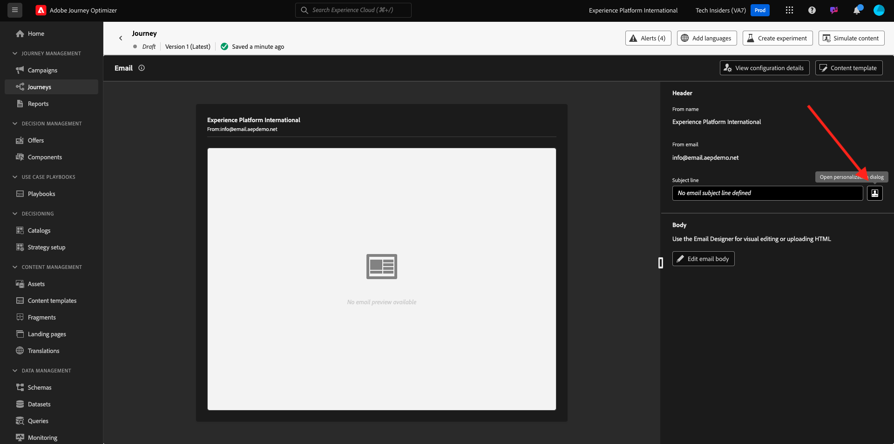
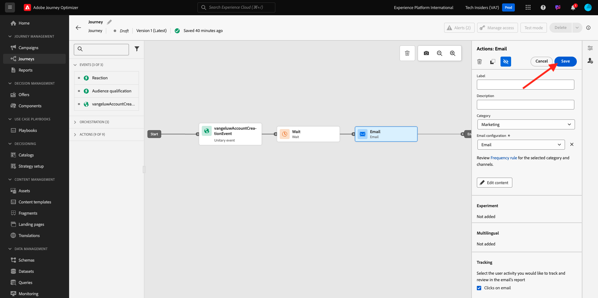

# 3.1.3创建您的历程、片段和消息

在本练习中，您将配置历程以及当有人在演示网站上创建帐户时需要触发的消息。

通过转到[Adobe Experience Cloud](https://experience.adobe.com)登录Adobe Journey Optimizer。 单击&#x200B;**Journey Optimizer**。


您将被重定向到Journey Optimizer中的&#x200B;**主页**&#x200B;视图。 首先，确保使用正确的沙盒。 要使用的沙盒名为`--aepSandboxName--`。


## 3.1.3.1创建您的历程

在左侧菜单中，单击&#x200B;**历程**。 接下来，单击&#x200B;**创建历程**&#x200B;以创建新旅程。


然后，您将看到一个空的历程屏幕。


在上一个练习中，您创建了一个新的&#x200B;**事件**。 您将其命名为类似于`--aepUserLdap--AccountCreationEvent`，并将`ldap`替换为LDAP。 这是创建事件的结果：


现在，您需要将此活动作为此历程的开头。 为此，您可以转到屏幕左侧，并在事件列表中搜索您的事件。


选择您的活动，并将其拖放到历程画布上。 您的历程现在看起来像这样：


作为历程的第二步，您需要添加一个短的&#x200B;**等待**&#x200B;步骤。 转到屏幕左侧的&#x200B;**业务流程**&#x200B;部分以查找此项。 您将使用配置文件属性，并且需要确保将它们填充到Real-time Customer Profile。


您的历程现在看起来像这样。 在屏幕的右侧，您需要配置等待时间。 设置为1分钟。 这将为配置文件属性在事件触发后保持可用留出充足的时间。 单击&#x200B;**保存**&#x200B;以保存更改。


作为历程的第三步，您需要添加&#x200B;**电子邮件**&#x200B;操作。 转到屏幕左侧的&#x200B;**操作**，选择&#x200B;**电子邮件**&#x200B;操作，然后将其拖放到历程的第二个节点上。 您现在可以看到此内容。


将&#x200B;**类别**&#x200B;设置为&#x200B;**营销**&#x200B;并选择允许您发送电子邮件的电子邮件配置。 在这种情况下，要选择的电子邮件配置是&#x200B;**电子邮件**。 确保同时启用了&#x200B;**电子邮件**&#x200B;和&#x200B;**电子邮件打开次数**&#x200B;的复选框。


## 3.1.3.2创建消息

若要创建消息，请单击&#x200B;**编辑内容**。


您现在可以看到此内容。


单击&#x200B;**打开个性化对话框**&#x200B;图标。



写入文本`Hi `。 接下来，您需要为存储在`profile.person.name.firstName`下的字段&#x200B;**名字**&#x200B;引入个性化令牌。 在左侧菜单中，导航以查找&#x200B;**人员>全名>名字**&#x200B;字段，然后单击&#x200B;**+**&#x200B;图标。 然后，您会看到个性化令牌显示在文本字段中。


接下来，添加文本&#x200B;**，感谢您注册！**&#x200B;的问题。单击&#x200B;**保存**。


您现在可以开始配置电子邮件的正文。 单击&#x200B;**编辑电子邮件正文**。


在开始创建实际消息本身的内容之前，最好考虑消息中的内容。 邮件中的某些内容是邮件本身所独有的，但其他部分是标准组件，对于您将发送给客户的每封电子邮件，这些组件可能都相同。

在上一个练习中，您已在Journey Optimizer中创建了这些标准组件作为片段，您现在可以在此消息以及您将创建的所有其他未来消息中引用这些片段。

在下一个屏幕中，将提示您使用3种不同的方法来提供电子邮件的内容：

- **从头开始设计**：从空白画布开始，使用WYSIWYG编辑器拖放结构和内容组件以可视方式构建电子邮件的内容。
- **对您自己的电子邮件进行编码**：使用HTML对电子邮件模板进行编码，以创建您自己的电子邮件模板
- **导入HTML**：导入一个现有的HTML模板，您可以编辑该模板。

单击&#x200B;**从头开始设计**。


在左侧菜单中，您将找到可用于定义电子邮件结构（行和列）的结构组件。


您还可以在左侧菜单中找到&#x200B;**片段**，您可以在其中看到您之前创建的片段。


在将页眉和页脚添加到画布之前，您需要向电子邮件添加2个结构。 单击左侧菜单中的&#x200B;**+**&#x200B;图标，然后将2 **1:1列**&#x200B;组件拖动到画布上。


在左侧菜单中，返回&#x200B;**片段**。 将页眉片段拖放到第一个组件中，将页脚片段拖放到第二个组件中。 你会看到这个。


单击左侧菜单中的&#x200B;**+**&#x200B;图标，然后将另外2个&#x200B;**1:1列**&#x200B;组件拖放到画布上的页眉和页脚之间。


将&#x200B;**Image**&#x200B;组件拖放到第一个&#x200B;**1:1列**&#x200B;组件中。 单击&#x200B;**浏览**。


在&#x200B;**citi-signal-images**&#x200B;文件夹中。 选择图像&#x200B;**`welcome_email_image.png`**&#x200B;并单击&#x200B;**选择**。


然后，您将拥有以下权限：


接下来，转到&#x200B;**Contents**&#x200B;并将&#x200B;**Text**&#x200B;组件拖放到结构组件的第四行。


选择默认文本&#x200B;**请在此处键入您的文本。**，就像处理任何文本编辑器一样。 请改写&#x200B;**欢迎使用家庭版，**。 在工具栏中，单击&#x200B;**添加个性化**&#x200B;图标。


接下来，您需要带入存储在`profile.person.name.firstName`下的&#x200B;**名字**&#x200B;个性化令牌。 在菜单中，找到&#x200B;**人员**&#x200B;元素，向下钻取到&#x200B;**全名**&#x200B;元素，然后单击&#x200B;**+**&#x200B;图标以将“名字”字段添加到表达式编辑器中。

单击&#x200B;**保存**。


现在，您会注意到个性化字段已添加到文本中的方式。


在同一文本字段中，按&#x200B;**Enter**&#x200B;两次以添加两行并复制和粘贴以下文本：

```
Welcome aboard! We're thrilled to have you join the CitiSignal family. 
As a valued member of our community, you're now poised to experience top-notch telecommunications services that cater to your every need.

At CitiSignal, we understand that staying connected is more than just a convenience - it's a necessity. Whether you're browsing the web, streaming your favourite content, or keeping in touch with loved ones, we're here to ensure you have the best tools and resources at your fingertips.
```


将&#x200B;**文本对齐方式**&#x200B;设置为居中，并根据自己的需要随意调整邮件的外观。 完成后，单击&#x200B;**保存**。


要执行的最终检查以确保您的电子邮件已准备好进行预览，请单击&#x200B;**模拟内容**&#x200B;按钮。


在模拟电子邮件之前，您需要添加测试用户档案。 单击&#x200B;**管理测试配置文件**。


通过单击&#x200B;**输入身份命名空间**&#x200B;字段旁边的图标选择&#x200B;**电子邮件**&#x200B;命名空间。

在身份命名空间列表中，选择&#x200B;**电子邮件**&#x200B;命名空间。 在&#x200B;**标识值**&#x200B;字段中，输入您在上一个练习中使用的且已存储在Adobe Experience Platform中的上一个配置文件的电子邮件地址。 单击&#x200B;**添加配置文件**。 返回上一个屏幕。


然后，您将会看到您的电子邮件，该邮件现在已针对此客户个人资料进行了模拟。 您现在可以在主题行和正文中验证个性化设置，并根据需要发送验证电子邮件。

单击&#x200B;**关闭**&#x200B;以关闭预览。


单击“保存”****&#x200B;保存您的邮件，然后单击左上角主题行文本旁边的&#x200B;**箭头**&#x200B;返回邮件仪表板。


单击&#x200B;**箭头**&#x200B;以返回您的历程。


## 3.1.3.3 Publish您的历程

单击&#x200B;**保存**。



您仍需要为历程命名。 您可以通过单击屏幕右上角的&#x200B;**属性**&#x200B;图标来执行此操作。


然后，您可以在此处输入历程的名称。 请使用`--aepUserLdap-- - Registration Journey`。 单击&#x200B;**保存**。


您现在可以通过单击&#x200B;**Publish**&#x200B;发布历程。


再次单击&#x200B;**Publish**。


几分钟后，历程的状态将更改为&#x200B;**实时**，您将看到历程性能的实时仪表板。


您现在已经完成了此练习。

下一步： [3.1.4更新您的数据收集属性并测试您的历程](./ex4.md)

[返回模块3.1](./journey-orchestration-create-account.md)

[返回所有模块](../../../overview.md)
