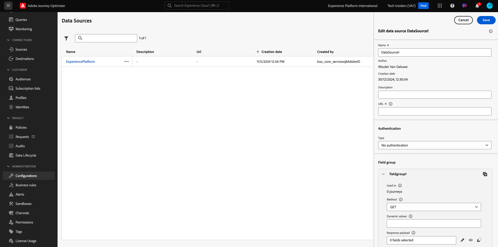
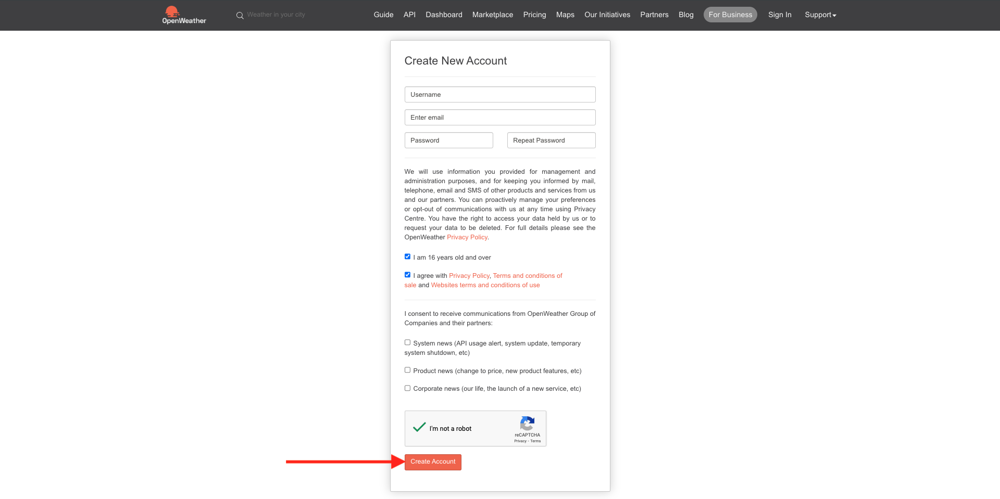
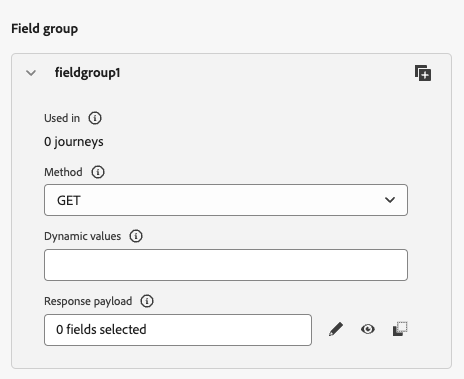

# 3.2.2定义外部数据源

在本练习中，您将使用Adobe Journey Optimizer创建一个自定义外部数据源。

通过转到[Adobe Experience Cloud](https://experience.adobe.com)登录Adobe Journey Optimizer。 单击&#x200B;**Journey Optimizer**。


您将被重定向到Journey Optimizer中的&#x200B;**主页**&#x200B;视图。 首先，确保使用正确的沙盒。 要使用的沙盒名为`--aepSandboxName--`。 若要从一个沙盒更改到另一个沙盒，请单击&#x200B;**PRODUCTION Prod (VA7)**，然后从列表中选择该沙盒。 在此示例中，沙盒名为&#x200B;**AEP Enablement FY22**。 然后，您将进入沙盒`--aepSandboxName--`的&#x200B;**主页**&#x200B;视图。


在左侧菜单中，向下滚动并单击&#x200B;**配置**。 接下来，单击&#x200B;**数据源**&#x200B;下的&#x200B;**管理**&#x200B;按钮。


您随后将看到&#x200B;**数据源**列表。
单击**创建数据Source**&#x200B;以开始添加数据源。


您将会看到一个空的数据源弹出窗口。



在开始配置之前，您需要具有&#x200B;**打开天气地图**&#x200B;服务的帐户。 按照以下步骤创建帐户并获取API密钥。

转到[https://openweathermap.org/](https://openweathermap.org/)。 在主页上单击&#x200B;**登录**。


单击&#x200B;**创建帐户**。


请填写详细信息。



单击&#x200B;**创建帐户**。


然后，您将被重定向到帐户页面。


在菜单中，单击&#x200B;**API密钥**&#x200B;以检索API密钥，您需要设置该密钥自定义外部数据源。


**API密钥**&#x200B;类似于： `b2c4c36b6bb59c3458d6686b05311dc3`。

您可以在[此处](https://openweathermap.org/current)找到&#x200B;**当前天气**&#x200B;的&#x200B;**API文档**。

在我们的用例中，我们将根据客户所在的城市实施与开放天气图的连接。


返回&#x200B;**Adobe Journey Optimizer**，进入您的空&#x200B;**外部数据Source**&#x200B;弹出窗口。


作为数据源的名称，请使用`--aepUserLdap--WeatherApi`。 在此示例中，数据源名称为`vangeluwWeatherApi `。

将描述设置为： `Access to the Open Weather Map`。

开放天气地图API的URL为： **http://api.openweathermap.org/data/2.5/weather?units=metric**


接下来，您需要选择要使用的身份验证。

使用以下变量：

| 字段 | 值 |
|:-----------------------:| :-----------------------|
| 类型 | **API密钥** |
| 名称 | **APPID** |
| 值 | **您的API密钥** |
| 位置 | **查询参数** |


最后，您需要定义&#x200B;**FieldGroup**，这基本上是您将发送到天气API的请求。 在我们的示例中，我们想使用城市的名称来请求该城市的当前天气。



根据天气API文档，我们需要发送参数`q=City`。


为了匹配预期的API请求，请按如下方式配置FieldGroup：

>[!IMPORTANT]
>
>字段组名称必须是唯一的，请使用此命名约定： `--aepUserLdap--WeatherByCity`，因此在这种情况下，名称应为`vangeluwWeatherByCity`


对于响应有效负载，您需要粘贴天气API将发送的响应示例。

您可以在API文档页面[此处](https://openweathermap.org/current)找到预期的API JSON响应。


或者，您可以从此处复制JSON响应：

```json
{"coord": { "lon": 139,"lat": 35},
  "weather": [
    {
      "id": 800,
      "main": "Clear",
      "description": "clear sky",
      "icon": "01n"
    }
  ],
  "base": "stations",
  "main": {
    "temp": 281.52,
    "feels_like": 278.99,
    "temp_min": 280.15,
    "temp_max": 283.71,
    "pressure": 1016,
    "humidity": 93
  },
  "wind": {
    "speed": 0.47,
    "deg": 107.538
  },
  "clouds": {
    "all": 2
  },
  "dt": 1560350192,
  "sys": {
    "type": 3,
    "id": 2019346,
    "message": 0.0065,
    "country": "JP",
    "sunrise": 1560281377,
    "sunset": 1560333478
  },
  "timezone": 32400,
  "id": 1851632,
  "name": "Shuzenji",
  "cod": 200
}
```

将上述JSON响应复制到剪贴板，然后转到自定义数据源配置屏幕。

单击&#x200B;**编辑有效负载**&#x200B;图标。


您将看到一个弹出窗口，您现在必须粘贴上述JSON响应。


粘贴您的JSON响应，之后您将看到此内容。 单击&#x200B;**保存**。


您的自定义数据源配置现已完成。 向上滚动并单击&#x200B;**保存**。


您的数据源现已创建成功，并且是&#x200B;**数据源**&#x200B;列表的一部分。


下一步： [3.2.3定义自定义操作](./ex3.md)

[返回模块3.2](journey-orchestration-external-weather-api-sms.md)

[返回所有模块](../../../overview.md)
