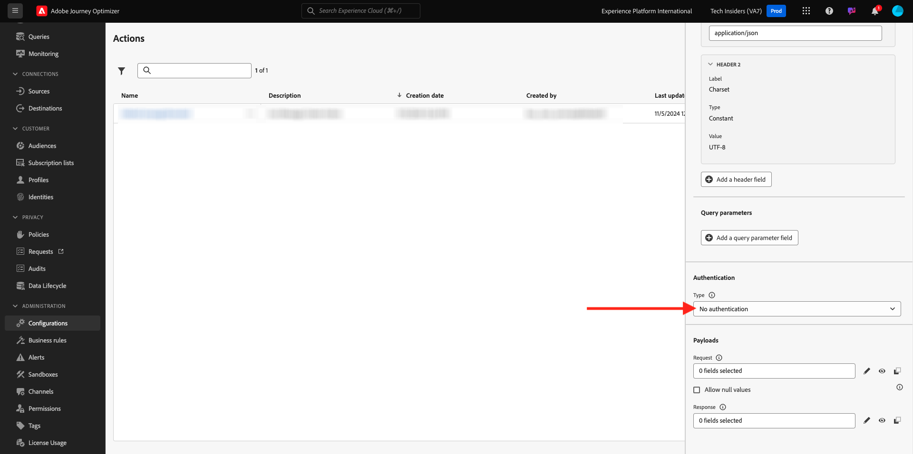

# 3.2.3定义自定义操作

在本练习中，您将结合使用Adobe Journey Optimizer来创建两个自定义操作。

通过转到[Adobe Experience Cloud](https://experience.adobe.com)登录Adobe Journey Optimizer。 单击&#x200B;**Journey Optimizer**。


您将被重定向到Journey Optimizer中的&#x200B;**主页**&#x200B;视图。 首先，确保使用正确的沙盒。 要使用的沙盒名为`--aepSandboxName--`。 若要从一个沙盒更改到另一个沙盒，请单击&#x200B;**PRODUCTION Prod (VA7)**，然后从列表中选择该沙盒。 在此示例中，沙盒名为&#x200B;**AEP Enablement FY22**。 然后，您将进入沙盒`--aepSandboxName--`的&#x200B;**主页**&#x200B;视图。


在左侧菜单中，向下滚动并单击&#x200B;**配置**。 接下来，单击&#x200B;**操作**&#x200B;下的&#x200B;**管理**&#x200B;按钮。


您随后将看到&#x200B;**操作**&#x200B;列表。


您将定义一个向Slack渠道发送文本的操作。

## 3.2.3.1操作：向Slack渠道发送文本

现在，您将使用现有的Slack渠道并将消息发送到该Slack渠道。 Slack具有易于使用的API，我们将使用Adobe Journey Optimizer触发其API。


单击&#x200B;**创建操作**&#x200B;以开始添加新操作。


您将会看到一个空的“操作”弹出窗口。


作为操作的名称，请使用`--aepUserLdap--TextSlack`。 在此示例中，操作名称为`vangeluwTextSlack`。

将描述设置为： `Send Text to Slack`。


对于&#x200B;**URL配置**，请使用此：

- URL： `https://2mnbfjyrre.execute-api.us-west-2.amazonaws.com/prod`
- 方法： **POST**

>[!NOTE]
>
>上述URL引用AWS Lambda函数，该函数随后会将您的请求转发到上述Slack渠道。 这是为了保护对Adobe拥有的Slack渠道的访问。 如果您拥有自己的Slack渠道，则应通过[https://api.slack.com/](https://api.slack.com/)创建一个Slack应用，然后需要在该Slack应用中创建传入Webhook，然后将上述URL替换为传入Webhook URL。

您无需更改标题字段。


**身份验证**&#x200B;应设置为&#x200B;**无身份验证**。



对于&#x200B;**操作参数**，您需要定义应将哪些字段发送到Slack。 从逻辑上讲，我们希望让Adobe Journey Optimizer和Adobe Experience Platform成为个性化的大脑，因此要发送到Slack的文本应该由Adobe Journey Optimizer定义，然后发送到Slack以供执行。

因此，对于&#x200B;**操作参数**，请单击&#x200B;**编辑有效负载**&#x200B;图标。


然后您会看到一个空的弹出窗口。


复制以下文本并将其粘贴到空弹出窗口中。

```json
{
 "text": {
  "toBeMapped": true,
  "dataType": "string",
  "label": "textToSlack"
 }
}
```

仅供参考：通过指定以下字段，将从客户历程访问这些字段，并且您可以从历程动态填充它们：

**&quot;toBeMapped&quot;： true，**

**&quot;dataType&quot;： &quot;string&quot;，**

**&quot;label&quot;： &quot;textToSlack&quot;**

您随后将看到以下内容：


单击&#x200B;**保存**。


向上滚动并再次单击&#x200B;**保存**&#x200B;以保存您的自定义操作。


您的自定义操作现已成为&#x200B;**操作**&#x200B;列表的一部分。


您已定义事件、外部数据源和操作。 现在，让我们将所有这些整合到一个历程中。

下一步： [3.2.4创建您的历程和消息](./ex4.md)

[返回模块8](journey-orchestration-external-weather-api-sms.md)

[返回所有模块](../../../overview.md)
