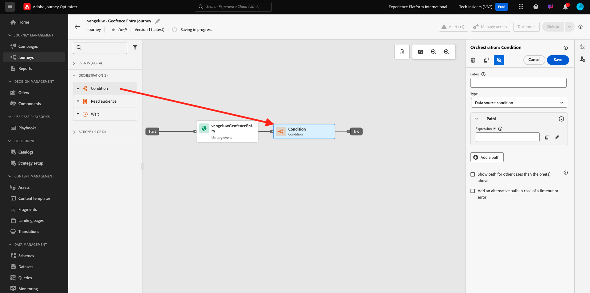
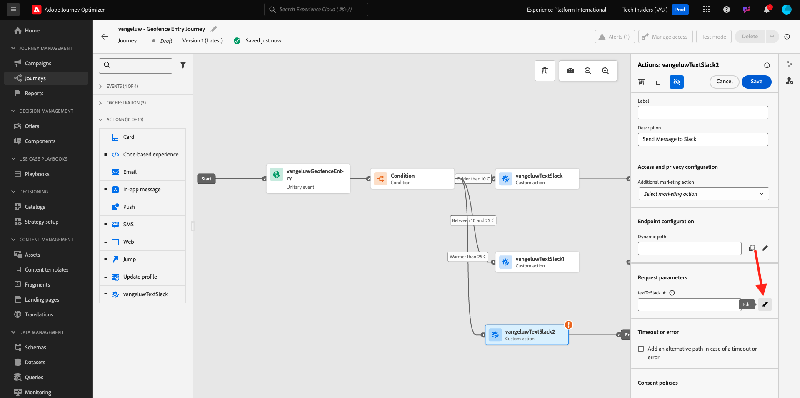

# 3.2.4创建历程和消息

在本练习中，您将使用Adobe Journey Optimizer创建一个历程和若干短信。

对于此用例，目标是根据客户所在位置的天气条件发送不同的消息。 已定义三种方案：

- 摄氏10度以下
- 在10°和25°C之间
- 温度高于25摄氏度

对于这3种情况，您需要在Adobe Journey Optimizer中定义3条消息。

## 3.2.4.1创建历程

通过转到[Adobe Experience Cloud](https://experience.adobe.com)登录Adobe Journey Optimizer。 单击&#x200B;**Journey Optimizer**。


您将被重定向到Journey Optimizer中的&#x200B;**主页**&#x200B;视图。 首先，确保使用正确的沙盒。 要使用的沙盒名为`--aepSandboxName--`。 然后，您将进入沙盒`--aepSandboxName--`的&#x200B;**主页**&#x200B;视图。


在左侧菜单中，转到&#x200B;**历程**，然后单击&#x200B;**创建历程**&#x200B;以开始创建您的历程。


您应该为您的历程命名。

作为历程的名称，请使用`--aepUserLdap-- - Geofence Entry Journey`。 此时不得设置其他值。 单击&#x200B;**保存**。


在屏幕左侧，查看&#x200B;**事件**。 您应会在该列表中看到之前创建的事件。 选择它，然后将其拖放到历程画布上。 您的历程随后将类似于此。 单击&#x200B;**保存**。


接下来，单击&#x200B;**业务流程**。 您现在可以看到可用的&#x200B;**编排**&#x200B;功能。 选择&#x200B;**条件**，然后将其拖放到历程画布上。



您现在必须为此条件配置三条路径：

- 天气寒冷超过10摄氏度
- 它位于摄氏10度至25度之间
- 天气比25摄氏度还热

让我们定义第一个条件。

### 条件1：摄氏10度以下

单击&#x200B;**条件**。  单击&#x200B;**Path1**&#x200B;并编辑&#x200B;**比10 C**&#x200B;冷的路径的名称。 单击Path1表达式的&#x200B;**编辑**&#x200B;图标。


然后，您会看到空的&#x200B;**简单编辑器**&#x200B;屏幕。 您的查询将更高级，因此您将需要&#x200B;**高级模式**。 单击&#x200B;**高级模式**。


随后您将看到允许输入代码的&#x200B;**高级编辑器**。


选择以下代码并将其粘贴到&#x200B;**高级编辑器**&#x200B;中。

`#{--aepUserLdap--WeatherApi.--aepUserLdap--WeatherByCity.main.temp} <= 10`

你会看到这个。


为了在此条件下检索温度，您需要提供客户当前所在的城市。
**City**&#x200B;需要链接到动态参数`q`，就像您之前在开放天气API文档中看到的一样。

单击屏幕快照中显示的字段&#x200B;**动态值： q**。


然后，您需要在一个可用数据源中查找包含客户当前城市的字段，在这种情况下，您需要在&#x200B;**上下文**&#x200B;下查找该字段。


您可以通过导航到`--aepUserLdap--GeofenceEntry.placeContext.geo.city`找到该字段。

通过单击该字段或单击&#x200B;**+**，将其添加为参数`q`的动态值。 例如，将由您在移动应用程序中实施的地理位置服务填充此字段。 在这种情况下，您将使用演示网站的数据收集属性来模拟此情况。 单击&#x200B;**确定**。


### 条件2：在摄氏10至25度之间

添加第一个条件后，您将看到此屏幕。 单击&#x200B;**添加路径**。


双击&#x200B;**Path1**&#x200B;并编辑&#x200B;**介于10和25 C**&#x200B;之间的路径名。 单击此路径中表达式的&#x200B;**编辑**&#x200B;图标。


然后，您会看到空的&#x200B;**简单编辑器**&#x200B;屏幕。 您的查询将更高级，因此您将需要&#x200B;**高级模式**。 单击&#x200B;**高级模式**。


随后您将看到允许输入代码的&#x200B;**高级编辑器**。


选择以下代码并将其粘贴到&#x200B;**高级编辑器**&#x200B;中。

`#{--aepUserLdap--WeatherApi.--aepUserLdap--WeatherByCity.main.temp} > 10 and #{--aepUserLdap--WeatherApi.--aepUserLdap--WeatherByCity.main.temp} <= 25`

你会看到这个。


为了在此条件下检索温度，您需要提供客户当前所在的城市。
**City**&#x200B;需要链接到动态参数&#x200B;**q**，就像您之前在开放天气API文档中看到的一样。

单击屏幕快照中显示的字段&#x200B;**动态值： q**。


然后，您需要在一个可用数据源中找到包含客户当前城市的字段。


您可以通过导航到`--aepUserLdap--GeofenceEntry.placeContext.geo.city`找到该字段。 通过单击该字段，将其添加为参数&#x200B;**q**&#x200B;的动态值。 例如，将由您在移动应用程序中实施的地理位置服务填充此字段。 在这种情况下，您将使用演示网站的数据收集属性来模拟此情况。 单击&#x200B;**确定**。


接下来，您将添加第三个条件。

### 条件3：温度高于25°C

添加第二个条件后，您将看到此屏幕。 单击&#x200B;**添加路径**。


双击Path1以将名称更改为&#x200B;**比25 C**&#x200B;热。
然后，单击此路径中表达式的&#x200B;**编辑**&#x200B;图标。


然后，您会看到空的&#x200B;**简单编辑器**&#x200B;屏幕。 您的查询将更高级，因此您将需要&#x200B;**高级模式**。 单击&#x200B;**高级模式**。


随后您将看到允许输入代码的&#x200B;**高级编辑器**。


选择以下代码并将其粘贴到&#x200B;**高级编辑器**&#x200B;中。

`#{--aepUserLdap--WeatherApi.--aepUserLdap--WeatherByCity.main.temp} > 25`

你会看到这个。


为了在此条件下检索温度，您需要提供客户当前所在的城市。
**City**&#x200B;需要链接到动态参数&#x200B;**q**，就像您之前在开放天气API文档中看到的一样。

单击屏幕快照中显示的字段&#x200B;**动态值： q**。


然后，您需要在一个可用数据源中找到包含客户当前城市的字段。


您可以通过导航到```--aepUserLdap--GeofenceEntry.placeContext.geo.city```找到该字段。 通过单击该字段，将其添加为参数&#x200B;**q**&#x200B;的动态值。 例如，将由您在移动应用程序中实施的地理位置服务填充此字段。 在这种情况下，您将使用演示网站的数据收集属性来模拟此情况。 单击&#x200B;**确定**。


您现在有三个已配置的路径。 单击&#x200B;**保存**。


由于这是一个用于学习的历程，您现在将配置几个操作来展示营销人员现在必须投放消息的各种选项。

## 3.2.4.2发送以下路径的消息：摄氏10度以下

对于每个温度上下文，您将尝试向客户发送一条短信。 在本练习中，您将向Slack频道发送一条真正的消息，而不是手机号码。

让我们关注路径&#x200B;**比10 C**&#x200B;更冷。


在左侧菜单中，返回&#x200B;**操作**，选择操作`--aepUserLdap--TextSlack`，然后将其拖放到&#x200B;**消息**&#x200B;操作之后。


转到&#x200B;**操作参数**&#x200B;并单击参数`textToSlack`的&#x200B;**编辑**&#x200B;图标。


在弹出窗口中，单击&#x200B;**高级模式**。


选择以下代码，复制该代码并将其粘贴到&#x200B;**高级模式编辑器**&#x200B;中。 单击&#x200B;**确定**。

`"Brrrr..." + #{ExperiencePlatform.ProfileFieldGroup.profile.person.name.firstName} + ",  it's cold and freezing outside. Get comfortable at home with a 20% discount on a Disney+ subscription!"`


您将看到已完成的操作。 单击&#x200B;**保存**。


此历程路径现已准备就绪。

## 3.2.4.3为10°至25°摄氏度的路径发送消息

对于每个温度上下文，您将尝试向客户发送消息。 在本练习中，您将向Slack频道发送一条真正的消息，而不是手机号码。

让我们重点看一下10到25个C **路径之间的**。


在左侧菜单中，返回&#x200B;**操作**，选择操作`--aepUserLdap--TextSlack`，然后将其拖放到&#x200B;**消息**&#x200B;操作之后。


转到&#x200B;**操作参数**&#x200B;并单击参数`textToSlack`的&#x200B;**编辑**&#x200B;图标。


在弹出窗口中，单击&#x200B;**高级模式**。


选择以下代码，复制该代码并将其粘贴到&#x200B;**高级模式编辑器**&#x200B;中。 单击&#x200B;**确定**。

`"What nice weather for the time of year, " + #{ExperiencePlatform.ProfileFieldGroup.profile.person.name.firstName} + " 20% discount on Apple AirPods so you can go for a walk and listen to your favorite podcast!"`


您将看到已完成的操作。 单击&#x200B;**确定**。


此历程路径现已准备就绪。

## 3.2.4.4发送以下路径的消息：温度超过25° Celsius

对于每个温度上下文，您将尝试向客户发送消息。 在本练习中，您将向Slack频道发送一条真正的消息，而不是手机号码。

让我们重点关注&#x200B;**比25 C**&#x200B;路径更温暖。


在左侧菜单中，返回&#x200B;**操作**，选择操作`--aepUserLdap--TextSlack`，然后将其拖放到&#x200B;**消息**&#x200B;操作之后。


转到&#x200B;**操作参数**&#x200B;并单击参数`textToSlack`的&#x200B;**编辑**&#x200B;图标。



在弹出窗口中，单击&#x200B;**高级模式**。


选择以下代码，复制该代码并将其粘贴到&#x200B;**高级模式编辑器**&#x200B;中。 单击&#x200B;**确定**。

`"So warm, " + #{ExperiencePlatform.ProfileFieldGroup.profile.person.name.firstName} + "! 20% discount on adding 10GB of extra data so you can get online at the beach!"`


您将看到已完成的操作。 单击&#x200B;**保存**。


此历程路径现已准备就绪。

## 3.2.4.5 Publish您的历程

您的历程现已完全配置。 单击&#x200B;**Publish**。


再次单击&#x200B;**Publish**。


您的历程现已发布。


下一步： [3.2.5触发您的历程](./ex5.md)

[返回模块3.2](journey-orchestration-external-weather-api-sms.md)

[返回所有模块](../../../overview.md)
