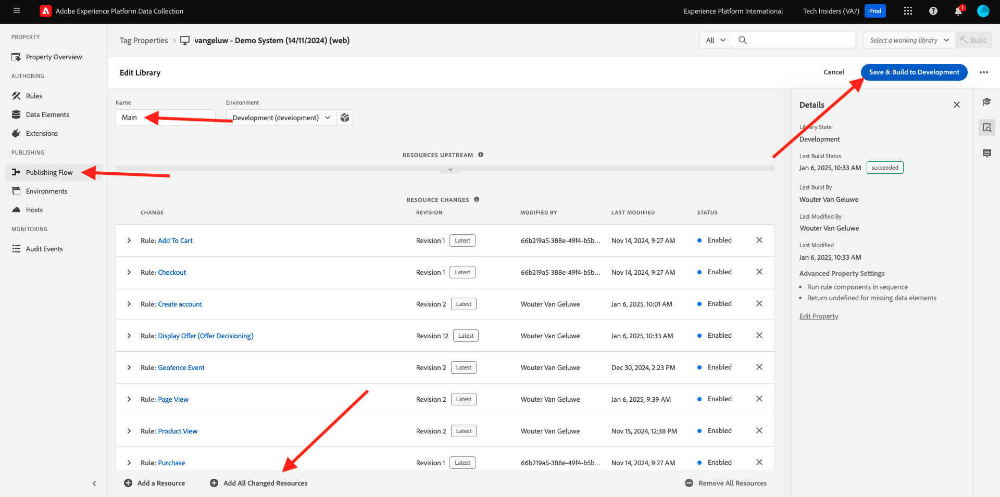

# 3.3.3准备您的Adobe Experience Platform数据收集客户端资产和Web SDK设置以进行Offer decisioning

## 3.3.3.1更新您的数据流

在[练习0.2](./../../../modules/gettingstarted/gettingstarted/ex2.md)中，您创建了自己的&#x200B;**[!UICONTROL 数据流]**。 您随后使用了名称`--aepUserLdap-- - Demo System Datastream`。

在本练习中，您需要配置该&#x200B;**[!UICONTROL 数据流]**&#x200B;以与&#x200B;**[!DNL Offer Decisioning]**&#x200B;配合使用。

为此，请转到[https://experience.adobe.com/#/data-collection/](https://experience.adobe.com/#/data-collection/)。 你会看到这个。 单击&#x200B;**[!UICONTROL 数据流]**&#x200B;或&#x200B;**[!UICONTROL 数据流(Beta)]**。

在屏幕右上角，选择沙盒名称，应为`--aepSandboxName--`。


搜索名为`--aepUserLdap-- - Demo System Datastream`的&#x200B;**[!UICONTROL 数据流]**。 单击您的&#x200B;**[!UICONTROL 数据流]**&#x200B;以将其打开。


你会看到这个。 单击&#x200B;**Adobe Experience Platform**&#x200B;旁边的&#x200B;**...**，然后单击&#x200B;**编辑**。


要启用&#x200B;**[!DNL Offer Decisioning]**，请选中&#x200B;**[!DNL Offer Decisioning]**&#x200B;的框。 单击&#x200B;**保存**。


您的&#x200B;**[!UICONTROL 数据流]**&#x200B;现已准备就绪，可与&#x200B;**[!DNL Offer Decisioning]**&#x200B;一起使用。


## 3.3.3.2配置您的Adobe Experience Platform数据收集客户端资产以请求个性化优惠

转到[https://experience.adobe.com/#/data-collection/](https://experience.adobe.com/#/data-collection/)，转到&#x200B;**[!UICONTROL 客户端]**。 搜索名为`--aepUserLdap-- - Demo System (DD/MM/YYYY)`的数据收集属性。 打开Web的数据收集客户端属性。


在属性中，转到&#x200B;**[!UICONTROL 规则]**&#x200B;并打开规则&#x200B;**[!UICONTROL 页面视图]**。


单击以打开[!UICONTROL 操作] **[!UICONTROL AEP Web SDK — 发送事件]**。


你会看到这个。 您会注意到&#x200B;**[!UICONTROL 决策范围]**&#x200B;的菜单选项。


对于发送到边缘和Adobe Experience Platform的每个请求，可以提供一个或多个&#x200B;**[!UICONTROL 决策范围]**。 **[!UICONTROL 决策范围]**&#x200B;是两个元素的组合：

- [!UICONTROL 决策ID]
- [!UICONTROL 版面ID]

我们先来看看你们在哪里可以找到这两个元素。

### 3.3.3.2.1检索您的[!UICONTROL 版面ID]

[!UICONTROL 版面ID]标识所需的资源的位置和类型。 例如，Luma网站主页上的主页图像与[!UICONTROL Web — 图像]的[!UICONTROL 版面ID]相对应。

>[!NOTE]
>
>在模块6中，您已配置Adobe Target体验定位活动，该活动将更改主页中主页位置的图像，如屏幕快照中所示。 为了进行此练习，您现在可以将选件显示在主页图像下方的图像中，如屏幕快照中所示。


若要查找[!UICONTROL Web — 图像]的[!UICONTROL 版面ID]，请转到[Adobe Experience Cloud](https://experience.adobe.com)以转到Adobe Journey Optimizer。 单击&#x200B;**Journey Optimizer**。


您将被重定向到Journey Optimizer中的&#x200B;**主页**&#x200B;视图。 首先，确保使用正确的沙盒。 要使用的沙盒名为`--aepSandboxName--`。 若要从一个沙盒更改到另一个沙盒，请单击&#x200B;**PRODUCTION Prod (VA7)**，然后从列表中选择该沙盒。 在此示例中，沙盒名为&#x200B;**AEP Enablement FY22**。 然后，您将进入沙盒`--aepSandboxName--`的&#x200B;**主页**&#x200B;视图。


接下来，转到[!UICONTROL 组件]，然后转到[!UICONTROL 位置]。 单击[!UICONTROL Web — 图像]位置查看其详细信息。


如上图所示，在此示例中，[!UICONTROL 版面ID]为`xcore:offer-placement:14bf09dc4190ebba`。 记下您的[!UICONTROL Web — 图像]版面的[!UICONTROL 版面ID]，因为下一个练习需要它。

### 3.3.3.2.2检索您的[!UICONTROL 决策ID]

[!UICONTROL 决策ID]标识您要使用的个性化优惠和备用优惠组合。 在上一个练习中，您创建了自己的[!UICONTROL 决策]并将其命名为`--aepUserLdap-- - Luma Decision`。

要查找您`--aepUserLdap-- - Luma Decision`的[!UICONTROL 决策ID]，请转到[https://platform.adobe.com](https://platform.adobe.com)。

接下来，转到[!UICONTROL 优惠]，然后转到[!UICONTROL 决策]。 单击以选择名为`--aepUserLdap-- - Luma Decision`的[!UICONTROL 决策]。


如上图所示，在此示例中，[!UICONTROL 决策ID]为`xcore:offer-activity:14c052382e1b6505`。 记下您的决策`--aepUserLdap-- - Luma Decision`的[!UICONTROL 决策ID]，因为您将在下一个练习中需要它。

现在，您已检索到创建&#x200B;**[!UICONTROL 决策范围]**&#x200B;所需的两个元素，您可以继续下一步骤，其中涉及编码决策范围。

### 3.3.3.2.3基本编码64

您需要输入的&#x200B;**[!UICONTROL 决策范围]**&#x200B;是BASE64编码的字符串。 此BASE64编码字符串是[!UICONTROL 位置ID]和[!UICONTROL 决策ID]的组合，如下图所示。

```json
{
  "activityId":"xcore:offer-activity:14c052382e1b6505",
  "placementId":"xcore:offer-placement:14bf09dc4190ebba"
}
```

可通过两种方式生成&#x200B;**[!UICONTROL 决策范围]**：

- 使用公共服务，如[https://www.base64encode.org/](https://www.base64encode.org/)。 如上所述，输入JSON代码，单击&#x200B;**[!UICONTROL 编码]**，您将在下面获取BASE64编码字符串。

  

- 从Adobe Experience Platform中检索BASE64编码字符串。 转到[!UICONTROL 决策]并单击以打开名为`--aepUserLdap-- - Luma Decision`的[!UICONTROL 决策]。

  

  打开`--aepUserLdap-- - Luma Decision`后，您将看到此内容。 找到版面[!UICONTROL Web — 图像]，然后单击&#x200B;**[!UICONTROL 复制]**&#x200B;按钮。 接下来，单击&#x200B;**[!UICONTROL 编码决策范围]**。 **[!UICONTROL 决策范围]**&#x200B;现已复制到剪贴板。

  

接下来，返回到Launch，进入您的操作&#x200B;**[!UICONTROL AEP Web SDK — 发送事件]**。


将编码的决策范围粘贴到输入字段中。


单击&#x200B;**[!UICONTROL 保留更改]**，保存操作&#x200B;**[!UICONTROL AEP Web SDK — 发送事件]**&#x200B;中所做的更改。


接下来，单击&#x200B;**[!UICONTROL 保存]**&#x200B;或&#x200B;**[!UICONTROL 保存到库]**


在Adobe Experience Platform数据收集中，转到&#x200B;**[!UICONTROL 发布流]**&#x200B;并打开名为&#x200B;**[!UICONTROL Main]**&#x200B;的&#x200B;**[!UICONTROL 开发库]**。 单击&#x200B;**[!UICONTROL +添加所有更改的资源]**，然后单击&#x200B;**[!UICONTROL 保存并生成以进行开发]**。 您所做的更改将立即发布到演示网站。


每次您现在加载&#x200B;**常规页面**&#x200B;时（例如，演示网站的主页），Offer decisioning都将评估适用的选件，并将返回包含要显示的选件详细信息的响应。 在网站上显示选件需要其他配置，您将在下一步中进行这些配置。

## 3.3.3.3配置您的Adobe Experience Platform数据收集客户端资产以接收和应用个性化优惠

转到[https://experience.adobe.com/#/data-collection/](https://experience.adobe.com/#/data-collection/)，转到&#x200B;**[!UICONTROL 属性]**。 搜索名为`--aepUserLdap-- - Demo System (DD/MM/YYYY)`的数据收集属性。 打开Web的数据收集属性。


在属性中，转到&#x200B;**[!UICONTROL 规则]**。


搜索并打开规则&#x200B;**接收的决定**。


你会看到这个。 打开操作&#x200B;**将选件放在页面**&#x200B;上。


单击&#x200B;**[!UICONTROL 打开编辑器]**


通过在编辑器中粘贴以下代码来覆盖代码。

```javascript
if(!Array.isArray(event.decisions)) {
  console.log('No decisions returned')
  return;
}
console.log("decision",event.decisions)

event.decisions.forEach(function(payload) {
  payload.items.forEach(function(item){
    console.log("Response from Offer Decisioning ", item.data.content);
   
    var element = document.querySelector("#root > div > div > div.app-content > div > section.feature_part.padding_top > div > div.row.align-items-center.justify-content-between > div.col-lg-7.col-sm-6.\\30  > div");
    if(!element){
      console.log("Offer Placement Area Selector not found")
      return;
    }
    if(!item.data){
      return
    }
    //check if offer already exists
    var offer = document.querySelector("#root > div > div > div.app-content > div > section.feature_part.padding_top > div > div.row.align-items-center.justify-content-between > div.col-lg-7.col-sm-6.\\30  > div");
    if(!offer){ 
      element.insertAdjacentHTML('afterbegin', item.data.content) 
    }
    else { 
      console.log("item.data.deliveryURL: " + item.data.deliveryURL)
      document.querySelector("#root > div > div > div.app-content > div > section.feature_part.padding_top > div > div.row.align-items-center.justify-content-between > div.col-lg-7.col-sm-6.\\30  > div").style.background="url('"+item.data.deliveryURL+"')";
      document.querySelector("#root > div > div > div.app-content > div > section.feature_part.padding_top > div > div.row.align-items-center.justify-content-between > div.col-lg-7.col-sm-6.\\30  > div").style.backgroundRepeat="no-repeat";
      document.querySelector("#root > div > div > div.app-content > div > section.feature_part.padding_top > div > div.row.align-items-center.justify-content-between > div.col-lg-7.col-sm-6.\\30  > div").style.backgroundPosition="center center";
      document.querySelector("#root > div > div > div.app-content > div > section.feature_part.padding_top > div > div.row.align-items-center.justify-content-between > div.col-lg-7.col-sm-6.\\30  > div").style.backgroundSize = "contain";
    }  
  })
});
```

行26-27-28-29将应用Offer decisioning返回的图像到网站。 单击&#x200B;**[!UICONTROL 保存]**。


单击&#x200B;**[!UICONTROL 保留更改]**。


接下来，单击&#x200B;**[!UICONTROL 保存]**&#x200B;或&#x200B;**[!UICONTROL 保存到库]**


在Adobe Experience Platform数据收集中，转到&#x200B;**[!UICONTROL 发布流]**&#x200B;并打开名为&#x200B;**[!UICONTROL Main]**&#x200B;的&#x200B;**[!UICONTROL 开发库]**。 单击&#x200B;**[!UICONTROL +添加所有更改的资源]**，然后单击&#x200B;**[!UICONTROL 保存并生成以进行开发]**。 您所做的更改将立即发布到演示网站。



进行此更改后，Adobe Experience Platform数据收集中的此规则现在将侦听Offer decisioning的响应，该响应是Web SDK响应的一部分，收到响应后，将在主页上显示选件的图像。

查看演示网站，您会看到此图像将被立即替换：

>[!NOTE]
>
>在模块6中，您已配置Adobe Target体验定位活动，该活动将更改主页中主页位置的图像，如屏幕快照中所示。 为了进行此练习，您现在可以将选件显示在主页图像下方的图像中，如屏幕快照中所示。


现在，您将看到类似于此类的选件，而不是默认的Luma网站图像。 在这种情况下，将显示后备优惠。


您现在配置了2种类型的个性化：

- 在模块6中使用Adobe Target的“1体验定位”活动
- 使用“数据收集”资产实现1个Offer decisioning

在下一个练习中，您将了解如何将在Adobe Journey Optimizer中创建的优惠和决策与Adobe Target体验定位活动相结合。

下一步：[3.3.4将Adobe Target和Offer decisioning结合使用](./ex4.md)

[返回模块3.3](./offer-decisioning.md)

[返回所有模块](./../../../overview.md)
