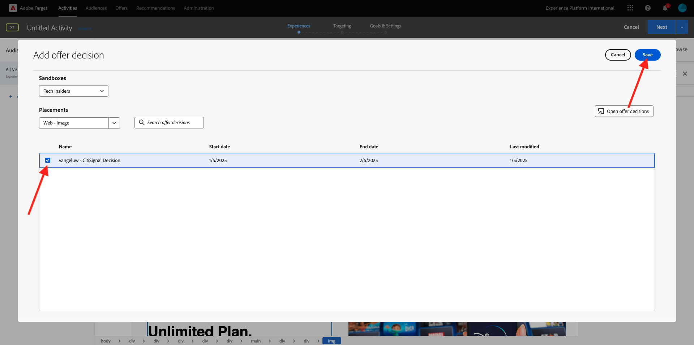

# 3.3.4将Adobe Target与Offer Decisioning结合使用

## 3.3.4.1收集演示项目的可共享链接

要在Adobe Target中加载演示网站项目，您首先需要收集一个特殊链接，以便Adobe Target加载您的演示网站项目。

为此，请转到[https://builder.adobedemo.com/projects](https://builder.adobedemo.com/projects)。 使用Adobe ID登录后，您将看到此内容。 单击您的网站项目以将其打开。

您现在将看到此内容。 单击&#x200B;**共享**。

单击&#x200B;**生成链接**，然后将链接复制到剪贴板。

转到[https://bitly.com](https://bitly.com)，粘贴您复制的链接，然后单击&#x200B;**缩短**。 您现在将获得缩短的链接，如下所示： `https://bit.ly/3JxN7aG`。 在下一个练习中，您将需要该链接。

## 3.3.4.2收集

现在，转到[https://experiencecloud.adobe.com/](https://experiencecloud.adobe.com/)以转到Adobe Experience Cloud主页。 单击&#x200B;**目标**。

在&#x200B;**Adobe Target**&#x200B;主页上，您将看到所有现有活动。

单击&#x200B;**+创建活动**&#x200B;以创建新活动。

选择&#x200B;**体验定位**。

现在，选择&#x200B;**Visual**&#x200B;并将缩短的链接粘贴到&#x200B;**输入活动URL**&#x200B;字段中。 单击&#x200B;**下一步**。

然后，您会看到您的演示网站项目正在可视化体验编辑器中加载。

转到&#x200B;**浏览**&#x200B;模式，在Cookie同意弹出窗口中单击&#x200B;**全部允许**。

单击包含文本&#x200B;**特色类别**&#x200B;的区域。 单击&#x200B;**此项前插入**，然后选择&#x200B;**优惠决策**。

然后您会看到此弹出窗口。 选择您的沙盒`--aepSandboxName--`，然后选择投放位置&#x200B;**Web — 图像**。

接下来，选择您的决策`--aepUserLdap-- - Luma Decision`。 单击&#x200B;**保存**。

你会看到这个。 确保添加额外的模板规则&#x200B;**URL** **包含** **your-project-name**。 单击&#x200B;**保存**。

你会看到这个。 单击&#x200B;**下一步**。

输入选件的名称，使用此名称： `--aepUserLdap-- - XT with Offers (VEC)`。 单击&#x200B;**下一步**。

你会看到这个。 按指示定义您的&#x200B;**目标指标**。 单击&#x200B;**保存并关闭**。

您的选件现已创建并即将发布。

发布选件后，即可启用该选件。

下一步： [3.3.5在电子邮件和短信中使用您的决定](./ex5.md)

[返回模块3.3](./offer-decisioning.md)

[返回所有模块](./../../../overview.md)
