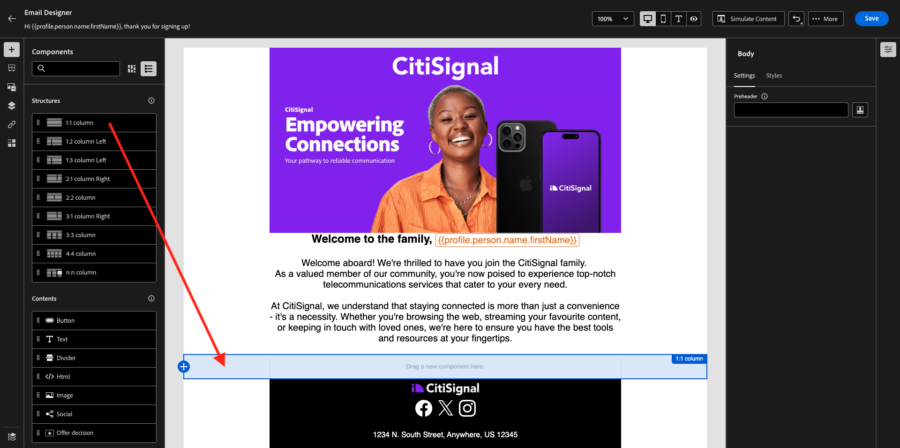

# 3.3.5在电子邮件中使用您的决定

在本练习中，您将使用自己的决定来个性化电子邮件和短信的投放。

转到&#x200B;**历程**。 查找您在练习7.2中创建的名为`--aepUserLdap-- - Account Creation Journey`的历程。 单击您的历程以将其打开。

你会看到这个。 单击&#x200B;**创建新版本**。

单击&#x200B;**创建新版本**。

单击&#x200B;**电子邮件**&#x200B;操作，然后单击&#x200B;**编辑内容**。

然后，您将看到消息仪表板。 单击&#x200B;**向Designer发送电子邮件**。

你会看到这个。

你会看到这个。 将新的&#x200B;**1:1列**&#x200B;结构组件拖动到画布上。

在菜单中，转到&#x200B;**内容组件**。 选择&#x200B;**优惠决策**&#x200B;组件，然后按指示将此组件拖放到电子邮件的内容优惠占位符中。 然后，单击&#x200B;**添加**。

选择要包含在电子邮件中的版面类型。 在&#x200B;**版面**&#x200B;下拉菜单中，选择&#x200B;**电子邮件 — 图像**，然后选择您的决策`--aepUserLdap-- - Luma Decision`。 单击&#x200B;**添加**。

您现在可以在电子邮件设计器中查看所有个性化优惠和备用优惠的可视化。 单击&#x200B;**模拟内容**&#x200B;以预览包含真实客户个人资料的电子邮件。

首先确定您要用于预览的配置文件。 选择&#x200B;**email**&#x200B;命名空间，然后输入您在演示网站上创建的客户配置文件的电子邮件地址。 接下来，单击&#x200B;**预览**。

电子邮件显示和选件正确显示后，单击&#x200B;**关闭**&#x200B;按钮。

最后，单击&#x200B;**保存**。

现在，单击箭头返回到上一个屏幕。

你会看到这个。 单击左上角的箭头可返回您的历程。

单击&#x200B;**确定**&#x200B;以关闭您的&#x200B;**电子邮件**&#x200B;操作。

单击&#x200B;**Publish**&#x200B;发布更新的历程。

再次单击&#x200B;**Publish**&#x200B;以确认。

您的消息现已发布。

在演示网站上创建新帐户后，您将收到以下电子邮件：

您已完成此练习。

下一步：[3.3.6使用API测试您的决策](./ex6.md)

[返回模块3.3](./offer-decisioning.md)

[返回所有模块](./../../../overview.md)
