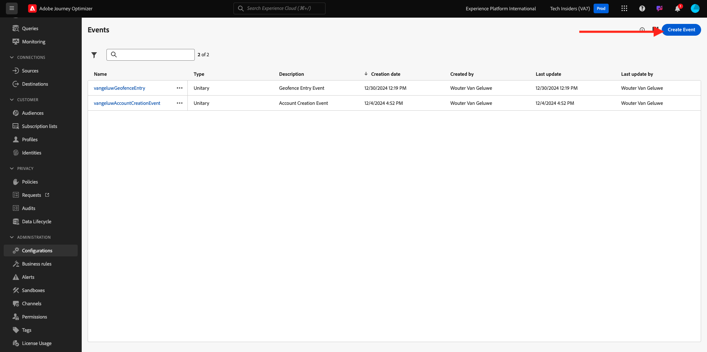
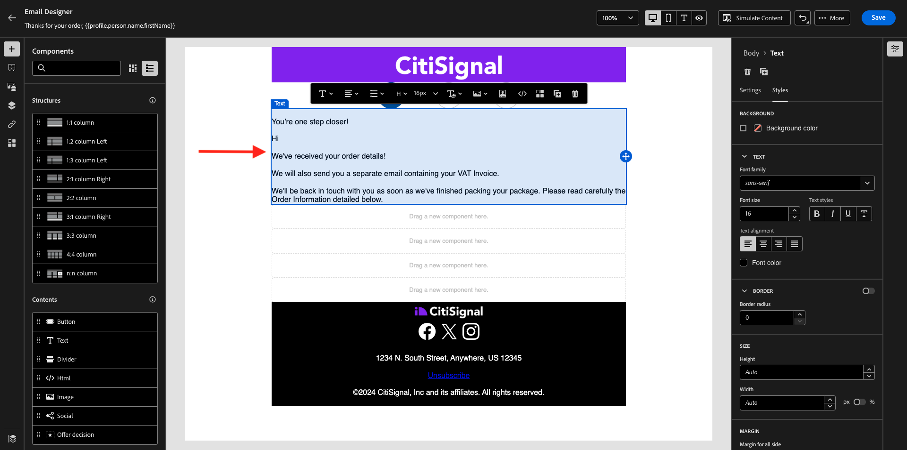
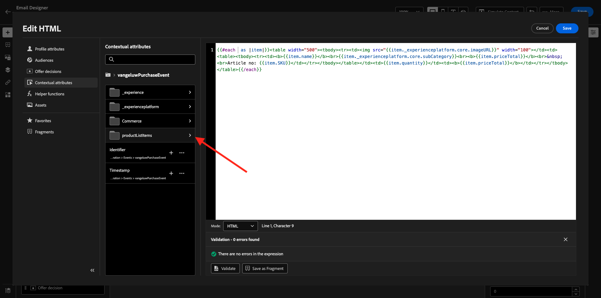
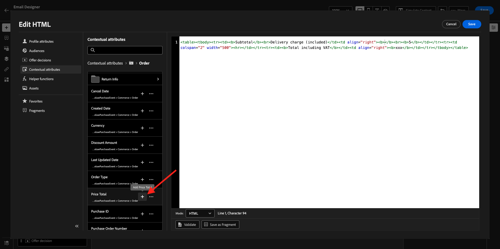
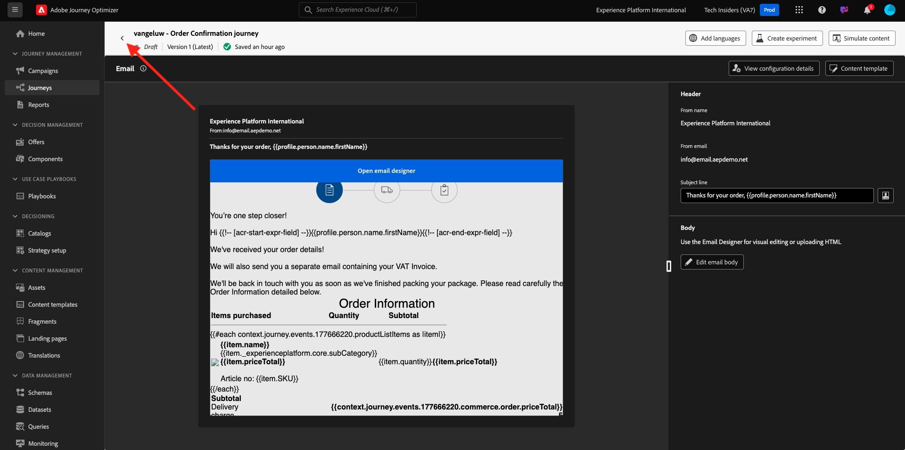

# 3.4.1配置基于触发器的历程 — 订单确认

通过转到[Adobe Experience Cloud](https://experience.adobe.com)登录Adobe Journey Optimizer。 单击&#x200B;**Journey Optimizer**。


您将被重定向到Journey Optimizer中的&#x200B;**主页**&#x200B;视图。 首先，确保使用正确的沙盒。 要使用的沙盒名为`--aepSandboxName--`。 若要从一个沙盒更改到另一个沙盒，请单击&#x200B;**PRODUCTION Prod (VA7)**，然后从列表中选择该沙盒。 在此示例中，沙盒名为&#x200B;**AEP Enablement FY22**。 然后，您将进入沙盒`--aepSandboxName--`的&#x200B;**主页**&#x200B;视图。


## 3.4.1.1创建事件

在菜单中，转到&#x200B;**配置**，然后单击&#x200B;**事件**&#x200B;下的&#x200B;**管理**。


在&#x200B;**事件**&#x200B;屏幕上，您会看到类似于此内容的视图。 单击&#x200B;**创建事件**。



然后，您将看到空的事件配置。


首先，为您的事件提供如下名称： `--aepUserLdap--PurchaseEvent`，然后添加如下描述： `Purchase Event`。


下一个是&#x200B;**事件类型**&#x200B;选择。 选择&#x200B;**单一**。


下一个是&#x200B;**事件ID类型**&#x200B;选择。 选择&#x200B;**系统生成**


接下来是架构选择。 为本练习准备了一个方案。 请使用架构`Demo System - Event Schema for Website (Global v1.1) v.1`。


选择架构后，您将在&#x200B;**有效负载**&#x200B;部分看到许多字段正在被选择。 单击&#x200B;**编辑/铅笔**&#x200B;图标以向此事件添加其他字段。


然后您会看到此弹出窗口。 现在，您需要选中其他复选框才能在触发此事件时访问其他数据。


首先，选中行`--aepTenantId--`上的复选框。


接下来，向下滚动并选中第`productListItems`行上的复选框。


接下来，向下滚动并选中第`commerce`行上的复选框。


接下来，单击&#x200B;**确定**。

然后，您将看到其他字段已添加到该事件。 单击&#x200B;**保存**。


随后将共享您的新事件，您现在将在可用事件列表中看到您的事件。

再次单击您的事件以再次打开&#x200B;**编辑事件**屏幕。
再次将鼠标悬停在**有效负载**&#x200B;字段上可再次查看这3个图标。 单击&#x200B;**查看有效负载**&#x200B;图标。


您现在将看到预期有效负载的示例。 您的事件具有独特的编排eventID，您可以通过在该有效负荷中向下滚动直至看到`_experience.campaign.orchestration.eventID`来查找该事件。


事件ID是需要发送到Adobe Journey Optimizer以触发您将在下一步中构建的旅程的内容。 记下此eventID，因为您将在后续步骤之一中需要它。
`"eventID": "ef6dd943c94fe1b4763c098ccd1772344662f2a9f614513106cb5ada8be36857"`

单击&#x200B;**确定**，然后单击&#x200B;**取消**。

您的事件现已配置完毕，可随时使用。

## 3.4.1.2创建历程

在菜单中，转到&#x200B;**历程**&#x200B;并单击&#x200B;**创建历程**。


你会看到这个。 为您的历程命名。 使用`--aepUserLdap-- - Order Confirmation journey`。 单击&#x200B;**确定**。


首先，您需要添加事件作为历程的起点。 搜索您的事件`--aepUserLdap--PurchaseEvent`并将其拖放到画布上。 单击&#x200B;**确定**。


接下来，在&#x200B;**操作**&#x200B;下，搜索&#x200B;**电子邮件**&#x200B;操作并将其添加到画布上。


将&#x200B;**类别**&#x200B;设置为&#x200B;**营销**，并选择一个允许您发送电子邮件的电子邮件表面。 在这种情况下，要选择的电子邮件表面为&#x200B;**电子邮件**。 确保同时启用了&#x200B;**电子邮件**&#x200B;和&#x200B;**电子邮件打开次数**&#x200B;的复选框。


下一步是创建消息。 为此，请单击&#x200B;**编辑内容**。


您现在可以看到此内容。 单击&#x200B;**主题行**&#x200B;文本字段。


在文本区域中，开始写入&#x200B;**感谢您的订购，**


主题行尚未完成。 接下来，您需要为存储在`profile.person.name.firstName`下的字段&#x200B;**名字**&#x200B;引入个性化令牌。 在左侧菜单中，向下滚动以查找&#x200B;**人员** > **全名** > **名字**&#x200B;字段，然后单击&#x200B;**+**&#x200B;图标以将个性化令牌添加到主题行中。 单击&#x200B;**保存**。


你以后会回到这里的。 单击&#x200B;**向Designer发送电子邮件**&#x200B;以创建电子邮件的内容。


在下一个屏幕中，单击&#x200B;**从头开始设计**。


在左侧菜单中，您将找到可用于定义电子邮件结构（行和列）的结构组件。

将&#x200B;**1:1列**&#x200B;拖放到画布上8次，这样您应该可以：


转到&#x200B;**内容组件**。


将&#x200B;**Image**&#x200B;组件拖放到第一行。 单击&#x200B;**浏览**。


转到文件夹&#x200B;**enablement-assets**，选择文件&#x200B;**luma-logo.png**，然后单击&#x200B;**选择**。


你现在回来了。 单击图像以将其选中，然后使用&#x200B;**大小**&#x200B;滑块使徽标图像变小一点。


转到&#x200B;**内容组件**&#x200B;并将&#x200B;**图像**&#x200B;组件拖放到第二行。 选择&#x200B;**图像组件**，但不单击“浏览”。


将此图像URL粘贴到字段&#x200B;**Source**&#x200B;中： `https://parsefiles.back4app.com/hgJBdVOS2eff03JCn6qXXOxT5jJFzialLAHJixD9/29043bedcde632a9cbe8a02a164189c9_preparing.png`。 此图像在Adobe之外托管。


当您将范围更改为其他字段时，将渲染图像，您将看到以下内容：


接下来，转到&#x200B;**内容组件**&#x200B;并将&#x200B;**文本**&#x200B;组件拖放到第三行。


选择该组件中的默认文本&#x200B;**请在此处键入您的文本。**&#x200B;并用以下文本替换它：

```javascript
You’re one step closer!

Hi 

We've received your order details!

We will also send you a separate email containing your VAT Invoice.

We'll be back in touch with you as soon as we've finished packing your package. Please read carefully the Order Information detailed below.
```



将光标放在文本&#x200B;**您好**&#x200B;旁边，然后单击&#x200B;**添加Personalization**。


导航到&#x200B;**人员** > **全名** > **名字**&#x200B;字段，然后单击&#x200B;**+**&#x200B;图标以将个性化令牌添加到主题行中。 单击&#x200B;**保存**。


您随后将看到以下内容：


接下来，转到&#x200B;**内容组件**&#x200B;并将&#x200B;**文本**&#x200B;组件拖放到第四行。


选择该组件中的默认文本&#x200B;**请在此处键入您的文本。**&#x200B;并用以下文本替换它：

`Order Information`

将字体大小更改为&#x200B;**26px**&#x200B;并将文本居中在此单元格中。 然后，您将拥有以下权限：


接下来，转到&#x200B;**内容组件**&#x200B;并将&#x200B;**HTML**&#x200B;组件拖放到第五行上。 单击HTML组件，然后单击&#x200B;**显示源代码**。


在&#x200B;**编辑HTML**&#x200B;弹出窗口中，粘贴此HTML：

```<table><tbody><tr><td><b>Items purchased</b></td><td></td><td><b>Quantity</b></td><td><b>Subtotal</b></td></tr><tr><td colspan="4" width="500"><hr></td></tr></tbody></table>```

单击&#x200B;**保存**。


你就能拥有这个了。 单击&#x200B;**保存**&#x200B;以保存进度。


转到&#x200B;**内容组件**&#x200B;并将&#x200B;**HTML**&#x200B;组件拖放到第六行。 单击HTML组件，然后单击&#x200B;**显示源代码**。


在&#x200B;**编辑HTML**&#x200B;弹出窗口中，粘贴此HTML：

```{{#each xxx as |item|}}<table width="500"><tbody><tr><td></td><td><table><tbody><tr><td><b>{{item.name}}</b><br>{{item.--aepTenantId--.core.subCategory}}<br><b>{{item.priceTotal}}</b><br>&nbsp;<br>Article no: {{item.SKU}}</td></tr></tbody></table></td><td>{{item.quantity}}</td><td><b>{{item.priceTotal}}</b></td></tr></tbody></table>{{/each}}```

然后，您将拥有以下权限：


您现在必须通过对作为触发历程的事件一部分的productListItems对象的引用替换&#x200B;**xxx**。


首先，先删除HTML代码中的&#x200B;**xxx**。


在左侧菜单中，单击&#x200B;**上下文属性**。 此上下文将传递到历程中的消息。


你会看到这个。 单击&#x200B;**Journey Orchestration**&#x200B;旁边的箭头可更深入地钻研。


单击&#x200B;**事件**&#x200B;旁边的箭头可更深入地探讨。


单击`--aepUserLdap--PurchaseEvent`旁边的箭头可更深入地钻研。


单击&#x200B;**productListItems**&#x200B;旁边的箭头可更深入地查看。



单击&#x200B;**名称**&#x200B;旁边的&#x200B;**+**&#x200B;图标以将其添加到画布。 你就能拥有这个了。 您现在需要选择&#x200B;**.name**（如下面的屏幕快照所示），然后您应该删除&#x200B;**.name**。


你就能拥有这个了。 单击&#x200B;**保存**。


您将立即返回Designer电子邮件。 单击&#x200B;**保存**&#x200B;以保存进度。


接下来，转到&#x200B;**内容组件**&#x200B;并将&#x200B;**HTML**&#x200B;组件拖放到第七行。 单击HTML组件，然后单击&#x200B;**显示源代码**。


在&#x200B;**编辑HTML**&#x200B;弹出窗口中，粘贴此HTML：

```<table><tbody><tr><td><b>Subtotal</b><br>Delivery charge (included)</td><td align="right"><b>xxx</b><br><b>5</b></td></tr><tr><td colspan="2" width="500"><hr></td></tr><tr><td><b>Total including VAT</b></td><td align="right"><b>xxx</b></td></tr></tbody></table>```

此HTML代码中有2个引用&#x200B;**xxx**。 现在，您必须使用对作为触发历程的事件一部分的productListItems对象的引用，来替换每个&#x200B;**xxx**。


首先，删除HTML代码中的前&#x200B;**xxx**。


在左侧菜单中，单击&#x200B;**上下文属性**。


单击&#x200B;**Journey Orchestration**&#x200B;旁边的箭头可更深入地钻研。


单击&#x200B;**事件**&#x200B;旁边的箭头可更深入地探讨。


单击`--aepUserLdap--PurchaseEvent`旁边的箭头可更深入地钻研。


单击&#x200B;**Commerce**&#x200B;旁边的箭头可更深入地查看。


单击&#x200B;**顺序**&#x200B;旁边的箭头可更深入地查看。


单击&#x200B;**总价**&#x200B;旁边的&#x200B;**+**&#x200B;图标以将其添加到画布中。



你就能拥有这个了。 现在删除HTML代码中的第二个&#x200B;**xxx**。


再次单击&#x200B;**总价**&#x200B;旁边的&#x200B;**+**&#x200B;图标以将其添加到画布中。


您还可以将&#x200B;**Order**&#x200B;对象中的字段&#x200B;**Currency**添加到画布上，如此处所示。
完成后，单击**保存**&#x200B;以保存更改。


然后，您将返回到Designer电子邮件。 再次单击&#x200B;**保存**。


单击左上角主题行文本旁边的&#x200B;**箭头**，返回消息仪表板。


单击左上角的箭头可返回您的历程。



单击&#x200B;**确定**&#x200B;以关闭您的电子邮件操作。


单击&#x200B;**Publish**&#x200B;发布您的旅程。


再次单击&#x200B;**Publish**。


您的历程现已发布。


## 3.4.1.5更新您的Adobe Experience Platform数据收集客户端资产

转到[Adobe Experience Platform数据收集](https://experience.adobe.com/launch/)并选择&#x200B;**标记**。

这是您之前看到的Adobe Experience Platform数据收集属性页面。


在模块0中，演示系统为您创建了两个客户端属性：一个用于网站，另一个用于移动应用程序。 通过在&#x200B;**[!UICONTROL 搜索]**&#x200B;框中搜索`--aepUserLdap--`来查找它们。 单击以打开&#x200B;**Web**&#x200B;属性。


转到&#x200B;**数据元素**。 搜索并打开数据元素&#x200B;**XDM — 购买**。


你会看到这个。 导航到字段&#x200B;**_experience.campaign.orchestration.eventID**，并在此处填写您的eventID。 此处要填写的eventID是您在练习10.1.2中创建的eventID。单击&#x200B;**保存**&#x200B;或&#x200B;**保存到库**。


将更改保存在客户端资产中，然后通过更新开发库来发布更改。


您的更改现已部署并可进行测试。

## 3.4.1.6使用演示网站测试您的订单确认电子邮件

让我们通过在演示网站上购买产品来测试更新的历程。

转到[https://builder.adobedemo.com/projects](https://builder.adobedemo.com/projects)。 使用Adobe ID登录后，您将看到此内容。 单击您的网站项目以将其打开。


在&#x200B;**Screens**&#x200B;页面上，单击&#x200B;**运行**。


随后您将看到您的演示网站已打开。 选择URL并将其复制到剪贴板。


打开一个新的无痕浏览器窗口。


粘贴您在上一步中复制的演示网站的URL。 然后，系统将要求您使用Adobe ID登录。


选择您的帐户类型并完成登录过程。


然后，您会看到您的网站已加载到无痕浏览器窗口中。 对于每个演示，您将需要使用新的无痕浏览器窗口来加载演示网站URL。


单击屏幕左上角的Adobe徽标图标以打开配置文件查看器。


请查看配置文件查看器面板和实时客户配置文件，将&#x200B;**Experience CloudID**&#x200B;作为当前未知客户的主要标识符。


转到“注册/登录”页面。 单击&#x200B;**创建帐户**。


填写您的详细信息，然后单击&#x200B;**注册**，之后您将被重定向到上一页。


将任何产品添加到购物车，然后转到&#x200B;**购物车**&#x200B;页面。 单击&#x200B;**继续结帐**。


接下来，验证签出页面上的字段，然后单击&#x200B;**签出**。


然后，您将在几秒钟内收到订单确认电子邮件。


您已完成此练习。

下一步： [3.4.2配置基于批次的新闻稿历程](./ex2.md)

[返回模块3.4](./journeyoptimizer.md)

[返回所有模块](../../../overview.md)
