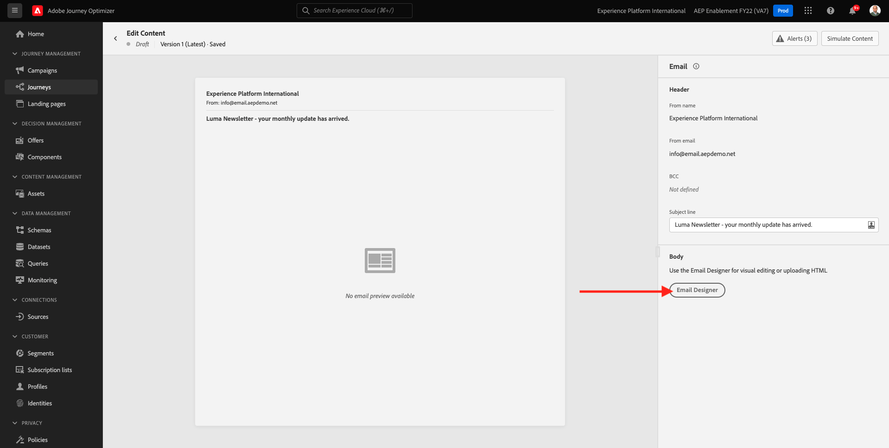
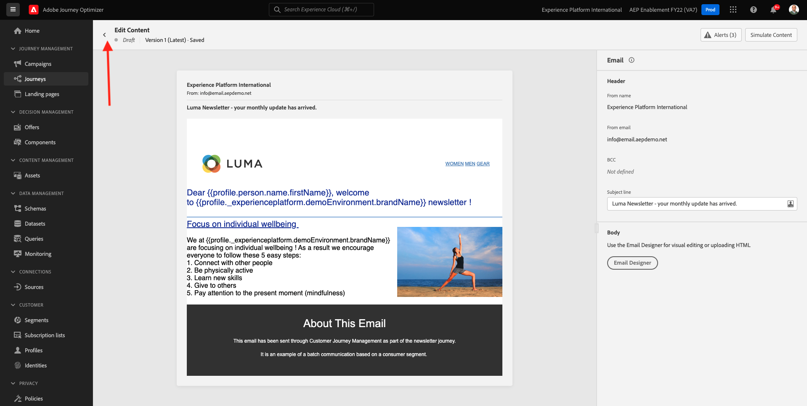
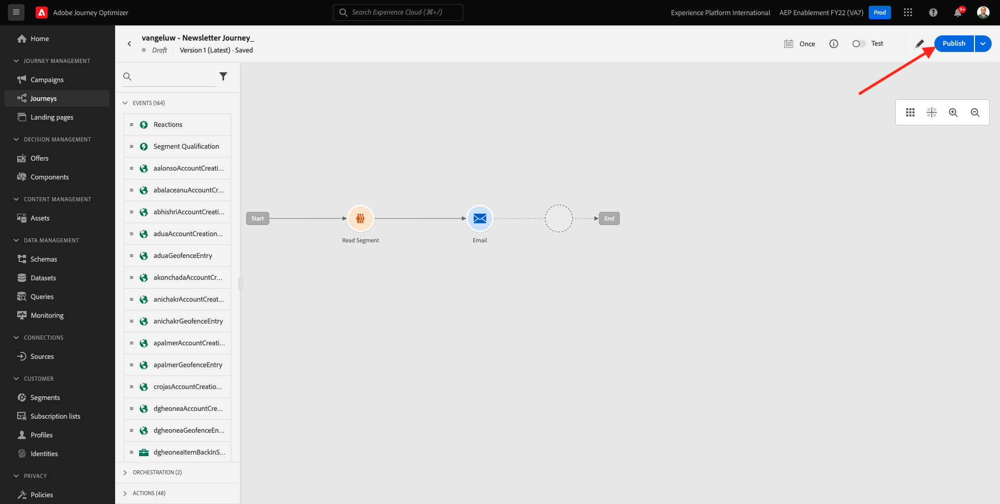

# 3.4.2配置基于批次的新闻稿历程

通过转到[Adobe Experience Cloud](https://experience.adobe.com)登录Adobe Journey Optimizer。 单击&#x200B;**Journey Optimizer**。

您将被重定向到Journey Optimizer中的&#x200B;**主页**&#x200B;视图。 首先，确保使用正确的沙盒。 要使用的沙盒名为`--aepSandboxName--`。 若要从一个沙盒更改到另一个沙盒，请单击&#x200B;**PRODUCTION Prod (VA7)**，然后从列表中选择该沙盒。 在此示例中，沙盒名为&#x200B;**AEP Enablement FY22**。 然后，您将进入沙盒`--aepSandboxName--`的&#x200B;**主页**&#x200B;视图。

## 3.4.2.1创建新闻稿历程

现在，您将创建一个基于批次的历程。 与上一个练习中依赖于传入体验事件或受众进入或退出以触发1个特定客户的历程的基于事件的历程不同，基于批次的历程一次以具有唯一内容（如新闻稿、一次性促销或通用信息）的整个受众为目标，或者定期发送具有类似内容的历程（如实例生日活动和提醒）。

在菜单中，转到&#x200B;**历程**&#x200B;并单击&#x200B;**创建历程**。

在右侧，您将看到一个表单，其中您需要指定历程名称和描述。 输入以下值：

- **名称**： `--aepUserLdap-- - Newsletter Journey`。 例如：**vangeluw — 新闻稿历程**。
- **描述**：每月新闻稿

单击&#x200B;**确定**。

在&#x200B;**编排**&#x200B;下，将&#x200B;**读取受众**&#x200B;拖放到画布上。 这意味着，发布后，历程将首先检索整个受众受众，然后成为历程和消息的目标受众。 单击&#x200B;**选择受众**。

在&#x200B;**选择受众**&#x200B;弹出窗口中，搜索您的ldap并选择您在[模块2.3 - Real-time CDP — 构建受众并执行名为`--aepUserLdap-- - Interest in Galaxy S24`的操作](./../../../modules/rtcdp-b2c/module2.3/real-time-cdp-build-a-segment-take-action.md)中创建的受众。 单击&#x200B;**保存**。

单击&#x200B;**确定**。

在左侧菜单中，找到&#x200B;**操作**&#x200B;部分，并将&#x200B;**电子邮件**&#x200B;操作拖放到画布上。

将&#x200B;**类别**&#x200B;设置为&#x200B;**营销**，并选择一个允许您发送电子邮件的电子邮件表面。 在这种情况下，要选择的电子邮件表面为&#x200B;**电子邮件**。 确保同时启用了&#x200B;**电子邮件**&#x200B;和&#x200B;**电子邮件打开次数**&#x200B;的复选框。

下一步是创建消息。 为此，请单击&#x200B;**编辑内容**。

您现在可以看到此内容。 单击&#x200B;**主题行**&#x200B;文本字段。

为主题行输入此文本： `Luma Newsletter - your monthly update has arrived.`。 单击&#x200B;**保存**。

你以后会回到这里的。 单击&#x200B;**电子邮件Designer**&#x200B;开始创建电子邮件内容。

你会看到这个。 单击&#x200B;**导入HTML**。

在弹出屏幕中，您需要拖放电子邮件的HTML文件。 您可以在[此处](./../../../assets/html/ajo-newsletter.html.zip)找到HTML模板。 将包含HTML模板的zip文件下载到本地计算机，然后解压缩到桌面。

拖放文件&#x200B;**ajo-newsletter.html**&#x200B;以将其上传到Journey Optimizer。 单击&#x200B;**导入**。

此电子邮件内容已准备就绪，因为它包含所有预期的个性化、图像和文本。 只有选件占位符留空。

您可能会收到一条错误消息：**尝试获取资源时出错**。 链接到电子邮件中的图像。

如果收到此错误，请选择图像并单击&#x200B;**编辑图像**&#x200B;按钮。

单击&#x200B;**Assets Essentials**&#x200B;以返回到AEM Assets Essentials库。

然后您会看到此弹出窗口。 导航到文件夹&#x200B;**enablement-assets**&#x200B;并选择图像&#x200B;**luma-newsletterContent.png**。 单击&#x200B;**选择**。

您的基本新闻稿电子邮件现已准备就绪。 单击&#x200B;**保存**。

单击左上角主题行文本旁边的&#x200B;**箭头**，返回消息仪表板。

单击左上角的箭头可返回您的历程。

单击&#x200B;**确定**&#x200B;以关闭您的电子邮件操作。

您的新闻稿历程现已准备就绪，可供发布。 在执行此操作之前，请注意&#x200B;**计划**&#x200B;部分，您可以在其中将此历程从一次性切换到定期营销活动。 单击&#x200B;**计划**&#x200B;按钮。

你会看到这个。 选择&#x200B;**一次**。

选择下一小时内的日期和时间，以便测试您的历程。 单击&#x200B;**确定**。

>[!NOTE]
>
>消息发送日期和时间必须在一小时以上。

单击&#x200B;**Publish**。

再次单击&#x200B;**Publish**。

您的基本新闻稿历程现已发布。 您的新闻稿电子邮件将按照您在时间表中定义的形式发送，一旦发送完最后一封电子邮件，您的历程将立即停止。

您已完成此练习。

下一步： [3.4.3在电子邮件中应用个性化](./ex3.md)

[返回模块3.4](./journeyoptimizer.md)

[返回所有模块](../../../overview.md)
