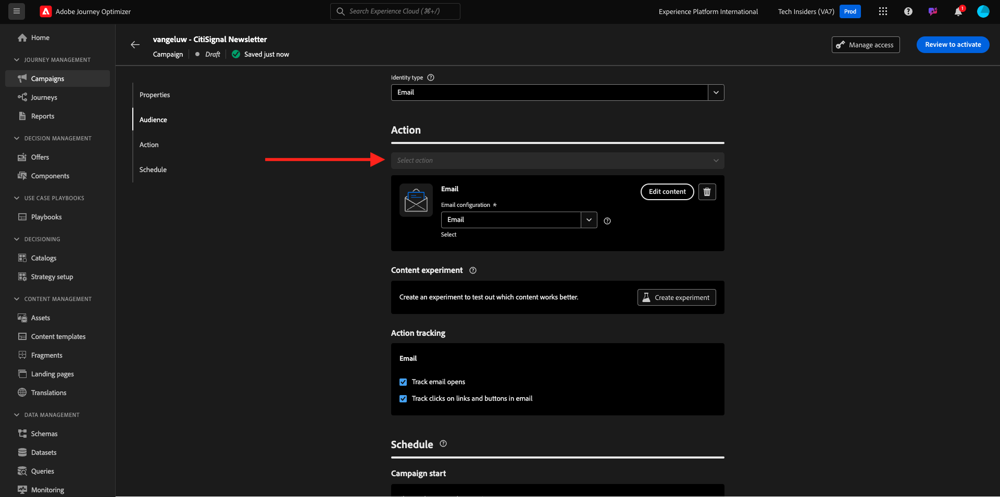
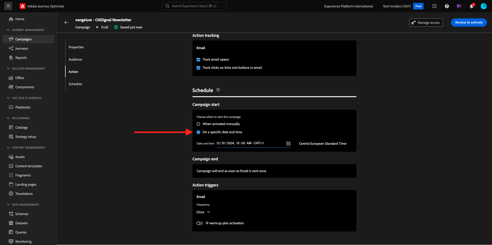
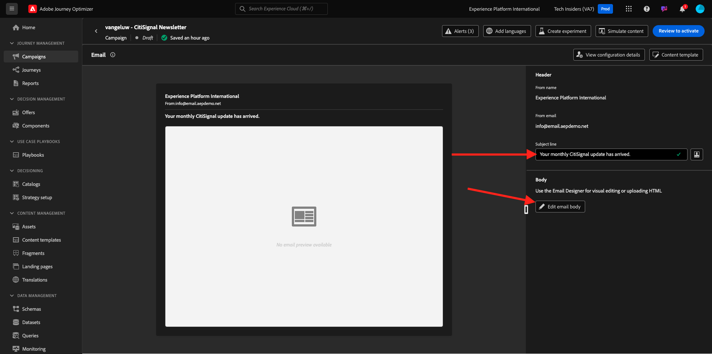
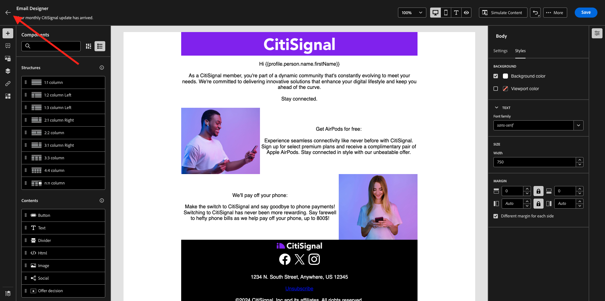

# 3.4.2配置营销活动

通过转到[Adobe Experience Cloud](https://experience.adobe.com)登录Adobe Journey Optimizer。 单击&#x200B;**Journey Optimizer**。


您将被重定向到Journey Optimizer中的&#x200B;**主页**&#x200B;视图。 首先，确保使用正确的沙盒。 要使用的沙盒名为`--aepSandboxName--`。 然后，您将进入沙盒`--aepSandboxName--`的&#x200B;**主页**&#x200B;视图。


## 3.4.2.1创建受众

在创建活动之前，您应该定义应接收该活动的受众。 要创建受众，请转到左侧菜单中的&#x200B;**受众**。 您将在其中看到所有之前创建的受众。

单击&#x200B;**+创建受众**。


选择&#x200B;**生成规则**&#x200B;并单击&#x200B;**创建**。


选择字段&#x200B;**XDM Individual Profile > Personal Email > Address**，并将其添加到画布。 将规则条件设置为&#x200B;**存在**。

为避免向共享培训环境中的其他用户发送电子邮件，您还可以添加诸如&#x200B;**名字等于 — 您的名字 —**&#x200B;之类的过滤器。

将受众的名称设置为`--aepUserLdap-- - All customers with email`并单击&#x200B;**Publish**。


您的受众现已发布，并可在营销活动中使用。

## 3.4.2.2创建新闻稿营销活动

您现在将创建一个营销活动。 上一个练习基于事件的历程依赖于传入体验事件或受众进入或退出来触发1个特定客户的历程，与此不同的是，营销活动面向整个受众一次，其中包含新闻稿、一次性促销活动或通用信息等独特内容，或者定期发送类似内容，如实例生日营销活动和提醒。

在菜单中，转到&#x200B;**营销活动**&#x200B;并单击&#x200B;**创建营销活动**。


选择&#x200B;**计划 — 营销**，然后单击&#x200B;**创建**。


在营销活动创建屏幕上，配置以下内容：

- **名称**： `--aepUserLdap-- - CitiSignal Newsletter`。
- **描述**：每月新闻稿
- **身份类型**：更改为电子邮件

单击&#x200B;**选择受众**。


对于&#x200B;**受众**，请选择在上一步中创建的受众`--aepUserLdap-- - All customers with email`。 单击&#x200B;**保存**。


对于&#x200B;**操作**，请选择&#x200B;**电子邮件**，然后选择现有的&#x200B;**电子邮件配置**。 你将在几分钟后编辑内容。



对于&#x200B;**计划**，请选择&#x200B;**在特定日期和时间**&#x200B;并设置所选时间。



您现在可以开始创建电子邮件本身。 向上滚动一点，然后单击&#x200B;**编辑内容**。


你会看到这个。 对于&#x200B;**主题行**，使用此： `Your monthly CitiSignal update has arrived.`。 接下来，单击&#x200B;**编辑电子邮件正文**。



从头开始选择&#x200B;**设计**。


你会看到这个。 在左侧菜单中，您将找到可用于定义电子邮件结构（行和列）的结构组件。

将&#x200B;**1:1列**&#x200B;拖放到画布上3次，左侧拖放1次1:2列，右侧拖放1次2:1列，这应该为您提供此结构：


在左侧菜单中，转到&#x200B;**片段**。 将您之前在[练习3.1.2.1](./../module3.1/ex2.md)中创建的标题拖动到画布中的第一个组件上。 将您之前在[练习3.1.2.2](./../module3.1/ex2.md)中创建的页脚拖到画布中的最后一个组件上。


单击左侧菜单中的&#x200B;**+**&#x200B;图标。 转到&#x200B;**Contents**&#x200B;以开始将内容添加到画布上。


将&#x200B;**Text**&#x200B;组件拖放到第二行。


选择该组件中的默认文本&#x200B;**请在此处键入您的文本。**&#x200B;并将其替换为以下文本。 将对齐方式更改为&#x200B;**居中对齐**。

```javascript
Hi {{profile.person.name.firstName}}

As a CitiSignal member, you're part of a dynamic community that's constantly evolving to meet your needs. We're committed to delivering innovative solutions that enhance your digital lifestyle and keep you ahead of the curve.

Stay connected.
```


将&#x200B;**Image**&#x200B;组件拖放到第3行和第4行。 在第3行上单击&#x200B;**浏览**。


打开文件夹&#x200B;**citi-signal-images**，单击以选择图像&#x200B;**Offer_AirPods.jpg**，然后单击&#x200B;**选择**。


在第4行的图像占位符上单击&#x200B;**浏览**。


打开文件夹&#x200B;**citi-signal-images**，单击以选择图像&#x200B;**Offer_Phone.jpg**，然后单击&#x200B;**选择**。


将&#x200B;**Text**&#x200B;组件拖放到第3行和第4行。


在第3行&#x200B;**上选择组件中的默认文本。请在此处键入您的文本。**&#x200B;并将其替换为以下文本。

```javascript
Get AirPods for free:

Experience seamless connectivity like never before with CitiSignal. Sign up for select premium plans and receive a complimentary pair of Apple AirPods. Stay connected in style with our unbeatable offer.
```

在第4行&#x200B;**上选择组件中的默认文本。请在此处键入您的文本。**&#x200B;并将其替换为以下文本。

```javascript
We'll pay off your phone:

Make the switch to CitiSignal and say goodbye to phone payments! Switching to CitiSignal has never been more rewarding. Say farewell to hefty phone bills as we help pay off your phone, up to 800$!
```


您的基本新闻稿电子邮件现已准备就绪。 单击&#x200B;**保存**。


单击左上角主题行文本旁边的&#x200B;**箭头**，返回营销活动仪表板。



单击&#x200B;**查看以激活**。


然后，您可能会收到此错误。 如果是这种情况，您可能需要等待长达24小时，直到评估受众，然后尝试再次激活您的营销活动。 您可能还需要更新营销活动计划，以便稍后运行。

单击&#x200B;**激活**。


激活后，您的营销活动将计划运行。


您的营销活动现已激活。 您的新闻稿电子邮件将按照您在时间表中定义的形式发送，一旦发送完最后一封电子邮件，您的营销活动将立即停止。

您还应该收到用于您之前创建的演示配置文件的电子邮件地址的电子邮件。


您已完成此练习。

下一步： [3.4.3在电子邮件中应用基于区段的个性化](./ex3.md)

[返回模块3.4](./journeyoptimizer.md)

[返回所有模块](../../../overview.md)
