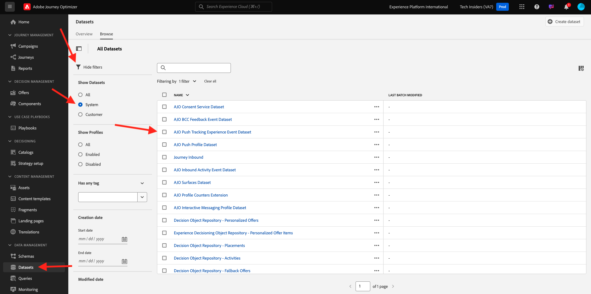
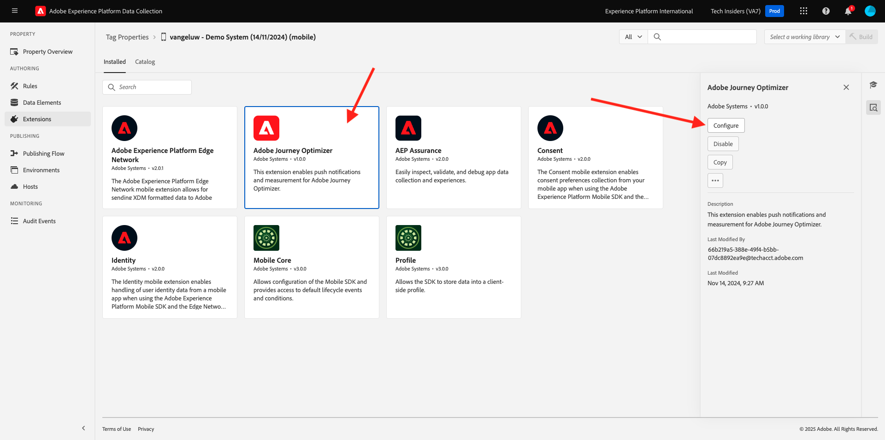
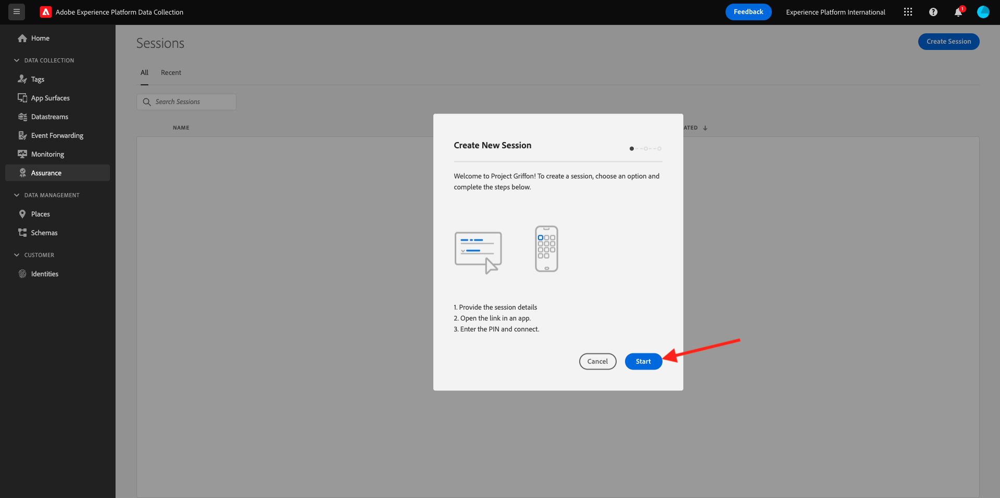
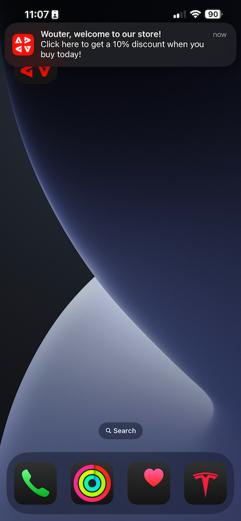

# 3.4.4 iOS的设置和使用推送通知

要在Adobe Journey Optimizer中使用推送通知，需要检查并了解大量设置。

以下是需要验证的所有设置：

- Adobe Experience Platform中的数据集和架构
- 适用于移动设备的数据流
- 移动设备的数据收集属性
- 推送证书的应用程序表面
- 使用AEP Assurance测试推送设置

让我们逐一回顾一下。

通过转到[Adobe Experience Cloud](https://experience.adobe.com)登录Adobe Journey Optimizer。 单击&#x200B;**Journey Optimizer**。

您将被重定向到Journey Optimizer中的&#x200B;**主页**&#x200B;视图。 首先，确保使用正确的沙盒。 要使用的沙盒名为`--aepSandboxName--`。 然后，您将进入沙盒`--aepSandboxName--`的&#x200B;**主页**&#x200B;视图。

## 3.4.4.1推送数据集

Adobe Journey Optimizer使用数据集在Adobe Journey Optimizer的数据集中存储来自移动设备的推送令牌或与推送消息的交互（例如：已发送消息、已打开消息等）。

您可以通过转到屏幕左侧菜单中的&#x200B;**[!UICONTROL 数据集]**&#x200B;来查找这些数据集。 要显示系统数据集，请单击过滤器图标。

启用选项&#x200B;**显示系统数据集**&#x200B;并搜索&#x200B;**AJO**。 然后，您将看到用于推送通知的数据集。

## 3.4.4.2适用于移动设备的数据流

转到[https://experience.adobe.com/#/data-collection/](https://experience.adobe.com/#/data-collection/)。

在左侧菜单中，转到&#x200B;**[!UICONTROL 数据流]**&#x200B;并搜索您在[练习0.2](./../../../modules/gettingstarted/gettingstarted/ex2.md)中创建的、名为`--aepUserLdap-- - Demo System Datastream (Mobile)`的数据流。 单击以将其打开。

单击&#x200B;**Adobe Experience Platform**&#x200B;服务上的&#x200B;**编辑**。

然后，您将看到定义的数据流设置，以及要将数据集事件和配置文件属性存储到哪些中。

无需更改，您的数据流现已准备就绪，可用于移动设备的数据收集客户端资产。

## 3.4.4.3查看您的移动设备数据收集属性

转到[https://experience.adobe.com/#/data-collection/](https://experience.adobe.com/#/data-collection/)。 作为[练习0.1](./../../../modules/gettingstarted/gettingstarted/ex1.md)的一部分，创建了2个数据收集属性。
您已在以前的模块中使用了这些数据收集客户端属性。

单击以打开移动设备的数据收集属性。

在数据收集属性中，转到&#x200B;**扩展**。 然后，您将看到移动应用程序所需的各种扩展。 单击以打开扩展&#x200B;**Adobe Experience PlatformEdge Network**。

然后，您将看到您的移动数据流链接到了此处。 接下来，单击&#x200B;**取消**&#x200B;以返回扩展概述。

你以后会回到这里的。 您将看到&#x200B;**AEP Assurance**&#x200B;的扩展。 AEP Assurance可帮助您检查、验证、模拟和验证在移动应用程序中收集数据或提供体验的方式。 您可以在此处[https://aep-sdks.gitbook.io/docs/beta/project-griffon](https://aep-sdks.gitbook.io/docs/beta/project-griffon)阅读有关AEP Assurance和项目Griffon的更多信息。

接下来，单击&#x200B;**配置**&#x200B;以打开扩展&#x200B;**Adobe Journey Optimizer**。

然后，您会看到这是用于跟踪推送事件的数据集的链接位置。

无需对数据收集属性进行任何更改。

## 3.4.4.4检查您的应用程序表面设置

转到[https://experience.adobe.com/#/data-collection/](https://experience.adobe.com/#/data-collection/)。 在左侧菜单中，转到&#x200B;**应用程序表面**&#x200B;并打开&#x200B;**DX演示应用程序APNS**&#x200B;的应用程序表面。

然后，您将看到为iOS和Android配置的应用程序表面。

## 3.4.4.5使用AEP Assurance测试推送通知设置。

安装应用程序后，您将在设备的主屏幕上找到该应用程序。 单击图标以打开应用程序。

首次使用应用程序时，系统会要求您使用Adobe ID登录。 完成登录过程。

登录后，您将看到一条通知，请求您发送通知的权限。 我们将在本教程中发送通知，因此请单击&#x200B;**允许**。

然后，您将看到该应用程序的主页。 转到&#x200B;**设置**。

在设置中，您会看到当前应用程序中已加载&#x200B;**公共项目**。 单击&#x200B;**自定义项目**。

您现在可以加载自定义项目。 单击二维码可轻松加载项目。

0.1练习后得到了这个结果。 单击以打开为您创建的&#x200B;**移动零售项目**。

如果您意外关闭了浏览器窗口，或者为了将来演示或支持会议，还可以转到[https://builder.adobedemo.com/projects](https://builder.adobedemo.com/projects)访问您的网站项目。 使用Adobe ID登录后，您将看到此内容。 单击您的移动应用程序项目以将其打开。

你会看到这个。 单击&#x200B;**集成**。

您需要选择在练习0.1中创建的移动设备的数据收集属性。接下来，单击&#x200B;**运行**。

随后您将看到一个弹出窗口，其中包含二维码。 在移动设备应用程序中扫描此二维码。

然后，您将在应用程序中看到项目ID，随后可单击&#x200B;**保存**。

现在，返回应用程序中的&#x200B;**主页**。 您的应用程序现已准备就绪，可供使用。

现在，您需要扫描二维码以将移动设备连接到AEP Assurance会话。

要启动AEP Assurance会话，请转到[https://experience.adobe.com/#/@experienceplatform/griffon](https://experience.adobe.com/#/@experienceplatform/griffon)。 单击&#x200B;**创建会话**。

单击&#x200B;**开始**。

填写值：

- 会话名称：使用`--aepUserLdap-- - push debugging`并将ldap替换为ldap
- 基本URL：使用&#x200B;**dxdemo://default**

单击&#x200B;**下一步**。

然后，您将在屏幕上看到一个二维码，您应该使用iOS设备扫描该二维码。

在移动设备上，打开相机应用程序并扫描AEP Assurance显示的二维码。

然后，您会看到一个弹出屏幕，要求您输入PIN码。 从AEP Assurance屏幕复制PIN码，然后单击&#x200B;**连接**。

你会看到这个。

在AEP Assurance中，您现在可以看到某个设备正在访问AEP Assurance会话。

转到&#x200B;**推送调试**。 你会看到这样的东西。

部分原因在于：

- 第一列&#x200B;**Client**&#x200B;显示iOS设备上的可用标识符。 您将看到ECID和推送令牌。
- 第二列显示&#x200B;**配置文件**&#x200B;信息，以及有关推送令牌所在的平台（APNS或APNSSandbox）的其他信息。 如果单击&#x200B;**Inspect配置文件**&#x200B;按钮，您将转到Adobe Experience Platform，并看到完整的实时客户配置文件。
- 第3列显示了&#x200B;**应用程序配置**，该配置是在启动项&#x200B;**中的练习** 3.4.5.4创建应用程序配置中设置的

要测试推送配置设置，请单击&#x200B;**发送推送通知**&#x200B;按钮。

您需要确保在单击&#x200B;**发送推送通知**&#x200B;按钮时未打开&#x200B;**DX演示**&#x200B;应用程序。 如果应用程序处于打开状态，则推送通知可能会在后台收到，因此不会显示。

然后，您将在移动设备上看到类似这样的推送通知。

如果您已收到推送通知，则表示您的设置正确且运行正常。

## 3.4.4.6创建新事件

在菜单中，转到&#x200B;**历程管理**，然后单击&#x200B;**事件**&#x200B;下的&#x200B;**管理**。

在&#x200B;**事件**&#x200B;屏幕上，您会看到类似于此内容的视图。 单击&#x200B;**创建事件**。

然后，您将看到空的事件配置。

首先，为您的事件提供如下名称： `--aepUserLdap--StoreEntryEvent`并将描述设置为`Store Entry Event`。

下一个是&#x200B;**事件类型**&#x200B;选择。 选择&#x200B;**单一**。

下一个是&#x200B;**事件ID类型**&#x200B;选择。 选择&#x200B;**系统生成**

接下来是架构选择。 为本练习准备了一个方案。 请使用架构`Demo System - Event Schema for Mobile App (Global v1.1) v.1`。

选择架构后，您将在&#x200B;**有效负载**&#x200B;部分看到许多字段正在被选择。 您的事件现已完全配置。

您应该会看到此内容。 单击&#x200B;**保存**。

您的事件现已配置并保存。 再次单击您的事件以再次打开&#x200B;**编辑事件**&#x200B;屏幕。

将鼠标悬停在&#x200B;**有效负载**&#x200B;字段上并单击&#x200B;**查看有效负载**&#x200B;图标。

您现在将看到预期有效负载的示例。

您的事件具有独特的编排eventID，您可以通过在该有效负荷中向下滚动直至看到`_experience.campaign.orchestration.eventID`来查找该事件。

事件ID需要发送到Adobe Experience Platform以触发您将在下一步中构建的历程。 记下此eventID，因为您将在下一步中需要它。
`"eventID": "e3a8f0bdc0b609667cd96a72a6b1e5aafa0ddaf6ccf121c574e6a2030860a633"`

单击&#x200B;**确定**，然后单击&#x200B;**取消**。

## 3.4.4.7创建旅程

在菜单中，转到&#x200B;**历程**&#x200B;并单击&#x200B;**创建历程**。

你会看到这个。 为您的历程命名。 使用`--aepUserLdap-- - Store Entry journey`。 单击&#x200B;**确定**。

首先，您需要添加事件作为历程的起点。 搜索您的事件`--aepUserLdap--StoreEntryEvent`并将其拖放到画布上。 单击&#x200B;**确定**。

接下来，在&#x200B;**操作**&#x200B;下，搜索&#x200B;**推送**操作。
将**推送**&#x200B;操作拖放到画布上。

将&#x200B;**类别**&#x200B;设置为&#x200B;**营销**，并选择一个允许您发送推送通知的推送表面。 在这种情况下，要选择的电子邮件表面为&#x200B;**Push-iOS-Android**。

下一步是创建消息。 为此，请单击&#x200B;**编辑内容**。

你会看到这个。 单击&#x200B;**标题**&#x200B;字段的&#x200B;**个性化**&#x200B;图标。

你会看到这个。 您现在可以直接从Real-time Customer Profile中选择任何Profile属性。

搜索字段&#x200B;**名字**，然后单击字段&#x200B;**名字**&#x200B;旁边的&#x200B;**+**&#x200B;图标。 随后您将看到添加的名字的个性化令牌： **{{profile.person.name.firstName}}**。

接下来，添加文本&#x200B;**，欢迎来到我们的商店！**&#x200B;在&#x200B;**{{profile.person.name.firstName}}**&#x200B;之后。

单击&#x200B;**保存**。

您现在拥有了此功能。 单击&#x200B;**正文**&#x200B;字段的&#x200B;**个性化**&#x200B;图标。

输入此文本&#x200B;**单击此处可在您今天购买时获得10%的折扣！**&#x200B;并单击&#x200B;**保存**。

你就能拥有这个了。 单击左上角的箭头可返回您的历程。

单击&#x200B;**确定**&#x200B;以关闭您的推送操作。

单击&#x200B;**Publish**。

再次单击&#x200B;**Publish**。

您的历程现已发布。

## 3.4.4.8测试您的历程和推送消息

在DX Demo 2.0移动应用程序中，转到&#x200B;**设置**&#x200B;屏幕。 单击&#x200B;**存储条目**&#x200B;按钮。

>[!NOTE]
>
>当前正在实施&#x200B;**存储条目**&#x200B;按钮。 您还无法在应用程序中找到它。

确保在单击&#x200B;**商店条目**&#x200B;图标后立即关闭应用程序，否则将不会显示推送消息。

几秒钟后，您将看到此消息。

您已完成此练习。

下一步：[3.4.5创建业务事件历程](./ex5.md)

[返回模块3.4](./journeyoptimizer.md)

[返回所有模块](../../../overview.md)
