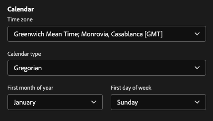
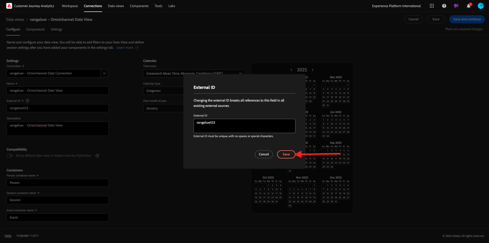
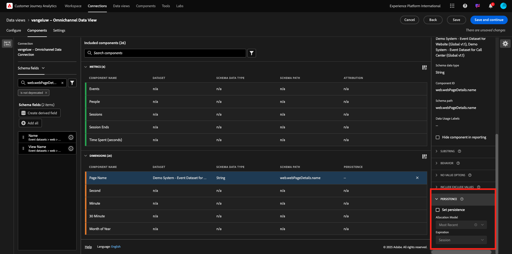
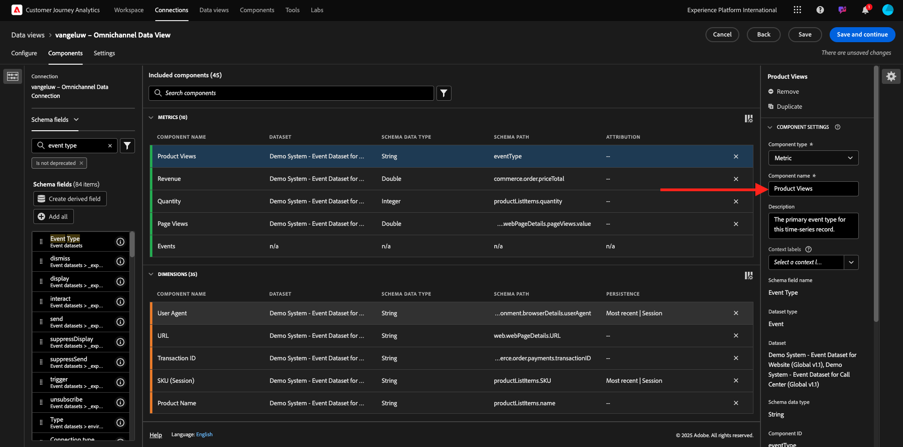

# 4.1.3创建数据视图

## 目标

- 了解数据视图UI
- 了解访问定义的基本设置
- 了解数据视图中的归因和持久性

## 4.1.3.1数据视图

完成连接后，您现在可以继续影响可视化图表。 Adobe Analytics和CJA之间的区别在于，CJA需要数据视图，以便在可视化之前清理和准备数据。

数据视图与Adobe Analytics中的虚拟报表包的概念类似，您可以在其中定义上下文感知访问定义、筛选以及组件的调用方式。

每个连接至少需要一个数据视图。 但是，对于某些用例，最好针对同一连接拥有多个数据视图，以便向不同团队提供不同的见解。
如果您希望公司成为数据驱动型公司，您应该调整每个团队中数据的查看方式。 一些示例：

- 仅适用于UX设计团队的UX量度
- 为Google Analytics的KPI和量度使用与Customer Journey Analytics相同的名称，以便数字分析团队只能说1种语言。
- 数据视图经过筛选，仅会显示一个市场、一个品牌或移动设备的实例数据。

在&#x200B;**连接**&#x200B;屏幕上，选中您刚刚创建的连接前面的复选框。 单击&#x200B;**创建数据视图**。

您将被重定向到&#x200B;**创建数据视图**&#x200B;工作流。

## 4.1.3.2数据视图定义

您现在可以配置数据视图的基本定义。

您在上一个练习中创建的&#x200B;**连接**&#x200B;已选定。 您的连接名为`--aepUserLdap-- – Omnichannel Data Connection`。

接下来，按照以下命名惯例为数据视图命名： `--aepUserLdap-- – Omnichannel Data View`。

为描述输入相同的值： `--aepUserLdap-- – Omnichannel Data View`。

| 名称 | 描述 | 外部 ID |
| ----------------- |-------------|-------------| 
| `--aepUserLdap-- – Omnichannel Data View` | `--aepUserLdap-- – Omnichannel Data View` | `--aepUserLdap--123` |

对于&#x200B;**时区**，请选择时区&#x200B;**格林威治标准时间；蒙罗维亚，卡萨布兰卡[GMT]**。 这是一个非常有趣的环境，因为有些公司在不同的国家和地区运营。 为每个国家分配合适的时区可以避免典型的数据错误，例如，认为秘鲁大部分人在凌晨4:00购买T恤。

您还可以修改主要量度命名（人员、会话和事件）。 虽然没有此要求，但有些客户希望使用人员、访问和点击而不是人员、会话和事件(来自Customer Journey Analytics的默认命名惯例)。

您现在应该已配置以下设置：

单击&#x200B;**保存并继续**。

单击&#x200B;**保存**。

## 4.1.3.3数据视图组件

在本练习中，您将配置用于分析数据并使用Analysis Workspace实现可视化所需的组件。 在此UI中，有三个主要方面：

- 左侧：所选数据集的可用组件
- 中间：向数据视图添加了组件
- 右侧：组件设置

您现在必须将分析所需的组件拖放到&#x200B;**添加的组件**。 要实现此目的，需要选择左侧菜单中的组件，并将它们拖放到中间的画布上。

让我们从第一个组件开始：**名称(web.webPageDetails.name)**。 搜索此组件，然后将其拖放到画布上。

此组件是页面名称，因为可从读取架构字段`(web.webPageDetails.name)`派生。

但是，使用&#x200B;**Name**&#x200B;作为名称不是业务用户快速了解此维度的最佳命名约定。

让我们将名称更改为&#x200B;**页面名称**。 单击该组件并在&#x200B;**组件设置**&#x200B;区域中重命名它。

真正重要的是&#x200B;**持久性设置**。 evar和prop的概念在CJA中不存在，但持久性设置允许类似的行为。

如果不更改这些设置，CJA会将该维度解释为&#x200B;**Prop**（点击级别）。 此外，我们可以更改持久性以使维度成为&#x200B;**eVar**（在整个历程中保留该值）。

如果您不熟悉eVar和Prop，则可以在文档[&#128279;](https://experienceleague.adobe.com/docs/analytics/landing/an-key-concepts.html?lang=zh-Hans)中阅读有关它们的更多信息。

让我们将“页面名称”保留为Prop。 因此，您无需更改任何&#x200B;**持久性设置**。

| 要搜索的组件名称 | 新名称 | 持久性设置 |
| ----------------- |-------------| --------------------| 
| 名称(web.webPageDetails.name) | 页面名称 |          |

接下来，选择维度&#x200B;**phoneNumber**&#x200B;并将其放到画布上。 新名称应为&#x200B;**电话号码**。

最后，让我们更改“持久性”设置，因为手机号码应在用户级别持续存在。

要更改持久性，请在右菜单中向下滚动，然后打开&#x200B;**持久性**&#x200B;选项卡：

选中此复选框可修改持久性设置。 选择&#x200B;**最近**&#x200B;和&#x200B;**人员（报告窗口）**&#x200B;范围，因为我们只关心该人员的最后一个手机号码。 如果客户在以后的访问中没有填写移动设备，您仍会看到填充了此值。

| 要搜索的组件名称 | 新名称 | 持久性设置 |
| ----------------- |-------------| --------------------| 
| phonenumber | 电话号码 | 最近，人员报告窗口 |

下一个组件是`web.webPageDetails.pageViews.value`。

在左侧菜单中，搜索`web.webPageDetails.pageViews.value`。 将此量度拖放到画布上。

在&#x200B;**组件设置**&#x200B;下将名称更改为&#x200B;**页面查看次数**。

| 要搜索的组件名称 | 新名称 | 归因设置 |
| ----------------- |-------------| --------------------| 
| web.webPageDetails.pageViews.value | Page Views |         |

对于归因设置，您无需更改任何内容。

注意：量度的持久性设置也可以在Analysis Workspace中更改。 在某些情况下，您可能会选择在此设置它，以避免业务用户必须考虑哪个是最佳持久性模型。

接下来，您必须配置许多Dimension和量度，如下表所示。

### Dimension

| 要搜索的组件名称 | 新名称 | 持久性设置 |
| ----------------- |-------------| --------------------| 
| brandName | 品牌名称 | 最近，会话 |
| callfeeling | 通话感觉 |          |
| 呼叫ID | 呼叫交互类型 |          |
| callTopic | 调用主题 | 最近，会话 |
| ecid | ECID | 最近，人员报告窗口 |
| 电子邮件 | 电子邮件ID | 最近，人员报告窗口 |
| 付款类型 | 付款类型 |          |
| 产品添加方法 | 产品添加方法 | 最近，会话 |
| 事件类型 | 事件类型 |         |
| 名称(productListItems.name) | 产品名称 |         |
| SKU | SKU（会话） | 最近，会话 |
| Transaction ID | Transaction ID |         |
| URL (web.webPageDetails.URL) | URL |         |
| 用户代理 | 用户代理 | 最近，会话 |

### 量度

| 要搜索的组件名称 | 新名称 | 归因设置 |
| ----------------- |-------------| --------------------| 
| 数量 | 数量 |          |
| commerce.order.priceTotal | 收入 |         |

然后，您的配置应如下所示。 不要忘记&#x200B;**保存**&#x200B;您的数据视图。 因此，请单击“立即保存&#x200B;**&#x200B;**”。

## 4.1.3.4计算指标

尽管您已组织数据视图中的所有组件，但仍需要调整其中一些组件，以便业务用户能够开始其分析。

如果您还记得，您没有具体将添加到购物车、产品视图或购买等量度引入数据视图。
但是，您有一个名为&#x200B;**事件类型**&#x200B;的维度。 因此，您可以通过创建3个计算指标来派生这些交互类型。

让我们从第一个量度开始：**产品查看次数**。

在左侧，请搜索&#x200B;**事件类型**&#x200B;并选择维度。 然后将其拖放到&#x200B;**包含的组件**&#x200B;画布中。
单击以选择新量度&#x200B;**事件类型**。

现在，将组件名称和描述更改为以下值：

| 组件名称 | 组件说明 |
| ----------------- |-------------| 
| 产品查看次数 | 产品查看次数 |

现在只允许&#x200B;**产品查看次数**&#x200B;个事件。 为此，请向下滚动&#x200B;**组件设置**，直到看到&#x200B;**包括排除值**。 确保启用选项&#x200B;**设置包括/排除值**。

由于您只想计数&#x200B;**产品查看次数**，请根据条件指定&#x200B;**commerce.productViews**。

您的计算量度现已准备就绪！

接下来，对&#x200B;**添加到购物车**&#x200B;和&#x200B;**购买**&#x200B;事件重复相同的过程。

### 添加到购物车

首先拖放相同的维度&#x200B;**事件类型**。

您将看到一个重复字段的弹出警报，因为我们正在使用相同的变量。 请单击&#x200B;**添加**：

现在，按照与我们对量度“产品查看”相同的流程进行操作：
- 首先更改名称和说明。
- 最后添加&#x200B;**commerce.productListAdds**&#x200B;作为仅计入添加到购物车的条件

| 名称 | 描述 | 标准 |
| ----------------- |-------------| -------------|
| 添加到购物车 | 添加到购物车 | commerce.productListAdds |

### 购买次数

首先拖放与我们对前两个量度相同的维度&#x200B;**事件类型**。

您将看到一个重复字段的弹出警报，因为我们正在使用相同的变量。 请单击&#x200B;**添加**：

现在，按照与处理量度“产品查看”和“添加到购物车”相同的流程进行操作：
- 首先更改名称和说明。
- 最后添加&#x200B;**commerce.purchases**&#x200B;作为仅计入添加到购物车的条件

| 名称 | 描述 | 标准 |
| ----------------- |-------------| -------------|
| 购买次数 | 购买次数 | commerce.purchases |

然后，您的最终配置应类似于以下内容。 单击&#x200B;**保存并继续**。

## 4.1.3.5数据视图设置

您应会被重定向到此屏幕：

在此选项卡中，您可以修改某些重要设置以更改数据的处理方式。 我们先将&#x200B;**会话超时**&#x200B;设置为30分钟。 借助每个体验事件的时间戳，您可以将会话的概念扩展到所有渠道。 例如，如果客户在访问网站后致电呼叫中心，会发生什么情况？ 使用自定义会话超时，您在决定会话是什么以及该会话如何将数据合并到一起方面缺乏灵活性。

在此选项卡中，您可以修改其他内容，例如使用区段/过滤器过滤数据。 在本练习中，您不需要执行此操作。

完成后，请单击&#x200B;**保存并完成**。

>[!NOTE]
>
>您之后可以返回此数据视图，并随时更改设置和组件。 更改将影响历史数据的显示方式。

您现在可以继续可视化图表和分析部分！

下一步：Customer Journey Analytics[&#128279;](./ex4.md)中的4.1.4数据准备

[返回模块4.1](./customer-journey-analytics-build-a-dashboard.md)

[返回所有模块](./../../../overview.md)
