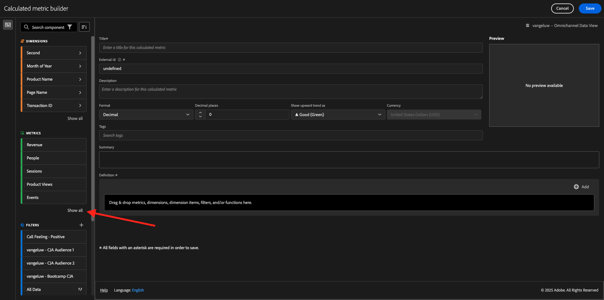
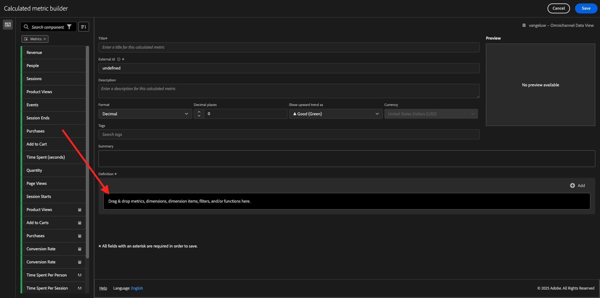

# 4.1.4 Analysis Workspace中的数据准备

## 目标

- 了解CJA中的Analysis Workspace UI
- 了解Analysis Workspace中的数据准备概念
- 了解如何进行数据计算

## 4.1.4.1 CJA中的Analysis Workspace UI

Analysis Workspace删除了单个Analytics报表的所有典型限制。 它为构建自定义分析项目提供了一个强大、灵活的画布。 将任意数量的数据表、可视化图表和组件（维度、量度、区段和时间粒度）拖放到项目中。 即时创建划分和区段，创建用于分析的同类群组，创建警报，比较区段，进行流量和流失分析，以及简化和计划报表以与业务中的任何人员共享。

Customer Journey Analytics基于Platform数据提供此解决方案。 我们强烈建议观看这段时长四分钟的概述视频：

>[!VIDEO](https://video.tv.adobe.com/v/35109?quality=12&learn=on&enablevpops)

如果您以前未使用Analysis Workspace，我们强烈建议您观看此视频：

>[!VIDEO](https://video.tv.adobe.com/v/26266?quality=12&learn=on&enablevpops)

### 创建项目

现在该创建您的第一个CJA工作区了。 转到CJA中的&#x200B;**Workspace**选项卡。
单击**创建项目**。

你会看到这个。 选择&#x200B;**空白Workspace项目**，然后单击&#x200B;**创建**。

然后，您将看到一个空项目。

首先，确保选择屏幕右上角的正确数据视图。 要选择的数据视图为`--aepUserLdap-- - Omnichannel Data View`。

接下来，您将保存项目并为其命名。 可以使用以下命令进行保存：

| 操作系统 | 捷径 |
| ----------------- |-------------| 
| Windows | Control + S |
| Mac | Command + S |

您将会看到此弹出窗口：

请使用此命名约定：

| 名称 | 描述 |
| ----------------- |-------------| 
| `--aepUserLdap-- - Omnichannel Analysis` | `--aepUserLdap-- - Omnichannel Analysis` |

接下来，单击&#x200B;**保存**。

## 4.1.4.2计算指标

虽然我们已在数据视图中组织了所有组件，但您仍需要调整其中一些组件，以便业务用户可以开始他们的分析。 此外，在任何分析期间，您可以创建计算量度以更深入地了解分析发现。

例如，我们将使用在数据视图上定义的&#x200B;**购买**&#x200B;量度/事件创建计算的&#x200B;**转化率**。

### 转化率

让我们开始打开计算指标生成器。 单击&#x200B;**+**&#x200B;以在Analysis Workspace中创建第一个计算量度。

**计算量度生成器**&#x200B;将显示：

在左侧菜单的量度列表中查找&#x200B;**购买**。 在&#x200B;**量度**&#x200B;下，单击&#x200B;**显示全部**

现在将&#x200B;**购买**&#x200B;量度拖放到计算量度定义中。

通常，转化率表示&#x200B;**转化/会话**。 让我们在计算量度定义画布中进行相同的计算。 查找&#x200B;**会话**&#x200B;量度，并将其拖放到定义生成器中的&#x200B;**购买**&#x200B;事件下。

请注意，系统会自动选择除法运算符。

转化率通常以百分比表示。 因此，让我们将格式更改为百分比并且选择2位小数。

最后，更改计算指标的名称和描述：

| 标题 | 描述 | 外部 ID |
| ----------------- |-------------| -------------| 
| 转化率 | 转化率 | conversionRate |

然后你就可以拥有这个。 单击&#x200B;**保存**。

再次单击&#x200B;**保存**。

## 4.1.4.3计算维度：过滤器（分段）和日期范围

### 过滤器：计算维度

计算并不只适用于量度。 在开始任何分析之前，创建一些&#x200B;**计算维度**&#x200B;也是很有趣的。 这基本上意味着&#x200B;**区段**&#x200B;返回到Adobe Analytics。 在Customer Journey Analytics中，这些区段称为&#x200B;**筛选器**。

创建筛选器将有助于商业用户开始分析时了解一些有价值的已计算维度。 这将使某些任务实现自动化，并帮助进行采用部分。 以下是一些示例：

1. 自有媒体、付费媒体、
2. 新访问与回访
3. 具有已放弃购物车的客户

这些筛选器可以在分析部分（将在下一个练习中完成）之前或期间创建。

### 日期范围：计算的时间维度

时间维是另一种计算维。 有些维度已经创建，但您还能够在数据准备阶段创建自己的自定义时间维度。

这些计算的时间维度我们将帮助分析师和业务用户记住重要日期，并使用它们来过滤和更改报表时间。 当我们进行分析时，脑海中浮现出一些典型的问题和疑问：

- 去年的“黑色星期五”是什么时候？ 21日到29日？
- 12月我们什么时候搞的？
- 我们什么时候举办的2018夏季销售会？ 我想把它与2019年进行比较。 顺便问一下，你知道2019年的确切日期吗？

现在，您已使用CJA Analysis Workspace完成数据准备练习。

下一步：使用Customer Journey Analytics的[4.1.5可视化图表](./ex5.md)

[返回模块4.1](./customer-journey-analytics-build-a-dashboard.md)

[返回所有模块](./../../../overview.md)
