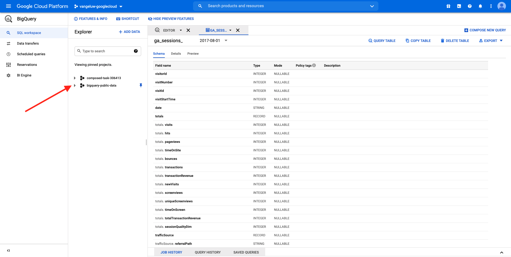
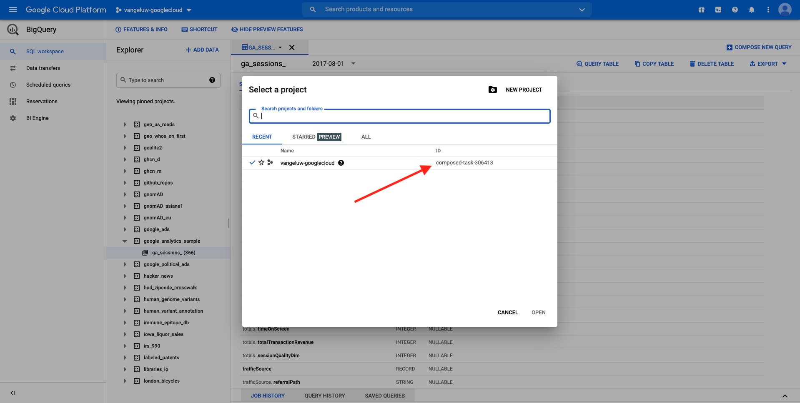

# 4.2.1创建您的Google Cloud Platform帐户

## 目标

- 创建您的Google Cloud Platform帐户
- 熟悉Google Cloud平台控制台
- 创建和准备BigQuery项目

## 4.2.1.1为何将Google BigQuery连接到Adobe Experience Platform以获取Google Analytics数据

Google Cloud Platform (GCP)是Google提供的一套公共云计算服务。 Google云平台包括一系列托管服务，可用于在Google硬件上运行的计算、存储和应用程序开发。

BigQuery是这些服务之一，并且始终包含在Google Analytics360中。 当我们尝试直接从Google Analytics数据（例如API）中获取数据时，经常会对其进行采样。 正因如此，Google包含BigQuery来获取未采样的数据，这样品牌就可以使用SQL进行高级分析，并从GCP的强大功能中获益。

Google Analytics数据每天使用批处理机制加载到BigQuery中。 因此，将此GCP/BigQuery集成用于实时个性化和激活用例没有任何意义。

如果品牌想要基于Google Analytics数据提供实时个性化用例，它可以通过Google Tag Manager在网站上收集这些数据，然后实时将其流式传输到Adobe Experience Platform。

GCP/BigQuery Source连接器应该用于……

- 跟踪网站上的所有客户行为，并将这些数据加载到Adobe Experience Platform中，以便进行无需实时激活的分析、数据科学和个性化用例。
- 将Google Analytics历史数据加载到Adobe Experience Platform中，同样用于分析和数据科学用例

## 4.2.1.2创建您的Google帐户

要获取Google Cloud Platform帐户，您需要一个Google帐户。

## 4.2.1.3激活您的Google Cloud Platform帐户

现在您已拥有Google帐户，接下来可以创建Google Cloud Platform环境了。 为此，请转到[https://console.cloud.google.com/](https://console.cloud.google.com/)。

在下一页，接受条款和条件。

接下来，单击&#x200B;**选择项目**。

单击&#x200B;**新建项目**。

按照以下命名约定命名项目：

| 公约 | 示例 |
| ----------------- |-------------| 
| `--aepUserLdap---googlecloud` | delaigle-googlecloud |

单击&#x200B;**创建**。

等到屏幕右上方的通知告知您创建已完成。 然后，单击&#x200B;**查看项目**。

接下来，转到屏幕顶部的搜索栏并键入&#x200B;**BigQuery**。 选择第一个结果。

然后，您将被重定向到BigQuery控制台，并且您将看到一条弹出消息。

**单击完成**。

本模块的目标是将Google Analytics数据导入Adobe Experience Platform。 为此，首先需要一个Google Analytics数据集中的虚拟数据。

单击左侧菜单中的&#x200B;**添加数据**，然后单击&#x200B;**浏览公共数据集**。

随后您将看到此窗口：

在搜索栏中输入搜索词&#x200B;**Google Analytics样本**&#x200B;并选择第一个结果。

您将看到以下屏幕以及数据集的描述。 单击&#x200B;**查看数据集**。

然后，您将被重定向到BigQuery，在&#x200B;**资源管理器**&#x200B;下将看到此&#x200B;**bigquery-public-data**&#x200B;数据集。

在&#x200B;**资源管理器**&#x200B;中，您现在应该会看到一些表。 欢迎您尽情探索。 转到`google_analytics_sample`。

单击以打开表`ga_sessions`。

在继续进行下一个练习之前，请在您计算机上的单独文本文件中写下以下内容：

| 凭据 | 命名 | 示例 |
| ----------------- |-------------| -------------|
| 项目名称 | `--aepUserLdap---googlecloud` | 旺格卢 — 古格吕德 |
| 项目编号 | random | composed-task-306413 |

通过单击顶部菜单栏中的&#x200B;**项目名称**，可以找到您的项目名称和项目ID：

然后，您将在右侧看到项目ID：

您现在可以转到练习12.2 ，通过查询Google Analytics数据会弄脏你的手。

下一步： [4.2.2在BigQuery](./ex2.md)中创建您的第一个查询

[返回模块4.2](./customer-journey-analytics-bigquery-gcp.md)

[返回所有模块](./../../../overview.md)
