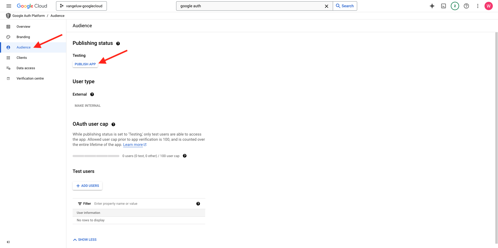
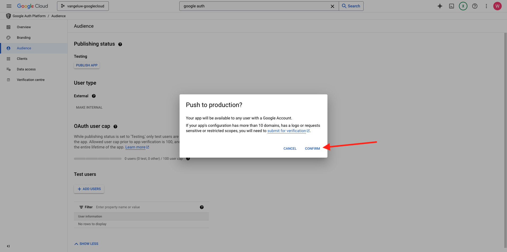
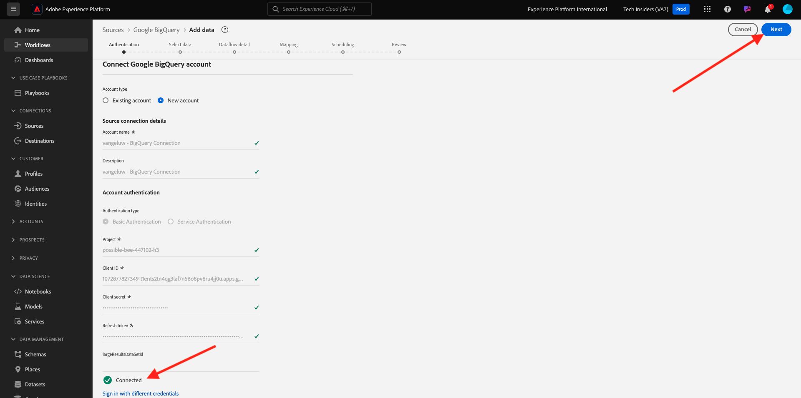

# 4.2.3将GCP和BigQuery连接到Adobe Experience Platform

## 目标

- 探索Google Cloud平台中的API和服务
- 熟悉用于测试Google API的OAuth Playground
- 在Adobe Experience Platform中创建您的第一个BigQuery连接

## 上下文

Adobe Experience Platform在&#x200B;**源**&#x200B;中提供了一个连接器，可帮助您将BigQuery数据集引入Adobe Experience Platform。 此数据连接器基于Google BigQuery API。 因此，请务必正确准备Google Cloud Platform和BigQuery环境，以接收来自Adobe Experience Platform的API调用。

要在Adobe Experience Platform中配置BigQuery Source连接器，您需要以下4个值：

- 项目
- clientId
- 客户端密钥
- refreshToken

到目前为止，您只有第一个，即&#x200B;**项目ID**。 此&#x200B;**项目ID**&#x200B;值是您在练习12.1中创建BigQuery项目时Google生成的随机ID。

请以分隔的文本文件复制项目ID。

| 凭据 | 命名 | 示例 |
| ----------------- |-------------| -------------|
| 项目编号 | random | possible-bee-447102-h3 |

您可以随时通过单击顶部菜单栏中的&#x200B;**项目名称**&#x200B;来检查项目ID：

您将在右侧看到您的项目ID：

在本练习中，您将学习如何获取其他3个必填字段：

- clientId
- 客户端密钥
- refreshToken

## 4.2.3.1 Google身份验证平台

要开始配置，请返回Google Cloud Platform主页。 要执行此操作，只需单击屏幕左上角的徽标。

进入主页后，在搜索栏中搜索&#x200B;**Google身份验证平台**。 单击第一个结果以将其打开。

您现在将看到&#x200B;**Google身份验证平台**&#x200B;主页。 单击&#x200B;**已启动GET**。

对于&#x200B;**应用程序名称**，使用此：

| 命名 | 示例 |
| ----------------- |-------------| 
| `--aepUserLdap-- - AEP BigQuery Connector` | vangeluw - AEP BigQuery连接器 |

为字段&#x200B;**用户支持电子邮件**&#x200B;选择您的电子邮件地址。

单击&#x200B;**下一步**。

选择&#x200B;**外部**&#x200B;并单击&#x200B;**下一步**。

输入您的电子邮件地址，然后单击&#x200B;**下一步**。

选中该复选框并单击&#x200B;**继续**。 然后，单击&#x200B;**创建**。

## 4.2.3.2创建OAuth客户端

单击&#x200B;**创建OAUTH客户端**。

你会看到这个。

选择&#x200B;**Web应用程序**。

将会弹出多个新字段。 您现在需要输入OAuth客户端ID的&#x200B;**Name**，还要输入&#x200B;**授权的重定向URI**。

对于字段&#x200B;**Name**，请使用以下代码：

| 字段 | 值 | 示例 |
| ----------------- |-------------| -------------| 
| 名称 | ldap - AEP BigQuery连接器 | vangeluw - Platform BigQuery Connector |

单击&#x200B;**授权的重定向URI**&#x200B;下的&#x200B;**+添加URI**。 添加以下新URI。

| 字段 | 值 |
| ----------------- |-------------| 
| 授权的重定向URI | https://developers.google.com/oauthplayground |

**授权重定向URI**&#x200B;字段是一个非常重要的字段，因为您稍后需要它来获取在Adobe Experience Platform中完成BigQuery Source连接器设置所需的RefreshToken。

单击&#x200B;**创建**。

您的OAuth客户端ID现已创建。 单击它可立即查看您的客户端ID和客户端密钥。

然后，您将看到客户端ID和客户端密钥的值。

请复制这两个字段并将其粘贴到桌面上的文本文件中。 您始终可以在以后的阶段访问这些凭据，但如果您将这些凭据保存在BigQuery项目ID旁边的文本文件中，会更轻松。

回顾一下Adobe Experience Platform中的BigQuery Source连接器设置，您现在已有以下值可用：

| BigQuery连接器凭据 | 值 |
| ----------------- |-------------| 
| 项目编号 | 您自己的项目ID(例如，： possible-bee-447102-h3) |
| clientid | yourclientid |
| cilentsecret | 您的客户端密钥 |

接下来，您需要发布OAuth应用程序。 转到&#x200B;**受众**&#x200B;并单击&#x200B;**PUBLISH应用程序**。

单击&#x200B;**确认**。

您仍然缺少&#x200B;**refreshToken**。 出于安全原因，需要使用refreshToken。 在API领域，令牌通常每24小时过期一次。 因此，每24小时刷新一次安全令牌需要&#x200B;**refreshToken**，以便您的Source连接器安装程序可以继续连接到Google Cloud Platform和BigQuery。

## 4.2.3.3 BigQuery API和refreshToken

可通过多种方式获取refreshToken以访问Google Cloud Platform API。 例如，其中一个选项是使用Postman。
但是，Google已构建一些更易于测试和使用API的工具，即**OAuth 2.0 Playground**。

若要访问&#x200B;**OAuth 2.0游乐场**，请转到[https://developers.google.com/oauthplayground](https://developers.google.com/oauthplayground)。

您随后将看到&#x200B;**OAuth 2.0游乐场**&#x200B;主页。

单击屏幕右上角的&#x200B;**齿轮**&#x200B;图标。 确保您的设置与上图中显示的设置相同。

选中复选框： **使用您自己的OAuth凭据**

将显示两个字段。

请填写此表后面的字段：

| 游乐场API设置 | 您的Google API凭据 |
| ----------------- |-------------| 
| OAuth客户端ID | 您自己的客户端ID（在桌面上的文本文件中） |
| OAuth客户端密钥 | 您自己的客户端密钥（在桌面上的文本文件中） |

填写凭据后，请单击&#x200B;**关闭**。

在左侧菜单中，您可以看到所有可用的Google API。 搜索&#x200B;**BigQuery API v2**&#x200B;并单击它以将其打开。

接下来，选择范围，如下图所示。 您需要单击每个可用的API，并且将为每个选定的API显示复选标记。

接下来，单击&#x200B;**授权API**。

单击用于设置GCP和BigQuery的电子邮件地址。

然后，您会看到一个严重警告：**此应用未验证**。 之所以会出现这种情况，是因为您的Platform BigQuery连接器尚未经过正式审核，因此Google不知道它是否是真实的应用程序。

单击&#x200B;**高级**。

接下来，单击&#x200B;**转到 — aepUserLdap— AEP BigQuery Connector (unsafe)**。

然后，您将看到访问的安全提示。 单击&#x200B;**全选**。

向下滚动并单击&#x200B;**继续**。

您现在将被送回OAuth 2.0游乐场，您将看到此内容。 单击&#x200B;**Exchange令牌授权码**。

几秒钟后，**步骤2 - Exchange令牌授权代码**&#x200B;视图将自动关闭，您将看到&#x200B;**步骤3 — 配置对API的请求**。

您必须返回到&#x200B;**步骤2 Exchange令牌授权码**，因此请再次单击&#x200B;**步骤2 Exchange令牌授权码**&#x200B;以可视化&#x200B;**刷新令牌**。

您现在将看到&#x200B;**刷新令牌**。

复制&#x200B;**刷新令牌**&#x200B;并将其粘贴到桌面上的文本文件中，同时粘贴其他BigQuery Source连接器凭据：

| BigQuery Source连接器凭据 | 值 |
| ----------------- |-------------| 
| 项目编号 | 您自己的随机项目ID(例如： apt-summer-273608) |
| clientid | yourclientid |
| cilentsecret | 您的客户端密钥 |
| refreshtoken | yourrefreshtoken |

接下来，让我们在Adobe Experience Platform中设置您的Source连接器。

## 4.2.3.5 — 将平台与您自己的BigQuery表连接起来

通过转到以下URL登录Adobe Experience Platform： [https://experience.adobe.com/platform](https://experience.adobe.com/platform)。

登录后，您将登录到Adobe Experience Platform的主页。

在继续之前，您需要选择一个&#x200B;**沙盒**。 要选择的沙盒名为``--aepSandboxName--``。 选择相应的沙盒后，您将看到屏幕变化，现在您位于专用沙盒中。

在左侧菜单中，转到“源”。 您随后将看到&#x200B;**源**&#x200B;主页。 在&#x200B;**源**&#x200B;菜单中，单击&#x200B;**数据库**。 单击&#x200B;**Google BigQuery**&#x200B;卡。 接下来，单击&#x200B;**设置**。

您现在应创建一个新连接。

单击&#x200B;**新建帐户**。 现在，您需要根据在GCP和BigQuery中进行的设置填写以下所有字段。

让我们从命名连接开始：

请使用此命名约定：

| BigQuery连接器凭据 | 值 | 示例 |
| ----------------- |-------------| -------------| 
| 帐户名称 | `--aepUserLdap-- - BigQuery Connection` | vangeluw - BigQuery连接 |
| 描述 | `--aepUserLdap-- - BigQuery Connection` | vangeluw - BigQuery连接 |

然后，您将拥有以下权限：

接下来，填写您存储在桌面上的文本文件中的GCP和BigQuery API **帐户身份验证** — 详细信息：

| BigQuery连接器凭据 | 值 |
| ----------------- |-------------| 
| 项目编号 | 您自己的随机项目ID(例如： possible-bee-447102-h3) |
| clientId | ... |
| 客户端密钥 | ... |
| refreshToken | ... |

您的&#x200B;**帐户身份验证** — 详细信息现在应如下所示。 单击&#x200B;**连接到源**。

如果您的&#x200B;**帐户身份验证**&#x200B;详细信息已正确填写，您现在应该会看到&#x200B;**已连接**&#x200B;确认消息，以直观方式确认连接是否正常工作。 单击&#x200B;**下一步**。

您现在将看到在上一个练习中创建的BigQuery数据集。

做得好！ 在下一个练习中，您将从该表中加载数据，并将其映射到Adobe Experience Platform中的架构和数据集。

下一步：[4.2.4将数据从BigQuery加载到Adobe Experience Platform](./ex4.md)

[返回模块4.2](./customer-journey-analytics-bigquery-gcp.md)

[返回所有模块](./../../../overview.md)
