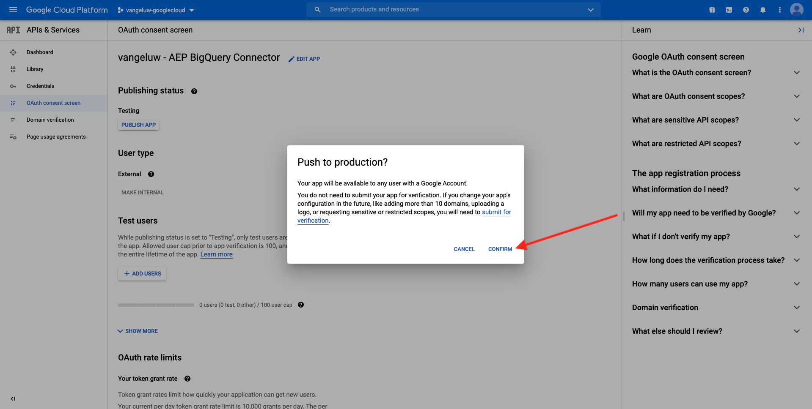
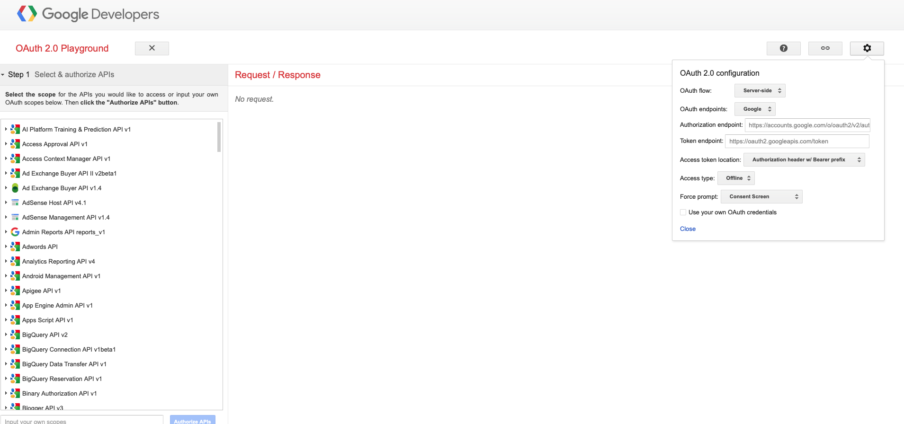
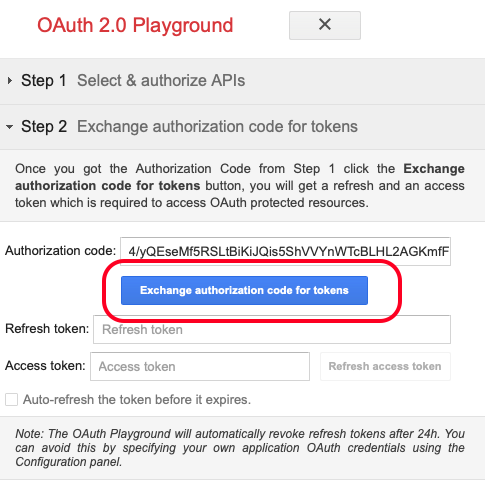
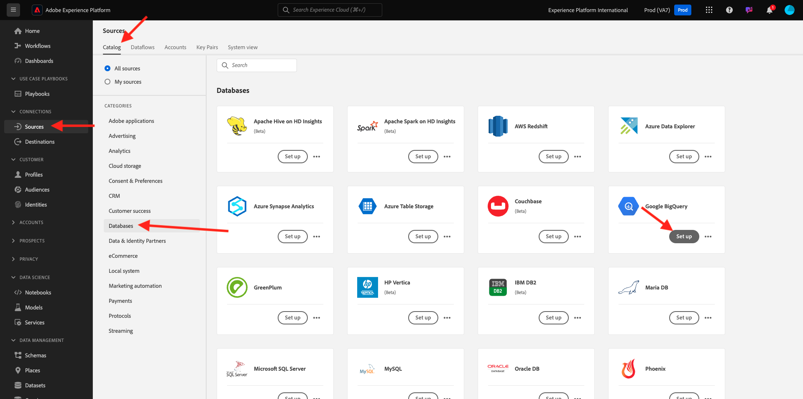

# 4.2.3将GCP和BigQuery连接到Adobe Experience Platform

## 目标

- 探索Google Cloud平台中的API和服务
- 熟悉用于测试Google API的OAuth Playground
- 在Adobe Experience Platform中创建您的第一个BigQuery连接

## 上下文

Adobe Experience Platform在&#x200B;**源**&#x200B;中提供了一个连接器，可帮助您将BigQuery数据集引入Adobe Experience Platform。 此数据连接器基于Google BigQuery API。 因此，请务必正确准备Google Cloud Platform和BigQuery环境，以接收来自Adobe Experience Platform的API调用。

要在Adobe Experience Platform中配置BigQuery Source连接器，您需要以下4个值：

- 项目
- clientId
- 客户端密钥
- refreshToken

到目前为止，您只有第一个，即&#x200B;**项目ID**。 此&#x200B;**项目ID**&#x200B;值是您在练习12.1中创建BigQuery项目时Google生成的随机ID。

请以分隔的文本文件复制项目ID。

| 凭据 | 命名 | 示例 |
| ----------------- |-------------| -------------|
| 项目编号 | random | composed-task-306413 |

您可以随时通过单击顶部菜单栏中的&#x200B;**项目名称**&#x200B;来检查项目ID：

您将在右侧看到您的项目ID：

在本练习中，您将学习如何获取其他3个必填字段：

- clientId
- 客户端密钥
- refreshToken

## 4.2.3.1 Google Cloud API和服务

要开始配置，请返回Google Cloud Platform主页。 要执行此操作，只需单击屏幕左上角的徽标。

进入主页后，转到左侧菜单并单击&#x200B;**API和服务**，然后单击&#x200B;**仪表板**。

您现在将看到&#x200B;**API和服务**&#x200B;主页。

在此页面中，您可以看到各种Google API连接的使用情况。 要设置API连接以便Adobe Experience Platform能够从BigQuery中读取，您需要执行以下步骤：

- 首先，您需要创建OAuth同意屏幕以启用未来的身份验证。 Google的安全原因还要求用户在允许程序化访问之前进行首次身份验证。
- 其次，您需要用于API身份验证和访问BigQuery Connector的API凭据（clientId和clientSecret）。

## 4.2.3.2 OAuth同意屏幕

让我们从创建OAuth同意屏幕开始。 在&#x200B;**API和服务**&#x200B;主页的左侧菜单中，单击&#x200B;**OAuth同意屏幕**。

您随后将看到以下内容：

选择用户类型： **外部**。 接下来，单击&#x200B;**创建**。

然后，您将位于&#x200B;**OAuth同意屏幕配置**&#x200B;窗口中。

此处只需在&#x200B;**应用程序名称**&#x200B;字段中输入同意屏幕的名称，然后选择&#x200B;**用户支持电子邮件**。 对于应用程序名称，请使用此命名约定：

| 命名 | 示例 |
| ----------------- |-------------| 
| `--aepUserLdap-- - AEP BigQuery Connector` | vangeluw - AEP BigQuery连接器 |

接下来，向下滚动，直到看到&#x200B;**开发人员联系信息**&#x200B;并填写电子邮件地址。

单击&#x200B;**保存并继续**。

你会看到这个。 单击&#x200B;**保存并继续**。

你会看到这个。 单击&#x200B;**保存并继续**。

你会看到这个。 单击&#x200B;**返回仪表板**。

你会看到这个。 单击&#x200B;**PUBLISH APP**。

单击&#x200B;**确认**。

你会看到这个。

在下一步中，您将完成API设置并获取API凭据。

## 4.2.3.3 Google API凭据：客户端密钥和客户端ID

在左侧菜单中，单击&#x200B;**凭据**。 您随后将看到以下内容：

单击&#x200B;**+创建凭据**&#x200B;按钮。

您将看到3个选项。 单击&#x200B;**OAuth客户端ID**：

在下一个屏幕中，选择&#x200B;**Web应用程序**。

将会弹出多个新字段。 您现在需要输入OAuth客户端ID的&#x200B;**Name**，还要输入&#x200B;**授权的重定向URI**。

请遵循以下命名约定：

| 字段 | 值 | 示例 |
| ----------------- |-------------| -------------| 
| 名称 | ldap - AEP BigQuery连接器 | vangeluw - Platform BigQuery Connector |
| 授权的重定向URI | https://developers.google.com/oauthplayground | https://developers.google.com/oauthplayground |

**授权重定向URI**&#x200B;字段是一个非常重要的字段，因为您稍后需要它来获取在Adobe Experience Platform中完成BigQuery Source连接器设置所需的RefreshToken。

在继续之前，需要先在输入URL以将该值存储在&#x200B;**授权的重定向URI**&#x200B;字段中后实际按下&#x200B;**Enter**&#x200B;按钮。 如果不单击&#x200B;**Enter**&#x200B;按钮，您稍后将在&#x200B;**OAuth 2.0游乐场**&#x200B;中遇到问题。

接下来，单击&#x200B;**创建**：

您现在可以看到您的客户端ID和客户端密钥。

请复制这两个字段并将其粘贴到桌面上的文本文件中。 您始终可以在以后的阶段访问这些凭据，但如果您将这些凭据保存在BigQuery项目ID旁边的文本文件中，会更轻松。

回顾一下Adobe Experience Platform中的BigQuery Source连接器设置，您现在已有以下值可用：

| BigQuery连接器凭据 | 值 |
| ----------------- |-------------| 
| 项目编号 | 您自己的项目ID(例如，：composed-task-306413) |
| clientid | yourclientid |
| cilentsecret | 您的客户端密钥 |

您仍然缺少&#x200B;**refreshToken**。 出于安全原因，需要使用refreshToken。 在API领域，令牌通常每24小时过期一次。 因此，每24小时刷新一次安全令牌需要&#x200B;**refreshToken**，以便您的Source连接器安装程序可以继续连接到Google Cloud Platform和BigQuery。

## 4.2.3.4 BigQuery API和refreshToken

可通过多种方式获取refreshToken以访问Google Cloud Platform API。 例如，其中一个选项是使用Postman。
但是，Google已构建一些更易于测试和使用API的工具，即**OAuth 2.0 Playground**。

若要访问&#x200B;**OAuth 2.0游乐场**，请转到[https://developers.google.com/oauthplayground](https://developers.google.com/oauthplayground)。

您随后将看到&#x200B;**OAuth 2.0游乐场**&#x200B;主页。

单击屏幕右上角的&#x200B;**齿轮**&#x200B;图标：

确保您的设置与上图中显示的设置相同。

仔细检查设置以完全确定。

完成后，选中&#x200B;**使用您自己的OAuth凭据**&#x200B;复选框

此时应会显示两个字段，并且您具有相应的值。

请填写此表后面的字段：

| 游乐场API设置 | 您的Google API凭据 |
| ----------------- |-------------| 
| OAuth客户端ID | 您自己的客户端ID（在桌面上的文本文件中） |
| OAuth客户端密钥 | 您自己的客户端密钥（在桌面上的文本文件中） |

从您在桌面上创建的文本文件中复制&#x200B;**客户端ID**&#x200B;和&#x200B;**客户端密钥**。

填写凭据后，请单击&#x200B;**关闭**

在左侧菜单中，您可以看到所有可用的Google API。 搜索&#x200B;**BigQuery API v2**。

接下来，选择范围，如下图所示：

选择它们后，您应该会看到一个蓝色按钮，显示&#x200B;**授权API**。 单击它。

选择用于设置GCP和BigQuery的Google帐户。

您可能会看到一个严重警告：**此应用未验证**。 之所以会出现这种情况，是因为您的Platform BigQuery连接器尚未经过正式审核，因此Google不知道它是否是真实的应用程序。 您应忽略此通知。

单击&#x200B;**高级**。

接下来，单击&#x200B;**转到ldap - AEP BigQuery连接器（不安全）**。

您将被重定向到您创建的OAuth同意屏幕。

如果您使用双重身份验证(2FA)，请输入发送给您的验证代码。

Google现在将向您显示八个不同的&#x200B;**权限**&#x200B;提示。 针对所有八个权限请求，单击&#x200B;**允许**。 （在API允许程序化请求之前，此过程必须由真实的人遵循并验证一次）

再次重申，将不会显示&#x200B;**八个不同的弹出窗口**，您必须为所有弹出窗口单击&#x200B;**允许**。

在发出八项权限请求后，您将看到此概述。 单击&#x200B;**允许**&#x200B;完成该过程。

最后一次&#x200B;**允许**&#x200B;单击后，您将被发送回OAuth 2.0游乐场，您将看到以下内容：

单击&#x200B;**Exchange令牌授权码**。

几秒钟后，**步骤2 - Exchange令牌授权代码**&#x200B;视图将自动关闭，您将看到&#x200B;**步骤3 — 配置对API的请求**。

您必须返回到&#x200B;**步骤2 Exchange令牌授权码**，因此请再次单击&#x200B;**步骤2 Exchange令牌授权码**&#x200B;以可视化&#x200B;**刷新令牌**。

您现在将看到&#x200B;**刷新令牌**。

复制&#x200B;**刷新令牌**&#x200B;并将其粘贴到桌面上的文本文件中，同时粘贴其他BigQuery Source连接器凭据：

| BigQuery Source连接器凭据 | 值 |
| ----------------- |-------------| 
| 项目编号 | 您自己的随机项目ID(例如： apt-summer-273608) |
| clientid | yourclientid |
| cilentsecret | 您的客户端密钥 |
| refreshtoken | yourrefreshtoken |

接下来，让我们在Adobe Experience Platform中设置您的Source连接器。

## 4.2.3.5 — 将平台与您自己的BigQuery表连接起来

通过转到以下URL登录Adobe Experience Platform： [https://experience.adobe.com/platform](https://experience.adobe.com/platform)。

登录后，您将登录到Adobe Experience Platform的主页。

在继续之前，您需要选择一个&#x200B;**沙盒**。 要选择的沙盒名为``--aepSandboxName--``。 选择相应的沙盒后，您将看到屏幕变化，现在您位于专用沙盒中。

在左侧菜单中，转到“源”。 您随后将看到&#x200B;**源**&#x200B;主页。 在&#x200B;**源**&#x200B;菜单中，单击&#x200B;**数据库**。 单击&#x200B;**Google BigQuery**&#x200B;卡。 接下来，单击&#x200B;**设置**&#x200B;或&#x200B;**+配置**。

您现在应创建一个新连接。

单击&#x200B;**新帐户**。 现在，您需要根据在GCP和BigQuery中进行的设置填写以下所有字段。

让我们从命名连接开始：

请使用此命名约定：

| BigQuery连接器凭据 | 值 | 示例 |
| ----------------- |-------------| -------------| 
| 帐户名称 | `--aepUserLdap-- - BigQuery Connection` | vangeluw - BigQuery连接 |
| 描述 | `--aepUserLdap-- - BigQuery Connection` | vangeluw - BigQuery连接 |

这应该会给你带来如下信息：

接下来，填写您存储在桌面上的文本文件中的GCP和BigQuery API **帐户身份验证** — 详细信息：

| BigQuery连接器凭据 | 值 |
| ----------------- |-------------| 
| 项目编号 | 您自己的随机项目ID(例如： apt-summer-273608) |
| clientId | ... |
| 客户端密钥 | ... |
| refreshToken | ... |

您的&#x200B;**帐户身份验证** — 详细信息现在应如下所示：

填写完所有这些字段后，单击&#x200B;**连接到源**。

如果您的&#x200B;**帐户身份验证**&#x200B;详细信息已正确填写，您现在应该会看到&#x200B;**已连接**&#x200B;确认消息，以直观方式确认连接是否正常工作。

现在您的连接已创建，请单击&#x200B;**下一步**：

现在，您将看到在练习12.2中创建的BigQuery数据集。

做得好！ 在下一个练习中，您将从该表中加载数据，并将其映射到Adobe Experience Platform中的架构和数据集。

下一步：[4.2.4将数据从BigQuery加载到Adobe Experience Platform](./ex4.md)

[返回模块4.2](./customer-journey-analytics-bigquery-gcp.md)

[返回所有模块](./../../../overview.md)
