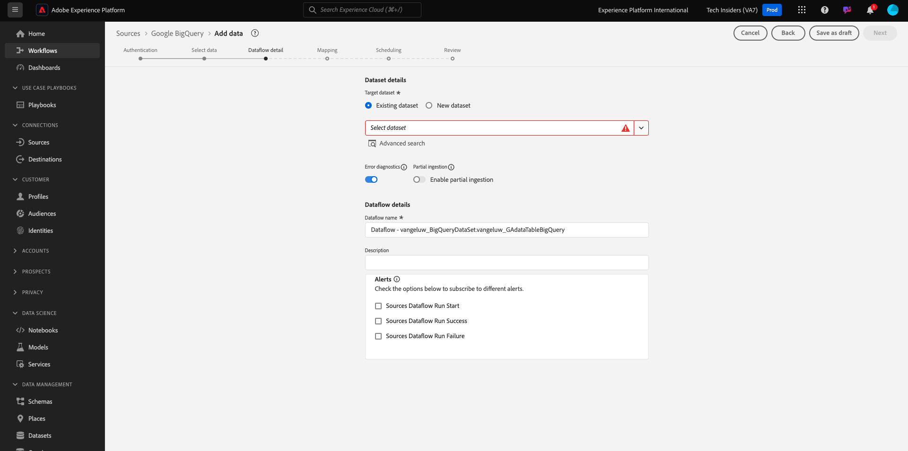
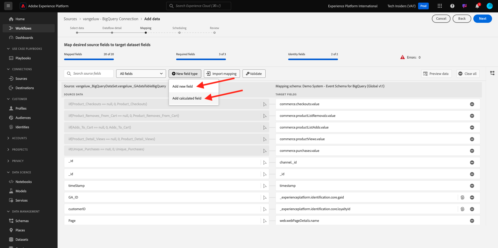

# 4.2.4将数据从BigQuery加载到Adobe Experience Platform中

## 目标

- 将BigQuery数据映射到XDM架构
- 将BigQuery数据加载到Adobe Experience Platform
- 熟悉BigQuery Source连接器UI

## 开始之前

在上一个练习后，您应该在Adobe Experience Platform中打开以下页面：

**如果您打开了它，请继续进行下一个练习。**

**如果您尚未打开它，请转到[Adobe Experience Platform](https://experience.adobe.com/platform/home)。**

在左侧菜单中，转到“源”。 您随后将看到&#x200B;**源**&#x200B;主页。 在&#x200B;**源**&#x200B;菜单中，转到&#x200B;**Google BigQuery**&#x200B;源连接器，然后单击&#x200B;**设置**。

然后，您会看到Google BigQuery帐户选择屏幕。 选择您的帐户，然后单击&#x200B;**下一步**。

然后您会看到&#x200B;**选择数据**&#x200B;屏幕。

## 4.2.4.1 BigQuery表选择

在&#x200B;**选择数据**&#x200B;屏幕中，选择您的BigQuery数据集。 您现在可以在BigQuery中看到Google Analytics数据的示例数据预览。

单击&#x200B;**下一步**。

## 4.2.4.2 XDM映射

您现在将看到以下内容：

现在，您必须创建新数据集或选择现有数据集以将Google Analytics数据加载到中。 对于此练习，已创建一个数据集和架构。 您无需创建新架构或数据集。

选择&#x200B;**现有数据集**。 打开下拉菜单以选择数据集。 搜索名为`Demo System - Event Dataset for BigQuery (Global v1.1)`的数据集并将其选定。 单击&#x200B;**下一步**。

向下滚动。 您现在需要从Google Analytics/BigQuery将每&#x200B;**个Source字段**&#x200B;映射到一个XDM **目标字段**，按字段映射。 您可能会看到一些错误，以下映射练习将解决这些错误。

在本练习中使用下面的映射表。

| 源字段 | 目标字段 |
| ----------------- |-------------| 
| `_id` | `_id` |
| `_id` | 渠道。_id |
| `timeStamp` | 时间戳 |
| `GA_ID` | ``--aepTenantId--``.identification.core.gaid |
| `customerID` | ``--aepTenantId--``的问题。identification.core.crmId |
| `Page` | web.webPageDetails.name |
| `Device` | device.type |
| `Browser` | environment.browserDetails.vendor |
| `MarketingChannel` | marketing.trackingCode |
| `TrafficSource` | channel.typeAtSource |
| `TrafficMedium` | channel.mediaType |
| `TransactionID` | commerce.order.payments.transactionID |
| `Ecommerce_Action_Type` | 事件类型 |
| `Pageviews` | web.webPageDetails.pageViews.value |

对于某些字段，您需要删除原始映射并为&#x200B;**计算字段**&#x200B;创建新映射。

| 计算字段 | 目标字段 |
| ----------------- |-------------| 
| `iif(Unique_Purchases == null, 0, Unique_Purchases)` | commerce.purchases.value |
| `iif(Product_Detail_Views == null, 0, Product_Detail_Views)` | commerce.productViews.value |
| `iif(Adds_To_Cart == null, 0, Adds_To_Cart)` | commerce.productListAdds.value |
| `iif(Product_Removes_From_Cart == null, 0, Product_Removes_From_Cart), 1, 0)` | commerce.productListRemovals.value |
| `iif(Product_Checkouts == null, 0, Product_Checkouts)` | commerce.checkouts.value |

要创建&#x200B;**计算字段**，请单击&#x200B;**+新建字段类型**，然后单击&#x200B;**计算字段**。

粘贴上述规则，并对上表中的每个字段单击&#x200B;**保存**。

您现在有了&#x200B;**映射**，类似于此。

源字段&#x200B;**GA_ID**&#x200B;和&#x200B;**customerID**&#x200B;映射到此XDM架构中的标识符。 这将允许您使用其他数据集（如忠诚度或呼叫中心数据）扩充Google Analytics数据（Web/应用程序行为数据）。

单击&#x200B;**下一步**。

## 4.2.4.3连接和数据摄取调度

您现在将看到&#x200B;**计划**&#x200B;选项卡：

在&#x200B;**计划**&#x200B;选项卡中，您可以为此&#x200B;**映射**&#x200B;和数据定义数据摄取过程的频率。

由于您在Google BigQuery中使用不会刷新的演示数据，因此在本练习中无需设置计划。 您确实必须选择某些内容，并且要避免过多的无用数据摄取流程，您需要设置频率，如下所示：

- 频率： **周**
- 间隔： **200**
- 开始时间：**下一小时内的任何时间**

**重要信息**：请务必激活&#x200B;**回填**&#x200B;开关。

最后但并非最不重要的一点是，您必须定义&#x200B;**delta**&#x200B;字段。

**delta**&#x200B;字段用于计划连接并仅上传进入BigQuery数据集的新行。 增量字段通常始终为时间戳列。 因此，对于未来的计划数据摄取，将仅摄取具有新的、更新的时间戳的行。

选择&#x200B;**时间戳**作为增量字段。
单击**下一步**。

## 4.2.4.4查看并启动连接

您现在可以看到连接的详细概述。 在继续之前，请确保所有内容均正确，因为某些设置此后不能再更改，例如XDM映射。

单击&#x200B;**完成**。

创建连接后，您将看到以下内容：

您现在已准备好继续下一个练习，在该练习中，您将使用Customer Journey Analytics功能基于Google Analytics数据构建强大的可视化图表。

下一步： [4.2.5使用Customer Journey Analytics分析Google Analytics数据](./ex5.md)

[返回模块4.2](./customer-journey-analytics-bigquery-gcp.md)

[返回所有模块](./../../../overview.md)
