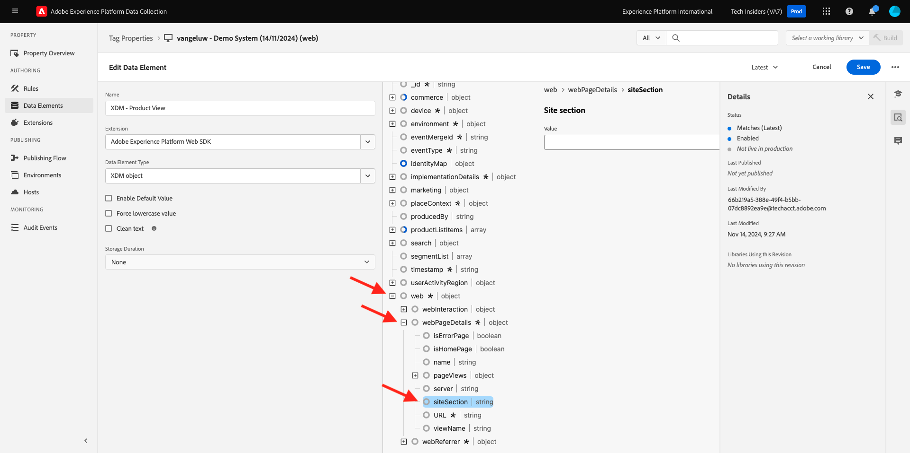
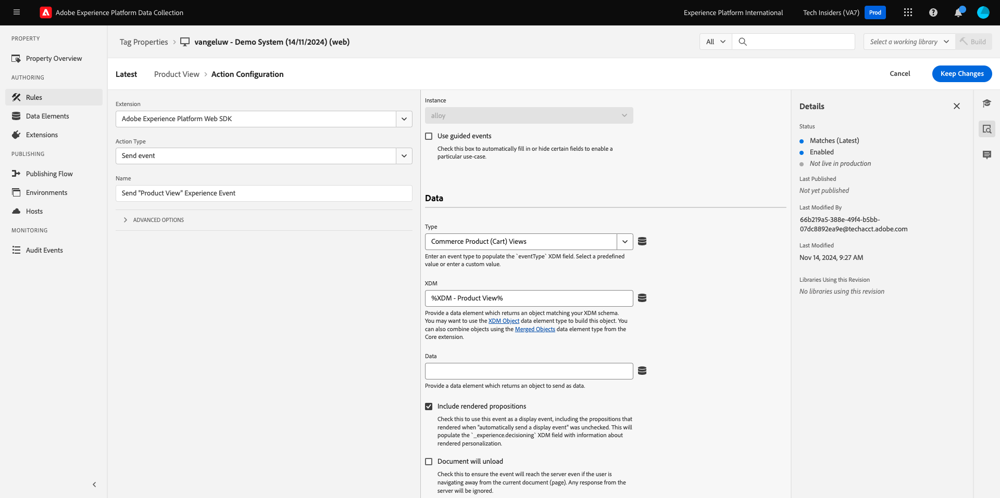

# 1.1.3 Adobe Experience Platform数据收集简介

## 上下文

现在，让我们更深入地了解Adobe Experience Platform数据收集的构建基块，以了解您的演示网站上安装的内容。 您将更详细地了解Adobe Experience Platform Web SDK扩展，配置数据元素和规则，以及如何发布库。

## Adobe Experience Platform Web SDK标记扩展

标记扩展是一组打包的代码，用于扩展Adobe Experience Platform数据收集界面和库功能。 Adobe Experience Platform数据收集是一个平台，而标记扩展类似于在该平台上运行的应用程序。 本教程中使用的所有扩展均由Adobe创建和管理，但第三方可以创建自己的扩展，以限制Adobe Experience Platform数据收集用户必须管理的自定义代码量。

转到[Adobe Experience Platform数据收集](https://experience.adobe.com/launch/)并选择&#x200B;**标记**。

这是您之前看到的Adobe Experience Platform数据收集属性页面。

在&#x200B;**快速入门**&#x200B;中，演示系统为您创建了两个客户端属性：一个用于网站，另一个用于移动应用程序。 通过在&#x200B;**[!UICONTROL 搜索]**&#x200B;框中搜索`--aepUserLdap--`来查找它们。
单击以打开**Web**&#x200B;属性。

然后，您将看到资产概述页面。 单击左边栏中的&#x200B;**[!UICONTROL 扩展]**，然后单击&#x200B;**Adobe Experience Platform Web SDK**，然后单击&#x200B;**[!UICONTROL 配置]**。

欢迎使用Adobe Experience Platform Web SDK！ 在这里，您可以使用在[快速入门](./../../../modules/gettingstarted/gettingstarted/ex2.md)中创建的数据流以及某些更高级的配置来配置该扩展。

默认边缘域始终为&#x200B;**edge.adobedc.net**。 如果您已在Adobe Experience Cloud或Adobe Experience Platform环境中实施CNAME配置，则需要更新&#x200B;**[!UICONTROL Edge域]**。

如果实例的边缘域不同于默认域，请在此处更新边缘域。 如果您不确定，请使用默认域。 利用边缘域，可以配置第一方跟踪服务器，然后在后端使用CNAME配置以确保将数据收集到Adobe中。

在&#x200B;**[!UICONTROL 数据流]**&#x200B;下，您已在&#x200B;**快速入门**&#x200B;部分中选择了数据流。 您从每个环境的&#x200B;**[!UICONTROL 数据流]**&#x200B;框中的列表中选择了此数据流`--aepUserLdap-- - Demo System Datastream`。

单击&#x200B;**[!UICONTROL 保存]**&#x200B;以返回扩展视图。

## 数据元素

数据元素是数据字典（或数据映射）的构建块。使用数据元素可跨市场营销和广告技术收集、组织和交付数据。

单个数据元素是一个变量，其值可以映射到查询字符串、URL、Cookie 值、JavaScript 变量等。您可以在整个Adobe Experience Platform数据收集中通过其变量名称引用此值。 此数据元素集合将成为可用于构建规则（事件、条件和操作）的已定义数据的字典。所有Adobe Experience Platform数据收集会共享此数据字典，以便与您添加到资产中的任何扩展一起使用。

您现在将要以Web SDK友好格式编辑现有的数据元素。

单击左边栏中的数据元素，以转到数据元素页面。

>[!NOTE]
>
>您在此练习中仅编辑了一个数据元素，但您可以在此页面上看到&#x200B;**[!UICONTROL 添加数据元素]**&#x200B;按钮，该按钮用于将新变量添加到数据字典中。 然后，可以在整个Adobe Experience Platform数据收集过程中使用此功能。 您可以随意查看一些其他现有的数据元素，这些元素主要使用本地存储作为数据源。

在搜索栏中，键入&#x200B;**XDM - Product View**，然后单击它返回的数据元素。

此屏幕显示您将编辑的XDM对象。 Experience Data Model (XDM)这一概念将在本技术教程中深入探讨，但目前足以将它理解为Adobe Experience Platform Web SDK所需的格式。 您将向在演示网站的文章页面上收集的数据添加一些更多信息。

单击树底部&#x200B;**Web**&#x200B;旁边的加号按钮。

单击&#x200B;**webPageDetails**&#x200B;旁边的加号按钮。

单击&#x200B;**siteSection**。 您现在看到&#x200B;**siteSection**&#x200B;尚未链接到任何数据元素。 我们来改变一下吧。

向上滚动，输入文本`%Product Category%`。 单击&#x200B;**[!UICONTROL 保存]**。

此时，已安装Adobe Experience Platform Web SDK扩展，并且您已更新一个数据元素以根据XDM结构收集数据。 接下来，让我们检查将在正确时间发送数据的规则。

## 规则

Adobe Experience Platform数据收集是一个基于规则的系统。 它可查找用户交互及关联数据。如果满足您的规则中所列的标准，则规则会触发您已识别的扩展、脚本或客户端代码。

构建规则可将数据与营销和广告技术的功能整合到一起，从而将不同的产品统一到单个解决方案中。

让我们划分在文章页面上发送数据的规则。

单击左边栏中的&#x200B;**[!UICONTROL 规则]**。

**[!UICONTROL 搜索]** `Product View`。

单击返回的规则。

让我们看一下构成此规则的各个元素。

对于所有规则：如果发生指定的&#x200B;**[!UICONTROL Event]**，则计算&#x200B;**[!UICONTROL Conditions]**，然后根据需要执行指定的&#x200B;**[!UICONTROL 操作]**。

单击事件&#x200B;**核心 — 自定义事件**。 这是加载的视图。

单击&#x200B;**事件类型**&#x200B;下拉列表。

这将列出一些标准交互，如果条件为true，您可以使用这些交互指示Adobe Experience Platform数据收集运行操作。

单击&#x200B;**[!UICONTROL 取消]**&#x200B;以返回规则。

单击操作&#x200B;**发送“产品视图”体验事件**。

在这里，您可以看到由Adobe Experience Platform Web SDK发送到边缘的数据。 更具体地说，它使用的是Web SDK的&#x200B;**alloy** **[!UICONTROL Instance]**。 事件&#x200B;**[!UICONTROL 类型]**&#x200B;设置为&#x200B;**Commerce产品（购物车）视图**，而您发送的XDM数据是您之前更改的&#x200B;**XDM — 产品视图**&#x200B;数据元素。

现在您已查看规则，可以在Adobe Experience Platform数据收集中发布所有更改。

## 库中的Publish

最后，为了验证您刚刚更新的规则和数据元素，您需要发布一个库，其中包含我们资产中编辑过的项目。 在Adobe Experience Platform数据收集的&#x200B;**[!UICONTROL 发布]**&#x200B;部分中，您需要执行一些快速步骤。

在左侧导航中单击&#x200B;**[!UICONTROL 发布流]**

单击名为&#x200B;**Main**&#x200B;的现有库。

单击&#x200B;**添加所有已更改资源**按钮。 下一步，
单击**保存并生成以进行开发**&#x200B;按钮。

库可能需要几分钟才能构建，完成后，库名称左侧将显示一个绿色圆点。

正如您可在发布流屏幕上看到的，Adobe Experience Platform数据收集中的发布流程还有许多其他内容，这些内容超出了本教程的范围。 我们将在开发环境中使用单个库。

下一步： [1.1.4客户端Web数据收集](./ex4.md)

[返回模块1.1](./data-ingestion-launch-web-sdk.md)

[返回所有模块](./../../../overview.md)
