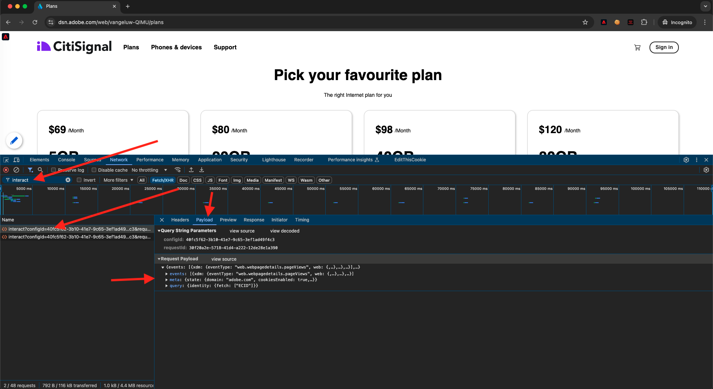

# 1.1.4客户端Web数据采集

## 验证请求中的数据

### 安装Adobe Experience Platform Debugger

Experience Platform Debugger是适用于Chrome和Firefox浏览器的扩展，可帮助您查看在网页中实施的Adobe技术。 为您的首选浏览器安装此版本：

- [Firefox扩展](https://addons.mozilla.org/zh-CN/firefox/addon/adobe-experience-platform-dbg/)

- [Chrome扩展](https://chrome.google.com/webstore/detail/adobe-experience-platform/bfnnokhpnncpkdmbokanobigaccjkpob)

如果您以前从未使用过Debugger，并且此调试器与之前的Adobe Experience Cloud Debugger不同，那么您可能需要观看以下五分钟概述视频：

>[!VIDEO](https://video.tv.adobe.com/v/32156?quality=12&learn=on&enablevpops)

鉴于您将以无痕模式加载演示网站，您需要确保Experience Platform Debugger也可在无痕模式下使用。 为此，请在浏览器中转到&#x200B;**chrome://extensions**，然后打开Experience Platform Debugger扩展。

验证是否启用了以下2个设置：

- 开发人员模式
- 允许无痕显示

### 打开演示网站

转到[https://dsn.adobe.com](https://dsn.adobe.com)。 使用Adobe ID登录后，您将看到此内容。 单击网站项目上的3个点&#x200B;**...**，然后单击&#x200B;**运行**&#x200B;以将其打开。

随后您将看到您的演示网站已打开。 选择URL并将其复制到剪贴板。

打开一个新的无痕浏览器窗口。

粘贴您在上一步中复制的演示网站的URL。 然后，系统将要求您使用Adobe ID登录。

选择您的帐户类型并完成登录过程。

然后，您会看到您的网站已加载到无痕浏览器窗口中。 对于每个演示，您将需要使用新的无痕浏览器窗口来加载演示网站URL。

### 使用Experience Platform Debugger查看发往Edge的调用

确保已打开演示网站，然后单击Experience Platform Debugger扩展图标。

此时将打开Debugger，并显示在Adobe Experience Platform数据收集属性中创建的实施的详细信息。 请记住，您正在调试刚刚编辑的扩展和规则。

单击右上方的&#x200B;**[!UICONTROL 登录]**&#x200B;按钮进行身份验证。 如果您已经打开了包含Adobe Experience Platform数据收集界面的浏览器选项卡，则身份验证步骤将自动完成，您无需再次输入用户名和密码。

然后，您将登录到Debugger。

单击演示网站上的“重新加载”按钮，将调试器连接到该特定选项卡。

确认Debugger已&#x200B;**[!UICONTROL 连接到主页]**（如上图所示），然后单击&#x200B;**[!UICONTROL 锁定]**&#x200B;图标将Debugger锁定到演示网站。 如果不这样做，Debugger将不断切换以显示任何焦点浏览器选项卡的实施详细信息，这可能会造成混淆。 锁定调试器后，图标将更改为&#x200B;**解锁**。

接下来，转到演示网站上的任何页面，例如&#x200B;**计划**&#x200B;类别页面。

现在，单击左侧导航栏中的&#x200B;**[!UICONTROL Experience Platform Web SDK]**，查看&#x200B;**[!UICONTROL 网络请求]**。

每个请求都包含一个&#x200B;**[!UICONTROL 事件]**&#x200B;行。

单击以打开&#x200B;**[!UICONTROL 事件]**&#x200B;行。 请注意您如何查看&#x200B;**web.webpagedetails.pageViews**&#x200B;事件，以及其他遵守&#x200B;**Web SDK ExperienceEvent XDM**&#x200B;格式的现成变量。

这些类型的请求详细信息也会显示在“网络”选项卡中。 筛选与&#x200B;**交互**&#x200B;的请求，以查找由Web SDK发送的请求。 您可以在有效负载部分中找到有关XDM有效负载的所有详细信息：

下一步：[1.1.5实施Adobe Analytics和Adobe Audience Manager](./ex5.md)

[返回模块1.1](./data-ingestion-launch-web-sdk.md)

[返回所有模块](./../../../overview.md)
