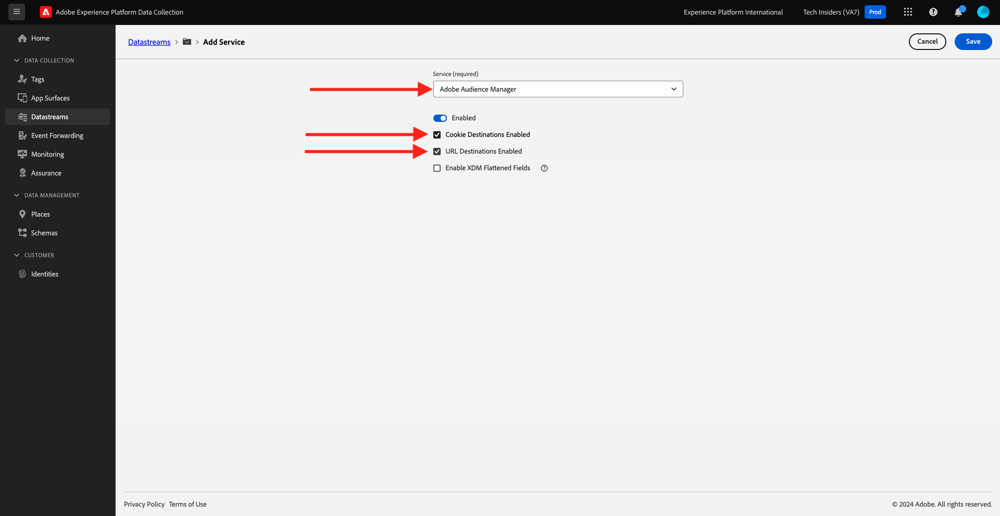

# 1.1.5实施Adobe Analytics和Adobe Audience Manager

## 上下文

您现在知道XDM数据正在流入平台。 您将详细了解[模块1.2](./../module1.2/data-ingestion.md)中的XDM是什么，以及如何构建您自己的架构以跟踪自定义变量。 现在，您将看到设置数据流以将数据转发到Analytics和Audience Manager时发生的情况。

## 在Analytics中映射变量

Adobe Experience Platform [!DNL Web SDK]自动映射某些值，从而能够尽快通过Web SDK实现Analytics的新实施。 自动映射的变量在[此处](https://experienceleague.adobe.com/docs/experience-platform/edge/data-collection/adobe-analytics/automatically-mapped-vars.html#data-collection)列出。

对于未自动映射到Adobe Analytics的XDM数据，您可以使用[上下文数据](https://experienceleague.adobe.com/docs/analytics/implementation/vars/page-vars/contextdata.html?lang=zh-Hans)来匹配您的[架构](https://experienceleague.adobe.com/docs/experience-platform/xdm/schema/composition.html)。 然后，可以使用[处理规则](https://experienceleague.adobe.com/docs/analytics/admin/admin-tools/processing-rules/processing-rules-configuration/t-processing-rules.html)将其映射到Analytics中以填充Analytics变量。 上下文数据和处理规则将是以前与Analytics一起使用的概念所熟悉的概念，但如果它们是新概念，则现在无需担心详细信息。

您还可以使用一组默认的操作和产品列表，通过AEP Web SDK发送或检索数据。 为此，请参阅[产品](https://experienceleague.adobe.com/docs/experience-platform/edge/data-collection/collect-commerce-data.html?lang=en#data-collection)。

### 上下文数据

为了供Analytics使用，XDM数据使用点表示法扁平化并作为`contextData`提供。 以下值对列表显示了`context data`的示例：

```javascript
{
    "bh": "900",
    "bw": "1680",
    "c": "24",
    "c.a.d.key.[0]": "value1",
    "c.a.d.key.[1]": "value2",
    "c.a.d.object.key1": "value1",
    "c.a.d.object.key2.[0]": "value2",
    "c.a.x.environment.browserdetails.javascriptenabled": "true",
    "c.a.x.environment.type": "browser",
    "cust_hit_time_gmt": "1579781427",
    "g": "http://example.com/home",
    "gn": "home",
    "j": "1.8.5",
    "k": "Y",
    "s": "1680x1050",
    "tnta": "218287:1:0|0,218287:1:0|2,218287:1:0|1,218287:1:0|32767,218287:1:01,218287:1:0|0,218287:1:0|1,218287:1:0|0,218287:1:0|1",
    "user_agent": "Mozilla/5.0 AppleWebKit/537.36 Safari/537.36",
    "v": "Y"
}
```

### 处理规则

可以通过[处理规则](https://experienceleague.adobe.com/docs/analytics/admin/admin-tools/processing-rules/processing-rules-configuration/t-processing-rules.html)访问边缘网络收集的所有数据。 在Analytics中，您可以使用处理规则将上下文数据纳入Analytics变量。

## Experience PlatformEdge Network上的Audience Manager

服务器端转发不是新的Audience Manager概念，与之前的过程相同。 您还可以同步身份。

## 审查您的数据流以将数据发送到Adobe Analytics

如果您要将Web SDK收集的数据发送到Adobe Analytics和Adobe Audience Manager，请执行以下步骤。

转到[https://experience.adobe.com/launch/](https://experience.adobe.com/launch/)并转到&#x200B;**数据流**。

在屏幕右上角，选择沙盒名称，应为`--aepSandboxName--`。 打开名为`--aepUserLdap-- - Demo System Datastream`的特定数据流。


你会看到这个。 要启用Adobe Analytics，请单击&#x200B;**添加服务**。


你会看到这个。 选择服务&#x200B;**Adobe Analytics**，之后您需要在Adobe Analytics中添加报表包才能将数据发送到中。 在本教程中，这超出了范围。 单击&#x200B;**取消**。


## 审查您的数据流以将数据发送到Adobe Audience Manager

你会看到这个。 要启用Adobe Audience Manager，请单击&#x200B;**添加服务**。


你会看到这个。 选择服务&#x200B;**Adobe Audience Manager**，您可以在此后决定启用或禁用Adobe Audience Manager Cookie目标和/或URL目标。 在本教程中，此配置超出了范围。 单击&#x200B;**取消**。



下一步： [1.1.6实施Adobe Target](./ex6.md)

[返回模块1.1](./data-ingestion-launch-web-sdk.md)

[返回所有模块](./../../../overview.md)
