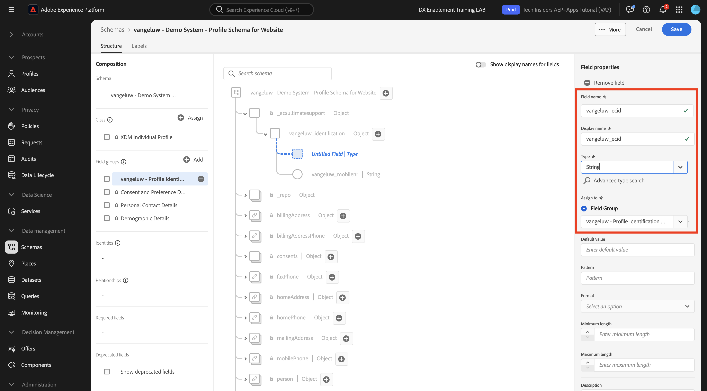

# 1.2.2配置架构并设置标识符

在本练习中，您将回顾分类用户档案信息和客户行为所需的XDM架构的配置。 在每个XDM模式中，您还会看到已定义了一个主标识符以将所有客户相关信息链接到。

## Story

在开始配置XDM架构和定义标识符之前，您需要考虑我们尝试执行的操作的业务上下文：

- 您需要数据
- 您希望将数据链接到客户
- 您希望构建一个渐进式的实时客户档案

有2种类型的数据需要捕获：

- 此客户是谁？
- 该客户做什么？

但是，问题&#x200B;**此客户是谁？**&#x200B;是一个非常开放的问题，有许多答案。 当您的组织希望获得此问题的答案时，您需要查找人口统计信息，如名字、姓氏和地址。 另外，还可以获取电子邮件地址或手机号码等联系信息。 此外，还有链接到语言、选择加入/选择退出甚至配置文件图片的信息。 最后，您真正需要了解的是，我们如何在贵组织使用的各种系统中识别此客户。

问题&#x200B;**也是如此。此客户做什么？**&#x200B;的问题。这个问题有很多答案。 当您的组织希望获得此问题的答案时，您需要查找客户与您在线和离线资产的任何交互。 访问过哪些页面或产品？ 此客户是否将产品添加到购物车，甚至是否购买了商品？ 使用什么设备和浏览器浏览网站？ 该客户在寻找什么样的信息？我们如何使用这些信息为该客户配置和提供愉快的体验？ 最后，我们真正需要了解的是，我们如何在贵组织使用的各种系统中识别此客户。

## 此客户是谁

正在捕获&#x200B;**此客户是谁？您组织的**&#x200B;是通过Login/Registration-page完成的。

从架构的角度来看，我们将其视为&#x200B;**类**。 问题：**此客户是谁？**&#x200B;是我们在&#x200B;**[!UICONTROL XDM个人配置文件]**&#x200B;类中定义的内容。

因此，当您创建XDM架构以捕获&#x200B;**此客户是谁？**，首先，您需要创建和定义1个引用类&#x200B;**[!UICONTROL XDM个人配置文件]**&#x200B;的架构。

若要指定该问题可以给出何种答案，您需要定义[!UICONTROL 字段组]。 [!UICONTROL 字段组]是配置文件类的扩展，具有非常具体的配置。 例如，名字、姓氏、性别和生日等人口统计信息是[!UICONTROL 字段组]的一部分： **[!UICONTROL 人口统计信息]**。

其次，您的组织需要决定如何识别该客户。 在您的组织中，已知客户的主要标识符可能是特定客户ID，例如电子邮件地址。 但从技术上讲，还有其他方法可以识别组织中的客户，如使用手机号码。
在本实验中，我们将电子邮件地址定义为主要标识符，电话号码定义为次要标识符。

最后，区分捕获数据的信道很重要。 在本例中，我们将讨论“网站注册”，需要定义的架构需要反映&#x200B;**其中**&#x200B;捕获了注册数据。 渠道在影响捕获的数据方面也将发挥重要作用。 因此，最佳实践是为渠道、主要标识符和收集的数据类型的每个组合定义架构。

基于上述，在Adobe Experience Platform中创建了模式的。

通过转到以下URL登录Adobe Experience Platform： [https://experience.adobe.com/platform](https://experience.adobe.com/platform)。

登录后，您将登录到Adobe Experience Platform的主页。

在继续之前，您需要选择一个&#x200B;**沙盒**。 要选择的沙盒名为``--aepSandboxName--``。 您可以通过单击屏幕顶部蓝线中的文本&#x200B;**[!UICONTROL Production Prod]**&#x200B;来执行此操作。 选择相应的沙盒后，您将看到屏幕变化，现在您位于专用沙盒中。

在Adobe Experience Platform中，单击屏幕左侧菜单中的&#x200B;**[!UICONTROL 架构]**。 您将看到可用[!UICONTROL 架构]的列表。

您应该创建一个新架构。 要创建新架构，请单击&#x200B;**[!UICONTROL +创建架构]**。

选择&#x200B;**手动**&#x200B;并单击&#x200B;**选择**。

接下来，选择&#x200B;**个人资料**，然后单击&#x200B;**下一步**。

输入架构的名称，如下所示： `--aepUserLdap-- - Demo System - Profile Schema for Website`。 单击&#x200B;**完成**。

现在已创建新架构。

现在您需要定义问题&#x200B;**此客户是谁？的答案**应该看起来像。
在本实验的介绍中，我们注意到需要使用以下属性来定义客户：

- 人口统计信息，如名字、姓氏和地址
- 联系信息，如家庭地址、电子邮件地址或手机号码
- 链接到语言、OptIn/OptOut甚至配置文件图片的其他信息。
- 客户的主要标识符

若要将该信息添加到架构中，您需要将以下[!UICONTROL 字段组]添加到架构中：

- 人口统计详细信息（人口统计信息）
- 个人联系详细信息（联系信息）
- 同意和偏好设置详细信息（其他信息）
- 贵组织的自定义用户档案标识字段组（主要和次要标识符）

单击&#x200B;**字段组**&#x200B;下的&#x200B;**+添加**&#x200B;按钮。

在&#x200B;**[!UICONTROL 添加字段组]**&#x200B;屏幕中，选择[!UICONTROL 字段组] **[!UICONTROL 人口统计详细信息]**、**[!UICONTROL 个人联系人详细信息]**&#x200B;和&#x200B;**[!UICONTROL 同意和偏好设置详细信息]**。

单击&#x200B;**[!UICONTROL 添加字段组]**&#x200B;按钮以将[!UICONTROL 字段组]添加到您的架构中。

您现在将拥有以下权限：

接下来，您需要一个新的[!UICONTROL 字段组]来捕获用于数据收集的&#x200B;**[!UICONTROL 标识符]**。 正如您在上一个练习中所看到的，标识符是一个概念。 主要标识符是最重要的标识符，因为所有收集的数据都将链接到此标识符。

您现在将创建自己的自定义[!UICONTROL 字段组]，因此，您将扩展[!UICONTROL XDM架构]以满足您自己组织的要求。

单击&#x200B;**字段组**&#x200B;下的&#x200B;**[!UICONTROL +添加]**&#x200B;开始添加[!UICONTROL 字段组]。

您现在将创建自己的[!UICONTROL 字段组]，而不是重用现有的[!UICONTROL 字段组]。 您可以通过选择&#x200B;**[!UICONTROL 新建字段组]**&#x200B;来执行此操作。

您现在需要为新的[!UICONTROL 字段组]提供&#x200B;**[!UICONTROL 显示名称]**&#x200B;和&#x200B;**[!UICONTROL 描述]**。

作为架构的名称，我们将使用此：
`--aepUserLdap-- - Profile Identification Field Group`

单击&#x200B;**[!UICONTROL 添加字段组]**&#x200B;按钮以将新创建的[!UICONTROL 字段组]添加到您的架构中。

您现在已具有此架构结构。

您的新[!UICONTROL 字段组]仍然为空，因此现在您必须将字段添加到该[!UICONTROL 字段组]。
在[!UICONTROL 字段组]列表中，单击您的自定义[!UICONTROL 字段组]。

现在，您会看到许多新按钮。

在架构的顶级，单击&#x200B;**[!UICONTROL +添加字段]**&#x200B;按钮。

单击&#x200B;**[!UICONTROL +添加字段]**&#x200B;按钮后，您现在会在架构中看到一个新的无标题字段。

您现在应使用以下对象定义输入此新字段的信息：

- 字段名：**[!UICONTROL 标识]**
- 显示名称： **[!UICONTROL 标识]**
- 类型：**[!UICONTROL 对象]**
- 字段组： **`--aepUserLdap-- - Profile Identification Field Group`**

单击&#x200B;**应用**。

您现在将在架构中看到一个新对象，该对象表示架构中的自定义&#x200B;**[!UICONTROL 对象]**，并以Adobe Experience Platform租户ID命名。 您的Adobe Experience Platform租户ID为`--aepTenantId--`，对于每个AEP实例都是唯一的。

现在，您将在刚刚创建的&#x200B;**标识**&#x200B;对象中，在该租户下添加3个新字段对象。 要开始添加这3个字段中的每一项，请单击每个字段的&#x200B;**标识**&#x200B;下的&#x200B;**+图标**。

使用以下信息在&#x200B;**[!UICONTROL 标识]**&#x200B;对象下创建这3个新字段：

- ecid：
   - 字段名：**[!UICONTROL ecid]**
   - 显示名称： **[!UICONTROL ecid]**
   - 类型： **[!UICONTROL 字符串]**
   - 字段组： **`--aepUserLdap-- - Profile Identification Field Group`**

- emailId
   - 字段名：**[!UICONTROL emailId]**
   - 显示名称： **[!UICONTROL emailId]**
   - 类型： **[!UICONTROL 字符串]**
   - 字段组： **`--aepUserLdap-- - Profile Identification Field Group`**

- mobilenr
   - 字段名：**[!UICONTROL mobilenr]**
   - 显示名称： **[!UICONTROL mobilenr]**
   - 类型： **[!UICONTROL 字符串]**
   - 字段组： **`--aepUserLdap-- - Profile Identification Field Group`**

这是初始字段配置中每个字段的外观。

- mobilenr

要保存字段，请在&#x200B;**[!UICONTROL 字段属性]**&#x200B;中向下滚动，直到看到&#x200B;**[!UICONTROL 应用]**&#x200B;按钮为止。 单击&#x200B;**[!UICONTROL 应用]**&#x200B;按钮。

- ecid

不要忘记向下滚动并单击&#x200B;**应用**。

- emailId

不要忘记向下滚动并单击&#x200B;**应用**。

每个字段均定义为类型&#x200B;**[!UICONTROL 字符串]**，您现在可以将这些字段配置为&#x200B;**[!UICONTROL 标识]**。 对于此架构，我们假设客户将始终由其电子邮件地址进行标识，这意味着您必须将字段&#x200B;**[!UICONTROL emailId]**&#x200B;配置为&#x200B;**[!UICONTROL primary]**&#x200B;标识符，并将其他字段配置为常规标识符。

您的3个字段现在必须定义为&#x200B;**[!UICONTROL 标识]**&#x200B;字段。

要开始将这些字段定义为&#x200B;**[!UICONTROL 标识]**&#x200B;字段，请执行以下步骤：

- 选择字段&#x200B;**[!UICONTROL emailId]**。
- 在右侧的字段属性中，向下滚动直到看到&#x200B;**[!UICONTROL 标识]**&#x200B;为止。 选中&#x200B;**[!UICONTROL 标识]**&#x200B;的复选框。

- 现在选中&#x200B;**[!UICONTROL 主标识]**&#x200B;的复选框。

- 最后，从&#x200B;**[!UICONTROL 命名空间]**&#x200B;列表中选择命名空间&#x200B;**[!UICONTROL 电子邮件]**。 Adobe Experience Platform中的身份图使用命名空间对命名空间中的标识符进行分类，并定义这些命名空间之间的关系。 单击&#x200B;**[!UICONTROL 应用]**&#x200B;以保存更改。

接下来，您必须将&#x200B;**[!UICONTROL ecid]**&#x200B;和&#x200B;**[!UICONTROL mobilenr]**&#x200B;的其他字段定义为标准标识符。

选择字段&#x200B;**[!UICONTROL ecid]**。 在右侧的字段属性中，向下滚动直到看到&#x200B;**[!UICONTROL 标识]**&#x200B;为止。 选中&#x200B;**[!UICONTROL 标识]**的复选框。
接下来，从**[!UICONTROL 命名空间]**&#x200B;列表中选择命名空间&#x200B;**[!UICONTROL ECID]**。
单击**[!UICONTROL 应用]**&#x200B;以保存更改。

选择字段&#x200B;**[!UICONTROL mobilenr]**。 在右侧的字段属性中，向下滚动直到看到&#x200B;**[!UICONTROL 标识]**&#x200B;为止。 选中&#x200B;**[!UICONTROL 标识]**的复选框。
从**[!UICONTROL 命名空间]**&#x200B;列表中选择命名空间&#x200B;**[!UICONTROL 电话]**。
单击**[!UICONTROL 应用]**&#x200B;以保存更改。

**[!UICONTROL 标识]**&#x200B;对象现在应如下所示，其中3个ID字段现在还显示&#x200B;**[!UICONTROL 指纹]**&#x200B;图标，以显示它们已被定义为标识符。

单击&#x200B;**[!UICONTROL 保存]**&#x200B;以保存更改。

此处的最后一个操作是激活要链接到&#x200B;**[!UICONTROL 配置文件]**的架构。
通过为配置文件启用架构，您将确保针对此架构发送到Adobe Experience Platform的所有数据都将成为Real-time Customer Profile环境的一部分，从而确保所有这些数据都可以实时用于查询、分段和激活。

为此，请选择架构的名称。

在架构的右侧选项卡中，单击当前已取消激活的&#x200B;**[!UICONTROL 配置文件切换]**。

通过单击[!UICONTROL 配置文件] — 开关将其激活。

单击&#x200B;**[!UICONTROL 启用]**&#x200B;为配置文件启用此架构。

您的架构现已配置为[!UICONTROL 实时客户个人资料]的一部分。 单击&#x200B;**[!UICONTROL 保存]**&#x200B;以保存您的架构。

### 客户会做什么？

捕获问题&#x200B;**的答案此客户做什么？您组织的**&#x200B;通过产品页面上的产品视图完成。

从架构的角度来看，我们将其视为&#x200B;**[!UICONTROL 类]**。 问题：**此客户做什么？**&#x200B;是我们在类&#x200B;**[!UICONTROL ExperienceEvent]**&#x200B;中定义的对象。

因此，当您创建[!UICONTROL XDM架构]以捕获&#x200B;**的答案时，此客户会怎么做？**，首先，您需要创建和定义1个引用类&#x200B;**[!UICONTROL ExperienceEvent]**&#x200B;的架构。

若要指定该问题可以给出何种答案，您需要定义[!UICONTROL 字段组]。 [!UICONTROL 字段组]是[!UICONTROL ExperienceEvent]类的扩展，具有非常具体的配置。 例如，有关客户查看或添加到其购物车的哪种产品属于[!UICONTROL 字段组] **Commerce详细信息**&#x200B;的信息。

其次，贵组织需要决定如何识别该客户的行为。 由于我们讨论的是网站上的交互，因此您的组织可能会了解客户，但同样有可能的是，某个未知的匿名访客活跃在网站上。 因此，我们不能使用像电子邮件地址这样的标识符。 在这种情况下，贵组织可能会决定使用[!UICONTROL Experience CloudID (ECID)]作为主标识符。

最后，区分捕获数据的信道很重要。 在本例中，我们将讨论“网站交互”，需要定义的架构需要反映&#x200B;**其中**&#x200B;捕获了交互数据。 渠道在影响捕获的数据方面也将发挥重要作用。 因此，最佳实践是为渠道、主要标识符和收集的数据类型的每个组合定义架构。

基于以上所述，您需要在Adobe Experience Platform中配置架构。

登录后，您将登录到Adobe Experience Platform的主页。

在继续之前，您需要选择一个&#x200B;**[!UICONTROL 沙盒]**。 要选择的[!UICONTROL 沙盒]名为``--module2sandbox--``。 您可以通过单击屏幕顶部蓝线中的文本&#x200B;**[!UICONTROL Production Prod]**&#x200B;来执行此操作。 选择相应的沙盒后，您将看到屏幕变化，现在您位于专用沙盒中。

在Adobe Experience Platform中，单击屏幕左侧菜单中的&#x200B;**[!UICONTROL 架构]**。

在[!UICONTROL 架构]中，您将看到所有现有架构。 您应该创建一个新架构。 要创建新架构，请单击&#x200B;**[!UICONTROL +创建架构]**&#x200B;按钮。

选择&#x200B;**手动**&#x200B;并单击&#x200B;**选择**。

选择&#x200B;**体验事件**&#x200B;并单击&#x200B;**下一步**。

输入架构的名称，如下所示： `--aepUserLdap-- - Demo System - Event Schema for Website`。 单击&#x200B;**完成**。

将创建一个新架构，您可以配置将针对该架构收集哪些数据。

现在，您需要定义问题&#x200B;**此客户有何行为？**应该看起来像。
在本实验的介绍中，我们注意到需要使用以下属性来定义客户的操作：

- 访问过哪些页面或产品？
- 此客户是否将产品添加到购物车，甚至是否购买了商品？
- 使用什么设备和浏览器浏览网站？
- 该客户在寻找什么样的信息？我们如何使用这些信息为该客户配置和提供愉快的体验？
- 客户的主要标识符

若要将该信息添加到架构中，您需要将以下[!UICONTROL 字段组]添加到架构中：

- AEP Web SDK ExperienceEvent
- 您组织的自定义配置文件标识[!UICONTROL 字段组]

单击&#x200B;**字段组**&#x200B;下的&#x200B;**+添加**。

在&#x200B;**[!UICONTROL 添加字段组]**&#x200B;屏幕中，选择[!UICONTROL 字段组] **[!UICONTROL AEP Web SDK ExperienceEvent]**。 单击&#x200B;**[!UICONTROL 添加字段组]**。

然后，您将拥有以下权限：

接下来，您需要创建一个新的[!UICONTROL 字段组]以捕获用于数据收集的&#x200B;**[!UICONTROL 标识符]**。

您现在将创建自己的自定义[!UICONTROL 字段组]，因此，您将扩展[!UICONTROL XDM架构]以满足您自己组织的要求。

[!UICONTROL 字段组]链接到[!UICONTROL 类]，这意味着您不能简单地重复使用以前创建的[!UICONTROL 字段组]。

单击“**[!UICONTROL +添加]**”按钮开始添加[!UICONTROL 字段组]。

您现在将创建自己的[!UICONTROL 字段组]，而不是重用现有的[!UICONTROL 字段组]。 选择&#x200B;**[!UICONTROL 新建字段组]**&#x200B;并输入字段组的名称，如下所示： `--aepUserLdap-- - ExperienceEvent Identification Field Group`。
单击**添加字段组**

您现在应该已具备此[!UICONTROL 架构]结构。

您的新[!UICONTROL 字段组]仍然为空，因此现在您必须将字段添加到该字段组。
在[!UICONTROL 字段组]列表中，单击您的自定义[!UICONTROL 字段组]。

现在，您会看到许多新按钮。

在架构的顶层，在架构 — 名称旁边，单击&#x200B;**[!UICONTROL +]**&#x200B;按钮。

单击&#x200B;**+**&#x200B;按钮后，您现在会在架构中看到一个新的无标题字段。

使用此项来定义新字段：

- 字段名：**[!UICONTROL 标识]**
- 显示名称： **[!UICONTROL 标识]**
- 类型：**[!UICONTROL 对象]**
- 字段组： `--aepUserLdap-- - ExperienceEvent Identification Field Group`

单击&#x200B;**应用**。

现在，您的新字段是在您的Adobe Experience Platform租户ID下创建的。 您的Adobe Experience Platform租户ID为`--aepTenantId--`。

您现在将在&#x200B;**[!UICONTROL 标识]**&#x200B;对象下添加1个新字段。

单击&#x200B;**[!UICONTROL 标识]**&#x200B;对象旁边的&#x200B;**[!UICONTROL +]**&#x200B;按钮以创建新字段。

ECID字段将被定义为类型&#x200B;**[!UICONTROL 字符串]**，您将将此字段配置为&#x200B;**[!UICONTROL 标识]**。 对于网站&#x200B;]**的架构**[!UICONTROL &#x200B;演示系统 — 事件架构，我们假设客户将始终由其[!UICONTROL ECID]标识，这意味着您必须将字段&#x200B;**[!UICONTROL ECID]**&#x200B;配置为&#x200B;**主**&#x200B;标识符

现在，您有一个空字段。 您需要按指示配置上述字段。

- ecid：

   - 字段名：**[!UICONTROL ecidweb]**
   - 显示名称： **[!UICONTROL ecidweb]**
   - 类型： **[!UICONTROL 字符串]**
   - 字段组： `--aepUserLdap-- - ExperienceEvent Identification Field Group`

这是[!UICONTROL ecid]字段在初始字段配置之后的显示方式：

向下滚动并单击&#x200B;**[!UICONTROL 应用]**。

您现在有了一个新字段，但该字段尚未定义为&#x200B;**[!UICONTROL 标识]**&#x200B;字段。

要开始将这些字段定义为&#x200B;**[!UICONTROL 标识]**&#x200B;字段，请选择字段&#x200B;**[!UICONTROL ecid]**。
在右侧的字段属性中，向下滚动直到看到**[!UICONTROL 标识]**&#x200B;为止。 选中&#x200B;**[!UICONTROL 标识]**&#x200B;的复选框，并选中&#x200B;**[!UICONTROL 主标识]**的复选框。
从**[!UICONTROL 命名空间]**&#x200B;列表中选择命名空间&#x200B;**[!UICONTROL ECID]**。

单击&#x200B;**[!UICONTROL 应用]**&#x200B;以保存更改。

**[!UICONTROL 标识]**&#x200B;对象现在应如下所示，ecid-field现在还显示&#x200B;**指纹**图标，以显示它们已被定义为标识符。
单击**[!UICONTROL 保存]**&#x200B;以保存更改。

请务必注意，最终针对此架构摄取数据时，需要填写一些字段。
例如，字段**[!UICONTROL _id]**&#x200B;和&#x200B;**[!UICONTROL timestamp]**&#x200B;是必填字段。

- _id需要包含用于特定数据摄取的唯一id
- 时间戳需要为此点击的时间戳，格式为&#x200B;**[!UICONTROL &quot;YYYY-MM-DDTHH:MM:SSSZ&quot;]**，例如：**[!UICONTROL &quot;2024-11-18T07:20:000Z&quot;]**

您现在已定义架构，链接了现有和新创建的[!UICONTROL 字段组]，并定义了标识符。

此处的最后一个操作是激活要链接到&#x200B;**[!UICONTROL 配置文件]**的架构。
通过启用[!UICONTROL 配置文件]的架构，您将确保针对此架构发送到Adobe Experience Platform的所有数据都将包含在Real-time Customer Profile中，从而确保所有数据能够实时用于查询、分段和激活。

为此，请单击架构的名称。

在架构的右侧选项卡中，您将看到一个当前已取消激活的&#x200B;**[!UICONTROL 配置文件]切换开关**。 单击[!UICONTROL 配置文件] — 切换以启用它。

您会看到此消息。 单击&#x200B;**[!UICONTROL 启用]**&#x200B;为配置文件启用此架构。

您的架构现在已配置为实时客户配置文件的一部分。

单击&#x200B;**[!UICONTROL 保存]**&#x200B;以保存您的架构。

您现在已完成构建激活以在实时客户档案中使用的架构。

让我们看一下下一个练习中的数据集。

下一步： [1.2.3配置数据集](./ex3.md)

[返回模块1.2](./data-ingestion.md)

[返回所有模块](../../../overview.md)
