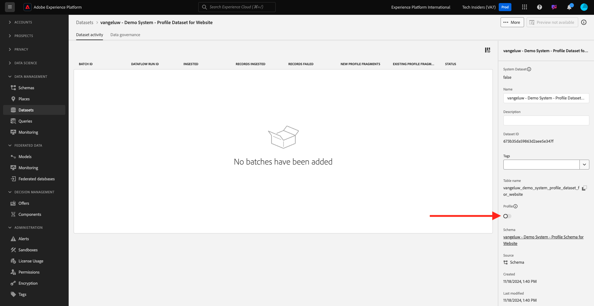

# 1.2.3配置数据集

在本练习中，您将配置所需的数据集以捕获和存储用户档案信息和客户行为。 您在此项中创建的每个数据集都将使用您在上一步中构建的架构之一。

## Story

在定义问题的答案后，**此客户是谁？**&#x200B;和&#x200B;**此客户做什么？**&#x200B;应该如下所示，您现在需要创建一个使用该信息的存储段，以接收并验证发送到Adobe Experience Platform的数据。

## 1.2.3.1 — 创建数据集

您现在需要创建2个数据集：

- 1个数据集用于捕获回答&#x200B;**此客户是谁？** — 问题。
- 1个数据集用于捕获回答&#x200B;**该客户做什么？** — 问题。

通过转到以下URL登录Adobe Experience Platform： [https://experience.adobe.com/platform](https://experience.adobe.com/platform)。

登录后，您将登录到Adobe Experience Platform的主页。

在继续之前，您需要选择一个&#x200B;**[!UICONTROL 沙盒]**。 要选择的沙盒名为``--module2sandbox--``。 您可以通过单击屏幕顶部蓝线中的文本&#x200B;**[!UICONTROL Production Prod]**&#x200B;来执行此操作。 选择适当的[!UICONTROL 沙盒]后，您将看到屏幕更改，现在您已经进入专用的[!UICONTROL 沙盒]。

在Adobe Experience Platform中，单击屏幕左侧菜单中的&#x200B;**[!UICONTROL 数据集]**。  您随后将看到以下内容：

让我们从创建用于捕获网站注册信息的数据集开始。

您应该创建一个新数据集。 要创建新数据集，请单击按钮&#x200B;**[!UICONTROL +创建数据集]**。

单击&#x200B;**[!UICONTROL +创建数据集]**&#x200B;按钮后，您将看到以下屏幕。

您必须使用上一步中定义的架构定义数据集。 单击&#x200B;**[!UICONTROL 从架构创建数据集]** — 选项。

在下一个屏幕中，您必须选择在1， `--aepUserLdap-- - Demo System - Profile Schema for Website`中创建的架构。

选择架构后，单击&#x200B;**[!UICONTROL 下一步]**&#x200B;继续。

让我们为您的数据集提供一个名称。

将用作我们数据集的名称时，请使用以下代码：

`--aepUserLdap-- - Demo System - Profile Dataset for Website`

例如，对于ldap **[!UICONTROL vangeluw]**，这应该是架构的名称：

**[!UICONTROL vangeluw — 演示系统 — 网站的配置文件数据集]**

这应该会给你这样的东西：

单击&#x200B;**[!UICONTROL 完成]**&#x200B;以完成数据集配置。

您现在将看到以下内容：

返回[!UICONTROL 数据集]概述。 现在，您将在概述中看到所创建的数据集弹出窗口。

接下来，您将配置第二个数据集以捕获网站交互。

您应该创建一个新数据集。 要创建新数据集，请单击按钮&#x200B;**[!UICONTROL +创建数据集]**。

单击&#x200B;**[!UICONTROL +创建数据集]**&#x200B;按钮后，您将看到以下屏幕。

您必须使用上一步中定义的架构定义数据集。 单击&#x200B;**[!UICONTROL 从架构创建数据集]** — 选项。

在下一个屏幕中，您必须选择在2.2 `--aepUserLdap-- - Demo System - Event Schema for Website`中创建的架构。

选择架构后，单击&#x200B;**[!UICONTROL 下一步]**&#x200B;继续。

让我们为您的数据集提供一个名称。

作为我们的数据集的名称，我们将使用它：

`--aepUserLdap-- - Demo System - Event Dataset for Website`

例如，对于ldap **[!UICONTROL vangeluw]**，这应该是架构的名称：

**[!UICONTROL vangeluw — 演示系统 — 网站的事件数据集]**

这应该会给你这样的东西：

单击&#x200B;**[!UICONTROL 完成]**&#x200B;以完成数据集配置。

您随后将看到以下内容：

返回[!UICONTROL 数据集]概述屏幕。

现在，您必须使数据集成为Adobe Experience Platform Real-time Customer Profile的一部分。

单击以打开您的网站数据集`--aepUserLdap--` — 演示系统 — 个人资料数据集。

在屏幕右侧找到[!UICONTROL 配置文件]切换图标。

单击[!UICONTROL 配置文件]切换开关为[!UICONTROL 配置文件]启用此数据集。

单击&#x200B;**[!UICONTROL 启用]**。

您的数据集现在已启用[!UICONTROL 配置文件]。

返回数据集概述，并通过单击为网站打开您的数据集`--aepUserLdap-- - Demo System - Event Dataset`。

在屏幕右侧找到[!UICONTROL 配置文件]切换图标。

单击[!UICONTROL 配置文件]切换可启用[!UICONTROL 配置文件]。

单击&#x200B;**[!UICONTROL 启用]**。

您的数据集现在已启用[!UICONTROL 配置文件]。

下一步：[1.2.4从脱机源摄取数据](./ex4.md)

[返回模块1.2](./data-ingestion.md)

[返回所有模块](../../../overview.md)
