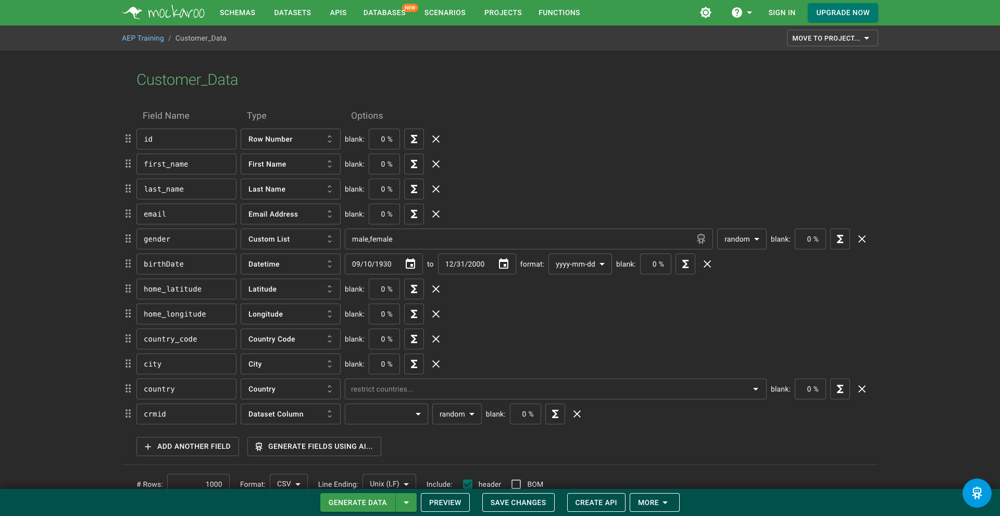
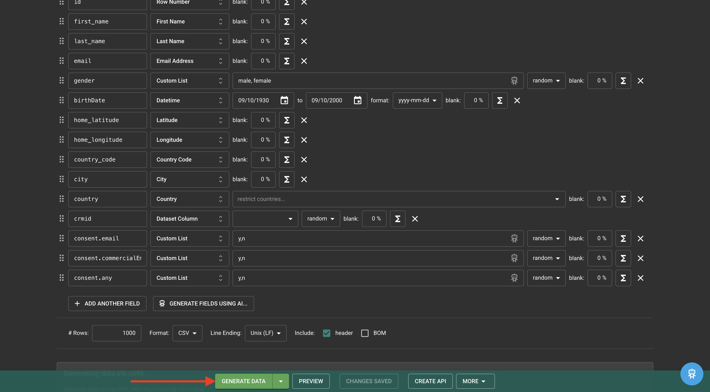
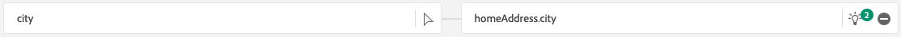

# 1.2.4从离线来源摄取数据

在本练习中，目标是载入外部数据，如Platform中的CRM数据。

## 学习目标

- 了解如何生成测试数据
- 了解如何摄取CSV
- 了解如何使用Web UI通过工作流摄取数据
- 了解Experience Platform的数据治理功能

## 资源

- 莫卡鲁： [https://www.mockaroo.com/](https://www.mockaroo.com/)
- Adobe Experience Platform： [https://experience.adobe.com/platform/](https://experience.adobe.com/platform/)

## 任务

- 创建包含演示数据的CSV文件。 使用可用的工作流在Adobe Experience Platform中摄取CSV文件。
- 了解Adobe Experience Platform中的数据治理选项

## 使用数据生成器工具创建CRM数据集

在本练习中，您需要1000个CRM数据示例行。

转到[https://www.mockaroo.com/12674210](https://www.mockaroo.com/12674210)打开Mockaroo模板。

在模板上，您会注意到以下字段：

- ID
- 名字
- last_name
- 电子邮件
- 性别
- birthDate
- home_latitude
- home_longiture
- country_code
- 城市
- 国家/地区

所有这些字段都是为了生成与Platform兼容的数据而定义的。

要生成CSV文件，请单击&#x200B;**[!UICONTROL 生成数据]**&#x200B;按钮，该按钮将创建和下载包含1000行演示数据的CSV文件。

打开CSV文件以可视化其内容。

准备好CSV文件后，您可以在AEP中继续摄取。

### 验证数据集

打开[Adobe Experience Platform](https://experience.adobe.com/platform)并转到&#x200B;**[!UICONTROL 数据集]**。

在继续之前，您需要选择一个&#x200B;**[!UICONTROL 沙盒]**。 要选择的沙盒名为``--aepSandboxName--``。

在Adobe Experience Platform中，单击屏幕左侧菜单中的&#x200B;**[!UICONTROL 数据集]**。

您将使用共享数据集。 已创建共享数据集，其名称为&#x200B;**[!UICONTROL Demo System - CRM的配置文件数据集(Global v1.1)]**。 单击以将其打开。

在概述屏幕上，您可以看到3条主要信息。

首先，[!UICONTROL 数据集活动]仪表板显示数据集中的CRM记录总数以及摄取的批次及其状态

其次，通过在页面上向下滚动，您可以检查何时摄取批量数据、载入了多少记录，以及是否成功载入了批次。 **[!UICONTROL 批次ID]**&#x200B;是特定批次作业的标识符，而&#x200B;**[!UICONTROL 批次ID]**&#x200B;很重要，因为它可用于解决特定批次未成功载入的原因。

最后，[!UICONTROL 数据集]信息选项卡显示诸如[!UICONTROL 数据集ID]等重要信息（从故障排除的角度来说，同样非常重要）、数据集的名称以及是否为配置文件启用了数据集。

此处最重要的设置是数据集与架构之间的链接。 架构定义可以摄取哪些数据以及这些数据的外观。

在本例中，我们使用的是CRM (Global v1.1)]**的**[!UICONTROL  Demo System - Profile Schema，该架构映射到&#x200B;**[!UICONTROL Profile]**&#x200B;的类并已实施扩展（也称为字段组）。

通过单击架构的名称，您会进入[!UICONTROL 架构]概述，您可以看到已为此架构激活的所有字段。

每个架构都需要定义一个自定义的主描述符。 在我们CRM数据集的情况下，架构已定义字段&#x200B;**[!UICONTROL crmId]**&#x200B;应是主要标识符。 如果要创建架构并将其链接到[!UICONTROL 实时客户个人资料]，您需要定义一个引用您的主描述符的自定义[!UICONTROL 字段组]。

您还可以看到我们的主要标识位于`--aepTenantId--.identification.core.crmId`中，链接到&#x200B;**[!UICONTROL 演示系统 — CRMID]**&#x200B;的[!UICONTROL 命名空间]。

每个架构以及应在[!UICONTROL 实时客户个人资料]中使用的每个数据集都应有一个[!UICONTROL 主标识符]。 此[!UICONTROL 主要标识符]是该数据集中的品牌客户的标识符用户。 对于CRM数据集，它可能是电子邮件地址或CRM ID；对于呼叫中心数据集，它可能是客户的手机号码。

最佳实践是为每个数据集创建单独的特定架构，并为每个数据集设置描述符，以专门匹配品牌使用的当前解决方案的运行方式。

### 使用工作流将CSV文件映射到XDM架构

本练习的目标是在AEP中载入CRM数据。 在Platform中引入的所有数据都应针对特定的XDM架构进行映射。 您当前拥有的CSV数据集在一侧具有1000行，并且数据集链接到另一侧的架构。 要在该数据集中加载该CSV文件，需要执行映射。 为了便于此映射练习，我们在Adobe Experience Platform中提供了&#x200B;**[!UICONTROL 工作流]**。

单击&#x200B;**[!UICONTROL 将CSV映射到XDM架构]**，然后单击&#x200B;**[!UICONTROL 启动]**&#x200B;以开始此过程。

在下一个屏幕上，您需要选择一个数据集以摄取文件。 您可以选择选择现有的数据集或创建新数据集。 对于本练习，我们将重复使用现有的演示系统：请按如下所述选择&#x200B;**[!UICONTROL 演示系统 — 用于CRM (Global v1.1)]**&#x200B;的配置文件数据集，并将其他设置保留为默认设置。

单击&#x200B;**下一步**。

拖放您的CSV文件或单击&#x200B;**[!UICONTROL 选择文件]**，在您的计算机上导航到桌面并选择您的CSV文件。

选择CSV文件后，它将立即上传，您将在几秒钟内看到文件预览。

单击&#x200B;**下一步**。

现在，您需要在&#x200B;**[!UICONTROL 演示系统 — CRM]**&#x200B;的配置文件数据集中使用XDM — 属性映射CSV文件中的列标题。

Adobe Experience Platform已为您提出了一些建议，方法是尝试将[!UICONTROL Source属性]与[!UICONTROL 目标架构字段]链接。

对于[!UICONTROL 架构映射]，Adobe Experience Platform已尝试将字段链接在一起。 但是，并非所有映射建议都是正确的。 您现在需要逐一更新&#x200B;**目标字段**。

#### birthDate

Source架构字段&#x200B;**birthDate**&#x200B;应链接到目标字段&#x200B;**person.birthDate**。

#### 城市

Source架构字段&#x200B;**city**&#x200B;应链接到目标字段&#x200B;**homeAddress.city**。

#### 国家/地区

Source架构字段&#x200B;**country**&#x200B;应链接到目标字段&#x200B;**homeAddress.country**。

#### country_code

Source架构字段&#x200B;**country_code**&#x200B;应链接到目标字段&#x200B;**homeAddress.countryCode**。

#### 电子邮件

Source架构字段&#x200B;**电子邮件**&#x200B;应链接到目标字段&#x200B;**personalEmail.address**。

#### crmid

Source架构字段&#x200B;**crmid**&#x200B;应链接到目标字段&#x200B;**`--aepTenantId--`.identification.core.crmId**。

#### 名字

Source架构字段&#x200B;**first_name**&#x200B;应链接到目标字段&#x200B;**person.name.firstName**。

#### 性别

Source架构字段&#x200B;**gender**&#x200B;应链接到目标字段&#x200B;**person.gender**。

#### home_latitude

Source架构字段&#x200B;**home_latitude**&#x200B;应链接到目标字段&#x200B;**homeAddress。_schema.latitude**。

#### home_longiture

Source架构字段&#x200B;**home_longitude**&#x200B;应链接到目标字段&#x200B;**homeAddress。_schema.longitude**。

#### ID

Source架构字段&#x200B;**id**&#x200B;应链接到目标字段&#x200B;**_id**。

#### last_name

Source架构字段&#x200B;**last_name**&#x200B;应链接到目标字段&#x200B;**person.name.lastName**。

您现在应该拥有此项。 单击&#x200B;**完成**。

单击&#x200B;**[!UICONTROL 完成]**&#x200B;后，您将看到&#x200B;**数据流**&#x200B;概述，几分钟后，您可以刷新屏幕以查看工作流是否成功完成。 单击您的&#x200B;**目标数据集名称**。

然后，您将看到已处理您的摄取的数据集，并看到刚刚被摄取的[!UICONTROL 批次ID]，其中已摄取1000条记录，状态为&#x200B;**[!UICONTROL 成功]**。 单击&#x200B;**[!UICONTROL 预览数据集]**。

现在，您将看到一个数据集的小示例，以确保加载的数据正确。

加载数据后，您可以为数据集定义正确的数据治理方法。

### 向数据集添加数据管理

现在您的客户数据已被摄取，您需要确保针对使用和导出控制对此数据集进行正确管理。 单击&#x200B;**[!UICONTROL 数据管理]**&#x200B;选项卡，并观察到，您可以设置多种类型的限制：合同、身份和敏感、合作伙伴生态系统和自定义。

让我们限制整个数据集的身份数据。 将鼠标悬停在数据集名称上，然后单击铅笔图标以编辑设置。

转到&#x200B;**[!UICONTROL 身份数据]**，您将看到已选中&#x200B;**[!UICONTROL I2]**&#x200B;选项 — 这将假定此数据集中的所有信息段至少可间接识别给人员。

单击&#x200B;**[!UICONTROL 保存更改]**。

在另一个模块中，我们将深入探讨数据治理和标签的“谁”框架。

现在，借助此功能，您已成功摄取并分类Adobe Experience Platform中的CRM数据。

下一步：[1.2.5数据登陆区](./ex5.md)

[返回模块1.2](./data-ingestion.md)

[返回所有模块](../../../overview.md)
