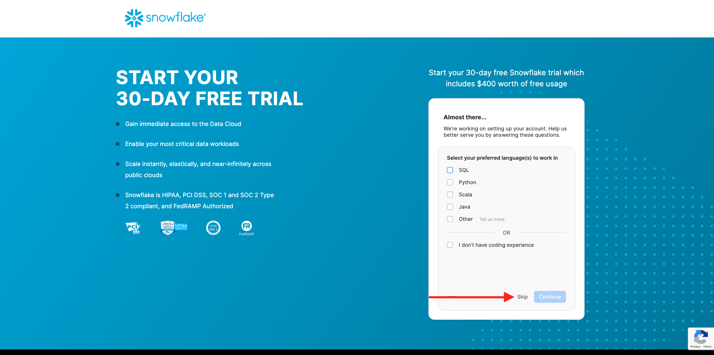
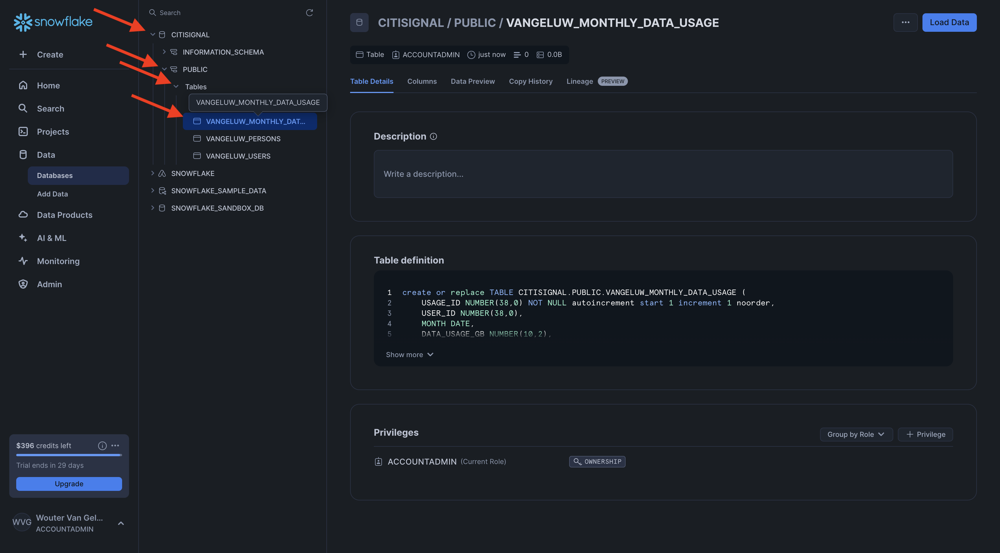
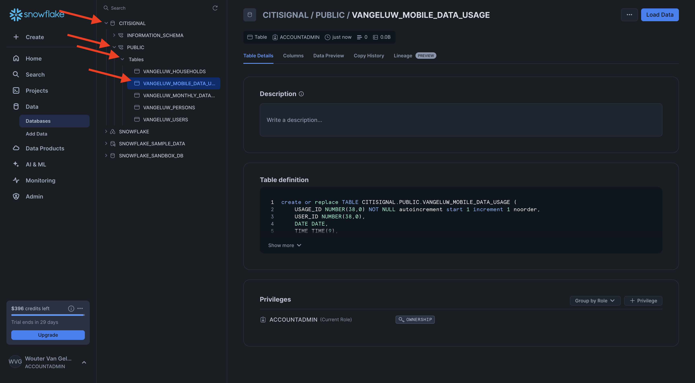

# 1.3.1设置您的Snowflake环境

## 1.3.1.1创建您的帐户

转到[https://snowflake.com](https://snowflake.com)。 单击&#x200B;**免费启动**。


输入您的详细信息，然后单击&#x200B;**继续**。


输入详细信息，选择云提供商，然后单击&#x200B;**开始**。


输入详细信息或单击&#x200B;**跳过** (x2)。



你会看到这个。 检查您的电子邮件，然后单击发送给您的确认电子邮件。


单击确认电子邮件中的链接以激活您的帐户，定义您的用户名和密码。 单击&#x200B;**开始**。在下一个练习中，您需要使用此用户名和密码。


然后，您将登录到Snowflake。 单击&#x200B;**立即跳过**。


## 1.3.1.2创建数据库

转到&#x200B;**数据>数据库**。 单击&#x200B;**+数据库**。


对数据库使用名称&#x200B;**CITISIGNAL**。 单击&#x200B;**创建**。


## 1.3.1.3创建表

您现在可以在Snowflake中开始创建表。 您将在下面找到用于创建表的脚本。

### 表CK_PERSON

单击&#x200B;**+创建**，然后单击&#x200B;**表**，然后单击&#x200B;**标准**。


你会看到这个。 复制以下查询并将其粘贴为Snowflake。 在创建表之前，请确保选择屏幕左上角的&#x200B;**CITISIGNAL**&#x200B;数据库。

```sql
create or replace TABLE CITISIGNAL.PUBLIC.CK_PERSONS (
	PERSON_ID NUMBER(38,0) NOT NULL,
	NAME VARCHAR(255),
	AGE NUMBER(38,0),
	EMAIL VARCHAR(255),
	PHONE_NUMBER VARCHAR(20),
	GENDER VARCHAR(10),
	OCCUPATION VARCHAR(100),
	ISATTMOBILESUB BOOLEAN,
	primary key (PERSON_ID)
);
```

单击&#x200B;**创建表**。


脚本运行后，您可以在&#x200B;**数据库> CITISIGNAL > PUBLIC**&#x200B;下找到表。


### 表CK_HOMEES

单击&#x200B;**+创建**，然后单击&#x200B;**表**，然后单击&#x200B;**标准**。


你会看到这个。 复制以下查询并将其粘贴为Snowflake。 在创建表之前，请确保选择屏幕左上角的&#x200B;**CITISIGNAL**&#x200B;数据库。

```sql
create or replace TABLE CITISIGNAL.PUBLIC.CK_HOUSEHOLDS (
	HOUSEHOLD_ID NUMBER(38,0) NOT NULL,
	ADDRESS VARCHAR(255),
	CITY VARCHAR(100),
	STATE VARCHAR(50),
	POSTAL_CODE VARCHAR(20),
	COUNTRY VARCHAR(100),
	ISELIGIBLEFORFIBER BOOLEAN,
	PRIMARY_PERSON_ID NUMBER(38,0),
	ISFIBREENABLED BOOLEAN,
	primary key (HOUSEHOLD_ID)
);
```

单击&#x200B;**创建表**。


脚本运行后，您可以在&#x200B;**数据库> CITISIGNAL > PUBLIC**&#x200B;下找到表。


### 表CK_USERS

单击&#x200B;**+创建**，然后单击&#x200B;**表**，然后单击&#x200B;**标准**。


你会看到这个。 复制以下查询并将其粘贴为Snowflake。 在创建表之前，请确保选择屏幕左上角的&#x200B;**CITISIGNAL**&#x200B;数据库。

```sql
create or replace TABLE CITISIGNAL.PUBLIC.CK_USERS (
	USER_ID NUMBER(38,0) NOT NULL,
	PERSON_ID NUMBER(38,0),
	HOUSEHOLD_ID NUMBER(38,0),
	primary key (USER_ID),
	foreign key (PERSON_ID) references CITISIGNAL.PUBLIC.CK_PERSONS(PERSON_ID),
	foreign key (HOUSEHOLD_ID) references CITISIGNAL.PUBLIC.CK_HOUSEHOLDS(HOUSEHOLD_ID)
);
```

单击&#x200B;**创建表**。


脚本运行后，您可以在&#x200B;**数据库> CITISIGNAL > PUBLIC**&#x200B;下找到表。


### 表CK_MONTHLY_DATA_USAGE

单击&#x200B;**+创建**，然后单击&#x200B;**表**，然后单击&#x200B;**标准**。


你会看到这个。 复制以下查询并将其粘贴为Snowflake。 在创建表之前，请确保选择屏幕左上角的&#x200B;**CITISIGNAL**&#x200B;数据库。

```sql
create or replace TABLE CITISIGNAL.PUBLIC.CK_MONTHLY_DATA_USAGE (
	USAGE_ID NUMBER(38,0) NOT NULL autoincrement start 1 increment 1 noorder,
	USER_ID NUMBER(38,0),
	MONTH DATE,
	DATA_USAGE_GB NUMBER(10,2),
	primary key (USAGE_ID)
);
```

单击&#x200B;**创建表**。


脚本运行后，您可以在&#x200B;**数据库> CITISIGNAL > PUBLIC**&#x200B;下找到表。



### 表CK_MOBILE_DATA_USAGE

单击&#x200B;**+创建**，然后单击&#x200B;**表**，然后单击&#x200B;**标准**。


你会看到这个。 复制以下查询并将其粘贴为Snowflake。 在创建表之前，请确保选择屏幕左上角的&#x200B;**CITISIGNAL**&#x200B;数据库。


```sql
create or replace TABLE CITISIGNAL.PUBLIC.CK_MOBILE_DATA_USAGE (
	USAGE_ID NUMBER(38,0) NOT NULL autoincrement start 1 increment 1 noorder,
	USER_ID NUMBER(38,0),
	DATE DATE,
	TIME TIME(9),
	APP_NAME VARCHAR(255),
	DATA_USAGE_MB NUMBER(10,2),
	NETWORK_TYPE VARCHAR(50),
	DEVICE_TYPE VARCHAR(50),
	COUNTRY_CODE VARCHAR(10),
	primary key (USAGE_ID)
);
```

单击&#x200B;**创建表**。


脚本运行后，您可以在&#x200B;**数据库> CITISIGNAL > PUBLIC**&#x200B;下找到表。



现在将创建您的所有表。


## 1.3.1.4摄取示例数据

您现在可以开始将示例数据加载到数据库中。

...

现在，您已完成Snowflake中的设置。


下一步： [1.3.2创建架构、数据模型和链接](./ex2.md)

[返回模块1.3](./fac.md)

[返回所有模块](../../../overview.md)
