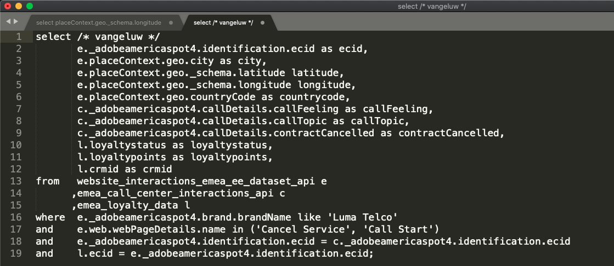

# 5.1.3查询、查询、查询……和流失分析

## 目标

* 编写用于数据分析的查询
* 编写结合了Adobe Experience Platform中可用的在线、呼叫中心和忠诚度数据的SQL查询
* 了解Adobe定义的函数

## 上下文

在本练习中，您将编写查询来分析产品查看、产品漏斗、流失率等。

本章中列出的所有查询都将在&#x200B;**PSQL命令行接口**&#x200B;中执行。 您应该复制(CTRL-c)以&#x200B;**SQL**&#x200B;表示的语句块，并将其粘贴到&#x200B;**PSQL命令行接口**&#x200B;中(CTRL-v)。 **查询结果**&#x200B;块显示粘贴的SQL语句和关联的查询结果。

## 5.1.3.1编写用于数据分析的基本查询

### 时间戳

在Adobe Experience Platform中捕获的数据带有时间戳。 **timestamp**&#x200B;属性允许您分析一段时间内的数据。

我们每天查看多少次产品？

**SQL**

```sql
select date_format( timestamp , 'yyyy-MM-dd') AS Day,
       count(*) AS productViews
from   demo_system_event_dataset_for_website_global_v1_1
where  --aepTenantId--.demoEnvironment.brandName IN ('Luma Telco', 'Citi Signal')
and eventType = 'commerce.productViews'
group by Day
limit 10;
```

复制上述语句并在&#x200B;**PSQL命令行接口**&#x200B;中执行该语句。

**查询结果**

```text
aepenablementfy21:all=> select date_format( timestamp , 'yyyy-MM-dd') AS Day,
aepenablementfy21:all->        count(*) AS productViews
aepenablementfy21:all-> from   demo_system_event_dataset_for_website_global_v1_1
aepenablementfy21:all-> where  --aepTenantId--.demoEnvironment.brandName IN ('Luma Telco', 'Citi Signal')
aepenablementfy21:all-> and    eventType = 'commerce.productViews'
aepenablementfy21:all-> group by Day
aepenablementfy21:all-> limit 10;
    Day     | productViews 
------------+--------------
 2020-07-31 |         2297
(1 row)
```

### 查看的前5项产品

查看的前5项产品是什么？

#### SQL

```sql
select productListItems.name, count(*)
from   demo_system_event_dataset_for_website_global_v1_1
where  --aepTenantId--.demoEnvironment.brandName IN ('Luma Telco', 'Citi Signal')
and    eventType = 'commerce.productViews'
group  by productListItems.name
order  by 2 desc
limit 5;
```

复制上述语句并在&#x200B;**PSQL命令行接口**&#x200B;中执行该语句。

**查询结果**

```text
aepenablementfy21:all=> select productListItems.name, count(*)
aepenablementfy21:all-> from   demo_system_event_dataset_for_website_global_v1_1
aepenablementfy21:all-> where  --aepTenantId--.demoEnvironment.brandName IN ('Luma Telco', 'Citi Signal')
aepenablementfy21:all-> and    eventType = 'commerce.productViews'
aepenablementfy21:all-> group  by productListItems.name
aepenablementfy21:all-> order  by 2 desc
aepenablementfy21:all-> limit 5;
                 name                  | count(1) 
---------------------------------------+----------
 Google Pixel XL 32GB Black Smartphone |      938
 SIM Only                              |      482
 Samsung Galaxy S8                     |      456
 Samsung Galaxy S7 32GB Black          |      421
(4 rows)
```

### 产品互动漏斗，从查看到购买

**SQL**

```sql
select eventType, count(*)
from   demo_system_event_dataset_for_website_global_v1_1
where  --aepTenantId--.demoEnvironment.brandName IN ('Luma Telco', 'Citi Signal')
and    eventType is not null
and    eventType <> ''
group  by eventType;
```

复制上述语句并在&#x200B;**PSQL命令行接口**&#x200B;中执行该语句。

**查询结果**

```text
aepenablementfy21:all=> select eventType, count(*)
aepenablementfy21:all-> from   demo_system_event_dataset_for_website_global_v1_1
aepenablementfy21:all-> where  --aepTenantId--.demoEnvironment.brandName IN ('Luma Telco', 'Citi Signal')
aepenablementfy21:all-> and    eventType is not null
aepenablementfy21:all-> and    eventType <> ''
aepenablementfy21:all-> group  by eventType;
          eventType           | count(1) 
------------------------------+----------
 commerce.productViews        |     2297
 commerce.productListAdds     |      494
 commerce.purchases           |      246
(3 rows)
```

### 识别具有流失风险的访客（访问页面=>取消服务）

**SQL**

```sql
select distinct --aepTenantId--.identification.core.ecid
from   demo_system_event_dataset_for_website_global_v1_1
where  --aepTenantId--.demoEnvironment.brandName IN ('Luma Telco', 'Citi Signal')
and    web.webPageDetails.name = 'Cancel Service'
group  by --aepTenantId--.identification.core.ecid
limit 10;
```

复制上述语句并在&#x200B;**PSQL命令行接口**&#x200B;中执行该语句。

**查询结果**

```text
aepenablementfy21:all=> select distinct --aepTenantId--.identification.core.ecid
aepenablementfy21:all-> from   demo_system_event_dataset_for_website_global_v1_1
aepenablementfy21:all-> where  --aepTenantId--.demoEnvironment.brandName IN ('Luma Telco', 'Citi Signal')
aepenablementfy21:all-> and    web.webPageDetails.name = 'Cancel Service'
aepenablementfy21:all-> group  by --aepTenantId--.identification.core.ecid
aepenablementfy21:all-> limit 10;
               ecid               
----------------------------------
 67802232253493573025911610627278
 27147331741697745713411940873426
 19806347932758146991274525406147
 06339676267512351981624626408225
 23933440740775575701680766564499
 11860828134020790182705892056898
 04258863338643046907489131372300
 90257333076958492787834714105751
 66695181015407529430237951973742
 19103852558440070949457567094096
(10 rows)
```

在下一组查询中，我们将扩展上述查询，以便完整查看访问“取消服务”页面的客户及其行为。 您将学习如何使用Adobe定义函数对信息进行会话化，标识事件的顺序和时间。 您还将连接数据集，以进一步扩充和准备数据以供在MicrosoftPower BI中分析。

## 5.1.3.2高级查询

大多数业务逻辑要求收集客户的接触点并按时间对这些接触点排序。 Spark SQL以窗口函数的形式提供此支持。 窗口函数是标准SQL的一部分，并且受许多其他SQL引擎支持。

### Adobe定义的函数

Adobe已将一组&#x200B;**Adobe定义的函数**&#x200B;添加到标准SQL语法中，以便您更好地了解体验数据。 在接下来的几个查询中，您将了解这些ADF函数。 您可以在文档](https://experienceleague.adobe.com/docs/experience-platform/query/sql/adobe-defined-functions.html)中找到更多信息和完整列表[。

### 在会话的第3页访问“取消服务”页面之前，人们在网站上做什么？

通过此查询，您将发现前两个Adobe定义的函数&#x200B;**SESS_TIMEOUT**&#x200B;和&#x200B;**NEXT**

> **SESS_TIMEOUT()**&#x200B;会重现使用Adobe Analytics找到的访问分组。 它执行类似的基于时间的分组，但参数可自定义。
>
> **NEXT()**&#x200B;和&#x200B;**PREVIOUS()**&#x200B;帮助您了解客户如何浏览您的网站。

**SQL**

```sql
SELECT
  webPage,
  webPage_2,
  webPage_3,
  webPage_4,
  count(*) journeys
FROM
  (
      SELECT
        webPage,
        NEXT(webPage, 1, true)
          OVER(PARTITION BY ecid, session.num
                ORDER BY timestamp
                ROWS BETWEEN CURRENT ROW AND UNBOUNDED FOLLOWING).value
          AS webPage_2,
        NEXT(webPage, 2, true)
          OVER(PARTITION BY ecid, session.num
                ORDER BY timestamp
                ROWS BETWEEN CURRENT ROW AND UNBOUNDED FOLLOWING).value
          AS webPage_3,
        NEXT(webPage, 3, true)
           OVER(PARTITION BY ecid, session.num
                ORDER BY timestamp
                ROWS BETWEEN CURRENT ROW AND UNBOUNDED FOLLOWING).value
          AS webPage_4,
        session.depth AS SessionPageDepth
      FROM (
            select a.--aepTenantId--.identification.core.ecid as ecid,
                   a.timestamp,
                   web.webPageDetails.name as webPage,
                    SESS_TIMEOUT(timestamp, 60 * 30) 
                       OVER (PARTITION BY a.--aepTenantId--.identification.core.ecid 
                             ORDER BY timestamp 
                             ROWS BETWEEN UNBOUNDED PRECEDING AND CURRENT ROW) 
                  AS session
            from   demo_system_event_dataset_for_website_global_v1_1 a
            where  a.--aepTenantId--.identification.core.ecid in ( 
                select b.--aepTenantId--.identification.core.ecid
                from   demo_system_event_dataset_for_website_global_v1_1 b
                where  b.--aepTenantId--.demoEnvironment.brandName IN ('Luma Telco', 'Citi Signal')
                and    b.web.webPageDetails.name = 'Cancel Service'
            )
        )
)
WHERE SessionPageDepth=1
and   webpage_3 = 'Cancel Service'
GROUP BY webPage, webPage_2, webPage_3, webPage_4
ORDER BY journeys DESC
LIMIT 10;
```

复制上述语句并在&#x200B;**PSQL命令行接口**&#x200B;中执行该语句。

**查询结果**

```text
                webPage                |               webPage_2               |   webPage_3    | webPage_4  | journeys 
---------------------------------------+---------------------------------------+----------------+------------+----------
 Citi Signal Sport                     | Google Pixel XL 32GB Black Smartphone | Cancel Service | Call Start |        2
 SIM Only                              | Citi Signal Shop                      | Cancel Service |            |        2
 SIM Only                              | Telco Home                            | Cancel Service |            |        2
 TV & Broadband Deals                  | Samsung Galaxy S7 32GB Black          | Cancel Service |            |        2
 Telco Home                            | Citi Signal Sport                     | Cancel Service | Call Start |        2
 Google Pixel XL 32GB Black Smartphone | Broadband Deals                       | Cancel Service |            |        2
 Broadband Deals                       | Samsung Galaxy S7 32GB Black          | Cancel Service |            |        2
 Broadband Deals                       | Samsung Galaxy S8                     | Cancel Service |            |        1
 Samsung Galaxy S8                     | Google Pixel XL 32GB Black Smartphone | Cancel Service |            |        1
 SIM Only                              | Google Pixel XL 32GB Black Smartphone | Cancel Service | Call Start |        1
(10 rows)
```

### 在访客访问“取消服务”页面后呼叫呼叫中心之前我们还有多少时间？

要回答此类查询，我们将使用&#x200B;**TIME_BETWEEN_NEXT_MATCH()** Adobe定义函数。

> 上一个匹配或下一个匹配之间的时间函数提供了一个新维度，该维度测量自特定事件以来经过的时间。

**SQL**

```sql
select * from (
       select --aepTenantId--.identification.core.ecid as ecid,
              web.webPageDetails.name as webPage,
              TIME_BETWEEN_NEXT_MATCH(timestamp, web.webPageDetails.name='Call Start', 'seconds')
              OVER(PARTITION BY --aepTenantId--.identification.core.ecid
                  ORDER BY timestamp
                  ROWS BETWEEN CURRENT ROW AND UNBOUNDED FOLLOWING)
              AS contact_callcenter_after_seconds
       from   demo_system_event_dataset_for_website_global_v1_1
       where  --aepTenantId--.demoEnvironment.brandName IN ('Luma Telco', 'Citi Signal')
       and    web.webPageDetails.name in ('Cancel Service', 'Call Start')
) r
where r.webPage = 'Cancel Service'
limit 15;
```

复制上述语句并在&#x200B;**PSQL命令行接口**&#x200B;中执行该语句。

**查询结果**

```text
               ecid               |    webPage     | contact_callcenter_after_seconds 
----------------------------------+----------------+----------------------------------
 00331886620679939148047665693117 | Cancel Service |                                 
 00626561600197295782131349716866 | Cancel Service |                                 
 00630470663554417679969244202779 | Cancel Service |                             -797
 00720875344152796154458668700428 | Cancel Service |                             -519
 00746064605049656090779523644276 | Cancel Service |                              -62
 00762093837616944422322357210965 | Cancel Service |                                 
 00767875779073091876070699689209 | Cancel Service |                                 
 00798691264980137616449378075855 | Cancel Service |                                 
 00869613691740150556826953447162 | Cancel Service |                             -129
 00943638725078228957873279219207 | Cancel Service |                             -750
 01167540466536077846425644389346 | Cancel Service |                                 
 01412448537869549016063764484810 | Cancel Service |                                 
 01419076946514450291741574452702 | Cancel Service |                             -482
 01533124771963987423015507880755 | Cancel Service |                                 
 01710651086750904478559809475925 | Cancel Service |                                 
(15 rows)
```

### 那这次联络的结果如何？

说明我们正在将数据集连接在一起，在这种情况下，我们将与`demo_system_event_dataset_for_call_center_global_v1_1`一起连接`demo_system_event_dataset_for_website_global_v1_1`。 我们这样做是为了了解呼叫中心互动的结果。

**SQL**

```sql
select distinct r.*,
       c.--aepTenantId--.interactionDetails.core.callCenterAgent.callFeeling,
       c.--aepTenantId--.interactionDetails.core.callCenterAgent.callTopic,
       c.--aepTenantId--.interactionDetails.core.callCenterAgent.callContractCancelled
from (
       select --aepTenantId--.identification.core.ecid ecid,
              web.webPageDetails.name as webPage,
              TIME_BETWEEN_NEXT_MATCH(timestamp, web.webPageDetails.name='Call Start', 'seconds')
              OVER(PARTITION BY --aepTenantId--.identification.core.ecid
                  ORDER BY timestamp
                  ROWS BETWEEN CURRENT ROW AND UNBOUNDED FOLLOWING)
              AS contact_callcenter_after_seconds
       from   demo_system_event_dataset_for_website_global_v1_1
       where  --aepTenantId--.demoEnvironment.brandName IN ('Luma Telco', 'Citi Signal')
       and    web.webPageDetails.name in ('Cancel Service', 'Call Start')
) r
, demo_system_event_dataset_for_call_center_global_v1_1 c
where r.ecid = c.--aepTenantId--.identification.core.ecid
and r.webPage = 'Cancel Service'
and c.--aepTenantId--.interactionDetails.core.callCenterAgent.callContractCancelled IN (true,false)
and c.--aepTenantId--.interactionDetails.core.callCenterAgent.callTopic IN ('contract', 'invoice','complaint','wifi')
limit 15;
```

复制上述语句并在&#x200B;**PSQL命令行接口**&#x200B;中执行该语句。

**查询结果**

```text
               ecid               |    webPage     | contact_callcenter_after_seconds | callfeeling | calltopic | callcontractcancelled 
----------------------------------+----------------+----------------------------------+-------------+-----------+-----------------------
 65003638134805559755890758041032 | Cancel Service |                             -440 | negative    | contract  | true
 24197860921105808861772992106002 | Cancel Service |                             -109 | negative    | contract  | true
 96145097889556586310105454800766 | Cancel Service |                             -501 | neutral     | contract  | true
 18680613140217544548647790969994 | Cancel Service |                             -502 | negative    | contract  | true
 66121898576007921287545496624574 | Cancel Service |                             -546 | negative    | contract  | true
 35086866174626846547860375146326 | Cancel Service |                             -493 | negative    | contract  | false
 30502827193916828536733220567055 | Cancel Service |                             -924 | negative    | contract  | true
 85319114253582167371394801608573 | Cancel Service |                             -267 | positive    | contract  | true
 04258863338643046907489131372300 | Cancel Service |                             -588 | positive    | contract  | false
 23933440740775575701680766564499 | Cancel Service |                             -261 | neutral     | contract  | true
 17332005215125613039685855763735 | Cancel Service |                             -478 | neutral     | contract  | true
 02666934104296797891818818456669 | Cancel Service |                             -297 | positive    | contract  | true
 48158305927116134877913019413025 | Cancel Service |                              -47 | neutral     | contract  | false
 13294750130353985087337266864522 | Cancel Service |                              -71 | positive    | contract  | false
 69034679856689334967307492458080 | Cancel Service |                             -812 | negative    | contract  | true
(15 rows)
```

### 这些客户的忠诚度如何？

在此查询中，我们加入已在Adobe Experience Platform中载入的忠诚度数据。 这允许利用忠诚度数据扩充流失分析。

**SQL**

```sql
select r.*,
       c.--aepTenantId--.interactionDetails.core.callCenterAgent.callFeeling,
       c.--aepTenantId--.interactionDetails.core.callCenterAgent.callTopic,
       l.--aepTenantId--.loyaltyDetails.level,
       l.--aepTenantId--.identification.core.loyaltyId
from (
       select --aepTenantId--.identification.core.ecid ecid,
              web.webPageDetails.name as webPage,
              TIME_BETWEEN_NEXT_MATCH(timestamp, web.webPageDetails.name='Call Start', 'seconds')
              OVER(PARTITION BY --aepTenantId--.identification.core.ecid
                  ORDER BY timestamp
                  ROWS BETWEEN CURRENT ROW AND UNBOUNDED FOLLOWING)
              AS contact_callcenter_after_seconds
       from   demo_system_event_dataset_for_website_global_v1_1
       where  --aepTenantId--.demoEnvironment.brandName IN ('Luma Telco', 'Citi Signal')
       and    web.webPageDetails.name in ('Cancel Service', 'Call Start')
) r
, demo_system_event_dataset_for_call_center_global_v1_1 c
, demo_system_profile_dataset_for_loyalty_global_v1_1 l
where r.ecid = c.--aepTenantId--.identification.core.ecid
and r.webPage = 'Cancel Service'
and l.--aepTenantId--.identification.core.ecid = r.ecid
and c.--aepTenantId--.interactionDetails.core.callCenterAgent.callTopic IN ('contract', 'invoice','complaint','wifi','promo')
limit 15;
```

复制上述语句并在&#x200B;**PSQL命令行接口**&#x200B;中执行该语句。

**查询结果**

```text
               ecid               |    webPage     | contact_callcenter_after_seconds | callfeeling | calltopic | level  | loyaltyid 
----------------------------------+----------------+----------------------------------+-------------+-----------+--------+-----------
 65003638134805559755890758041032 | Cancel Service |                             -440 | negative    | contract  | Gold   | 924854108
 65003638134805559755890758041032 | Cancel Service |                             -440 | negative    | contract  | Gold   | 924854108
 24197860921105808861772992106002 | Cancel Service |                             -109 | negative    | contract  | Bronze | 094259678
 24197860921105808861772992106002 | Cancel Service |                             -109 | negative    | contract  | Bronze | 094259678
 96145097889556586310105454800766 | Cancel Service |                             -501 | neutral     | contract  | Gold   | 644887358
 96145097889556586310105454800766 | Cancel Service |                             -501 | neutral     | contract  | Gold   | 644887358
 18680613140217544548647790969994 | Cancel Service |                             -502 | negative    | contract  | Gold   | 205300004
 18680613140217544548647790969994 | Cancel Service |                             -502 | negative    | contract  | Gold   | 205300004
 66121898576007921287545496624574 | Cancel Service |                             -546 | negative    | contract  | Bronze | 095728673
 66121898576007921287545496624574 | Cancel Service |                             -546 | negative    | contract  | Bronze | 095728673
 35086866174626846547860375146326 | Cancel Service |                             -493 | negative    | contract  | Bronze | 453145930
 35086866174626846547860375146326 | Cancel Service |                             -493 | negative    | contract  | Bronze | 453145930
 30502827193916828536733220567055 | Cancel Service |                             -924 | negative    | contract  | Gold   | 269406417
 30502827193916828536733220567055 | Cancel Service |                             -924 | negative    | contract  | Gold   | 269406417
 85319114253582167371394801608573 | Cancel Service |                             -267 | positive    | contract  | Bronze | 899276035
(15 rows)
```

### 他们从哪个地区访问我们？

让我们包括Adobe Experience Platform捕获的地理信息，如经度、态度、城市、国家/地区代码，以获取有关客户流失的一些地理见解。

**SQL**

```sql
       select distinct r.ecid,
              r.city,
              r.countrycode,
              r.lat as latitude,
              r.lon as longitude,
              r.contact_callcenter_after_seconds as seconds_to_contact_callcenter,
              c.--aepTenantId--.interactionDetails.core.callCenterAgent.callFeeling,
              c.--aepTenantId--.interactionDetails.core.callCenterAgent.callTopic,
              c.--aepTenantId--.interactionDetails.core.callCenterAgent.callContractCancelled,
              l.--aepTenantId--.loyaltyDetails.level,
              l.--aepTenantId--.identification.core.loyaltyId
       from (
              select --aepTenantId--.identification.core.ecid ecid,
                     placeContext.geo._schema.latitude lat,
                     placeContext.geo._schema.longitude lon,
                     placeContext.geo.city,
                     placeContext.geo.countryCode,
                     web.webPageDetails.name as webPage,
                     TIME_BETWEEN_NEXT_MATCH(timestamp, web.webPageDetails.name='Call Start', 'seconds')
                     OVER(PARTITION BY --aepTenantId--.identification.core.ecid
                         ORDER BY timestamp
                         ROWS BETWEEN CURRENT ROW AND UNBOUNDED FOLLOWING)
                     AS contact_callcenter_after_seconds
              from   demo_system_event_dataset_for_website_global_v1_1
              where  --aepTenantId--.demoEnvironment.brandName IN ('Luma Telco', 'Citi Signal')
              and    web.webPageDetails.name in ('Cancel Service', 'Call Start')
       ) r
       , demo_system_event_dataset_for_call_center_global_v1_1 c
       , demo_system_profile_dataset_for_loyalty_global_v1_1 l
       where r.ecid = c.--aepTenantId--.identification.core.ecid
       and r.webPage = 'Cancel Service'
       and l.--aepTenantId--.identification.core.ecid = r.ecid
       and c.--aepTenantId--.interactionDetails.core.callCenterAgent.callTopic IN ('contract', 'invoice','complaint','wifi','promo')
       limit 15;
```

复制上述语句并在&#x200B;**PSQL命令行接口**&#x200B;中执行该语句。

**查询结果**

```text
               ecid               |   city    | countrycode |  latitude  | longitude  | seconds_to_contact_callcenter | callfeeling | calltopic | callcontractcancelled | level  | loyaltyid 
----------------------------------+-----------+-------------+------------+------------+-------------------------------+-------------+-----------+-----------------------+--------+-----------
 00630470663554417679969244202779 | Charlton  | GB          |   51.59119 |  -1.407848 |                          -797 | negative    | contract  | false                 | Bronze | 524483285
 00630470663554417679969244202779 | Charlton  | GB          |   51.59119 |  -1.407848 |                          -797 | negative    | contract  |                       | Bronze | 524483285
 00720875344152796154458668700428 | Ashley    | GB          | 51.4139633 | -2.2685462 |                          -519 | positive    | contract  | false                 | Silver | 860696333
 00720875344152796154458668700428 | Ashley    | GB          | 51.4139633 | -2.2685462 |                          -519 | positive    | contract  |                       | Silver | 860696333
 00746064605049656090779523644276 | Liverpool | GB          | 53.4913801 |  -2.867264 |                           -62 | positive    | contract  | true                  | Bronze | 072387270
 00746064605049656090779523644276 | Liverpool | GB          | 53.4913801 |  -2.867264 |                           -62 | positive    | contract  |                       | Bronze | 072387270
 00869613691740150556826953447162 | Langley   | GB          |  51.888151 |   -0.23924 |                          -129 | negative    | contract  | true                  | Bronze | 789347684
 00869613691740150556826953447162 | Langley   | GB          |  51.888151 |   -0.23924 |                          -129 | negative    | contract  |                       | Bronze | 789347684
 00943638725078228957873279219207 | Eaton     | GB          | 53.2945961 | -0.9335791 |                          -750 | positive    | contract  | false                 | Gold   | 033926162
 00943638725078228957873279219207 | Eaton     | GB          | 53.2945961 | -0.9335791 |                          -750 | positive    | contract  |                       | Gold   | 033926162
 01419076946514450291741574452702 | Tullich   | GB          | 57.4694803 | -3.1269422 |                          -482 | neutral     | contract  | false                 | Bronze | 105063634
 01419076946514450291741574452702 | Tullich   | GB          | 57.4694803 | -3.1269422 |                          -482 | neutral     | contract  |                       | Bronze | 105063634
 01738842540109643781526526573341 | Whitwell  | GB          | 54.3886617 |  -1.555363 |                          -562 | neutral     | contract  | false                 | Gold   | 791324509
 01738842540109643781526526573341 | Whitwell  | GB          | 54.3886617 |  -1.555363 |                          -562 | neutral     | contract  |                       | Gold   | 791324509
 02052460258994877317679083617975 | Edinburgh | GB          | 55.9309486 | -3.1859102 |                          -545 | neutral     | contract  | false                 | Gold   | 443477555
(15 rows)
```

## 呼叫中心互动分析

在上述查询中，我们只查看了在服务取消的情况下最终联系呼叫中心的访客。 我们希望将这一点考虑得更广，并考虑所有呼叫中心互动，包括（wifi、促销、发票、投诉和合同）。

您将需要编辑查询，因此让我们先打开记事本或括号。

在Windows上，单击Windows工具栏中的“搜索”图标(1)，在“搜索”字段中键入&#x200B;**记事本**(2)，然后单击(3) “记事本”结果：


在Mac上


将以下语句复制到记事本/方括号：

```sql
select /* enter your name */
       e.--aepTenantId--.identification.core.ecid as ecid,
       e.placeContext.geo.city as city,
       e.placeContext.geo._schema.latitude latitude,
       e.placeContext.geo._schema.longitude longitude,
       e.placeContext.geo.countryCode as countrycode,
       c.--aepTenantId--.interactionDetails.core.callCenterAgent.callFeeling as callFeeling,
       c.--aepTenantId--.interactionDetails.core.callCenterAgent.callTopic as callTopic,
       c.--aepTenantId--.interactionDetails.core.callCenterAgent.callContractCancelled as contractCancelled,
       l.--aepTenantId--.loyaltyDetails.level as loyaltystatus,
       l.--aepTenantId--.loyaltyDetails.points as loyaltypoints,
       l.--aepTenantId--.identification.core.loyaltyId as crmid
from   demo_system_event_dataset_for_website_global_v1_1 e
      ,demo_system_event_dataset_for_call_center_global_v1_1 c
      ,demo_system_profile_dataset_for_loyalty_global_v1_1 l
where  e.--aepTenantId--.demoEnvironment.brandName IN ('Luma Telco', 'Citi Signal')
and    e.web.webPageDetails.name in ('Cancel Service', 'Call Start')
and    e.--aepTenantId--.identification.core.ecid = c.--aepTenantId--.identification.core.ecid
and    l.--aepTenantId--.identification.core.ecid = e.--aepTenantId--.identification.core.ecid;
```

和替换

```text
enter your name
```

不要删除`/\*`和`\*/`。 您在记事本中修改的语句应该如下所示：



将修改后的语句从&#x200B;**记事本**&#x200B;复制到&#x200B;**PSQL命令行窗口**&#x200B;中，然后按Enter。 您应会在PSQL命令行窗口中看到以下结果：

```text
aepenablementfy21:all=> 
aepenablementfy21:all=> select /* vangeluw */
aepenablementfy21:all->        e._experienceplatform.identification.core.ecid as ecid,
aepenablementfy21:all->        e.placeContext.geo.city as city,
aepenablementfy21:all->        e.placeContext.geo._schema.latitude latitude,
aepenablementfy21:all->        e.placeContext.geo._schema.longitude longitude,
aepenablementfy21:all->        e.placeContext.geo.countryCode as countrycode,
aepenablementfy21:all->        c._experienceplatform.interactionDetails.core.callCenterAgent.callFeeling as callFeeling,
aepenablementfy21:all->        c._experienceplatform.interactionDetails.core.callCenterAgent.callTopic as callTopic,
aepenablementfy21:all->        c._experienceplatform.interactionDetails.core.callCenterAgent.callContractCancelled as contractCancelled,
aepenablementfy21:all->        l._experienceplatform.loyaltyDetails.level as loyaltystatus,
aepenablementfy21:all->        l._experienceplatform.loyaltyDetails.points as loyaltypoints,
aepenablementfy21:all->        l._experienceplatform.identification.core.loyaltyId as crmid
aepenablementfy21:all-> from   demo_system_event_dataset_for_website_global_v1_1 e
aepenablementfy21:all->       ,demo_system_event_dataset_for_call_center_global_v1_1 c
aepenablementfy21:all->       ,demo_system_profile_dataset_for_loyalty_global_v1_1 l
aepenablementfy21:all-> where  e._experienceplatform.demoEnvironment.brandName IN ('Luma Telco', 'Citi Signal')
aepenablementfy21:all-> and    e.web.webPageDetails.name in ('Cancel Service', 'Call Start')
aepenablementfy21:all-> and    e._experienceplatform.identification.core.ecid = c._experienceplatform.identification.core.ecid
aepenablementfy21:all-> and    l._experienceplatform.identification.core.ecid = e._experienceplatform.identification.core.ecid;
               ecid               |    city    |  latitude  | longitude  | countrycode | callFeeling | callTopic | contractCancelled | loyaltystatus | loyaltypoints |   crmid   
----------------------------------+------------+------------+------------+-------------+-------------+-----------+-------------------+---------------+---------------+-----------
 33977405947573095768416894125891 | Tullich    | 57.4694803 | -3.1269422 | GB          | positive    | wifi      | false             | Bronze        |          73.0 | 904552921
 33977405947573095768416894125891 | Tullich    | 57.4694803 | -3.1269422 | GB          | positive    | wifi      | false             | Bronze        |          73.0 | 904552921
 33977405947573095768416894125891 | Tullich    | 57.4694803 | -3.1269422 | GB          | positive    | wifi      |                   | Bronze        |          73.0 | 904552921
 33977405947573095768416894125891 | Tullich    | 57.4694803 | -3.1269422 | GB          | positive    | wifi      |                   | Bronze        |          73.0 | 904552921
 67802232253493573025911610627278 | Linton     | 54.0542238 | -2.0215836 | GB          | none        | none      | false             | Silver        |         522.0 | 417981877
 67802232253493573025911610627278 | Linton     | 54.0542238 | -2.0215836 | GB          | none        | none      | false             | Silver        |         522.0 | 417981877
 67802232253493573025911610627278 | Linton     | 54.0542238 | -2.0215836 | GB          | none        | none      |                   | Silver        |         522.0 | 417981877
 67802232253493573025911610627278 | Linton     | 54.0542238 | -2.0215836 | GB          | none        | none      |                   | Silver        |         522.0 | 417981877
 27147331741697745713411940873426 | Langley    |  51.888151 |   -0.23924 | GB          | none        | none      | false             | Bronze        |         790.0 | 826545716
 27147331741697745713411940873426 | Langley    |  51.888151 |   -0.23924 | GB          | none        | none      | false             | Bronze        |         790.0 | 826545716
 27147331741697745713411940873426 | Langley    |  51.888151 |   -0.23924 | GB          | none        | none      |                   | Bronze        |         790.0 | 826545716
 27147331741697745713411940873426 | Langley    |  51.888151 |   -0.23924 | GB          | none        | none      |                   | Bronze        |         790.0 | 826545716
 19806347932758146991274525406147 | Edinburgh  | 55.9309486 | -3.1859102 | GB          | none        | none      | false             | Gold          |         981.0 | 412492571
 19806347932758146991274525406147 | Edinburgh  | 55.9309486 | -3.1859102 | GB          | none        | none      | false             | Gold          |         981.0 | 412492571
 19806347932758146991274525406147 | Edinburgh  | 55.9309486 | -3.1859102 | GB          | none        | none      |                   | Gold          |         981.0 | 412492571
 19806347932758146991274525406147 | Edinburgh  | 55.9309486 | -3.1859102 | GB          | none        | none      |                   | Gold          |         981.0 | 412492571
 06339676267512351981624626408225 | Edinburgh  | 55.9309486 | -3.1859102 | GB          | none        | none      | false             | Bronze        |         632.0 | 024761880
 06339676267512351981624626408225 | Edinburgh  | 55.9309486 | -3.1859102 | GB          | none        | none      | false             | Bronze        |         632.0 | 024761880
 06339676267512351981624626408225 | Edinburgh  | 55.9309486 | -3.1859102 | GB          | none        | none      |                   | Bronze        |         632.0 | 024761880
 06339676267512351981624626408225 | Edinburgh  | 55.9309486 | -3.1859102 | GB          | none        | none      |                   | Bronze        |         632.0 | 024761880
 23933440740775575701680766564499 | Whitwell   | 54.3886617 |  -1.555363 | GB          | neutral     | contract  | true              | Gold          |         853.0 | 696923821
 23933440740775575701680766564499 | Whitwell   | 54.3886617 |  -1.555363 | GB          | neutral     | contract  | true              | Gold          |         853.0 | 696923821
 23933440740775575701680766564499 | Whitwell   | 54.3886617 |  -1.555363 | GB          | neutral     | contract  |                   | Gold          |         853.0 | 696923821
 23933440740775575701680766564499 | Whitwell   | 54.3886617 |  -1.555363 | GB          | neutral     | contract  |                   | Gold          |         853.0 | 696923821
 11860828134020790182705892056898 | Norton     | 52.2679288 | -1.1202549 | GB          | none        | none      | false             | Gold          |         139.0 | 271933383
 11860828134020790182705892056898 | Norton     | 52.2679288 | -1.1202549 | GB          | none        | none      | false             | Gold          |         139.0 | 271933383
 11860828134020790182705892056898 | Norton     | 52.2679288 | -1.1202549 | GB          | none        | none      |                   | Gold          |         139.0 | 271933383
 11860828134020790182705892056898 | Norton     | 52.2679288 | -1.1202549 | GB          | none        | none      |                   | Gold          |         139.0 | 271933383
:
```

接下来，您将保留查询（也称为&#x200B;**创建表作为select**&#x200B;或&#x200B;**CTAS**），作为您将在MicrosoftPower BI中使用的新数据集。

下一步： [5.1.4从查询生成数据集](./ex4.md)

[返回模块5.1](./query-service.md)

[返回所有模块](../../../overview.md)
