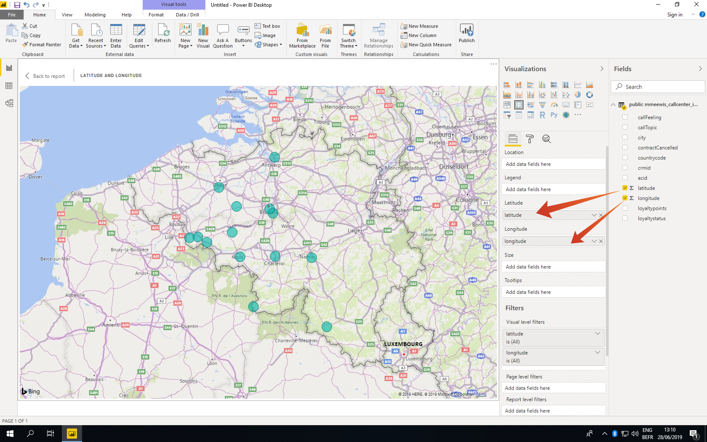

# 5.1.6查询服务和Power BI

打开MicrosoftPower BI桌面。

单击&#x200B;**获取数据**。

搜索&#x200B;**Postgres** (1)，从列表中选择&#x200B;**Postgres** (2)和&#x200B;**连接** (3)。

转到Adobe Experience Platform、**查询**&#x200B;和&#x200B;**凭据**。

从Adobe Experience Platform的&#x200B;**凭据**&#x200B;页中，复制&#x200B;**主机**&#x200B;并将其粘贴到&#x200B;**服务器**&#x200B;字段中，复制&#x200B;**数据库**&#x200B;并将其粘贴到PowerBI中的&#x200B;**数据库**&#x200B;字段中，然后单击“确定”(2)。

>[!IMPORTANT]
>
>确保在Server值末尾包含端口&#x200B;**：80**，因为查询服务当前未使用默认的PostgreSQL端口5432。

在下一个对话框中，使用在Adobe Experience Platform的&#x200B;**凭据**&#x200B;中找到的用户名和密码填充用户名和密码。

在“导航器”对话框中，将&#x200B;**LDAP**&#x200B;放入搜索字段(1)以查找CTAS数据集，并选中每个(2)旁边的框。 然后单击“加载(3)”。

确保选择&#x200B;**报告**&#x200B;选项卡(1)。

选择映射(1)，将其添加到报告画布后，放大映射(2)。

接下来，我们需要定义度量和维度，您可以通过将&#x200B;**字段**&#x200B;分区中的字段拖到对应的占位符（位于&#x200B;**可视化图表**&#x200B;下）上来执行此操作，如下所示：

作为度量值，我们将使用&#x200B;**customerId**&#x200B;的计数。 将&#x200B;**crmid**&#x200B;字段从&#x200B;**字段**&#x200B;分区拖入&#x200B;**大小**&#x200B;占位符：

最后，要执行一些&#x200B;**callTopic**&#x200B;分析，请将&#x200B;**callTopic**&#x200B;字段拖到&#x200B;**页面级别筛选器**&#x200B;占位符上（您可能必须滚动&#x200B;**可视化图表**&#x200B;部分）；

选择/取消选择要调查的&#x200B;**呼叫主题**：

您现在已经完成了此练习。

下一步： [5.1.8查询服务API](./ex8.md)

[返回模块5.1](./query-service.md)

[返回所有模块](../../../overview.md)
