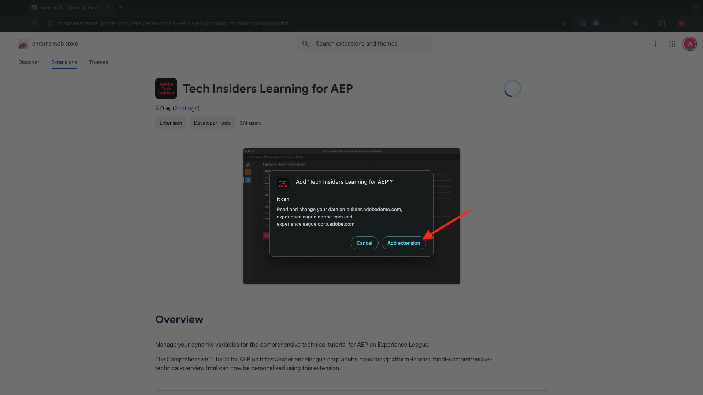

# 0.1安装适用于Experience League文档的Chrome扩展

## 0.1.1为什么创建Chrome扩展？

该文档已经过通用化，任何人都可以使用任何Adobe Experience Platform实例轻松重复使用。
通过使文档可重用，文档中引入了**环境变量**，这意味着您将在文档中找到以下&#x200B;**键**。 每个键值都是特定环境的特定变量，Chrome扩展会为您更改该变量，因此，您可以轻松地从教程页面中复制代码和文本，并将其粘贴到教程中使用的各种用户界面中。

此类值的示例如下所示。 目前，这些值尚无法使用，但一旦您安装和激活Chrome扩展，就会看到这些变量变为可供复制和重复使用的“普通”文本。

| 名称 | 键 |
|:-------------:| :---------------:|
| AEP IMS组织ID | `--aepImsOrgId--` |
| AEP租户ID | `--aepTenantId--` |
| AEP沙盒名称 | `--aepSandboxName--` |
| 学习者配置文件LDAP | `--aepUserLdap--` |

例如，在以下屏幕截图中，您可以看到对`--aepTenantId--`的引用。

安装扩展后，该文本将自动更改以反映实例特定的值。

通过该扩展，您还可以：

- 注册参加教程

## 0.1.2安装Chrome扩展

要安装该Chrome扩展，请打开Chrome浏览器，然后转到： [https://chrome.google.com/webstore/detail/platform-learn-configurat/hhnbkfgioecmhimdhooigajdajplinfi/related?hl=en&amp;authuser=0](https://chrome.google.com/webstore/detail/platform-learn-configurat/hhnbkfgioecmhimdhooigajdajplinfi/related?hl=en&amp;authuser=0)。 你会看到这个。

单击&#x200B;**添加到Chrome**。

你会看到这个。 单击&#x200B;**添加扩展**。

随后将安装扩展，您会看到一条类似通知。

在&#x200B;**扩展**&#x200B;菜单中，单击&#x200B;**拼图块**&#x200B;图标，并将&#x200B;**Platform Learn - Configuration**&#x200B;扩展固定到扩展菜单。

## 0.1.2配置Chrome扩展

转到[https://experienceleague.adobe.com/docs/platform-learn/comprehensive-technical-tutorial-v22/overview.html?lang=en](https://experienceleague.adobe.com/docs/platform-learn/comprehensive-technical-tutorial-v22/overview.html?lang=en)，然后单击扩展图标以将其打开。

然后您会看到此弹出窗口。 单击&#x200B;**+**&#x200B;图标。

输入您的名称和为您的Adobe Experience Platform环境创建的配置ID。 单击&#x200B;**新建**。

>[!IMPORTANT]
>
>如果您是Adobe员工：您可以找到要在内部Github存储库(https://git.corp.adobe.com/vangeluw/platformenablement)中使用的配置ID。
>
>如果您是Adobe解决方案合作伙伴，请联系您的解决方案合作伙伴联系人或发送电子邮件至&#x200B;**spphelp@adobe.com**。

在扩展的左侧菜单中，您现在将看到一个包含缩写的图标。 单击它。 然后，您将看到&#x200B;**环境变量**&#x200B;与您的特定Adobe Experience Platform实例值之间的映射。 单击&#x200B;**激活配置**。

激活配置后，您会在首字母缩写旁看到一个绿色圆点。 这意味着您的配置ID现在处于活动状态。 您还会看到其他许多菜单选项显示。

您现在有2个选项：

- 如果您是现有设置中启用的现有用户，请转到&#x200B;**0.1.3现有用户 — 登录**
- 如果您是首次开始本教程的全新用户，请转到&#x200B;**0.1.4注册**&#x200B;并跳过&#x200B;**0.1.3现有用户 — 登录**

## 0.1.3现有用户 — 登录

>[!IMPORTANT]
>
>练习&#x200B;**0.1.3现有用户 — 登录名**&#x200B;只有在您是以前注册了本教程的现有用户时才有效。

如果您是首次设置此Chrome扩展的现有用户，请单击左侧菜单中的紫色图标。 你会看到这个。

根据需要填写值。

>[!IMPORTANT]
>
>**LDAP**&#x200B;是最重要的字段：您应使用首次注册教程时使用的相同LDAP。 这将确保成功加载进度。 如果您不确定您的ldap是什么，请查看您的电子邮件地址。 将电子邮件地址中@-symbol前面的文本用作LDAP。 如果您的电子邮件地址为&#x200B;**techinsiders@adobe.com**，则您在此处输入的LDAP应为&#x200B;**vangeluw**)。

单击&#x200B;**确定**。

30秒–1分钟后，您的屏幕将更改，您将返回到&#x200B;**主页**，您将看到以下内容：

您的Chrome扩展现已配置，您现在可以验证是否一切正常。

## 0.1.4新用户 — 注册

>[!IMPORTANT]
>
>练习&#x200B;**0.1.4新用户 — 注册**&#x200B;适用于首次启动本教程的新用户。

如果您是首次注册本教程的新用户，请单击菜单中的黄色图标。 你会看到这个。

根据需要填写字段。 单击&#x200B;**保存**。

>[!IMPORTANT]
>
>**LDAP**&#x200B;是最重要的字段。 如果您不确定您的ldap是什么，请查看您的电子邮件地址。 将电子邮件地址中@-symbol前面的文本用作LDAP。 如果您的电子邮件地址为&#x200B;**techinsiders@adobe.com**，则您在此处输入的LDAP应为&#x200B;**vangeluw**)。

30秒–1分钟后，您的屏幕将更改，您将返回到&#x200B;**主页**，您将看到以下内容：

您的Chrome扩展现已配置，您现在可以验证是否一切正常。

## 0.1.5验证教程内容

作为测试，请转到[此页面](https://experienceleague.adobe.com/docs/platform-learn/comprehensive-technical-tutorial-v22/module4/ex3.html?lang=en)。

您现在应该会看到，根据Chrome扩展中的配置ID，所有&#x200B;**环境变量**&#x200B;都已替换为其真值。

现在，您应该具有类似于下面的视图，其中环境变量`--aepTenantId--`已被您的实际租户ID替换，在本例中为&#x200B;**_experienceplatform**。

下一步： [0.2使用演示系统设置Adobe Experience Platform数据收集客户端属性](./ex2.md)

[返回模块0](./getting-started.md)

[返回所有模块](./../../../overview.md)
