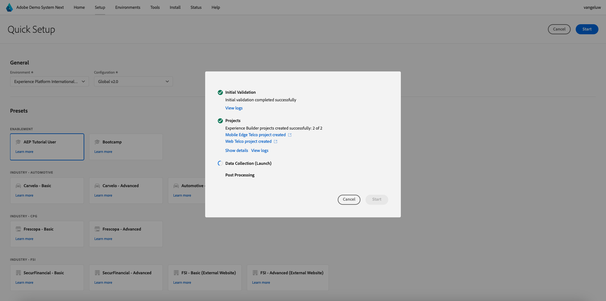
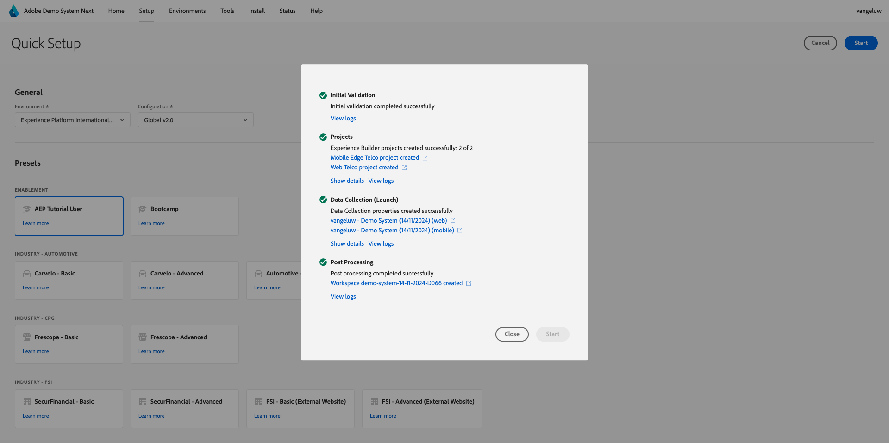

# 0.2使用Demo System Next设置您的Adobe Experience Platform数据收集客户端资产

注册Adobe Experience Platform全面技术教程后，系统将自动为您提供对演示系统的访问权限，以便您访问和运行以下配置。

访问演示系统后，请继续执行以下步骤。

转到[https://dashboard.adobedemo.com/](https://dashboard.adobedemo.com/)。 选择您的沙盒，然后单击&#x200B;**快速设置**。

您将看到以下内容：

在&#x200B;**常规** - **环境**&#x200B;下，选择您的Adobe Experience Platform实例和沙盒，在本例中：

- **Experience Platform国际**
- **aepenablementfy22**
- 配置：请选择&#x200B;**Global v2.0**

接下来，选择预设&#x200B;**启用用户**，然后单击&#x200B;**开始**。

在弹出窗口中，输入数据收集属性的名称。 请使用此命名约定：**演示系统(DD/MM/YYYY)**。 仅供参考：您的LDAP将自动附加，您无需自行添加。

单击&#x200B;**开始**。

然后，您会看到此弹出窗口，其中显示创建网站和移动应用程序项目以及数据收集属性时的进度。

完成快速设置过程后，您将拥有：

- 1个Web零售项目，这使得能够使用Luma演示品牌的演示网站成为可能
- 1个移动零售项目，该项目允许将演示移动应用程序与Luma演示品牌结合使用
- 1 CX App Retail项目，这使得通过Luma演示品牌使用呼叫中心和客户代理应用程序成为可能
- 1个用于Web的数据收集属性，您将使用该属性从网站收集数据
- 1个用于移动设备的数据收集属性，您将使用该属性从移动设备应用程序中收集数据

在后续步骤中根据需要保持此屏幕打开。

下一步： [0.3创建您的数据流](./ex3.md)

[返回模块0](./getting-started.md)

[返回所有模块](./../../../overview.md)
