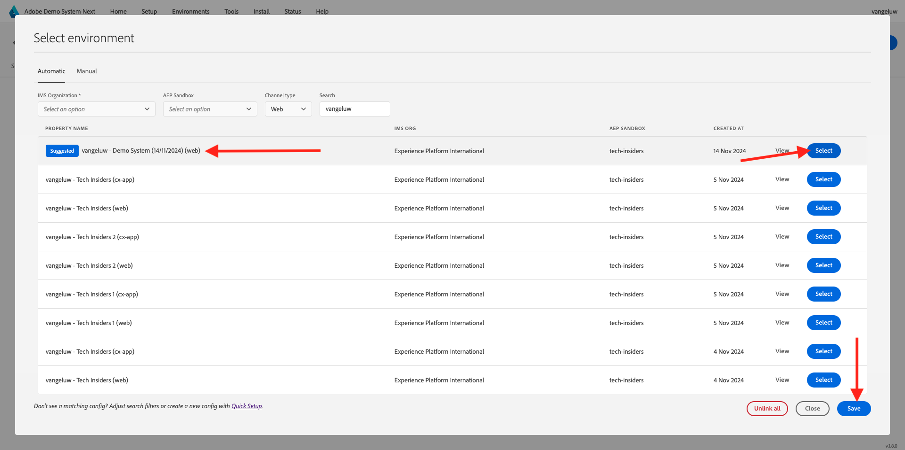

# 使用网站

## 备选办法1：继续先前的行使

>[!NOTE]
>
>如果您不再打开下面的屏幕，请转到选项2。

在上一个练习之后，您得到了此结果。 单击以打开为您创建的&#x200B;**Web Telco项目**。

你会看到这个。 单击&#x200B;**集成**。

在&#x200B;**集成**&#x200B;页面上，您需要选择在上一个练习中创建的数据收集属性。 为此，请单击&#x200B;**选择环境**。

在上一步中创建的数据收集属性（名为`--aepUserLdap-- - Demo System (DD/MM/YYYY) (web)`）上单击&#x200B;**选择**。

你会看到这个。 单击&#x200B;**运行**&#x200B;以打开演示网站。

随后您将看到您的演示网站已打开。 选择URL并将其复制到剪贴板。

打开一个新的无痕浏览器窗口。

粘贴您在上一步中复制的演示网站的URL。 然后，系统将要求您使用Adobe ID登录。

选择您的帐户类型并完成登录过程。

然后，您会看到您的网站已加载到无痕浏览器窗口中。 对于每个演示，您将需要使用新的无痕浏览器窗口来加载演示网站URL。

## 选项2：从新的无痕浏览器窗口开始

如果您意外关闭了浏览器窗口，或者为了进行以后的会话，还可以转到[https://dsn.adobe.com/](https://dsn.adobe.com/)来访问您的网站项目。 使用Adobe ID登录后，您将看到此内容。 单击网站项目上的3个点&#x200B;**...**，然后单击&#x200B;**编辑**。

您现在可以按照以下流程访问该网站。 单击&#x200B;**集成**。

在&#x200B;**集成**&#x200B;页面上，您需要选择在上一个练习中创建的数据收集属性。 为此，请单击&#x200B;**选择环境**。

在上一步中创建的数据收集属性（名为`--aepUserLdap - Demo System (DD/MM/YYYY) (web)`）上单击&#x200B;**选择**。

你会看到这个。 单击&#x200B;**运行**&#x200B;以打开演示网站。

随后您将看到您的演示网站已打开。 选择URL并将其复制到剪贴板。

打开一个新的无痕浏览器窗口。

粘贴您在上一步中复制的演示网站的URL。 然后，系统将要求您使用Adobe ID登录。

选择您的帐户类型并完成登录过程。

然后，您会看到您的网站已加载到无痕浏览器窗口中。 对于每个演示，您将需要使用新的无痕浏览器窗口来加载演示网站URL。

下一步：[使用移动应用](./ex5.md)

[返回快速入门](./getting-started.md)

[返回所有模块](./../../../overview.md)
