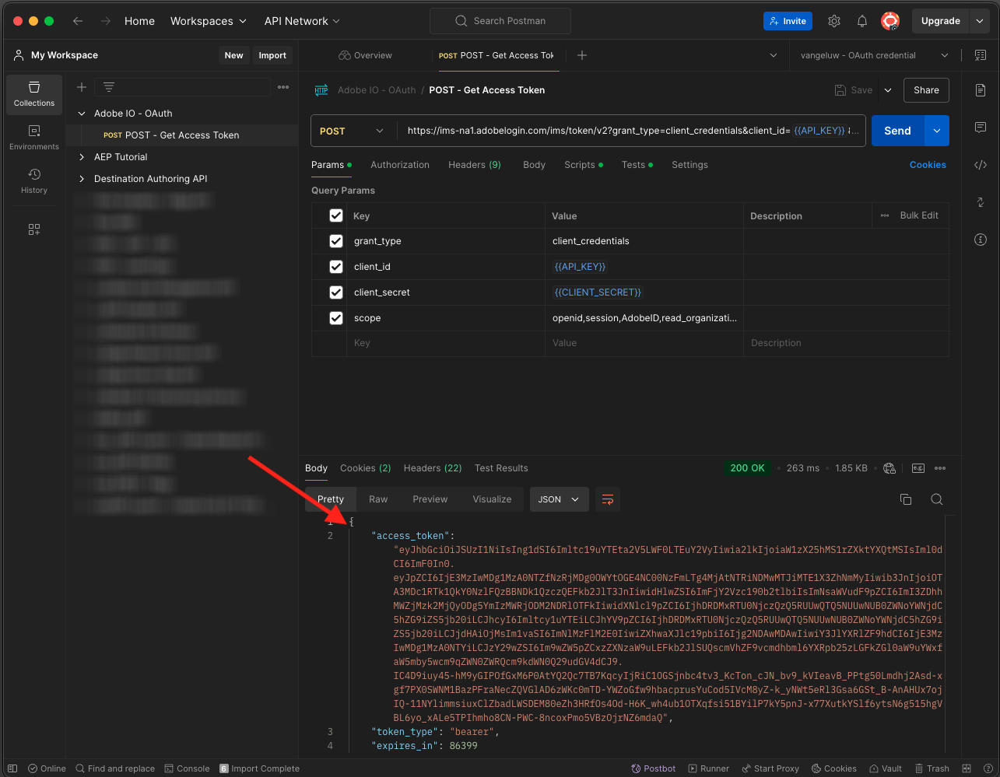
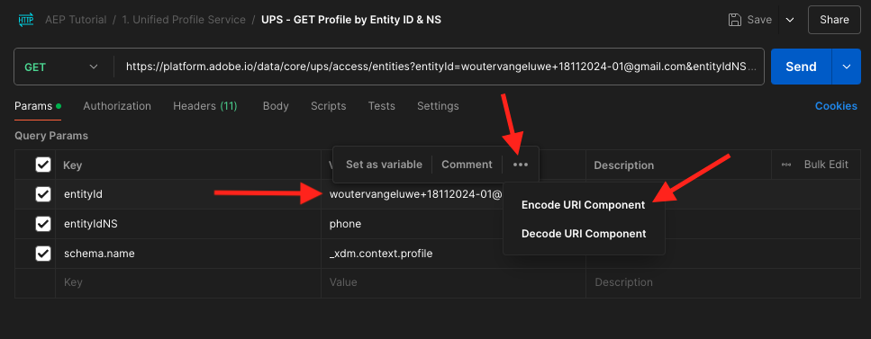

# 2.1.3可视化您自己的实时客户个人资料 — API

在本练习中，您将使用Postman和Adobe I/O查询Adobe Experience Platform的API，以查看您自己的实时客户个人资料。

## Story

在实时客户个人资料中，所有个人资料数据都与事件数据以及现有区段成员资格一起显示。 所显示的数据可以来自任何地方，包括Adobe应用程序和外部解决方案。 这是Adobe Experience Platform中最强大的视图，体验记录体系。

实时客户配置文件可供所有Adobe应用程序使用，也可以供呼叫中心或店内客户通信应用程序等外部解决方案使用。 要执行此操作，您需要将这些外部解决方案连接到Adobe Experience Platform的API。

## 2.1.3.1您的标识符

在网站上的“配置文件查看器”面板上，您可以找到多个身份。 每个身份都链接到命名空间。


在X-Ray面板上，我们可以看到4种不同的ID和命名空间组合：

| 标识 | 命名空间 |
|:-------------:| :---------------:|
| Experience CloudID (ECID) | 12507560687324495704459439363261812234 |
| 电子邮件ID | woutervangeluwe+06022022-01@gmail.com |
| 手机号码ID | +32473622044+06022022-01 |

请记住这些标识符以便执行下一步。

有了这些ID，请转到Postman。

## 2.1.3.2设置您的Adobe I/O项目

在本练习中，您将集中使用Adobe I/O来针对平台的API进行查询。 请按照以下步骤设置Adobe I/O。

转到[https://developer.adobe.com/console/home](https://developer.adobe.com/console/home)


请确保在屏幕右上角选择正确的Adobe Experience Platform实例。 您的实例为`--envName--`。


单击&#x200B;**新建项目**。

或


选择&#x200B;**+添加到项目**&#x200B;并选择&#x200B;**API**。


您随后将看到以下内容：


单击&#x200B;**Adobe Experience Platform**图标。
/images/api2.png)

单击&#x200B;**Experience PlatformAPI**。


单击&#x200B;**下一步**。


您现在可以选择让Adobe I/O生成安全密钥对，或者上传现有密钥对。

选择&#x200B;**选项1 — 生成密钥对**。


单击&#x200B;**生成密钥对**。


你将会看到旋转图标约30秒。


您随后将看到此内容，并且生成的密钥对将下载为zip文件： **config.zip**。

在桌面上解压缩文件&#x200B;**config.zip**，您会看到它包含2个文件：


- **certificate_pub.crt**&#x200B;是您的公钥证书。 从安全角度来看，这是可自由用于设置与在线应用程序集成的证书。
- **private.key**&#x200B;是您的私钥。 这永远不应该和任何人分享。 私钥是您用于对API实施进行身份验证的密钥，它应该是机密。 如果您与任何人共享您的私钥，则他们可能会访问您的实施并滥用该API，将恶意数据摄取到Platform中，并提取Platform中的所有数据。


确保将&#x200B;**config.zip**&#x200B;文件保存在安全位置，因为您需要此文件以执行后续步骤以及将来访问Adobe I/O和Adobe Experience Platform API。

单击&#x200B;**下一步**。


您现在必须为集成选择&#x200B;**产品配置文件**。

选择所需的产品配置文件。

**仅供参考**：在您的Adobe Experience Platform实例中，产品配置文件将具有不同的命名。 您需要至少选择一个具有适当访问权限的产品配置文件，这些权限是在Adobe Admin Console中设置的。


单击&#x200B;**保存配置的API**。


你将会看到一个旋转图标几秒钟。


接下来，您将看到您的集成。


单击“下载Postman **”按钮，然后单击“**&#x200B;服务帐户(JWT)**”下载Postman环境（在下载环境之前等待，这可能需要几秒钟的时间）。**


向下滚动直到看到&#x200B;**服务帐户(JWT)**，您可以在其中找到用于配置与Adobe Experience Platform集成的所有集成详细信息。


您的IO项目当前具有通用名称。 您需要为集成提供一个友好名称。 按指示单击&#x200B;**项目1**（或类似名称）


单击&#x200B;**编辑项目**。


输入集成的“名称”和“说明”。 作为命名约定，我们将使用`AEP API --aepUserLdap--`。 将ldap替换为您的ldap。
例如，如果您的ldap是vangeluw，则集成的名称和描述将变为AEP API vangeluw。

输入`AEP API --aepUserLdap--`作为&#x200B;**项目标题**。 单击&#x200B;**保存**。


您的Adobe I/O集成现已完成。


## 2.1.3.3 Postman对Adobe I/O的身份验证

转到[https://www.getpostman.com/](https://www.getpostman.com/)。

单击&#x200B;**开始**。


接下来，下载并安装Postman。


安装Postman后，启动应用程序。

在Postman中，有2个概念：环境和收藏集。

- 环境包含所有比较一致或不太一致的环境变量。 在该环境中，您可以找到我们的Platform环境的IMSOrg等内容，以及您的私钥和其他安全凭据。 环境文件是您在上一个练习中的Adobe I/O设置过程中下载的文件，其名称如下： **service.postman_environment.json**。

- 收藏集包含大量您可以使用的API请求。 我们将使用2个收藏集
   - 1个用于AdobeI/0的身份验证的集合
   - 1本模块中的练习的集合
   - 用于Real-Time CDP模块中练习的1个集合，用于目标创作

请将文件[postman.zip](./../../../assets/postman/postman_profile.zip)下载到您的本地桌面。

在此&#x200B;**postman.zip**&#x200B;文件中，您将找到以下文件：

- `_Adobe I-O - Token.postman_collection.json`
- `_Adobe Experience Platform Enablement.postman_collection.json`
- `Destination_Authoring_API.json`

解压缩&#x200B;**postman.zip**&#x200B;文件，并将这3个文件以及从Adobe I/O下载的Postman环境存储在您桌面上的文件夹中。您需要在该文件夹中包含以下4个文件：


返回Postman。 单击&#x200B;**导入**。


单击&#x200B;**上载文件**。


导航到桌面上解压缩4个已下载文件的文件夹。 同时选择这4个文件，然后单击&#x200B;**打开**。


单击&#x200B;**打开**&#x200B;后，Postman将向您显示要导入的环境和收藏集的概述。 单击&#x200B;**导入**。


您现在拥有Postman中开始通过API与Adobe Experience Platform交互所需的一切。

首先要做的是确保您正确通过了身份验证。 要进行身份验证，您需要请求访问令牌。

在执行任何请求之前，请确保选择了正确的环境。 您可以通过验证右上角的环境下拉列表来检查当前选定的环境。

所选环境的名称应类似于以下名称：


单击&#x200B;**eye**&#x200B;图标，然后单击&#x200B;**编辑**&#x200B;以更新环境文件中的私钥。


你会看到这个。 已预填充所有字段，但字段&#x200B;**PRIVATE_KEY**&#x200B;除外。


私钥已在创建Adobe I/O项目时生成。 已下载为名为&#x200B;**config.zip**&#x200B;的zip文件。 将该zip文件提取到桌面。


打开文件夹&#x200B;**config**&#x200B;并使用您选择的文本编辑器打开文件&#x200B;**private.key**。


然后您会看到与此类似的内容，将所有文本复制到剪贴板。


返回Postman并将私钥粘贴到&#x200B;**INITIAL VALUE**&#x200B;和&#x200B;**CURRENT VALUE**&#x200B;列的变量&#x200B;**PRIVATE_KEY**&#x200B;旁边的字段中。 单击&#x200B;**保存**。


您的Postman环境和收藏集现已配置完毕，可正常使用。 您现在可以从Postman向Adobe I/O进行身份验证。

为此，您需要加载外部库，该库将负责通信的加密和解密。 要加载此库，必须执行名为&#x200B;**INIT：为RS256**&#x200B;加载加密库的请求。 在&#x200B;**_Request - Token集合**&#x200B;中选择此Adobe I/O，您将看到它显示在屏幕中央。


单击蓝色的&#x200B;**发送**&#x200B;按钮。 几秒钟后，您应该会在Postman的&#x200B;**Body**&#x200B;部分中看到一个响应：


现在加载加密库后，我们可以对Adobe I/O进行身份验证。

在&#x200B;**\_Request - TokenAdobe I/O**&#x200B;中，选择名为&#x200B;**IMS： JWT Generate + Auth**&#x200B;的请求。 同样，您会看到请求详细信息显示在屏幕中央。


单击蓝色的&#x200B;**发送**&#x200B;按钮。 几秒钟后，您应该会在Postman的&#x200B;**Body**&#x200B;部分中看到一个响应：



如果配置成功，您应该会看到包含以下信息的类似响应：

| 键 | 值 |
|:-------------:| :---------------:| 
| token_type | **持有人** |
| access_token | **eyJ4NXUiOiJpbXNfbmEx...QT7mqZkumN1tdsPEioOEl4087Dg** |
| expires_in | **86399973** |

Adobe I/O为您提供了&#x200B;**持有者** — 令牌，该令牌具有特定值（此很长的access_token）和到期窗口。

我们收到的令牌现在有24小时有效。 这意味着24小时后，如果您要使用Postman对Adobe I/O进行身份验证，则必须通过再次运行此请求来生成新令牌。

## 2.1.3.4实时客户个人资料API，架构：个人资料

现在，您可以将第一个请求发送到Platform的实时客户档案API。

在Postman中，找到集合&#x200B;**_Adobe Experience Platform启用**。


在&#x200B;**1中。 统一配置文件服务**，选择名为&#x200B;**UPS的第一个GET — 按实体ID和NS**&#x200B;列出的请求。


对于此请求，有三个必需的变量：

| 键 | 值 | 定义 |
|:-------------:| :---------------:| :---------------:| 
| entityId | **id** | 特定客户ID |
| entityIdNS | **命名空间** | 适用于ID的特定命名空间 |
| schema.name | **_xdm.context.profile** | 您希望接收其信息的特定架构 |

因此，如果您希望要求Adobe Experience Platform的API将您自己的ECID的所有配置文件信息返回给您，您需要按如下方式配置请求：

| 键 | 值 |
|:-------------:| :---------------:| 
| entityId | **您的ECID** |
| entityIdNS | **ecid** |
| schema.name | **_xdm.context.profile** |


您还应验证请求的&#x200B;**标头** — 字段。 转到&#x200B;**标头**。 您随后将看到以下内容：


| 键 | 值 |
| ----------- | ----------- |
| x-sandbox-name | `--aepSandboxName--` |

>[!NOTE]
>
>您需要指定正在使用的Adobe Experience Platform沙盒的名称。 您的x-sandbox-name应为`--aepSandboxName--`。

单击&#x200B;**发送**&#x200B;以将您的请求发送到Platform。

您应会立即收到Platform的响应，并显示如下所示的内容：


这是来自Platform的完整响应：

```javascript
{
    "A28iM3aJBJRbEQpOnUh5HOM9": {
        "entityId": "A28iM3aJBJRbEQpOnUh5HOM9",
        "mergePolicy": {
            "id": "e632ccb8-882a-4b5e-8375-96a1ba3df1aa"
        },
        "sources": [
            "61fe23c5be4b5f19485dc379",
            "profile-streaming-segment",
            "61fe23cfa07c1219489b3ba4"
        ],
        "tags": [
            "1644130566774:1542:232:va7",
            "0a1e9dd4-940a-46ec-9114-7e371cf5c4d0",
            "aep_ups_partitioned_profile_cdc_low_lag_sla_0:106:1090888313",
            "a6fed09e-2c56-403e-8692-4e99e4779dfa:IRL1",
            "1644419616318:2989:31:va7",
            "aep_ups_profile_change_event_prod_va7:71:7946633524-8361f22c-c09e-4364-b24b-b57435c4d14f"
        ],
        "identityGraph": [
            "BUF9zMKLrXq72p4HpbsHv1SSBnr0LTAxQGdtYWlsLmNvbQ",
            "GkicrkFjgmCjUg",
            "GtCbrkFjgkSOFg",
            "A2-AP9zOsakzNTe9Rqwf7Wse",
            "BkFuK4QcJpSPByuSBnr0LTAx",
            "A28jSB484ziuECF3fEoXmFlF",
            "A28iM3aJBJRbEQpOnUh5HOM9"
        ],
        "entity": {
            "_experienceplatform": {
                "individualCharacteristics": {},
                "loyaltyDetails": {
                    "level": "Basic",
                    "points": 0
                },
                "identification": {
                    "core": {
                        "phoneNumber": "+32473622044+06022022-01",
                        "email": "woutervangeluwe+06022022-01@gmail.com",
                        "loyaltyId": "5415776",
                        "ecid": "12019606991718502754997192487345616673",
                        "crmId": "1478212"
                    }
                }
            },
            "personalEmail": {
                "address": "woutervangeluwe+06022022-01@gmail.com"
            },
            "_repo": {
                "createDate": "2022-02-06T06:56:06.424Z"
            },
            "testProfile": true,
            "homeAddress": {
                "postalCode": "1831",
                "city": "Diegem",
                "street1": "Culliganlaan 2F"
            },
            "mobilePhone": {
                "number": "+32473622044+06022022-01"
            },
            "segmentMembership": {
                "ups": {
                    "bc999ded-b6d7-40d4-87a7-d3a280b950e3": {
                        "lastQualificationTime": "2022-02-09T20:38:33Z",
                        "status": "exited"
                    },
                    "23b1cd4e-d62f-44bd-8392-3095a33109c4": {
                        "lastQualificationTime": "2022-02-09T20:38:33Z",
                        "status": "exited"
                    },
                    "f0807704-a1c8-4ac4-85dd-60db2fbf18f1": {
                        "lastQualificationTime": "2022-02-09T20:38:33Z",
                        "status": "existing"
                    }
                }
            },
            "person": {
                "name": {
                    "lastName": "Van Geluwe",
                    "firstName": "Wouter"
                },
                "gender": "female",
                "birthDate": "1982-07-08"
            },
            "userActivityRegions": {
                "IRL1": {
                    "captureTimestamp": "2022-02-09T15:21:11Z"
                }
            },
            "identityMap": {
                "email": [
                    {
                        "id": "woutervangeluwe+06022022-01@gmail.com"
                    }
                ],
                "crmid": [
                    {
                        "id": "1478212"
                    }
                ],
                "ecid": [
                    {
                        "id": "12507560687324495704459439363261812234"
                    },
                    {
                        "id": "12019606991718502754997192487345616673"
                    },
                    {
                        "id": "38335942889672702722192106363935964471"
                    }
                ],
                "phone": [
                    {
                        "id": "+32473622044+06022022-01"
                    }
                ],
                "loyaltyid": [
                    {
                        "id": "5415776"
                    }
                ]
            }
        },
        "lastModifiedAt": "2022-02-09T20:38:36Z"
    }
}
```

当前是Platform中此ECID的所有可用配置文件数据。

您无需使用ECID从Platform的Real-time Customer Profile请求配置文件数据，您可以使用任何命名空间中的任何ID来请求此数据。

让我们返回Postman并假装我们是呼叫中心，然后向Platform发送一个请求，其中指定了&#x200B;**Phone**&#x200B;的命名空间和您的手机号码。

因此，如果您希望要求Platform的API将特定电话的所有配置文件信息返回给您，您需要按如下方式配置请求：

| 键 | 值 |
|:-------------:| :---------------:| 
| entityId | **您的电话号码** |
| entityIdNS | **phone** （用电话替换ecid） |
| schema.name | **_xdm.context.profile** |

如果您的电话号码包含&#x200B;**+**&#x200B;等特殊符号，则必须选择完整的电话号码，单击鼠标右键并单击&#x200B;**EncodeURIComponent**。


然后，您将拥有以下权限：


您还应验证请求的&#x200B;**标头** — 字段。 转到&#x200B;**标头**。 您随后将看到以下内容：


| 键 | 值 |
| ----------- | ----------- |
| x-sandbox-name | `--aepSandboxName--` |

>[!NOTE]
>
>您需要指定正在使用的Adobe Experience Platform沙盒的名称。 您的x-sandbox-name应为`--aepSandboxName--`。

单击蓝色的&#x200B;**发送**&#x200B;按钮并验证响应。


让我们通过指定&#x200B;**email**&#x200B;的命名空间和您的电子邮件地址，对您的电子邮件地址执行相同的操作。

因此，如果您希望要求Platform的API将特定电子邮件地址的所有配置文件信息返回给您，则需要按如下方式配置请求：

| 键 | 值 |
|:-------------:| :---------------:| 
| entityId | **您的电子邮件** |
| entityIdNS | **电子邮件** （将电话替换为电子邮件） |
| schema.name | **_xdm.context.profile** |

如果您的电子邮件地址包含&#x200B;**+**&#x200B;等特殊符号，则必须选择完整的电子邮件地址，单击鼠标右键并单击&#x200B;**EncodeURIComponent**。



然后，您将拥有以下权限：


您还应验证请求的&#x200B;**标头** — 字段。 转到&#x200B;**标头**。 您随后将看到以下内容：


| 键 | 值 |
| ----------- | ----------- |
| x-sandbox-name | `--aepSandboxName--` |

>[!NOTE]
>
>您需要指定正在使用的Adobe Experience Platform沙盒的名称。 您的x-sandbox-name应为`--aepSandboxName--`。

单击蓝色的&#x200B;**发送**&#x200B;按钮并验证响应。


这是提供给品牌的一种非常重要的灵活性。 这意味着任何环境都可以使用自己的ID和命名空间向Platform发送请求，而无需了解多个命名空间和ID的复杂性。

例如：

- 呼叫中心将使用命名空间&#x200B;**phone**&#x200B;向Platform请求数据
- 忠诚度系统将使用命名空间&#x200B;**电子邮件**&#x200B;从平台请求数据
- 联机应用程序可能使用命名空间&#x200B;**ecid**

呼叫中心不一定知道忠诚度系统中使用了哪种标识符，忠诚度系统也不一定知道在线应用程序使用了哪种标识符。 每个系统都可以使用自己拥有和理解的信息在需要时获取所需的信息。

## 2.1.3.5实时客户个人资料API，架构：个人资料和ExperienceEvent

成功查询了平台的API以查找配置文件数据后，现在让我们对ExperienceEvent数据执行相同的操作。

在Postman中，找到集合&#x200B;**_Adobe Experience Platform启用**。


在&#x200B;**1中。 统一配置文件服务**，请选择名称为&#x200B;**UPS的第二个请求 — 按实体ID和NS**&#x200B;列出的GET配置文件和EE。


对于此请求，有四个必需变量：

| 键 | 值 | 定义 |
|:-------------:| :---------------:|  :---------------:| 
| schema.name | **_xdm.context.experienceevent** | 您希望接收其信息的特定架构。 在本例中，我们要查找映射到ExperienceEvent架构的数据。 |
| relatedSchema.name | **_xdm.context.profile** | 在查找映射到ExperienceEvent架构的数据时，我们需要指定要接收该数据的标识。 有权访问身份的架构是Profile-schema，因此此处的relatedSchema是Profile-schema。 |
| relatedEntityId | **id** | 特定客户ID |
| relatedentityidNS | **命名空间** | 适用于ID的特定命名空间 |

因此，如果您希望请求平台的API将您自己的ecid的所有配置文件信息返回给您，您需要按如下方式配置请求：

| 键 | 值 |
|:-------------:| :---------------:| 
| schema.name | **_xdm.context.experienceevent** |
| relatedSchema.name | **_xdm.context.profile** |
| relatedEntityId | **您的ECID** |
| relatedentityidNS | **ecid** |


您还应验证请求的&#x200B;**标头** — 字段。 转到&#x200B;**标头**。 您随后将看到以下内容：


| 键 | 值 |
| ----------- | ----------- |
| x-sandbox-name | `--aepSandboxName--` |

>[!NOTE]
>
>您需要指定正在使用的Adobe Experience Platform沙盒的名称。 您的x-sandbox-name应为`--aepSandboxName--`。

单击&#x200B;**发送**&#x200B;以将您的请求发送到Platform。

您应会立即收到Platform的响应，并显示如下所示的内容：


以下是来自Platform的完整响应。 在此示例中，有八个ExperienceEvents关联到该客户的ECID。 请查看下方以了解请求中的不同变量，因为下方是您在前几个练习中配置Launch的直接后果。

此外，当X-ray面板显示ExperienceEvent信息时，它使用以下有效负载解析和检索信息，如产品名称（在下面有效负载中搜索productName）和产品图像URL（在下面有效负载中搜索productImageUrl）。

```javascript
{
    "_page": {
        "orderby": "timestamp",
        "start": "d686ab8a-2d0c-4722-9ff5-bfc1020b0b55-0",
        "count": 31,
        "next": ""
    },
    "children": [
        {
            "relatedEntityId": "A28iM3aJBJRbEQpOnUh5HOM9",
            "entityId": "d686ab8a-2d0c-4722-9ff5-bfc1020b0b55-0",
            "timestamp": 1644127126596,
            "entity": {
                "environment": {
                    "ipV4": "213.118.129.117",
                    "type": "browser",
                    "browserDetails": {
                        "viewportHeight": 969,
                        "viewportWidth": 1920,
                        "userAgent": "Mozilla/5.0 (Macintosh; Intel Mac OS X 10_15_7) AppleWebKit/537.36 (KHTML, like Gecko) Chrome/98.0.4758.80 Safari/537.36"
                    }
                },
                "web": {
                    "webPageDetails": {
                        "pageViews": {
                            "value": 1
                        },
                        "name": "vangeluw-OCUC",
                        "URL": "https://builder.adobedemo.com/run/vangeluw-OCUC"
                    },
                    "webReferrer": {
                        "URL": "https://adobe.okta.com/"
                    }
                },
                "_experienceplatform": {
                    "interactionDetails": {
                        "core": {
                            "channel": "web"
                        }
                    },
                    "demoEnvironment": {
                        "brandName": "vangeluw-OCUC"
                    },
                    "identification": {
                        "core": {
                            "ecid": "12507560687324495704459439363261812234"
                        }
                    }
                },
                "implementationDetails": {
                    "name": "https://ns.adobe.com/experience/alloy/reactor",
                    "version": "2.8.0+2.9.0",
                    "environment": "browser"
                },
                "identityMap": {
                    "ECID": [
                        {
                            "id": "12507560687324495704459439363261812234",
                            "authenticatedState": "ambiguous",
                            "primary": true
                        }
                    ]
                },
                "eventType": "web.webpagedetails.pageViews",
                "_id": "d686ab8a-2d0c-4722-9ff5-bfc1020b0b55-0",
                "placeContext": {
                    "localTime": "2022-02-06T06:58:46.596+01:00",
                    "localTimezoneOffset": -60
                },
                "device": {
                    "screenOrientation": "landscape",
                    "screenWidth": 1920,
                    "screenHeight": 1080
                },
                "timestamp": "2022-02-06T05:58:46.596Z"
            },
            "lastModifiedAt": "2022-02-06T05:59:48Z"
        },
        {
            "relatedEntityId": "A28iM3aJBJRbEQpOnUh5HOM9",
            "entityId": "919a46bf-a591-4c32-9201-b72250d5f5d9-0",
            "timestamp": 1644127129876,
            "entity": {
                "environment": {
                    "ipV4": "213.118.129.117",
                    "type": "browser",
                    "browserDetails": {
                        "viewportHeight": 969,
                        "viewportWidth": 1920,
                        "userAgent": "Mozilla/5.0 (Macintosh; Intel Mac OS X 10_15_7) AppleWebKit/537.36 (KHTML, like Gecko) Chrome/98.0.4758.80 Safari/537.36"
                    }
                },
                "web": {
                    "webPageDetails": {
                        "pageViews": {
                            "value": 1
                        },
                        "name": "vangeluw-OCUC#",
                        "URL": "https://builder.adobedemo.com/run/vangeluw-OCUC#"
                    },
                    "webReferrer": {
                        "URL": "https://adobe.okta.com/"
                    }
                },
                "_experienceplatform": {
                    "interactionDetails": {
                        "core": {
                            "channel": "web"
                        }
                    },
                    "demoEnvironment": {
                        "brandName": "vangeluw-OCUC"
                    },
                    "identification": {
                        "core": {
                            "ecid": "12507560687324495704459439363261812234"
                        }
                    }
                },
                "implementationDetails": {
                    "name": "https://ns.adobe.com/experience/alloy/reactor",
                    "version": "2.8.0+2.9.0",
                    "environment": "browser"
                },
                "identityMap": {
                    "ECID": [
                        {
                            "id": "12507560687324495704459439363261812234",
                            "authenticatedState": "ambiguous",
                            "primary": true
                        }
                    ]
                },
                "eventType": "web.webpagedetails.pageViews",
                "_id": "919a46bf-a591-4c32-9201-b72250d5f5d9-0",
                "placeContext": {
                    "localTime": "2022-02-06T06:58:49.876+01:00",
                    "localTimezoneOffset": -60
                },
                "device": {
                    "screenOrientation": "landscape",
                    "screenWidth": 1920,
                    "screenHeight": 1080
                },
                "timestamp": "2022-02-06T05:58:49.876Z"
            },
            "lastModifiedAt": "2022-02-06T05:59:48Z"
        },
        {
            "relatedEntityId": "A28iM3aJBJRbEQpOnUh5HOM9",
            "entityId": "41a80489-00d4-446c-b456-8cb19c3f309a-0",
            "timestamp": 1644130597134,
            "entity": {
                "environment": {
                    "ipV4": "213.118.129.117",
                    "type": "browser",
                    "browserDetails": {
                        "viewportHeight": 1001,
                        "viewportWidth": 1920,
                        "userAgent": "Mozilla/5.0 (Macintosh; Intel Mac OS X 10_15_7) AppleWebKit/537.36 (KHTML, like Gecko) Chrome/98.0.4758.80 Safari/537.36"
                    }
                },
                "web": {
                    "webPageDetails": {
                        "pageViews": {
                            "value": 1
                        },
                        "name": "login",
                        "URL": "https://builder.adobedemo.com/run/vangeluw-OCUC/login"
                    },
                    "webReferrer": {
                        "URL": "https://builder.adobedemo.com/run/vangeluw-OCUC/login"
                    }
                },
                "_experienceplatform": {
                    "interactionDetails": {
                        "core": {
                            "channel": "web"
                        }
                    },
                    "demoEnvironment": {
                        "brandName": "vangeluw-OCUC"
                    },
                    "identification": {
                        "core": {
                            "ecid": "12507560687324495704459439363261812234"
                        }
                    }
                },
                "implementationDetails": {
                    "name": "https://ns.adobe.com/experience/alloy/reactor",
                    "version": "2.8.0+2.9.0",
                    "environment": "browser"
                },
                "identityMap": {
                    "ECID": [
                        {
                            "id": "12507560687324495704459439363261812234",
                            "authenticatedState": "ambiguous",
                            "primary": true
                        }
                    ]
                },
                "eventType": "web.webpagedetails.pageViews",
                "_id": "41a80489-00d4-446c-b456-8cb19c3f309a-0",
                "placeContext": {
                    "localTime": "2022-02-06T07:56:37.134+01:00",
                    "localTimezoneOffset": -60
                },
                "device": {
                    "screenOrientation": "landscape",
                    "screenWidth": 1920,
                    "screenHeight": 1080
                },
                "timestamp": "2022-02-06T06:56:37.134Z"
            },
            "lastModifiedAt": "2022-02-06T06:56:38Z"
        },
        {
            "relatedEntityId": "A28jSB484ziuECF3fEoXmFlF",
            "entityId": "8ACC7B6C-2320-4865-B414-3B0CFA01F628",
            "timestamp": 1644419615000,
            "entity": {
                "environment": {
                    "ipV4": "213.118.129.117",
                    "browserDetails": {
                        "userAgent": "Mozilla/5.0 (iPhone; CPU OS 15_3 like Mac OS X; en_BE)"
                    }
                },
                "eventType": "application.login",
                "_id": "8ACC7B6C-2320-4865-B414-3B0CFA01F628",
                "_experienceplatform": {
                    "interactionDetails": {
                        "core": {
                            "channel": "mobile"
                        }
                    },
                    "demoEnvironment": {
                        "brandName": "vangeluw-2L6V"
                    },
                    "identification": {
                        "core": {
                            "ecid": "12019606991718502754997192487345616673",
                            "email": "woutervangeluwe+06022022-01@gmail.com"
                        }
                    }
                },
                "timestamp": "2022-02-09T15:13:35Z",
                "identityMap": {
                    "ECID": [
                        {
                            "id": "12019606991718502754997192487345616673",
                            "authenticatedState": "ambiguous",
                            "primary": true
                        }
                    ]
                }
            },
            "lastModifiedAt": "2022-02-09T15:13:38Z"
        },
        {
            "relatedEntityId": "A28jSB484ziuECF3fEoXmFlF",
            "entityId": "54F68CE5-E9E1-4AD0-91B1-7B607A9285C4",
            "timestamp": 1644419658000,
            "entity": {
                "environment": {
                    "ipV4": "213.118.129.117",
                    "browserDetails": {
                        "userAgent": "Mozilla/5.0 (iPhone; CPU OS 15_3 like Mac OS X; en_BE)"
                    }
                },
                "_experienceplatform": {
                    "interactionDetails": {
                        "core": {
                            "channel": "mobile"
                        }
                    },
                    "demoEnvironment": {
                        "brandName": "vangeluw-2L6V"
                    },
                    "identification": {
                        "core": {
                            "ecid": "12019606991718502754997192487345616673"
                        }
                    }
                },
                "identityMap": {
                    "ECID": [
                        {
                            "id": "12019606991718502754997192487345616673",
                            "authenticatedState": "ambiguous",
                            "primary": true
                        }
                    ]
                },
                "eventType": "commerce.productViews",
                "_id": "54F68CE5-E9E1-4AD0-91B1-7B607A9285C4",
                "commerce": {
                    "productViews": {
                        "value": 1
                    }
                },
                "productListItems": [
                    {
                        "quantity": 1,
                        "productAddMethod": "Mobile",
                        "_experienceplatform": {
                            "core": {
                                "mainCategory": "Women",
                                "productURL": "product1",
                                "imageURL": "https://contentviewer.s3.amazonaws.com/helium/wh08-white_main.jpg"
                            }
                        },
                        "priceTotal": 42,
                        "name": "Cassia Funnel Sweatshirt",
                        "SKU": "product1",
                        "currencyCode": "USD"
                    }
                ],
                "timestamp": "2022-02-09T15:14:18Z"
            },
            "lastModifiedAt": "2022-02-09T15:14:21Z"
        },
        {
            "relatedEntityId": "A2-AP9zOsakzNTe9Rqwf7Wse",
            "entityId": "bfe26684-bc3b-40c5-9fe5-5aba854c3227-0",
            "timestamp": 1644420036035,
            "entity": {
                "environment": {
                    "ipV4": "193.105.139.131",
                    "type": "browser",
                    "browserDetails": {
                        "viewportHeight": 969,
                        "viewportWidth": 1920,
                        "userAgent": "Mozilla/5.0 (Macintosh; Intel Mac OS X 10_15_7) AppleWebKit/537.36 (KHTML, like Gecko) Chrome/98.0.4758.80 Safari/537.36"
                    }
                },
                "web": {
                    "webPageDetails": {
                        "pageViews": {
                            "value": 1
                        },
                        "name": "vangeluw-OCUC",
                        "URL": "https://builder.adobedemo.com/run/vangeluw-OCUC"
                    },
                    "webReferrer": {
                        "URL": "https://adobe.okta.com/"
                    }
                },
                "_experienceplatform": {
                    "interactionDetails": {
                        "core": {
                            "channel": "web"
                        }
                    },
                    "demoEnvironment": {
                        "brandName": "vangeluw-OCUC"
                    },
                    "identification": {
                        "core": {
                            "ecid": "38335942889672702722192106363935964471"
                        }
                    }
                },
                "implementationDetails": {
                    "name": "https://ns.adobe.com/experience/alloy/reactor",
                    "version": "2.8.0+2.9.0",
                    "environment": "browser"
                },
                "identityMap": {
                    "ECID": [
                        {
                            "id": "38335942889672702722192106363935964471",
                            "authenticatedState": "ambiguous",
                            "primary": true
                        }
                    ]
                },
                "eventType": "web.webpagedetails.pageViews",
                "_id": "bfe26684-bc3b-40c5-9fe5-5aba854c3227-0",
                "placeContext": {
                    "localTime": "2022-02-09T16:20:36.035+01:00",
                    "localTimezoneOffset": -60
                },
                "device": {
                    "screenOrientation": "landscape",
                    "screenWidth": 1920,
                    "screenHeight": 1080
                },
                "timestamp": "2022-02-09T15:20:36.035Z"
            },
            "lastModifiedAt": "2022-02-09T15:20:39Z"
        },
        {
            "relatedEntityId": "A2-AP9zOsakzNTe9Rqwf7Wse",
            "entityId": "0480c434-8fcd-4a80-b298-c561276ac989-0",
            "timestamp": 1644420037078,
            "entity": {
                "environment": {
                    "ipV4": "193.105.139.131",
                    "type": "browser",
                    "browserDetails": {
                        "viewportHeight": 969,
                        "viewportWidth": 1920,
                        "userAgent": "Mozilla/5.0 (Macintosh; Intel Mac OS X 10_15_7) AppleWebKit/537.36 (KHTML, like Gecko) Chrome/98.0.4758.80 Safari/537.36"
                    }
                },
                "web": {
                    "webPageDetails": {
                        "pageViews": {
                            "value": 1
                        },
                        "name": "vangeluw-OCUC#",
                        "URL": "https://builder.adobedemo.com/run/vangeluw-OCUC#"
                    },
                    "webReferrer": {
                        "URL": "https://adobe.okta.com/"
                    }
                },
                "_experienceplatform": {
                    "interactionDetails": {
                        "core": {
                            "channel": "web"
                        }
                    },
                    "demoEnvironment": {
                        "brandName": "vangeluw-OCUC"
                    },
                    "identification": {
                        "core": {
                            "ecid": "38335942889672702722192106363935964471"
                        }
                    }
                },
                "implementationDetails": {
                    "name": "https://ns.adobe.com/experience/alloy/reactor",
                    "version": "2.8.0+2.9.0",
                    "environment": "browser"
                },
                "identityMap": {
                    "ECID": [
                        {
                            "id": "38335942889672702722192106363935964471",
                            "authenticatedState": "ambiguous",
                            "primary": true
                        }
                    ]
                },
                "eventType": "web.webpagedetails.pageViews",
                "_id": "0480c434-8fcd-4a80-b298-c561276ac989-0",
                "placeContext": {
                    "localTime": "2022-02-09T16:20:37.078+01:00",
                    "localTimezoneOffset": -60
                },
                "device": {
                    "screenOrientation": "landscape",
                    "screenWidth": 1920,
                    "screenHeight": 1080
                },
                "timestamp": "2022-02-09T15:20:37.078Z"
            },
            "lastModifiedAt": "2022-02-09T15:20:39Z"
        },
        {
            "relatedEntityId": "A2-AP9zOsakzNTe9Rqwf7Wse",
            "entityId": "6b1b3983-6966-4551-a711-6b6e410fd819-0",
            "timestamp": 1644420045993,
            "entity": {
                "environment": {
                    "ipV4": "193.105.139.131",
                    "type": "browser",
                    "browserDetails": {
                        "viewportHeight": 969,
                        "viewportWidth": 1920,
                        "userAgent": "Mozilla/5.0 (Macintosh; Intel Mac OS X 10_15_7) AppleWebKit/537.36 (KHTML, like Gecko) Chrome/98.0.4758.80 Safari/537.36"
                    }
                },
                "web": {
                    "webPageDetails": {
                        "pageViews": {
                            "value": 1
                        },
                        "name": "login",
                        "URL": "https://builder.adobedemo.com/run/vangeluw-OCUC/login"
                    },
                    "webReferrer": {
                        "URL": "https://adobe.okta.com/"
                    }
                },
                "_experienceplatform": {
                    "interactionDetails": {
                        "core": {
                            "channel": "web"
                        }
                    },
                    "demoEnvironment": {
                        "brandName": "vangeluw-OCUC"
                    },
                    "identification": {
                        "core": {
                            "ecid": "38335942889672702722192106363935964471"
                        }
                    }
                },
                "implementationDetails": {
                    "name": "https://ns.adobe.com/experience/alloy/reactor",
                    "version": "2.8.0+2.9.0",
                    "environment": "browser"
                },
                "identityMap": {
                    "ECID": [
                        {
                            "id": "38335942889672702722192106363935964471",
                            "authenticatedState": "ambiguous",
                            "primary": true
                        }
                    ]
                },
                "eventType": "web.webpagedetails.pageViews",
                "_id": "6b1b3983-6966-4551-a711-6b6e410fd819-0",
                "placeContext": {
                    "localTime": "2022-02-09T16:20:45.993+01:00",
                    "localTimezoneOffset": -60
                },
                "device": {
                    "screenOrientation": "landscape",
                    "screenWidth": 1920,
                    "screenHeight": 1080
                },
                "timestamp": "2022-02-09T15:20:45.993Z"
            },
            "lastModifiedAt": "2022-02-09T15:20:47Z"
        },
        {
            "relatedEntityId": "A2-AP9zOsakzNTe9Rqwf7Wse",
            "entityId": "ae0f3551-7753-4467-8547-8fdbb66c2214-0",
            "timestamp": 1644420058565,
            "entity": {
                "environment": {
                    "ipV4": "193.105.139.131",
                    "type": "browser",
                    "browserDetails": {
                        "viewportHeight": 969,
                        "viewportWidth": 1920,
                        "userAgent": "Mozilla/5.0 (Macintosh; Intel Mac OS X 10_15_7) AppleWebKit/537.36 (KHTML, like Gecko) Chrome/98.0.4758.80 Safari/537.36"
                    }
                },
                "web": {
                    "webPageDetails": {
                        "URL": "https://builder.adobedemo.com/run/vangeluw-OCUC/home"
                    },
                    "webReferrer": {
                        "URL": "https://adobe.okta.com/"
                    }
                },
                "_experienceplatform": {
                    "interactionDetails": {
                        "core": {
                            "channel": "web"
                        }
                    },
                    "demoEnvironment": {
                        "brandName": "vangeluw-OCUC"
                    },
                    "identification": {
                        "core": {
                            "ecid": "38335942889672702722192106363935964471",
                            "email": "woutervangeluwe+06022022-01@gmail.com"
                        }
                    }
                },
                "implementationDetails": {
                    "name": "https://ns.adobe.com/experience/alloy/reactor",
                    "version": "2.8.0+2.9.0",
                    "environment": "browser"
                },
                "identityMap": {
                    "ECID": [
                        {
                            "id": "38335942889672702722192106363935964471",
                            "authenticatedState": "ambiguous",
                            "primary": true
                        }
                    ]
                },
                "eventType": "web.login",
                "_id": "ae0f3551-7753-4467-8547-8fdbb66c2214-0",
                "placeContext": {
                    "localTime": "2022-02-09T16:20:58.565+01:00",
                    "localTimezoneOffset": -60
                },
                "device": {
                    "screenOrientation": "landscape",
                    "screenWidth": 1920,
                    "screenHeight": 1080
                },
                "timestamp": "2022-02-09T15:20:58.565Z"
            },
            "lastModifiedAt": "2022-02-09T15:20:59Z"
        },
        {
            "relatedEntityId": "A2-AP9zOsakzNTe9Rqwf7Wse",
            "entityId": "5e67a9c9-b201-4e21-bd3a-4d10475f6156-0",
            "timestamp": 1644420058653,
            "entity": {
                "environment": {
                    "ipV4": "193.105.139.131",
                    "type": "browser",
                    "browserDetails": {
                        "viewportHeight": 969,
                        "viewportWidth": 1920,
                        "userAgent": "Mozilla/5.0 (Macintosh; Intel Mac OS X 10_15_7) AppleWebKit/537.36 (KHTML, like Gecko) Chrome/98.0.4758.80 Safari/537.36"
                    }
                },
                "web": {
                    "webPageDetails": {
                        "pageViews": {
                            "value": 1
                        },
                        "name": "home",
                        "URL": "https://builder.adobedemo.com/run/vangeluw-OCUC/home"
                    },
                    "webReferrer": {
                        "URL": "https://adobe.okta.com/"
                    }
                },
                "_experienceplatform": {
                    "interactionDetails": {
                        "core": {
                            "channel": "web"
                        }
                    },
                    "demoEnvironment": {
                        "brandName": "vangeluw-OCUC"
                    },
                    "identification": {
                        "core": {
                            "ecid": "38335942889672702722192106363935964471"
                        }
                    }
                },
                "implementationDetails": {
                    "name": "https://ns.adobe.com/experience/alloy/reactor",
                    "version": "2.8.0+2.9.0",
                    "environment": "browser"
                },
                "identityMap": {
                    "ECID": [
                        {
                            "id": "38335942889672702722192106363935964471",
                            "authenticatedState": "ambiguous",
                            "primary": true
                        }
                    ]
                },
                "eventType": "web.webpagedetails.pageViews",
                "_id": "5e67a9c9-b201-4e21-bd3a-4d10475f6156-0",
                "placeContext": {
                    "localTime": "2022-02-09T16:20:58.653+01:00",
                    "localTimezoneOffset": -60
                },
                "device": {
                    "screenOrientation": "landscape",
                    "screenWidth": 1920,
                    "screenHeight": 1080
                },
                "timestamp": "2022-02-09T15:20:58.653Z"
            },
            "lastModifiedAt": "2022-02-09T15:21:00Z"
        },
        {
            "relatedEntityId": "A2-AP9zOsakzNTe9Rqwf7Wse",
            "entityId": "33253c5a-6a7e-4858-a7d2-4e6d4a1c7901-0",
            "timestamp": 1644420061804,
            "entity": {
                "environment": {
                    "ipV4": "193.105.139.131",
                    "type": "browser",
                    "browserDetails": {
                        "viewportHeight": 969,
                        "viewportWidth": 1920,
                        "userAgent": "Mozilla/5.0 (Macintosh; Intel Mac OS X 10_15_7) AppleWebKit/537.36 (KHTML, like Gecko) Chrome/98.0.4758.80 Safari/537.36"
                    }
                },
                "web": {
                    "webPageDetails": {
                        "pageViews": {
                            "value": 1
                        },
                        "name": "vangeluw-OCUC",
                        "URL": "https://builder.adobedemo.com/run/vangeluw-OCUC"
                    },
                    "webReferrer": {
                        "URL": "https://builder.adobedemo.com/run/vangeluw-OCUC/home"
                    }
                },
                "_experienceplatform": {
                    "interactionDetails": {
                        "core": {
                            "channel": "web"
                        }
                    },
                    "demoEnvironment": {
                        "brandName": "vangeluw-OCUC"
                    },
                    "identification": {
                        "core": {
                            "ecid": "38335942889672702722192106363935964471"
                        }
                    }
                },
                "implementationDetails": {
                    "name": "https://ns.adobe.com/experience/alloy/reactor",
                    "version": "2.8.0+2.9.0",
                    "environment": "browser"
                },
                "identityMap": {
                    "ECID": [
                        {
                            "id": "38335942889672702722192106363935964471",
                            "authenticatedState": "ambiguous",
                            "primary": true
                        }
                    ]
                },
                "eventType": "web.webpagedetails.pageViews",
                "_id": "33253c5a-6a7e-4858-a7d2-4e6d4a1c7901-0",
                "placeContext": {
                    "localTime": "2022-02-09T16:21:01.804+01:00",
                    "localTimezoneOffset": -60
                },
                "device": {
                    "screenOrientation": "landscape",
                    "screenWidth": 1920,
                    "screenHeight": 1080
                },
                "timestamp": "2022-02-09T15:21:01.804Z"
            },
            "lastModifiedAt": "2022-02-09T15:21:03Z"
        },
        {
            "relatedEntityId": "A2-AP9zOsakzNTe9Rqwf7Wse",
            "entityId": "d8e81fb7-6de9-44c1-b9c6-60d93b520209-0",
            "timestamp": 1644420071737,
            "entity": {
                "environment": {
                    "ipV4": "193.105.139.131",
                    "type": "browser",
                    "browserDetails": {
                        "viewportHeight": 969,
                        "viewportWidth": 1920,
                        "userAgent": "Mozilla/5.0 (Macintosh; Intel Mac OS X 10_15_7) AppleWebKit/537.36 (KHTML, like Gecko) Chrome/98.0.4758.80 Safari/537.36"
                    }
                },
                "web": {
                    "webPageDetails": {
                        "pageViews": {
                            "value": 1
                        },
                        "name": "vangeluw-OCUC",
                        "URL": "https://builder.adobedemo.com/run/vangeluw-OCUC"
                    },
                    "webReferrer": {
                        "URL": "https://builder.adobedemo.com/run/vangeluw-OCUC/home"
                    }
                },
                "_experienceplatform": {
                    "interactionDetails": {
                        "core": {
                            "channel": "web"
                        }
                    },
                    "demoEnvironment": {
                        "brandName": "vangeluw-OCUC"
                    },
                    "identification": {
                        "core": {
                            "ecid": "38335942889672702722192106363935964471"
                        }
                    }
                },
                "implementationDetails": {
                    "name": "https://ns.adobe.com/experience/alloy/reactor",
                    "version": "2.8.0+2.9.0",
                    "environment": "browser"
                },
                "identityMap": {
                    "ECID": [
                        {
                            "id": "38335942889672702722192106363935964471",
                            "authenticatedState": "ambiguous",
                            "primary": true
                        }
                    ]
                },
                "eventType": "web.webpagedetails.pageViews",
                "_id": "d8e81fb7-6de9-44c1-b9c6-60d93b520209-0",
                "placeContext": {
                    "localTime": "2022-02-09T16:21:11.737+01:00",
                    "localTimezoneOffset": -60
                },
                "device": {
                    "screenOrientation": "landscape",
                    "screenWidth": 1920,
                    "screenHeight": 1080
                },
                "timestamp": "2022-02-09T15:21:11.737Z"
            },
            "lastModifiedAt": "2022-02-09T15:21:14Z"
        }
    ],
    "_links": {
        "next": {
            "href": ""
        }
    }
}
```

这是此ECID当前在Platform中所有可用的ExperienceEvent数据。

您无需使用ECID从Adobe Experience Platform的实时配置文件中请求ExperienceEvent数据，您可以使用任何命名空间中的任何ID来请求此数据。

下一步： [2.1.4创建区段 — UI](./ex4.md)

[返回模块2.1](./real-time-customer-profile.md)

[返回所有模块](../../../overview.md)
