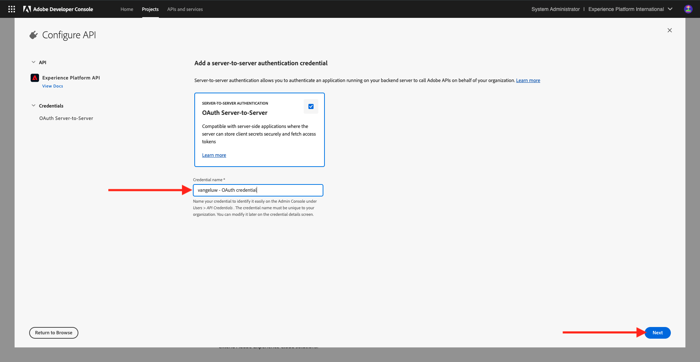
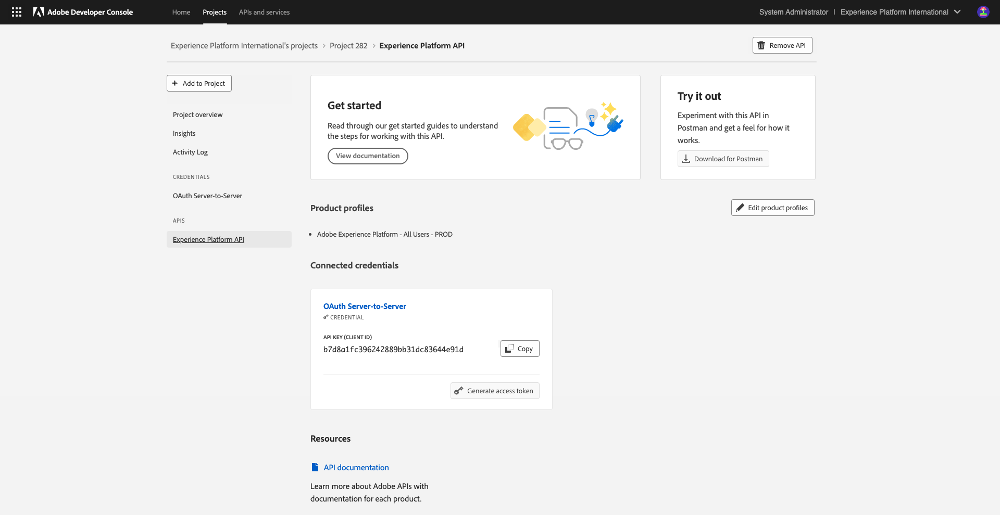

# 2.1.3可视化您自己的实时客户个人资料 — API

在本练习中，您将使用Postman和Adobe I/O查询Adobe Experience Platform的API，以查看您自己的实时客户个人资料。

## 上下文

在实时客户个人资料中，所有个人资料数据都与事件数据以及现有受众成员资格一起显示。 所显示的数据可以来自任何地方，包括Adobe应用程序和外部解决方案。 这是Adobe Experience Platform中最强大的视图，体验记录体系。

实时客户配置文件可供所有Adobe应用程序使用，也可以供呼叫中心或店内客户通信应用程序等外部解决方案使用。 要执行此操作，您需要将这些外部解决方案连接到Adobe Experience Platform的API。

## 您的标识符

在网站上的“配置文件查看器”面板上，您可以找到多个身份。 每个身份都链接到命名空间。


在X-Ray面板上，我们可以看到4种不同的ID和命名空间组合：

| 标识 | 命名空间 |
|:-------------:| :---------------:|
| Experience CloudID (ECID) | 79943948563923140522865572770524243489 |
| Experience CloudID (ECID) | 70559351147248820114888181867542007989 |
| 电子邮件ID | woutervangeluwe+18112024-01@gmail.com |
| 手机号码ID | +32473622044+18112024-01 |

请记住这些标识符以便执行下一步。

## 配置Adobe I/O项目

在本练习中，您将集中使用Adobe I/O来针对平台的API进行查询。 请按照以下步骤设置Adobe I/O。

转到[https://developer.adobe.com/console/home](https://developer.adobe.com/console/home)


请确保在屏幕右上角选择正确的Adobe Experience Platform实例。 您的实例为`--aepImsOrgName--`。 单击&#x200B;**新建项目**。


选择&#x200B;**+添加到项目**&#x200B;并选择&#x200B;**API**。


您随后将看到以下内容：


选择&#x200B;**Experience PlatformAPI**&#x200B;并单击&#x200B;**下一步**。


您现在将看到此内容。 为您的凭据提供一个名称： `--aepUserLdap-- - OAuth credential`。 单击&#x200B;**下一步**。



接下来，您需要选择一个产品配置文件，该配置文件将定义此集成可用的权限。

选择所需的产品配置文件。

>[!NOTE]
>
> 由于产品配置文件名称因实例而异，因此在您的Adobe Experience Platform实例中将有所不同。 您需要至少选择一个具有适当访问权限的产品配置文件，这些权限是在Adobe Admin Console和AEP权限UI中设置的。

单击&#x200B;**保存配置的API**。


您的Adobe I/O集成现已准备就绪。



单击“**Postman下载**”按钮，然后单击“**OAuth服务器到服务器**”以下载Postman环境（请等待该环境下载完毕，这可能需要几秒钟的时间）。


您的IO项目当前具有通用名称。 您需要为集成提供一个友好名称。 按指示单击&#x200B;**项目X**（或类似名称）


单击&#x200B;**编辑项目**。


输入集成的“名称”和“说明”： `--aepUserLdap-- AEP Tutorial`。

单击&#x200B;**保存**。


您的Adobe I/O集成现已完成。


>[!NOTE]
>
>还有一个额外的步骤可确保此Adobe I/O项目可以访问Adobe Experience Platform的权限设置。 项目的API凭据需要添加到Adobe Experience Platform的权限UI中，为此，需要系统管理员访问权限。 这些步骤记录如下，但如果您没有所需的访问权限，可能需要联系系统管理员为您处理这些步骤。

## API凭据的AEP权限

转到[Adobe Experience Platform](https://experience.adobe.com/platform)。 登录后，您将登录到Adobe Experience Platform的主页。

转到&#x200B;**权限**、**角色**，然后单击相关的产品配置文件。

>[!NOTE]
>
> 由于产品配置文件名称因实例而异，因此在您的Adobe Experience Platform实例中将有所不同。 您需要至少选择一个具有适当访问权限的产品配置文件，这些权限是在Adobe Admin Console和AEP权限UI中设置的。


单击&#x200B;**API凭据**。


单击&#x200B;**+添加API凭据**。


选择新创建的Adobe I/O项目并单击&#x200B;**保存**。


## 对Adobe I/O进行Postman身份验证

转到[https://www.postman.com/downloads/](https://www.postman.com/downloads/)。

下载并安装适用于您的操作系统的Postman的相关版本。


安装Postman后，启动应用程序。

在Postman中，有2个概念：环境和收藏集。

- 环境包含所有比较一致或不太一致的环境变量。 在该环境中，您可以找到我们的Platform环境的IMSOrg等内容，以及您的私钥和其他安全凭据。 环境文件是您在上一个练习的Adobe I/O设置过程中下载的文件，其名称如下： **`oauth_server_to_server.postman_environment.json`**。

- 收藏集包含大量您可以使用的API请求。 我们将使用2个收藏集
   - 1个集合用于Adobe I/O的身份验证
   - 1本模块中的练习的集合
   - 用于Real-Time CDP模块中练习的1个集合，用于目标创作

请将文件[postman.zip](./../../../assets/postman/postman_profile.zip)下载到您的本地桌面。

在此&#x200B;**postman.zip**&#x200B;文件中，您将找到以下文件：

- `Adobe IO - OAuth.postman_collection.json`
- `AEP Tutorial.postman_collection.json`
- `Destination_Authoring_API.json`

解压缩&#x200B;**postman.zip**&#x200B;文件，并将这3个文件以及从Adobe I/O下载的Postman环境存储在您桌面上的文件夹中。您需要在该文件夹中包含以下4个文件：


返回Postman。 单击&#x200B;**导入**。


单击&#x200B;**文件**。


导航到桌面上解压缩4个已下载文件的文件夹。 同时选择这4个文件，然后单击&#x200B;**打开**。


单击&#x200B;**打开**&#x200B;后，Postman将向您显示要导入的环境和收藏集的概述。 单击&#x200B;**导入**。


您现在拥有Postman中开始通过API与Adobe Experience Platform交互所需的一切。

首先要做的是确保您正确通过了身份验证。 要进行身份验证，您需要请求访问令牌。

在执行任何请求之前，请确保选择了正确的环境。 您可以通过验证右上角的环境下拉列表来检查当前选定的环境。

所选环境的名称应与此名称类似，`--aepUserLdap-- OAuth Credential`。


您的Postman环境和收藏集现已配置完毕，可正常使用。 您现在可以从Postman向Adobe I/O进行身份验证。

在&#x200B;**AdobeIO - OAuth**&#x200B;集合中，选择名为&#x200B;**POST — 获取访问令牌**&#x200B;的请求。 单击&#x200B;**发送**。


几秒钟后，您应该会在Postman的&#x200B;**Body**&#x200B;部分中看到一个响应：


如果配置成功，您应该会看到包含以下信息的类似响应：

| 键 | 值 |
|:-------------:| :---------------:| 
| token_type | **持有人** |
| access_token | **eyJhbGciOiJSU...jrNZ6mdaQ** |
| expires_in | **86399** |

Adobe I/O为您提供了&#x200B;**持有者** — 令牌，该令牌具有特定值（非常长的access_token）和到期窗口。

我们收到的令牌现在有24小时有效。 这意味着24小时后，如果您要使用Postman对Adobe I/O进行身份验证，则必须通过再次运行此请求来生成新令牌。

## Real-time Customer Profile API，架构：配置文件

现在，您可以将第一个请求发送到Platform的实时客户档案API。

在Postman中，找到收藏集&#x200B;**AEP教程**。


在&#x200B;**1中。 统一配置文件服务**，单击名为&#x200B;**UPS的第一个请求 — 按实体ID和NS**&#x200B;的GET配置文件。


对于此请求，有三个必需的变量：

| 键 | 值 | 定义 |
|:-------------:| :---------------:| :---------------:| 
| entityId | **id** | 特定客户ID |
| entityIdNS | **命名空间** | 适用于ID的特定命名空间 |
| schema.name | **_xdm.context.profile** | 您希望接收其信息的特定架构 |

因此，如果您希望要求Adobe Experience Platform的API将您自己的ECID的所有配置文件信息返回给您，您需要按如下方式配置请求：

| 键 | 值 |
|:-------------:| :---------------:| 
| entityId | **您的ECID** |
| entityIdNS | **ecid** |
| schema.name | **_xdm.context.profile** |


您还应验证请求的&#x200B;**标头** — 字段。 转到&#x200B;**标头**。 您随后将看到以下内容：


>[!NOTE]
>
>您需要指定正在使用的Adobe Experience Platform沙盒的名称。 您的x-sandbox-name应为`--aepSandboxName--`。

| 键 | 值 |
| ----------- | ----------- |
| x-sandbox-name | `--aepSandboxName--` |


检查沙盒名称后，单击&#x200B;**发送**&#x200B;以将请求发送到Platform。

您应会立即收到Platform的响应，并显示如下所示的内容：


这是来自Platform的完整响应：

```javascript
{
    "A2_ETHkJxMvxbiEmIZlAj8Qn": {
        "entityId": "A2_ETHkJxMvxbiEmIZlAj8Qn",
        "mergePolicy": {
            "id": "64e4b0ed-dfc3-4084-8e67-643e977168d7"
        },
        "sources": [
            "672a10cdb015162aefedfc0f",
            "672a10b1a05e282aee19737c"
        ],
        "tags": [
            "0938B898-469A-4513-8E86-87464307120F:va7",
            "3ba34930-405e-4b31-aafa-bac22d35203e:va7"
        ],
        "identityGraph": [
            "G7z3JAFBY4I6Rzg",
            "A2_ETHkJxMvxbiEmIZlAj8Qn",
            "BkFvK4QcJpSPByuDGF4UAS0wMQ",
            "BUF9zMKLrXq72p4HpbsHv1SDGF4UAS0wMUBnbWFpbC5jb20",
            "A29btmFXmrfrYbXQWISCT9ZD"
        ],
        "entity": {
            "_experienceplatform": {
                "identification": {
                    "core": {
                        "ecid": "79943948563923140522865572770524243489",
                        "phoneNumber": "+32473622044+18112024-01",
                        "email": "woutervangeluwe+18112024-01@gmail.com"
                    }
                }
            },
            "userAccount": {
                "ID": "3688250"
            },
            "pushNotificationDetails": [
                {
                    "denylisted": false,
                    "token": "2E0945F186CE5ED8CBFD1EB519A8CF38BA2B28A67FB381D45AA15EE37D289214",
                    "identity": {
                        "namespace": {
                            "code": "ECID"
                        },
                        "id": "70559351147248820114888181867542007989"
                    },
                    "platform": "apns",
                    "appID": "com.adobe.demosystem.dxdemo"
                }
            ],
            "personalEmail": {
                "address": "woutervangeluwe+18112024-01@gmail.com"
            },
            "_repo": {
                "createDate": "2024-11-18T10:39:12.296Z"
            },
            "extSourceSystemAudit": {
                "lastUpdatedDate": "2024-11-19T07:46:52.001Z"
            },
            "testProfile": true,
            "mobilePhone": {
                "number": "+32473622044"
            },
            "consents": {
                "metadata": {
                    "time": "2024-11-19T07:46:52.001Z"
                },
                "idSpecific": {
                    "ECID": {
                        "70559351147248820114888181867542007989": {
                            "collect": {
                                "val": "y"
                            }
                        }
                    }
                }
            },
            "person": {
                "name": {
                    "lastName": "Van Geluwe",
                    "firstName": "Wouter"
                }
            },
            "userActivityRegions": {
                "IRL1": {
                    "captureTimestamp": "2024-11-19T07:46:51.239Z"
                }
            },
            "identityMap": {
                "ecid": [
                    {
                        "id": "70559351147248820114888181867542007989"
                    },
                    {
                        "id": "79943948563923140522865572770524243489"
                    }
                ],
                "email": [
                    {
                        "id": "woutervangeluwe+18112024-01@gmail.com"
                    }
                ],
                "phone": [
                    {
                        "id": "+32473622044+18112024-01"
                    }
                ],
                "userid": [
                    {
                        "id": "3688250"
                    }
                ]
            }
        },
        "lastModifiedAt": "2024-11-19T07:47:23Z"
    }
}
```

当前是Platform中此ECID的所有可用配置文件数据。

您无需使用ECID从Platform的Real-time Customer Profile请求配置文件数据，您可以使用任何命名空间中的任何ID来请求此数据。

让我们返回Postman并假装我们是呼叫中心，然后向Platform发送一个请求，其中指定了&#x200B;**Phone**&#x200B;的命名空间和您的手机号码。

因此，如果您希望要求Platform的API将特定电话的所有配置文件信息返回给您，您需要按如下方式配置请求：

| 键 | 值 |
|:-------------:| :---------------:| 
| entityId | **您的电话号码** |
| entityIdNS | **phone** （用电话替换ecid） |
| schema.name | **_xdm.context.profile** |

如果您的电话号码包含&#x200B;**+**&#x200B;等特殊符号，则必须选择完整的电话号码，单击鼠标右键并单击&#x200B;**EncodeURIComponent**。


然后，您将拥有以下权限：


您还应验证请求的&#x200B;**标头** — 字段。 转到&#x200B;**标头**。 您随后将看到以下内容：


>[!NOTE]
>
>您需要指定正在使用的Adobe Experience Platform沙盒的名称。 您的x-sandbox-name应为`--aepSandboxName--`。

| 键 | 值 |
| ----------- | ----------- |
| x-sandbox-name | `--aepSandboxName--` |


单击&#x200B;**发送**&#x200B;并验证响应，您将看到响应与使用ECID作为标识时相同。


让我们通过指定&#x200B;**email**&#x200B;的命名空间和您的电子邮件地址，对您的电子邮件地址执行相同的操作。

因此，如果您希望要求Platform的API将特定电子邮件地址的所有配置文件信息返回给您，则需要按如下方式配置请求：

| 键 | 值 |
|:-------------:| :---------------:| 
| entityId | **您的电子邮件** |
| entityIdNS | **电子邮件** （将电话替换为电子邮件） |
| schema.name | **_xdm.context.profile** |

如果您的电子邮件地址包含&#x200B;**+**&#x200B;等特殊符号，则必须选择完整的电子邮件地址，单击鼠标右键并单击&#x200B;**EncodeURIComponent**。


然后，您将拥有以下权限：


您还应验证请求的&#x200B;**标头** — 字段。 转到&#x200B;**标头**。 您随后将看到以下内容：

>[!NOTE]
>
>您需要指定正在使用的Adobe Experience Platform沙盒的名称。 您的x-sandbox-name应为`--aepSandboxName--`。


| 键 | 值 |
| ----------- | ----------- |
| x-sandbox-name | `--aepSandboxName--` |

单击&#x200B;**发送**&#x200B;并验证响应，您会再次看到与之前相同的响应（包含ECID和电话号码）。


这是提供给品牌的一种非常重要的灵活性。 这意味着任何环境都可以使用自己的ID和命名空间向Platform发送请求，而无需了解多个命名空间和ID的复杂性。

例如：

- 呼叫中心可以使用命名空间&#x200B;**phone**&#x200B;从Platform请求数据
- 忠诚度系统可使用命名空间&#x200B;**电子邮件**&#x200B;从平台请求数据
- 联机应用程序可以使用命名空间&#x200B;**ecid**

呼叫中心不一定知道忠诚度系统中使用了哪种标识符，忠诚度系统也不一定知道在线应用程序使用了哪种标识符。 每个系统都可以使用自己拥有和理解的信息在需要时获取所需的信息。

## 实时客户个人资料API、架构：个人资料和ExperienceEvent

成功查询了平台的API以查找配置文件数据后，现在让我们对ExperienceEvent数据执行相同的操作。

在Postman中，找到收藏集&#x200B;**AEP教程**。


在&#x200B;**1中。 统一配置文件服务**，请选择名称为&#x200B;**UPS的第二个请求 — 按实体ID和NS**&#x200B;列出的GET配置文件和EE。


对于此请求，有四个必需变量：

| 键 | 值 | 定义 |
|:-------------:| :---------------:|  :---------------:| 
| schema.name | **_xdm.context.experienceevent** | 您希望接收其信息的特定架构。 在本例中，我们要查找映射到ExperienceEvent架构的数据。 |
| relatedSchema.name | **_xdm.context.profile** | 在查找映射到ExperienceEvent架构的数据时，我们需要指定要接收该数据的标识。 有权访问身份的架构是Profile-schema，因此此处的relatedSchema是Profile-schema。 |
| relatedEntityId | **id** | 特定客户ID |
| relatedentityidNS | **命名空间** | 适用于ID的特定命名空间 |

因此，如果您希望请求平台的API将您自己的ecid的所有配置文件信息返回给您，您需要按如下方式配置请求：

| 键 | 值 |
|:-------------:| :---------------:| 
| schema.name | **_xdm.context.experienceevent** |
| relatedSchema.name | **_xdm.context.profile** |
| relatedEntityId | **您的ECID** |
| relatedentityidNS | **ecid** |


您还应验证请求的&#x200B;**标头** — 字段。 转到&#x200B;**标头**。 您随后将看到以下内容：


>[!NOTE]
>
>您需要指定正在使用的Adobe Experience Platform沙盒的名称。 您的x-sandbox-name应为`--aepSandboxName--`。

| 键 | 值 |
| ----------- | ----------- |
| x-sandbox-name | `--aepSandboxName--` |

单击&#x200B;**发送**&#x200B;以将您的请求发送到Platform。

您应会立即收到Platform的响应，并显示如下所示的内容：


以下是来自Platform的完整响应。 在此示例中，有八个ExperienceEvents关联到该客户的ECID。 请查看下方以了解请求中的不同变量，因为下方是您在前几个练习中配置Launch的直接后果。

此外，当X-ray面板显示ExperienceEvent信息时，它使用以下有效负载解析和检索信息，如产品名称（在下面有效负载中搜索productName）和产品图像URL（在下面有效负载中搜索productImageUrl）。

```javascript
{
    "_page": {
        "orderby": "timestamp",
        "start": "b1325606-9b96-4e51-b7dd-73aacf527c72-0",
        "count": 14,
        "next": ""
    },
    "children": [
        {
            "relatedEntityId": "A2_ETHkJxMvxbiEmIZlAj8Qn",
            "entityId": "b1325606-9b96-4e51-b7dd-73aacf527c72-0",
            "sourceId": "672a10b1074ceb2af0aa7034",
            "timestamp": 1731923802848,
            "entity": {
                "environment": {
                    "ipV4": "141.134.241.99",
                    "type": "browser",
                    "browserDetails": {
                        "userAgentClientHints": {
                            "mobile": false,
                            "platform": "macOS",
                            "brands": [
                                {
                                    "brand": "Chromium",
                                    "version": "130"
                                },
                                {
                                    "brand": "Google Chrome",
                                    "version": "130"
                                },
                                {
                                    "brand": "Not?A_Brand",
                                    "version": "99"
                                }
                            ]
                        },
                        "userAgent": "Mozilla/5.0 (Macintosh; Intel Mac OS X 10_15_7) AppleWebKit/537.36 (KHTML, like Gecko) Chrome/130.0.0.0 Safari/537.36",
                        "viewportHeight": 992,
                        "viewportWidth": 1920
                    }
                },
                "web": {
                    "webPageDetails": {
                        "name": "Home",
                        "viewName": "Home",
                        "pageViews": {
                            "value": 1
                        },
                        "URL": "https://dsn.adobe.com/web/vangeluw-QIMU"
                    },
                    "webReferrer": {
                        "URL": "https://auth.services.adobe.com/"
                    }
                },
                "_experienceplatform": {
                    "interactionDetails": {
                        "core": {
                            "channel": "web"
                        }
                    },
                    "demoEnvironment": {
                        "brandName": "vangeluw-QIMU"
                    },
                    "identification": {
                        "core": {
                            "ecid": "79943948563923140522865572770524243489"
                        }
                    }
                },
                "implementationDetails": {
                    "name": "https://ns.adobe.com/experience/alloy/reactor",
                    "version": "2.24.0+2.27.0",
                    "environment": "browser"
                },
                "identityMap": {
                    "ECID": [
                        {
                            "id": "79943948563923140522865572770524243489",
                            "authenticatedState": "ambiguous",
                            "primary": true
                        }
                    ]
                },
                "eventType": "web.webpagedetails.pageViews",
                "_id": "b1325606-9b96-4e51-b7dd-73aacf527c72-0",
                "placeContext": {
                    "localTime": "2024-11-18T10:56:42.848+01:00",
                    "localTimezoneOffset": -60
                },
                "device": {
                    "screenOrientation": "landscape",
                    "screenWidth": 1920,
                    "screenHeight": 1080
                },
                "timestamp": "2024-11-18T09:56:42.848Z"
            },
            "lastModifiedAt": "2024-11-18T09:56:45Z"
        },
    "_links": {
        "next": {
            "href": ""
        }
    }
}
```

这是此ECID当前在Platform中所有可用的ExperienceEvent数据。

您无需使用ECID从Adobe Experience Platform的实时配置文件中请求ExperienceEvent数据，您可以使用任何命名空间中的任何ID来请求此数据。

下一步：[2.1.4创建受众 — UI](./ex4.md)

[返回模块2.1](./real-time-customer-profile.md)

[返回所有模块](../../../overview.md)
