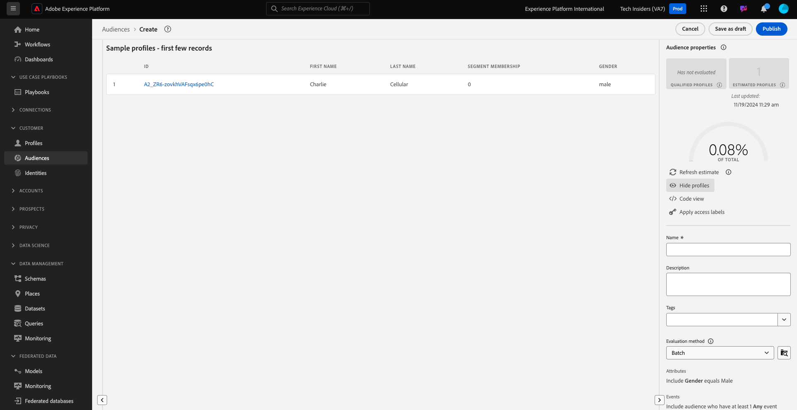

# 2.1.4创建受众 — UI

在本练习中，您将使用Adobe Experience Platform的Audience Builder创建一个受众。

转到[Adobe Experience Platform](https://experience.adobe.com/platform)。 登录后，您将登录到Adobe Experience Platform的主页。


在继续之前，您需要选择一个&#x200B;**沙盒**。 要选择的沙盒名为``--aepSandboxName--``。 选择适当的[!UICONTROL 沙盒]后，您将看到屏幕更改，现在您已经进入专用的[!UICONTROL 沙盒]。


在左侧的菜单中，转到&#x200B;**受众**。 在此页面上，您可以看到所有现有受众的概述。 单击&#x200B;**+创建受众**&#x200B;按钮开始创建新受众。


选择&#x200B;**生成规则**&#x200B;并单击&#x200B;**创建**。


进入新的受众生成器后，您会立即注意到&#x200B;**属性**&#x200B;菜单选项和&#x200B;**XDM个人资料**&#x200B;引用。


由于XDM是支持体验业务的语言，因此XDM也是受众生成器的基础。 在Platform中引入的所有数据都应根据XDM进行映射，因此，无论数据来自何处，所有数据都会成为同一数据模型的一部分。 这为您在构建受众时提供了很大的优势，因为从这个受众生成器UI中，您可以在同一个工作流中组合来自任何来源的数据。 在Audience Builder中构建的受众可以发送到Adobe Target、Adobe Campaign和Adobe Audience Manager等解决方案进行激活。

让我们构建一个受众，其中包含所有&#x200B;**男性**&#x200B;客户。

要获得性别属性，您需要了解和了解XDM。

性别是“人员”的一个属性，可在“属性”下找到。 为此，请先单击&#x200B;**XDM个人资料**。 你会看到这个。 从&#x200B;**XDM Individual Profile**&#x200B;窗口中，选择&#x200B;**人员**。


你会看到这个。 在&#x200B;**人员**&#x200B;中，您可以找到&#x200B;**性别**&#x200B;属性。 将“性别”属性拖动到受众生成器中。


现在，您可以从预填充选项中选择特定的性别。 在这种情况下，让我们选择&#x200B;**男性**。


选择&#x200B;**男性**&#x200B;后，您可以通过按&#x200B;**刷新估算**&#x200B;按钮获得受众群体的估算。 这对于企业用户非常有用，因此他们可以了解某些属性对生成的受众规模的影响。


然后，您将看到如下所示的估计：


接下来，您应该对受众进行一些细化。 您需要构建已查看产品&#x200B;**iPhone 15 Pro**&#x200B;的所有男性客户的受众。

要构建此受众，您需要添加一个体验事件。 单击&#x200B;**字段**&#x200B;菜单栏中的&#x200B;**事件**&#x200B;图标可找到所有Experience Events。 接下来，您将看到顶级&#x200B;**XDM ExperienceEvents**&#x200B;节点。 单击&#x200B;**XDM ExperienceEvent**。


转到&#x200B;**产品列表项**。


选择&#x200B;**Name**&#x200B;并从左侧菜单将&#x200B;**Name**&#x200B;对象拖放到受众生成器画布上的&#x200B;**事件**&#x200B;部分。


您随后将看到以下内容：


比较参数应为&#x200B;**等于**，并在输入字段中输入&#x200B;**iPhone 15 Pro**。


每次将元素添加到受众生成器时，都可以单击&#x200B;**刷新估算**&#x200B;按钮以获取受众中群体的最新估算。

到目前为止，您仅使用UI构建受众，但还有一个代码选项可用于构建受众。

构建受众时，您实际上是在构建Profile Query Language (PQL)查询。 要可视化PQL代码，您可以单击受众生成器右上角的&#x200B;**代码视图**&#x200B;切换器。


现在，您可以看到完整的PQL声明：

```sql
person.gender in ["male"] and CHAIN(xEvent, timestamp, [C0: WHAT(productListItems.exists(name.equals("iPhone 15 Pro", false)))])
```

您还可以通过单击&#x200B;**查看配置文件**，预览属于此受众的客户配置文件示例。



最后，让我们为您的受众命名，
将&#x200B;**评估方法**&#x200B;设置为&#x200B;**流式传输**，然后单击&#x200B;**Publish**。

作为命名约定，请使用：

- `--aepUserLdap-- - Male customers with interest in iPhone 15 Pro`


您将返回到受众概述页面。


下一步：[2.1.5在呼叫中心查看您的实时客户档案](./ex5.md)

[返回模块2.1](./real-time-customer-profile.md)

[返回所有模块](../../../overview.md)
