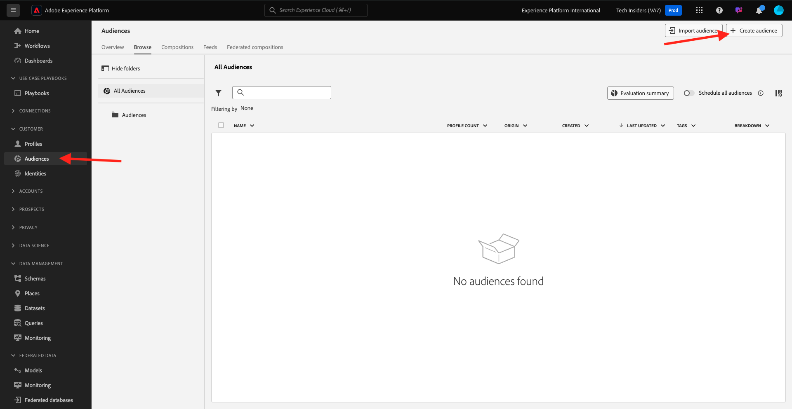

# 2.1.4创建区段 — UI

在本练习中，您将使用Adobe Experience Platform的区段生成器创建一个区段。

## Story

转到[Adobe Experience Platform](https://experience.adobe.com/platform)。 登录后，您将登录到Adobe Experience Platform的主页。


在继续之前，您需要选择一个&#x200B;**沙盒**。 要选择的沙盒名为``--aepSandboxName--``。 您可以通过单击屏幕顶部蓝线中的文本&#x200B;**[!UICONTROL Production Prod]**&#x200B;来执行此操作。 选择适当的[!UICONTROL 沙盒]后，您将看到屏幕更改，现在您已经进入专用的[!UICONTROL 沙盒]。


在左侧的菜单中，转到&#x200B;**区段**。 在此页面上，您可以看到所有现有区段的概述。 单击&#x200B;**+创建区段**&#x200B;按钮开始创建新区段。



进入新的区段生成器后，您会立即注意到&#x200B;**Attributes**&#x200B;菜单选项和&#x200B;**XDM个人资料**&#x200B;引用。


由于XDM是支持体验业务的语言，因此XDM也是区段生成器的基础。 在Platform中引入的所有数据都应根据XDM进行映射，因此，无论数据来自何处，所有数据都会成为同一数据模型的一部分。 这为您在构建区段时提供了很大的优势，因为从这个区段生成器UI中，您可以在同一个工作流中组合来自任何源的数据。 在Segment Builder中构建的区段可以发送到Adobe Target、Adobe Campaign和Adobe Audience Manager等解决方案进行激活。

让我们构建一个包含所有&#x200B;**男性**&#x200B;客户的区段。

要获得性别属性，您需要了解和了解XDM。

性别是“人员”的一个属性，可在“属性”下找到。 为此，请先单击&#x200B;**XDM个人资料**。 你会看到这个。 从&#x200B;**XDM Individual Profile**&#x200B;窗口中，选择&#x200B;**人员**。


你会看到这个。 在&#x200B;**人员**&#x200B;中，您可以找到&#x200B;**性别**&#x200B;属性。 将“性别”属性拖动到区段生成器中。


现在，您可以从预填充选项中选择特定的性别。 在这种情况下，让我们选择&#x200B;**男性**。


选择&#x200B;**男性**&#x200B;后，您可以通过按&#x200B;**刷新估算**&#x200B;按钮获得区段群体的估算。 这对于企业用户非常有用，因为他们可以查看特定属性对生成区段大小的影响。


然后，您将看到如下所示的估计：


接下来，您应该对区段进行一些优化。 您需要构建已查看产品&#x200B;**Proteus Fitness Jackshirt (Orange)**&#x200B;的所有男性客户的区段。

要构建此区段，您需要添加一个体验事件。 单击&#x200B;**字段**&#x200B;菜单栏中的&#x200B;**事件**&#x200B;图标可找到所有Experience Events。


接下来，您将看到顶级&#x200B;**XDM ExperienceEvents**&#x200B;节点。 单击&#x200B;**XDM ExperienceEvent**。


转到&#x200B;**产品列表项**。


选择&#x200B;**Name**&#x200B;并从左侧菜单将&#x200B;**Name**&#x200B;对象拖放到区段生成器画布中的&#x200B;**事件**&#x200B;部分。


您随后将看到以下内容：


比较参数应为&#x200B;**等于**，并在输入字段中输入&#x200B;**MONTANA WIND JACKET**。


每次将元素添加到区段生成器时，都可以单击&#x200B;**刷新估算**&#x200B;按钮以获取区段中的群体新估算。

到目前为止，您仅使用UI生成区段，但还有一个代码选项可用于生成区段。

构建区段时，您实际上是构成了Profile Query Language (PQL)查询。 要可视化PQL代码，您可以单击区段生成器右上角的&#x200B;**代码视图**&#x200B;切换器。


现在，您可以看到完整的PQL声明：

```sql
person.gender in ["male"] and CHAIN(xEvent, timestamp, [C0: WHAT(productListItems.exists(name.equals("MONTANA WIND JACKET", false)))])
```

您还可以通过单击&#x200B;**查看配置文件**，预览此区段中包含的客户配置文件示例。


最后，让我们为您的区段命名并保存它。

作为命名约定，请使用：

- `--aepUserLdap-- - Male customers with interest in Montana Wind Jacket`


然后，单击&#x200B;**保存并关闭**&#x200B;按钮以保存您的区段，之后您将返回到区段概述页面。


您现在可以继续下一个练习，并通过API构建区段。

下一步：[2.1.5创建区段 — API](./ex5.md)

[返回模块2.1](./real-time-customer-profile.md)

[返回所有模块](../../../overview.md)
