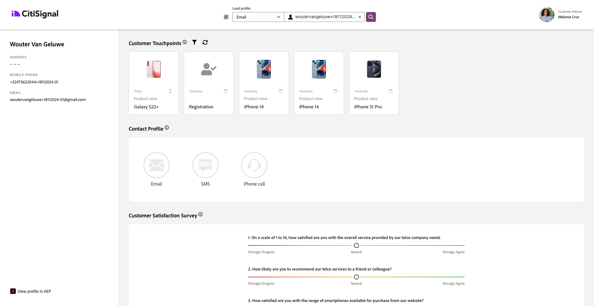

# 2.1.6在呼叫中心查看您的实时客户资料

在本练习中，目标是让您逐步了解客户历程，并像真实客户一样操作。

在此网站上，我们实施了Adobe Experience Platform。 每个操作都被视为体验事件，实时发送到Adobe Experience Platform，以补充实时客户资料。

在之前的练习中，你最初是一个匿名客户，在浏览网站后，经过几个步骤，你成为了一个已知客户。

当同一客户最终接听电话并致电您的呼叫中心时，能够立即获得其他渠道的信息至关重要，这样呼叫中心体验才能变得相关和个性化。

## 2.1.6.1使用您的CX App

作为演示系统的一部分，我们创建了一个CX应用程序模板，此模板可用于模拟呼叫中心环境。 按照以下步骤创建此类CX App项目。

转到[https://builder.adobedemo.com/projects](https://builder.adobedemo.com/projects)。 单击&#x200B;**新建项目**。

然后，您将看到您的CX App项目。 单击项目以将其打开。

在您的CX App项目中，转到&#x200B;**集成**。 选择在模块0中创建的Adobe Experience Platform数据收集属性。 您需要选择名称中具有&#x200B;**（启用）**&#x200B;的属性。 然后，单击&#x200B;**运行**。

你会看到这个。

在“配置文件查看器”面板上，您可以看到ID和命名空间的以下组合：

| 标识 | 命名空间 |
|:-------------:| :---------------:|
| Experience CloudID (ECID) | 12507560687324495704459439363261812234 |
| 电子邮件ID | woutervangeluwe+06022022-01@gmail.com |
| 手机号码ID | +32473622044+06022022-01 |

当客户致电您的呼叫中心时，可以使用电话号码来识别客户。 因此，在本练习中，您将使用该电话号码在CX应用程序中检索客户的配置文件。

在下拉列表中选择&#x200B;**电话号码**，然后输入您在网站上使用的电话号码。 按&#x200B;**Enter**。

现在，您会看到最好显示在呼叫中心中的信息，以便呼叫中心员工在与客户交谈时能够立即获得所有相关信息。

下一步：[摘要和优点](./summary.md)

[返回模块2.1](./real-time-customer-profile.md)

[返回所有模块](../../../overview.md)
