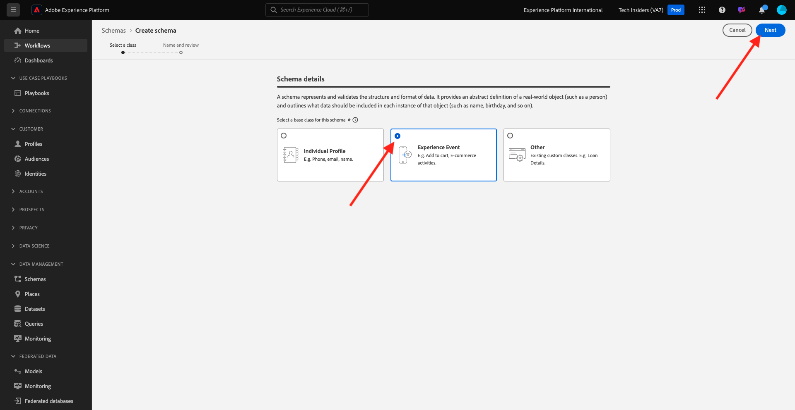
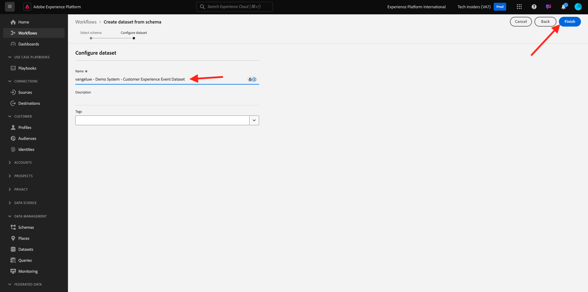

# 2.2.1客户人工智能 — 数据准备（引入）

为了使智能服务从营销事件数据中发掘洞察信息，必须在语义上丰富并维护标准结构中的数据。 智能服务利用Adobe的体验数据模型(XDM)架构来实现这一点。
具体而言，在智能服务中使用的所有数据集都必须符合**使用者体验事件** XDM架构。

## 创建架构

在本练习中，您将创建一个包含&#x200B;**消费者体验事件mixin**&#x200B;的架构，它是&#x200B;**客户人工智能**&#x200B;智能服务所必需的。

通过转到以下URL登录Adobe Experience Platform： [https://experience.adobe.com/platform](https://experience.adobe.com/platform)。

登录后，您将登录到Adobe Experience Platform的主页。

在继续之前，您需要选择一个&#x200B;**沙盒**。 要选择的沙盒名为``--aepSandboxName--``。 选择相应的沙盒后，您将看到屏幕变化，现在您位于专用沙盒中。

从左侧菜单中，单击&#x200B;**架构**&#x200B;并转到&#x200B;**浏览**。 单击&#x200B;**创建架构**。

在弹出窗口中，选择&#x200B;**手动**&#x200B;并单击&#x200B;**选择**。

接下来，选择&#x200B;**体验事件**，然后单击&#x200B;**下一步**。

您需要立即为架构提供一个名称。 作为架构的名称，请使用以下名称： `--aepUserLdap-- - Demo System - Customer Experience Event`并单击&#x200B;**完成**。

你会看到这个。 单击“字段组”下的&#x200B;**+添加**。

搜索并选择以下&#x200B;**字段组**&#x200B;以添加到此架构：

- 使用者体验事件
- 最终用户 ID 详细信息

单击&#x200B;**添加字段组**。

你会看到这个。 单击字段组&#x200B;**最终用户ID详细信息**。

导航到字段&#x200B;**endUserIDs。_experience.emailid.id**。

在字段&#x200B;**endUserIDs的右菜单中。_experience.emailid.id**，向下滚动并选中&#x200B;**标识**&#x200B;的复选框，选中&#x200B;**主要标识**&#x200B;的复选框，并选择&#x200B;**电子邮件**&#x200B;的&#x200B;**标识命名空间**。 单击&#x200B;**应用**。

导航到字段&#x200B;**endUserIDs。_experience.mcid.id**。 选中&#x200B;**Identity**&#x200B;的复选框，然后选择&#x200B;**ECID**&#x200B;的&#x200B;**Identity命名空间**。 单击&#x200B;**应用**。

你就能拥有这个了。 接下来，选择架构的名称。 您现在应通过单击&#x200B;**配置文件**&#x200B;切换来启用&#x200B;**配置文件**&#x200B;的架构。

你会看到这个。 单击&#x200B;**启用**。

您现在应该拥有此项。 单击&#x200B;**保存**&#x200B;以保存您的架构。

## 创建数据集

从左侧菜单中，单击&#x200B;**数据集**&#x200B;并转到&#x200B;**浏览**。 单击&#x200B;**创建数据集**。

单击&#x200B;**从架构创建数据集**。

在下一个屏幕中，选择您在上一个练习中创建的数据集，其名称为&#x200B;**[!UICONTROL ldap - Demo System - Customer Experience Event]**。 单击&#x200B;**下一步**。

作为数据集的名称，请使用`--aepUserLdap-- - Demo System - Customer Experience Event Dataset`。 单击&#x200B;**完成**。

您的数据集现已创建。 启用&#x200B;**配置文件**&#x200B;切换。

单击&#x200B;**启用**。

您现在应该拥有以下权限：

您现在可以开始摄取消费者体验事件数据并开始使用客户人工智能服务。

## 下载体验事件测试数据

在配置&#x200B;**架构**&#x200B;和&#x200B;**数据集**&#x200B;后，您现在可以摄取体验事件数据了。 由于客户人工智能至少需要&#x200B;**2个季度中的**&#x200B;的数据，因此您将需要摄取外部准备的数据。

为体验事件准备的数据必须符合[使用者体验事件XDM Mixin](https://github.com/adobe/xdm/blob/797cf4930d5a80799a095256302675b1362c9a15/docs/reference/context/experienceevent-consumer.schema.md)的要求和架构。

请从以下位置下载包含示例数据的文件： [https://dashboard.adobedemo.com/data](https://dashboard.adobedemo.com/data)。 单击&#x200B;**下载**&#x200B;按钮。

或者，如果您无法访问上述链接，也可以从以下位置下载文件： [https://aepmodule10.s3-us-west-2.amazonaws.com/retail-v1-dec2020-xl.json.zip](https://aepmodule10.s3-us-west-2.amazonaws.com/retail-v1-dec2020-xl.json.zip)。

您现在已下载名为&#x200B;**retail-v1-dec2020-xl.json.zip**&#x200B;的文件。 将文件放在计算机的桌面上并解压缩，之后您将看到名为&#x200B;**retail-v1.json**&#x200B;的文件。 在下一个练习中将需要此文件。

## 摄取体验事件测试数据

在Adobe Experience Platform中，转到&#x200B;**数据集**&#x200B;并打开名为&#x200B;**[!UICONTROL ldap - Demo System - Customer Experience Event数据集]**&#x200B;的数据集。

在数据集中，单击&#x200B;**选择文件**&#x200B;以添加数据。

在弹出窗口中，选择文件&#x200B;**retail-v1.json**，然后单击&#x200B;**打开**。

然后，您将看到正在导入的数据，并会在&#x200B;**正在加载**&#x200B;状态下创建新批次。 在上传文件之前，请勿导航离开此页面。

上传文件后，您会看到批次状态从&#x200B;**正在加载**&#x200B;更改为&#x200B;**正在处理**。

摄取和处理数据可能需要10-20分钟。

数据摄取成功后，批次状态将更改为&#x200B;**成功**。

下一步：[2.2.2客户人工智能 — 创建新实例（配置）](./ex2.md)

[返回模块2.2](./intelligent-services.md)

[返回所有模块](./../../../overview.md)
