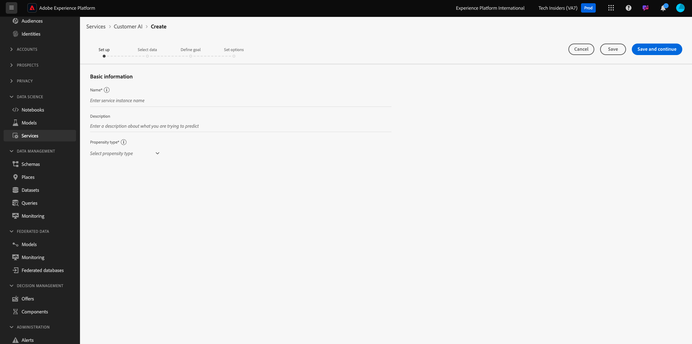

# 2.2.2客户人工智能 — 创建新实例（配置）

客户人工智能通过分析现有的消费者体验事件数据来预测客户流失或转化倾向分数。 创建新的客户人工智能实例，可让营销人员定义目标和衡量标准。

## 设置新的客户人工智能实例

在Adobe Experience Platform中，单击左侧菜单中的&#x200B;**服务**。 此时会出现&#x200B;**服务**&#x200B;浏览器，并显示您可以使用的全部可用服务。 在客户人工智能信息卡中，单击&#x200B;**打开**。

单击&#x200B;**创建实例**。

你会看到这个。

输入客户人工智能实例的必需详细信息：

- 名称：使用`--aepUserLdap-- Product Purchase Propensity`
- 描述：使用： **预测客户购买产品的可能性**
- 倾向性类型：选择&#x200B;**转化**

单击&#x200B;**保存并继续**。

你会看到这个。 选择您在上一个练习中创建的、名为`--demoProfileLdap - Demo System - Customer Experience Event Dataset`的数据集。 单击&#x200B;**添加**。

你会看到这个。 您需要定义&#x200B;**标识**&#x200B;字段。 单击&#x200B;**无**。

在弹出窗口中，选择&#x200B;**身份映射(identityMap)**，然后选择命名空间&#x200B;**Demo System - CRMID (crmId)**。 接下来，单击&#x200B;**保存**。

单击&#x200B;**保存并继续**。

选择&#x200B;**将在您的特定数据集中发生**，并将字段&#x200B;**commerce.purchases.value**&#x200B;定义为目标变量。

接下来，将计划设置为每周运行&#x200B;**次**，并将时间设置为尽可能接近当前时间。 确保启用了为配置文件&#x200B;**启用得分**&#x200B;的切换功能。 单击&#x200B;**保存并继续**。

配置实例后，您可以在客户人工智能服务列表中看到它，也可以通过单击客户人工智能实例行预览设置和执行详细信息的摘要。 如果发现错误，摘要面板还会显示错误详细信息。

>[!NOTE]
>
>只要您的客户人工智能实例的状态为&#x200B;**等待培训**&#x200B;或&#x200B;**错误**，您就可以修改任何定义或属性

一旦您的模型运行后，您将会看到此内容。

下一步：[2.2.3客户人工智能 — 评分仪表板和分段（预测并采取行动）](./ex3.md)

[返回模块2.2](./intelligent-services.md)

[返回所有模块](./../../../overview.md)
