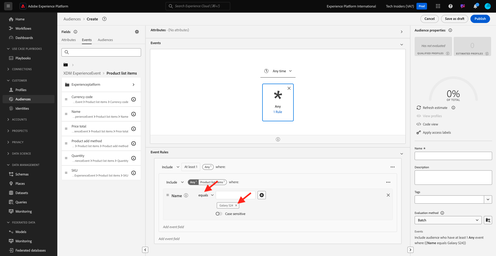

# 2.3.1创建区段

在本练习中，您将使用Adobe Experience Platform的区段生成器创建一个区段。

## 2.3.1.1上下文

在当今世界，对客户行为的响应必须是实时的。 实时响应客户行为的方法之一是在区段符合实时条件的情况下使用区段。 在本练习中，您需要构建区段，同时考虑到我们一直在使用的网站上的实际活动。

## 2.3.1.2确定您要对其做出反应的行为

转到[https://builder.adobedemo.com/projects](https://builder.adobedemo.com/projects)。 使用Adobe ID登录后，您将看到此内容。 单击您的网站项目以将其打开。

您现在可以按照以下流程访问该网站。 单击&#x200B;**集成**。

在&#x200B;**集成**&#x200B;页面上，您需要选择在练习0.1中创建的数据收集属性。

随后您将看到您的演示网站已打开。 选择URL并将其复制到剪贴板。

打开一个新的无痕浏览器窗口。

粘贴您在上一步中复制的演示网站的URL。 然后，系统将要求您使用Adobe ID登录。

选择您的帐户类型并完成登录过程。

然后，您会看到您的网站已加载到无痕浏览器窗口中。 对于每个演示，您将需要使用新的无痕浏览器窗口来加载演示网站URL。

在本例中，您希望对查看特定产品的特定客户做出响应。
从**Luma**&#x200B;主页，转到&#x200B;**Men**，然后单击产品&#x200B;**PROTEUS FITNESS JACKSHIRT**。

因此，当有人访问&#x200B;**PROTEUS FITNESS JACKSHIRT**&#x200B;的产品页面时，您希望能够采取行动。 要采取相应措施，首先要定义区段。

## 2.3.1.3创建区段

转到[Adobe Experience Platform](https://experience.adobe.com/platform)。 登录后，您将登录到Adobe Experience Platform的主页。

在继续之前，您需要选择一个&#x200B;**沙盒**。 要选择的沙盒名为``--aepSandboxName--``。 您可以通过单击屏幕顶部蓝线中的文本&#x200B;**[!UICONTROL Production Prod]**&#x200B;来执行此操作。 选择适当的[!UICONTROL 沙盒]后，您将看到屏幕更改，现在您已经进入专用的[!UICONTROL 沙盒]。

在左侧的菜单中，转到&#x200B;**区段**，然后转到&#x200B;**浏览**，您可以在其中查看所有现有区段的概述。 单击&#x200B;**创建区段**&#x200B;按钮开始创建新区段。

如上所述，您需要从查看了产品&#x200B;**PROTEUS FITNESS JACKSHIRT**&#x200B;的所有客户中构建一个区段。

要构建此区段，您需要添加一个事件。 单击&#x200B;**区段**&#x200B;菜单栏中的&#x200B;**事件**&#x200B;图标可找到所有事件。

接下来，您将看到顶级&#x200B;**XDM ExperienceEvent**&#x200B;节点。

若要查找已访问&#x200B;**PROTEUS FITNESS JACKSHIRT**&#x200B;产品的客户，请单击&#x200B;**XDM ExperienceEvent**。

向下滚动到&#x200B;**产品列表项**&#x200B;并单击它。

选择&#x200B;**Name**&#x200B;并从左侧的&#x200B;**产品列表项**&#x200B;菜单将&#x200B;**Name**&#x200B;对象拖放到区段生成器画布中的&#x200B;**事件**&#x200B;部分。

比较参数应为&#x200B;**等于**，并在输入字段中输入`PROTEUS FITNESS JACKSHIRT`。

您的&#x200B;**事件规则**&#x200B;现在应如下所示。 每次将元素添加到区段生成器时，都可以单击&#x200B;**刷新估算**&#x200B;按钮以获取区段中的群体新估算。

最后，让我们为您的区段命名并保存它。

作为命名约定，请使用：

- `--aepUserLdap-- - Interest in PROTEUS FITNESS JACKSHIRT`

区段名称应如下所示：
`vangeluw - Interest in PROTEUS FITNESS JACKSHIRT`

接下来，单击&#x200B;**保存并关闭**&#x200B;按钮以保存您的区段。

此时您将返回到区段概述页面。

下一步： [2.3.2查看如何使用目标](./ex2.md)配置DV360目标

[返回模块2.3](./real-time-cdp-build-a-segment-take-action.md)

[返回所有模块](../../../overview.md)
