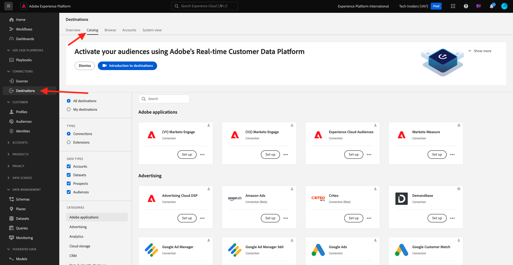

# 2.3.2配置Advertising目标，如Google DV360

>[!IMPORTANT]
>
>以下内容仅供参考 — 您&#x200B;**不需要**&#x200B;为DV360配置新的目标。 已创建目标，您可以在下一个练习中使用它。

转到[Adobe Experience Platform](https://experience.adobe.com/platform)。 登录后，您将登录到Adobe Experience Platform的主页。

在继续之前，您需要选择一个&#x200B;**沙盒**。 要选择的沙盒名为``--aepSandboxName--``。 您可以通过单击屏幕顶部蓝线中的文本&#x200B;**[!UICONTROL Production Prod]**&#x200B;来执行此操作。 选择适当的[!UICONTROL 沙盒]后，您将看到屏幕更改，现在您已经进入专用的[!UICONTROL 沙盒]。

在左侧菜单中，转到&#x200B;**目标**，然后转到&#x200B;**目录**。 您随后将看到&#x200B;**目标目录**。

在&#x200B;**目标**&#x200B;中，单击&#x200B;**Google显示和视频360**，然后单击&#x200B;**+设置**。

你会看到这个。 单击&#x200B;**连接到目标**。

在下一个屏幕中，您可以配置目标到Google DV360。

在&#x200B;**Name**&#x200B;和&#x200B;**Description**&#x200B;字段中输入值。

字段&#x200B;**帐户ID**&#x200B;是DV360帐户的&#x200B;**广告商ID**。 您可以在此处找到该内容：

**帐户类型**&#x200B;应设置为&#x200B;**邀请广告商**。

现在你有了这个。 单击&#x200B;**下一步**。

>[!NOTE]
>
>Google需要允许列表Adobe，以便Adobe Experience Platform将数据发送到Google DV360。 请联系您的Google客户经理以启用此数据流。

创建目标后，您将看到此内容。 您可以选择数据治理策略。 接下来，单击&#x200B;**保存并退出**。

然后，您将看到可用目标的列表。
在下一个练习中，您会将在上一个练习中构建的区段连接到Google DV360目标。

下一步： [2.3.3执行操作：将区段发送到DV360](./ex3.md)

[返回模块2.3](./real-time-cdp-build-a-segment-take-action.md)

[返回所有模块](../../../overview.md)
