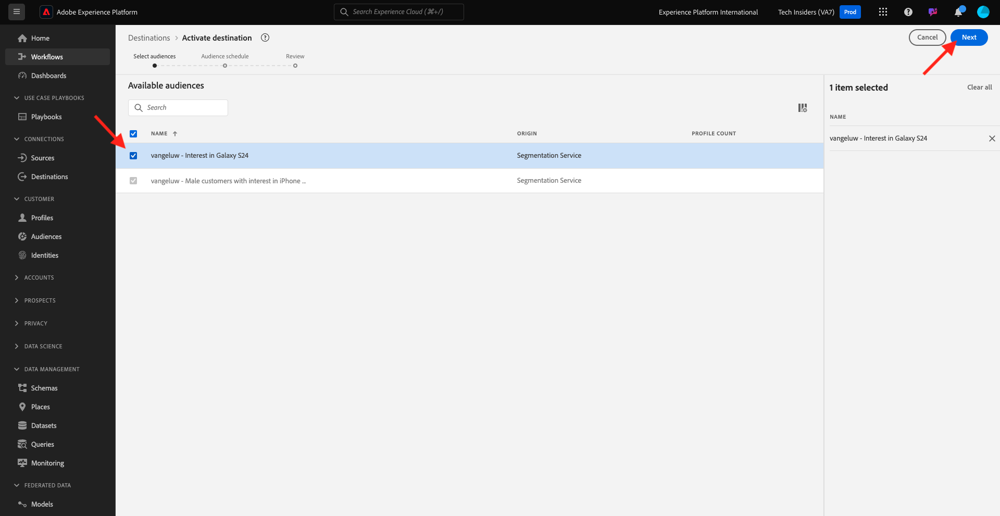

# 2.3.3采取行动：将您的区段发送到DV360

转到[Adobe Experience Platform](https://experience.adobe.com/platform)。 登录后，您将登录到Adobe Experience Platform的主页。

在继续之前，您需要选择一个&#x200B;**沙盒**。 要选择的沙盒名为``--aepSandboxName--``。 您可以通过单击屏幕顶部蓝线中的文本&#x200B;**[!UICONTROL Production Prod]**&#x200B;来执行此操作。 选择适当的[!UICONTROL 沙盒]后，您将看到屏幕更改，现在您已经进入专用的[!UICONTROL 沙盒]。

在左侧菜单中，转到&#x200B;**目标**，然后转到&#x200B;**目录**。 您随后将看到&#x200B;**目标目录**。

在&#x200B;**目标**&#x200B;中，单击&#x200B;**Google Display &amp; Video 360**&#x200B;卡上的&#x200B;**激活区段**。

选择您的目标并单击&#x200B;**下一步**。

在可用区段列表中，选择您在上一个练习中创建的区段。 单击&#x200B;**下一步**。

在&#x200B;**区段计划**&#x200B;页面上，单击&#x200B;**下一步**。

最后，在&#x200B;**审核**&#x200B;页面上单击&#x200B;**完成**。

您的区段现在链接到Google DV360。 每次有客户符合此区段的资格条件时，系统都会向Google DV360发送一个信号，以便将该客户包含在Google DV360的受众中。

下一步： [2.3.4执行操作：将区段发送到S3-destination](./ex4.md)

[返回模块2.3](./real-time-cdp-build-a-segment-take-action.md)

[返回所有模块](../../../overview.md)
