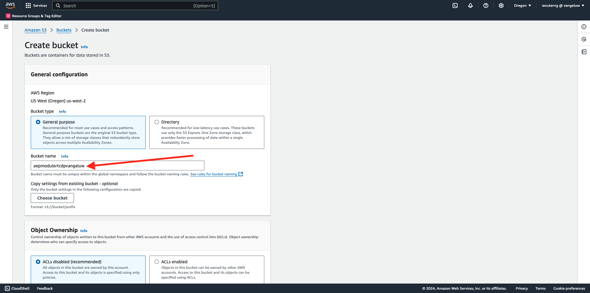

# 2.3.4采取行动：将您的区段发送到S3目标

Adobe Experience Platform还能够将受众共享到电子邮件营销目标，如SalesforceMarketing Cloud、Oracle Eloqua、Oracle Responsys和Adobe Campaign。

您可以使用FTP或SFTP作为每个电子邮件营销目标的专用目标的一部分，也可以使用AWS S3在Adobe Experience Platform和这些电子邮件营销目标之间交换客户列表。

在本模块中，您将通过使用AWS S3存储段来配置此类目标。

## 2.3.4.1创建您的S3存储段

转到[https://console.aws.amazon.com](https://console.aws.amazon.com)，然后使用您之前创建的Amazon帐户登录。

登录后，您将被重定向到&#x200B;**AWS管理控制台**。

在&#x200B;**查找服务**&#x200B;菜单中，搜索&#x200B;**s3**。 单击第一个搜索结果： **S3 — 云中的可扩展存储**。

您随后将看到&#x200B;**Amazon S3**&#x200B;主页。 单击&#x200B;**创建存储桶**。

在&#x200B;**创建Bucket**&#x200B;屏幕中，您需要配置以下两项内容：

- 名称：使用名称`aepmodulertcdp--aepUserLdap--`。 例如，在本练习中，存储桶名称为&#x200B;**aepmodulertcdpvangeluw**
- 区域：使用区域&#x200B;**EU (Frankfurt) eu-central-1**

保留所有其他默认设置。 向下滚动并单击&#x200B;**创建存储桶**。

然后，您会看到正在创建存储段，并且会被重定向到Amazon S3主页。

## 2.3.4.2设置访问S3存储段的权限

下一步是设置对S3存储段的访问权限。

为此，请转到[https://console.aws.amazon.com/iam/home](https://console.aws.amazon.com/iam/home)。

AWS资源的访问权限由Amazon Identity and Access Management (IAM)控制。

您现在可以看到此页面。

在左侧菜单中，单击&#x200B;**用户**。 您随后将看到&#x200B;**用户**&#x200B;屏幕。 单击&#x200B;**添加用户**。

接下来，配置您的用户：

- 用户名：使用`s3_--aepUserLdap--_rtcdp`作为名称，因此在此示例中，名称为`s3_vangeluw_rtcdp`。
- AWS访问类型：选择&#x200B;**访问密钥 — 程序化访问**。

单击&#x200B;**下一步：权限**。

然后，您将会看到此权限屏幕。 单击&#x200B;**直接附加现有策略**。

输入搜索词&#x200B;**s3**&#x200B;以查看所有相关的S3策略。 选择策略&#x200B;**AmazonS3FullAccess**。 单击&#x200B;**下一步：标记**。

在&#x200B;**标记**&#x200B;屏幕上，无需配置任何内容。 单击&#x200B;**下一步：审核**。

检查您的配置。 单击&#x200B;**创建用户**。

您的用户现已创建，您将看到用于访问S3环境的凭据。 这是你唯一一次看到你的凭据，请写下它们。

单击&#x200B;**显示**&#x200B;查看您的访问密钥：

>[!IMPORTANT]
>
>将凭据存储在计算机上的文本文件中。
>
> - 访问密钥ID： ...
> - 访问密钥： ...
>
> 单击&#x200B;**关闭**&#x200B;后，您将再也看不到您的凭据！

单击&#x200B;**关闭**。

您现在已成功创建一个AWS S3存储桶，并创建了一个有权访问此存储桶的用户。

## 2.3.4.3在Adobe Experience Platform中配置目标

转到[Adobe Experience Platform](https://experience.adobe.com/platform)。 登录后，您将登录到Adobe Experience Platform的主页。

在继续之前，您需要选择一个&#x200B;**沙盒**。 要选择的沙盒名为``--aepSandboxName--``。 您可以通过单击屏幕顶部蓝线中的文本&#x200B;**[!UICONTROL Production Prod]**&#x200B;来执行此操作。 选择适当的[!UICONTROL 沙盒]后，您将看到屏幕更改，现在您已经进入专用的[!UICONTROL 沙盒]。

在左侧菜单中，转到&#x200B;**目标**，然后转到&#x200B;**目录**。 您随后将看到&#x200B;**目标目录**。

单击&#x200B;**云存储**，然后单击&#x200B;**Amazon S3**&#x200B;卡上的&#x200B;**设置**&#x200B;按钮（或在&#x200B;**激活区段**&#x200B;上，具体取决于您的环境）。

根据您的环境，您可能需要单击&#x200B;**+配置新目标**&#x200B;以开始创建目标。

选择&#x200B;**新帐户**&#x200B;作为帐户类型。 请使用上一步中提供给您的S3凭据：

| 访问密钥ID | 访问密钥 |
|:-----------------------:| :-----------------------:|
| 秋叶香..... | Cm5Ln..... |

单击&#x200B;**连接到目标**。

然后，您将看到一条可视化确认消息，确认此目标现已连接。

您必须提供名称和文件夹，以便Adobe Experience Platform可以连接到S3存储桶。

作为命名约定，请使用以下内容：

| 访问密钥ID | 访问密钥 |
|:-----------------------:| :-----------------------:|
| 名称 | `AWS - S3 - --aepUserLdap--` |
| 描述 | `AWS - S3 - --aepUserLdap--` |
| 存储段名称 | `aepmodulertcdp--aepUserLdap--` |
| 文件夹路径 | / |

单击&#x200B;**下一步**。

您现在可以选择将数据治理策略附加到新目标。 单击&#x200B;**下一步**。

在区段列表中，搜索您在练习1中创建的区段并将其选定。 单击&#x200B;**下一步**。

你会看到这个。 如果您愿意，可以通过单击&#x200B;**铅笔**&#x200B;图标来编辑计划。 **创建计划**。

定义您选择的计划。 选择&#x200B;**导出增量文件**&#x200B;并将频率设置为每&#x200B;**3小时**&#x200B;的&#x200B;**小时**。 单击&#x200B;**创建**。

你就能拥有这个了。 单击&#x200B;**下一步**。

现在，您可以选择导出到AWS S3的属性。 单击&#x200B;**添加新字段**&#x200B;并确保已添加字段`--aepTenantId--.identification.core.ecid`并标记为&#x200B;**重复数据删除键**。

（可选）您可以根据需要添加任意数量的其他字段。

添加所有字段后，单击&#x200B;**下一步**。

检查您的配置。 单击&#x200B;**完成**&#x200B;以完成配置。

然后，您将返回到“目标激活”屏幕，您将看到区段已添加到此目标。

如果要添加更多区段导出，可以单击&#x200B;**激活区段**&#x200B;以重新启动该过程并添加更多区段。

下一步： [2.3.5执行操作：将区段发送到Adobe Target](./ex5.md)

[返回模块2.3](./real-time-cdp-build-a-segment-take-action.md)

[返回所有模块](../../../overview.md)
