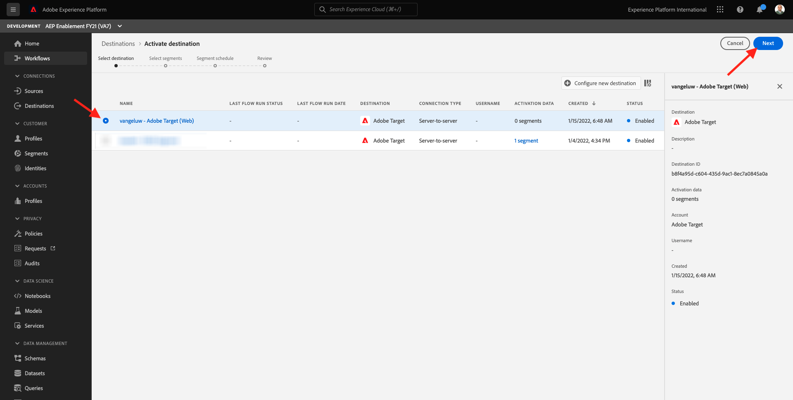
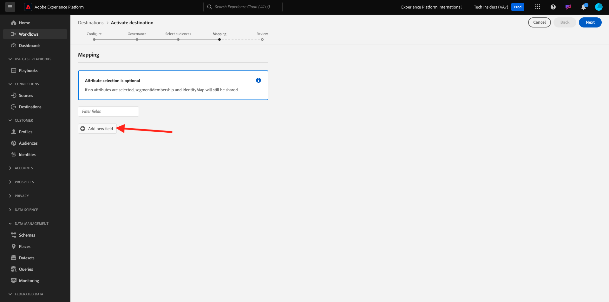
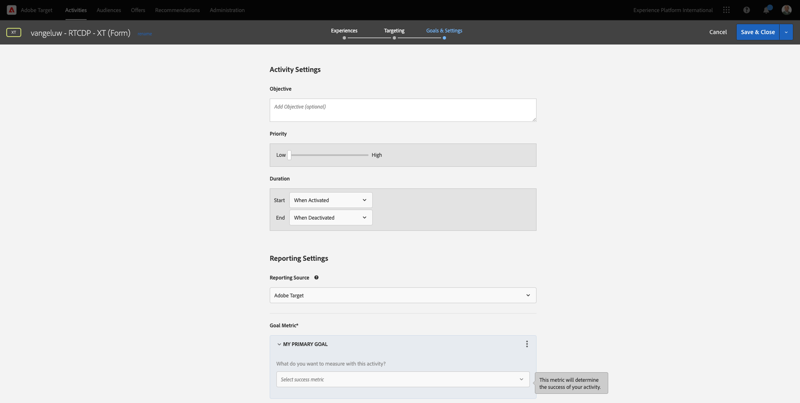

# 2.3.5采取行动：将您的区段发送到Adobe Target

转到[Adobe Experience Platform](https://experience.adobe.com/platform)。 登录后，您将登录到Adobe Experience Platform的主页。


在继续之前，您需要选择一个&#x200B;**沙盒**。 要选择的沙盒名为``--aepSandboxName--``。 您可以通过单击屏幕顶部蓝线中的文本&#x200B;**[!UICONTROL Production Prod]**&#x200B;来执行此操作。 选择适当的[!UICONTROL 沙盒]后，您将看到屏幕更改，现在您已经进入专用的[!UICONTROL 沙盒]。


## 2.3.5.1验证您的数据流

Real-Time CDP中的Adobe Target目标已连接到用于将数据摄取到Adobe边缘网络的数据流。 如果要设置Adobe Target目标，您首先需要验证是否已为Adobe Target启用数据流。 您的数据流是在[练习0.2创建数据流](./../../../modules/gettingstarted/gettingstarted/ex2.md)中配置的，名称为`--aepUserLdap-- - Demo System Datastream`。

转到[https://experience.adobe.com/#/data-collection/](https://experience.adobe.com/#/data-collection/)，然后单击&#x200B;**数据流**&#x200B;或&#x200B;**数据流(Beta)**。


在屏幕右上角，选择沙盒名称，应为`--aepSandboxName--`。


在数据流中，搜索名为`--aepUserLdap-- - Demo System Datastream`的数据流。 单击您的数据流以将其打开。


你将看到此内容，单击&#x200B;**Adobe Experience Platform**&#x200B;旁边的&#x200B;**...**，然后单击&#x200B;**编辑**。


选中&#x200B;**Edge分段**&#x200B;和&#x200B;**Personalization目标**&#x200B;的复选框。 单击&#x200B;**保存**。


接下来，单击&#x200B;**+添加服务**。


选择服务&#x200B;**Adobe Target**。 单击&#x200B;**保存**。


您的数据流现在已针对Adobe Target进行了配置。


## 2.3.5.2配置Adobe Target目标

Adobe Target可作为Real-Time CDP的目标。 要设置您的Adobe Target集成，请转到&#x200B;**目标**，转到&#x200B;**目录**。


在&#x200B;**类别**&#x200B;菜单中单击&#x200B;**Personalization**。 您随后将看到&#x200B;**Adobe Target**&#x200B;目标卡。 单击&#x200B;**激活区段**（或者&#x200B;**设置**，具体取决于您的环境）。


根据您的环境，您可能需要单击&#x200B;**+配置新目标**&#x200B;以开始创建目标。


你会看到这个。


在&#x200B;**配置新目标**&#x200B;屏幕中，您需要配置以下两项内容：

- 名称：使用名称`--aepUserLdap-- - Adobe Target (Web)`，它应如下所示： **vangeluw - Adobe Target (Web)**。
- 数据流ID：您需要选择在[练习0.2创建数据流](./../../../modules/gettingstarted/gettingstarted/ex2.md)中配置的数据流。 数据流的名称应为： `--aepUserLdap-- - Demo System Datastream`。

单击&#x200B;**下一步**。


在下一个屏幕中，您可以选择选择治理策略。 不需要选择一个，在此情况下不需要选择一个，因此请单击&#x200B;**创建**。


您的目标现已创建并将显示在列表中。 选择您的目标并单击&#x200B;**下一步**&#x200B;开始向目标发送区段。



在可用区段的列表中，选择您在[练习6.1中创建的区段，并创建一个名为`--aepUserLdap-- - Interest in PROTEUS FITNESS JACKSHIRT`的区段](./ex1.md)。 然后，单击&#x200B;**下一步**。


在下一页，单击&#x200B;**下一步**。



单击&#x200B;**完成**。


您的区段现在已激活到Adobe Target。


>[!IMPORTANT]
>
>当您刚刚在Real-Time CDP中创建Adobe Target目标时，可能需要长达一小时的时间才能激活目标。 由于设置了后端配置，这是一个一次性等待时间。 完成初始1小时的等待时间和后端配置后，发送到Adobe Target目标的新添加的边缘区段将可用于实时定位。

## 2.3.5.3配置基于Adobe Target表单的活动

现在，您的Real-Time CDP区段已配置为发送到Adobe Target，接下来您可以在Adobe Target中配置体验定位活动。 在本练习中，您将配置一个基于表单的活动。

转到[https://experiencecloud.adobe.com/](https://experiencecloud.adobe.com/)以转到Adobe Experience Cloud主页。 单击&#x200B;**Target**&#x200B;以将其打开。


在&#x200B;**Adobe Target**&#x200B;主页上，您将看到所有现有活动。


单击&#x200B;**+创建活动**&#x200B;以创建新活动。


选择&#x200B;**体验定位**。


选择&#x200B;**表单**&#x200B;并选择&#x200B;**无属性限制**。 单击&#x200B;**下一步**。


您现在位于基于表单的活动编辑器中。


对于字段&#x200B;**LOCATION 1**，请选择&#x200B;**target-global-mbox**。


默认受众当前为&#x200B;**所有访客**。 单击&#x200B;**所有访客**&#x200B;旁边的&#x200B;**3点**，然后单击&#x200B;**更改受众**。


您现在可以看到可用受众的列表，您之前创建并发送到Adobe Target的Adobe Experience Platform区段现在包含在此列表中。 选择您之前在Adobe Experience Platform中创建的区段。 单击&#x200B;**分配受众**。


您的Adobe Experience Platform区段现在是此体验定位活动的一部分。


现在，让我们更改网站主页上的主页图像。 单击以打开&#x200B;**默认内容**&#x200B;旁边的下拉列表，然后单击&#x200B;**创建HTML选件**。


粘贴以下代码。 然后，单击&#x200B;**下一步**。

```javascript
<script>document.querySelector("#home > div > div > div > div > div.banner_img.d-none.d-lg-block > img").src="https://parsefiles.back4app.com/hgJBdVOS2eff03JCn6qXXOxT5jJFzialLAHJixD9/ff92fdc3885972c0090ad5419e0ef4d4_Luma - Product - Proteus - Hero Banner.png"; document.querySelector(".banner_text > *").remove()</script>
```


然后，您将看到所选受众的新图像体验。


单击左上角的活动标题可对其进行重命名。


对于名称，请使用：

- `--aepUserLdap-- - RTCDP - XT (Form)`


单击&#x200B;**下一步**。


在&#x200B;**目标和设置** — 页面上，转到&#x200B;**目标量度**。



将主要目标设置为&#x200B;**参与** - **网站停留时间**。


单击&#x200B;**保存并关闭**。


您现在位于&#x200B;**活动概述**&#x200B;页面。 您仍需要激活活动。


单击字段&#x200B;**不活动**&#x200B;并选择&#x200B;**激活**。


然后，您将获得一条可视化确认消息，确认您的活动现已上线。


您的活动现已上线，并可在演示网站上进行测试。

>[!IMPORTANT]
>
>当您刚刚在Real-Time CDP中创建Adobe Target目标时，可能需要长达一小时的时间才能激活目标。 由于设置了后端配置，这是一个一次性等待时间。 完成初始1小时的等待时间和后端配置后，发送到Adobe Target目标的新添加的边缘区段将可用于实时定位。

如果您现在返回演示网站并访问PROTEUS FITNESS JACKSHIRT的产品页面，则您将立即符合您创建的区段的资格，并且您将看到Adobe Target活动实时显示在主页上。


下一步：[2.3.6外部受众](./ex6.md)

[返回模块2.3](./real-time-cdp-build-a-segment-take-action.md)

[返回所有模块](../../../overview.md)
