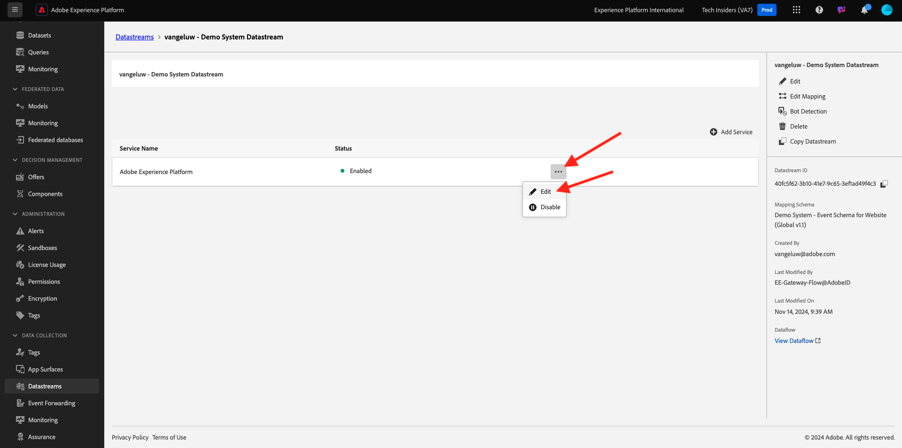

# 2.3.5采取行动：将受众发送至Adobe Target

转到[Adobe Experience Platform](https://experience.adobe.com/platform)。 登录后，您将登录到Adobe Experience Platform的主页。


在继续之前，您需要选择一个&#x200B;**沙盒**。 要选择的沙盒名为``--aepSandboxName--``。 选择适当的[!UICONTROL 沙盒]后，您将看到屏幕更改，现在您已经进入专用的[!UICONTROL 沙盒]。


## 验证您的数据流

Real-Time CDP中的Adobe Target目标已连接到用于将数据摄取到Adobe边缘网络的数据流。 如果要设置Adobe Target目标，您首先需要验证是否已为Adobe Target启用数据流。 您的数据流是在[练习0.2创建数据流](./../../../modules/gettingstarted/gettingstarted/ex2.md)中配置的，名称为`--aepUserLdap-- - Demo System Datastream`。

在左侧菜单中，向下滚动并单击&#x200B;**数据流**。 在数据流中，搜索名为`--aepUserLdap-- - Demo System Datastream`的数据流。 单击您的数据流以将其打开。


你将看到此内容，单击&#x200B;**Adobe Experience Platform**&#x200B;旁边的&#x200B;**...**，然后单击&#x200B;**编辑**。



选中&#x200B;**Edge分段**&#x200B;和&#x200B;**Personalization目标**&#x200B;的复选框。 单击&#x200B;**保存**。


接下来，单击&#x200B;**+添加服务**。


选择服务&#x200B;**Adobe Target**。 单击&#x200B;**保存**。


您的数据流现在已针对Adobe Target进行了配置。


## 设置您的Adobe Target目标

Adobe Target可作为Real-Time CDP的目标。 要设置您的Adobe Target集成，请转到&#x200B;**目标**，转到&#x200B;**目录**。

在&#x200B;**类别**&#x200B;菜单中单击&#x200B;**Personalization**。 您随后将看到&#x200B;**(v2) Adobe Target**&#x200B;目标卡。


单击&#x200B;**连接到目标**。


你会看到这个。 您需要创建自己的Adobe Target目标，请遵循以下准则：

- 名称：使用名称`--aepUserLdap-- - Adobe Target v2  (Web)`。
- 数据流ID：您需要选择在[练习0.2创建数据流](./../../../modules/gettingstarted/gettingstarted/ex2.md)中配置的数据流。 数据流的名称应为： `--aepUserLdap-- - Demo System Datastream`。
- Workspace：这与Adobe Target工作区相关。 如果没有您需要使用的特定工作区，请选择&#x200B;**默认Workspace**。

单击&#x200B;**下一步**。


您现在可以选择选择数据治理策略。 单击&#x200B;**下一步**。


在可用受众列表中，选择您在上一个练习[创建名为`--aepUserLdap-- - Interest in Galaxy S24`的受众](./ex1.md)中创建的受众。 然后，单击&#x200B;**下一步**。


在&#x200B;**映射**&#x200B;屏幕上，您可以映射配置文件属性以使其在Adobe Target中可用。 这有助于您在网站上添加一层额外的个性化设置。 单击&#x200B;**添加新字段**。


对于新字段，请选择字段&#x200B;**person.name.firstName**。 单击&#x200B;**保存**。


你就能拥有这个了。 单击&#x200B;**下一步**。


单击&#x200B;**完成**。


您的受众现已激活到Adobe Target。


>[!IMPORTANT]
>
>当您刚刚在Real-Time CDP中创建Adobe Target目标时，可能需要长达一小时的时间才能激活目标。 由于设置了后端配置，这是一个一次性等待时间。 完成初始1小时的等待时间和后端配置后，发送到Adobe Target目标的新添加受众将可以实时定位。

## 配置您的Adobe Target基于表单的活动

现在，您的Real-Time CDP受众已配置为发送到Adobe Target，您可以在Adobe Target中配置体验定位活动。 在本练习中，您将配置一个基于表单的活动。

转到[https://experiencecloud.adobe.com/](https://experiencecloud.adobe.com/)以转到Adobe Experience Cloud主页。 单击&#x200B;**Target**&#x200B;以将其打开。


在&#x200B;**Adobe Target**&#x200B;主页上，您将看到所有现有活动。 单击&#x200B;**创建活动**，然后单击&#x200B;**体验定位**。


选择&#x200B;**Web**、**表单**&#x200B;和&#x200B;**无属性限制**。 单击&#x200B;**创建**。


您现在位于基于表单的活动编辑器中。


对于字段&#x200B;**LOCATION 1**，请选择&#x200B;**target-global-mbox**。


默认受众当前为&#x200B;**所有访客**。 单击&#x200B;**所有访客**&#x200B;旁边的&#x200B;**3点**，然后单击&#x200B;**更改受众**。


您现在可以看到可用受众的列表，您之前创建并发送到Adobe Target的Adobe Experience Platform受众现在包含在此列表中。 选择您之前在Adobe Experience Platform中创建的受众。 单击&#x200B;**分配受众**。


您的Adobe Experience Platform受众现在已成为此体验定位活动的一部分。


现在，让我们更改网站主页上的主页图像。 单击以打开&#x200B;**默认内容**&#x200B;旁边的下拉列表，然后单击&#x200B;**创建HTML选件**。


粘贴以下代码。

```javascript
<script>document.querySelector("#SpectrumProvider > div.App > div > div.Page.home > main > div.Banner.Banner--alignment-right.Banner--verticalAlignment-middle.main-banner > div.Image > img").src="https://tech-insiders.s3.us-west-2.amazonaws.com/citisignal-new-hero.png"; document.querySelector("#SpectrumProvider > div.App > div > div.Page.home > main > div.Banner.Banner--alignment-right.Banner--verticalAlignment-middle.main-banner > div.Banner__content > div > div > h1").innerHTML="Hi there ";
document.querySelector("#SpectrumProvider > div.App > div > div.Page.home > main > div.Banner.Banner--alignment-right.Banner--verticalAlignment-middle.main-banner > div.Banner__content > div > div > div > div > p").innerHTML="What about 10% off of your next Galaxy S24 smartphone?";
</script>
```


接下来，您需要从Adobe Experience Platform的用户档案属性添加个性化令牌。 请记住，将受众激活到Adobe Target时，您还可以选择要与Adobe Target共享的字段&#x200B;**person.name.firstName**。 要检索该字段，请选择源&#x200B;**Adobe Experience Platform**，选择您的沙盒（应为`--aepSandboxName--`），然后选择属性&#x200B;**person.name.firstName**。


在单击&#x200B;**添加**&#x200B;按钮之前，请确保转到您看到`... > h1").innerHTML="Hi there ";`的行并将光标放在单词`there`后面的括号中，如下所示：

`... > h1").innerHTML="Hi there ";`

然后单击&#x200B;**添加**&#x200B;按钮，该按钮随后应添加令牌，这将如下所示更新代码：

`... > h1").innerHTML="Hi there ${aep.person.name.firstName}";`

单击&#x200B;**下一步**。


然后，您将看到所选受众使用新图像的体验概述。 单击&#x200B;**下一步**。


单击左上角的活动标题可对其进行重命名，如下所示： `--aepUserLdap-- - RTCDP - XT (Form)`


在&#x200B;**目标和设置** — 页面上，转到&#x200B;**目标量度**。 将主要目标设置为&#x200B;**参与** - **网站停留时间**。 单击&#x200B;**保存并关闭**。


您现在位于&#x200B;**活动概述**&#x200B;页面。 您仍需要激活活动。 单击字段&#x200B;**不活动**&#x200B;并选择&#x200B;**激活**。


然后，您将获得一条可视化确认消息，确认您的活动现已上线。


您的活动现已上线，并可在演示网站上进行测试。

>[!IMPORTANT]
>
>当您刚刚在Real-Time CDP中创建Adobe Target目标时，可能需要长达一小时的时间才能激活目标。 由于设置了后端配置，这是一个一次性等待时间。 完成初始1小时的等待时间和后端配置后，发送到Adobe Target目标的新添加的边缘受众将可以实时定位。

如果您现在返回演示网站并访问Galaxy S24的产品页面，则您将符合您创建的受众资格，并且您将看到Adobe Target活动实时显示在主页上。


下一步：[2.3.6外部受众](./ex6.md)

[返回模块2.3](./real-time-cdp-build-a-segment-take-action.md)

[返回所有模块](../../../overview.md)
