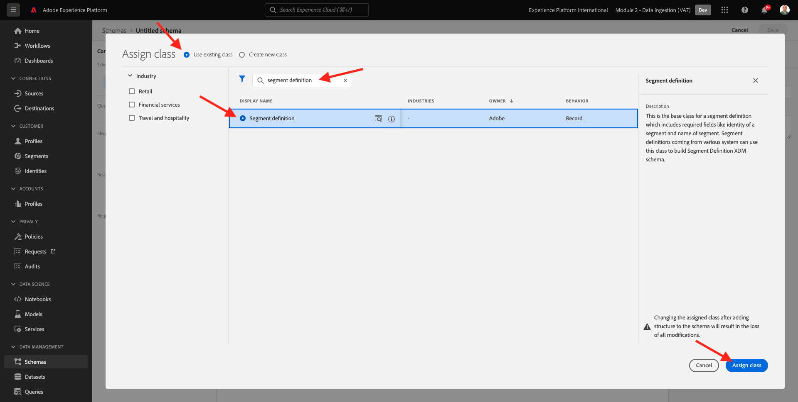
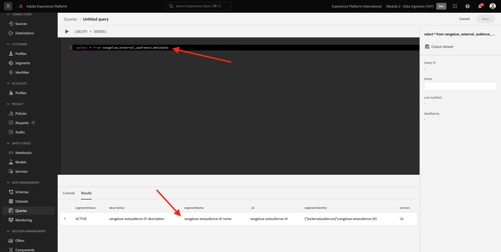

# 2.3.6外部受众

在许多情况下，您的公司可能会希望使用其他应用程序中的现有受众来扩充Adobe Experience Platform中的客户配置文件。
这些外部受众可能已根据数据科学模型或使用外部数据平台而定义。

通过Adobe Experience Platform的外部受众功能，您可以专注于外部受众的摄取及其激活，而无需在Adobe Experience Platform中重新详细定义相应的受众定义。

整个过程分为三个主要步骤：

- 导入外部受众元数据：此步骤旨在将外部受众元数据（如受众名称）纳入Adobe Experience Platform。
- 将外部受众成员资格分配给客户配置文件：此步骤旨在使用外部受众成员资格属性扩充客户配置文件。
- 在Adobe Experience Platform中创建受众：此步骤旨在根据外部受众成员资格创建切实可行的受众。

## 元数据

转到[Adobe Experience Platform](https://experience.adobe.com/platform)。 登录后，您将登录到Adobe Experience Platform的主页。


>[!IMPORTANT]
>
>用于此练习的沙盒是``--aepSandboxName--``！

在继续之前，您需要选择一个&#x200B;**沙盒**。 要选择的沙盒名为``--aepSandboxName--``。 选择适当的[!UICONTROL 沙盒]后，您将看到屏幕更改，现在您已经进入专用的[!UICONTROL 沙盒]。


虽然受众数据定义了用户档案成为受众的条件，但受众元数据是有关受众的信息，如受众的名称、描述和状态。 由于外部受众元数据将存储在Adobe Experience Platform中，因此您需要使用身份命名空间在Adobe Experience Platform中摄取元数据。

## 2.3.6.1.1外部受众的身份命名空间

已创建用于&#x200B;**外部受众**的标识命名空间。
要查看已创建的标识，请转到**标识**，然后搜索&#x200B;**外部**。 单击“外部受众”项目。

请注意：

- 标识符号&#x200B;**externalaudiences**&#x200B;将在后续步骤中用于引用外部受众标识。
- **非人员标识符**&#x200B;类型用于此身份命名空间，因为此命名空间不用于识别客户配置文件，而是用于识别受众。


## 2.3.6.1.2创建外部受众元数据架构

外部受众元数据基于&#x200B;**受众定义架构**。 您可以在[XDM Github存储库](https://github.com/adobe/xdm/blob/master/docs/reference/classes/segmentdefinition.schema.md)中找到更多详细信息。

在左侧菜单中，转到架构。 单击&#x200B;**+创建架构**，然后单击&#x200B;**浏览**。


要分配类，请搜索&#x200B;**受众定义**。 选择&#x200B;**受众定义**&#x200B;类并单击&#x200B;**分配类**。



你会看到这个。 单击&#x200B;**取消**。


你会看到这个。 选择字段&#x200B;**_id**。 在右菜单中，向下滚动并启用&#x200B;**标识**&#x200B;和&#x200B;**主标识**&#x200B;复选框。 选择&#x200B;**外部受众**&#x200B;标识命名空间。 单击&#x200B;**应用**。


接下来，选择架构名称&#x200B;**无标题架构**。 将名称更改为`--aepUserLdap-- - External Audiences Metadata`。


启用&#x200B;**配置文件**&#x200B;切换并确认。 最后，单击&#x200B;**保存**。


## 2.3.6.1.3创建外部受众元数据数据集

在&#x200B;**架构**&#x200B;中，转到&#x200B;**浏览**。 搜索并单击您在上一步中创建的`--aepUserLdap-- - External Audiences Metadata`架构。 接下来，单击&#x200B;**从架构**&#x200B;创建数据集。


对于字段&#x200B;**Name**，输入`--aepUserLdap-- - External Audience Metadata`。 单击&#x200B;**创建数据集**。


你会看到这个。 不要忘记启用&#x200B;**配置文件**&#x200B;切换开关！


## 2.3.6.1.4创建HTTP API Source连接

接下来，您需要配置HTTP API Source连接器，以便将其用于将元数据摄取到数据集中。

转到&#x200B;**源**。 在搜索字段中，输入&#x200B;**HTTP**。 单击&#x200B;**添加数据**。


输入以下信息：

- **帐户类型**：选择&#x200B;**新帐户**
- **帐户名**：输入`--aepUserLdap-- - External Audience Metadata`
- 选中复选框&#x200B;**XDM兼容框**

接下来，单击&#x200B;**连接到源**。


你会看到这个。 单击&#x200B;**下一步**。


选择&#x200B;**现有数据集**，然后在下拉菜单中，搜索并选择数据集`--aepUserLdap-- - External Audience Metadata`。

验证&#x200B;**数据流详细信息**，然后单击&#x200B;**下一步**。


你会看到这个。

向导的&#x200B;**映射**&#x200B;步骤为空，因为您要将兼容XDM的有效负载摄取到HTTP API Source Connector，因此无需映射。 单击&#x200B;**下一步**。


在&#x200B;**查看**&#x200B;步骤中，您可以选择查看连接和映射详细信息。 单击&#x200B;**完成**。


你会看到这个。


## 2.3.6.1.5外部受众元数据的摄取

在Source连接器概述选项卡上，单击&#x200B;**...**，然后单击&#x200B;**复制架构有效负载**。


在计算机上打开您的文本编辑器应用程序，并粘贴您刚刚复制的有效负载，如下所示。 接下来，您需要更新此有效负载中的&#x200B;**xdmEntity**&#x200B;对象。


对象&#x200B;**xdmEntity**&#x200B;需要替换为以下代码。 复制以下代码，并通过替换文本编辑器中的&#x200B;**xdmEntity**&#x200B;对象将其粘贴到文本文件中。

```
"xdmEntity": {
    "_id": "--aepUserLdap---extaudience-01",
    "description": "--aepUserLdap---extaudience-01 description",
    "segmentIdentity": {
      "_id": "--aepUserLdap---extaudience-01",
      "namespace": {
        "code": "externalaudiences"
      }
    },
    "segmentName": "--aepUserLdap---extaudience-01 name",
    "segmentStatus": "ACTIVE",
    "version": "1.0"
  }
```

您应该会看到以下内容：


接下来，打开一个新的&#x200B;**终端**&#x200B;窗口。 复制文本编辑器中的所有文本，并将其粘贴到终端窗口中。


接下来，按&#x200B;**Enter**。

然后，您将在“终端”窗口中看到数据摄取的确认：


刷新HTTP API Source Connector屏幕，此时您会看到正在处理数据：


## 2.3.6.1.6验证外部受众元数据摄取

处理完成后，您可以使用查询服务检查数据集中的数据可用性。

在右菜单中，转到&#x200B;**数据集**&#x200B;并选择您之前创建的`--aepUserLdap-- - External Audience Metadata`数据集。


在右菜单中，转到“查询”并单击&#x200B;**创建查询**。


输入以下代码，然后按&#x200B;**SHIFT + ENTER**：

```
select * from --aepUserLdap--_external_audience_metadata
```

在查询结果中，您将看到所摄取的外部受众元数据。



## 受众成员资格

借助外部受众元数据，您现在可以摄取特定客户配置文件的受众成员资格。

您现在需要准备一个配置文件数据集，以根据受众成员资格模式进行扩充。 您可以在[XDM Github存储库](https://github.com/adobe/xdm/blob/master/docs/reference/datatypes/segmentmembership.schema.md)中找到更多详细信息。

### 创建外部受众成员资格架构

在右菜单中，转到&#x200B;**架构**。 单击&#x200B;**创建架构**，然后单击&#x200B;**XDM个人配置文件**。


在&#x200B;**添加字段组**&#x200B;弹出窗口中，搜索&#x200B;**配置文件核心**。 选择&#x200B;**配置文件核心2**&#x200B;字段组。


接下来，在&#x200B;**添加字段组**&#x200B;弹出窗口中，搜索&#x200B;**区段成员资格**。 选择&#x200B;**区段成员资格详细信息**&#x200B;字段组。 接下来，单击&#x200B;**添加字段组**。


你会看到这个。 导航到字段`--aepTenantId--.identification.core`。 单击&#x200B;**crmId**&#x200B;字段。 在右菜单中，向下滚动并选中&#x200B;**标识**&#x200B;和&#x200B;**主标识**&#x200B;复选框。 对于&#x200B;**身份命名空间**，请选择&#x200B;**演示系统 — CRMID**。

单击&#x200B;**应用**。


接下来，选择架构名称&#x200B;**无标题架构**。 在显示名称字段中，输入`--aepUserLdap-- - External Audiences Membership`。


接下来，启用&#x200B;**配置文件**&#x200B;切换并确认。 单击&#x200B;**保存**。


### 创建外部受众成员资格数据集

在&#x200B;**架构**&#x200B;中，转到&#x200B;**浏览**。 搜索并单击您在上一步中创建的`--aepUserLdap-- - External Audiences Membership`架构。 接下来，单击&#x200B;**从架构**&#x200B;创建数据集。


对于字段&#x200B;**Name**，输入`--aepUserLdap-- - External Audiences Membership`。 单击&#x200B;**创建数据集**。


你会看到这个。 不要忘记启用&#x200B;**配置文件**&#x200B;切换开关！


### 创建HTTP API Source连接


接下来，您需要配置HTTP API Source连接器，以便将其用于将元数据摄取到数据集中。

转到&#x200B;**源**。 在搜索字段中，输入&#x200B;**HTTP**。 单击&#x200B;**添加数据**。


输入以下信息：

- **帐户类型**：选择&#x200B;**新帐户**
- **帐户名**：输入`--aepUserLdap-- - External Audience Membership`
- 选中复选框&#x200B;**XDM兼容框**

接下来，单击&#x200B;**连接到源**。


你会看到这个。 单击&#x200B;**下一步**。


选择&#x200B;**现有数据集**，然后在下拉菜单中，搜索并选择数据集`--aepUserLdap-- - External Audiences Membership`。

验证&#x200B;**数据流详细信息**，然后单击&#x200B;**下一步**。


你会看到这个。

向导的&#x200B;**映射**&#x200B;步骤为空，因为您要将兼容XDM的有效负载摄取到HTTP API Source Connector，因此无需映射。 单击&#x200B;**下一步**。


在&#x200B;**查看**&#x200B;步骤中，您可以选择查看连接和映射详细信息。 单击&#x200B;**完成**。


你会看到这个。


### 摄取外部受众成员资格数据

在Source连接器概述选项卡上，单击&#x200B;**...**，然后单击&#x200B;**复制架构有效负载**。


在计算机上打开您的文本编辑器应用程序，并粘贴您刚刚复制的有效负载，如下所示。 接下来，您需要更新此有效负载中的&#x200B;**xdmEntity**&#x200B;对象。


对象&#x200B;**xdmEntity**&#x200B;需要替换为以下代码。 复制以下代码，并通过替换文本编辑器中的&#x200B;**xdmEntity**&#x200B;对象将其粘贴到文本文件中。

```
  "xdmEntity": {
    "_id": "--aepUserLdap---profile-test-01",
    "_experienceplatform": {
      "identification": {
        "core": {
          "crmId": "--aepUserLdap---profile-test-01"
        }
      }
    },
    "personID": "--aepUserLdap---profile-test-01",
    "segmentMembership": {
      "externalaudiences": {
        "--aepUserLdap---extaudience-01": {
          "status": "realized",
          "lastQualificationTime": "2022-03-05T00:00:00Z"
        }
      }
    }
  }
```

您应该会看到以下内容：


接下来，打开一个新的&#x200B;**终端**&#x200B;窗口。 复制文本编辑器中的所有文本，并将其粘贴到终端窗口中。


接下来，按&#x200B;**Enter**。

然后，您将在“终端”窗口中看到数据摄取的确认：


刷新您的HTTP API Source连接器屏幕，几分钟后，您现在可以看到正在处理数据：


### 验证外部受众成员资格摄取

处理完成后，您可以使用查询服务检查数据集中的数据可用性。

在右菜单中，转到&#x200B;**数据集**&#x200B;并选择您之前创建的`--aepUserLdap-- - External Audiences Membership `数据集。


在右菜单中，转到“查询”并单击&#x200B;**创建查询**。


输入以下代码，然后按&#x200B;**SHIFT + ENTER**：

```
select * from --aepUserLdap--_external_audiences_membership
```

在查询结果中，您将看到所摄取的外部受众元数据。


## 创建区段

现在，您已准备好对外部受众执行操作。
在Adobe Experience Platform中，采取相应措施可通过创建区段、填充相应受众并将这些受众共享到目标来实现。
现在，您将使用刚刚创建的外部受众创建一个区段。

在左侧菜单中，转到&#x200B;**区段**&#x200B;并单击&#x200B;**创建区段**。


转到&#x200B;**受众**。 你会看到这个。 单击&#x200B;**外部受众**。


选择您之前创建的名为`--aepUserLdap---extaudience-01`的外部受众。 将受众拖放到画布上。


为区段命名，使用`--aepUserLdap-- - extaudience-01`。 单击&#x200B;**保存并关闭**。


你会看到这个。 您还会注意到您为其摄取区段成员资格的配置文件现在显示在&#x200B;**示例配置文件**&#x200B;的列表中。


您的区段现已准备就绪，可发送至目标进行激活。

## 可视化您的客户配置文件

您现在还可以在客户配置文件中可视化区段鉴别。 转到&#x200B;**配置文件**，使用标识命名空间&#x200B;**演示系统 — CRMID**&#x200B;并提供您在练习6.6.2.4中使用的标识`--aepUserLdap---profile-test-01`，然后单击&#x200B;**查看**。 接下来，单击&#x200B;**配置文件ID**&#x200B;以打开配置文件。


转到&#x200B;**区段成员资格**，您将看到外部受众。


下一步：[2.3.7目标SDK](./ex7.md)

[返回模块2.3](./real-time-cdp-build-a-segment-take-action.md)

[返回所有模块](../../../overview.md)
