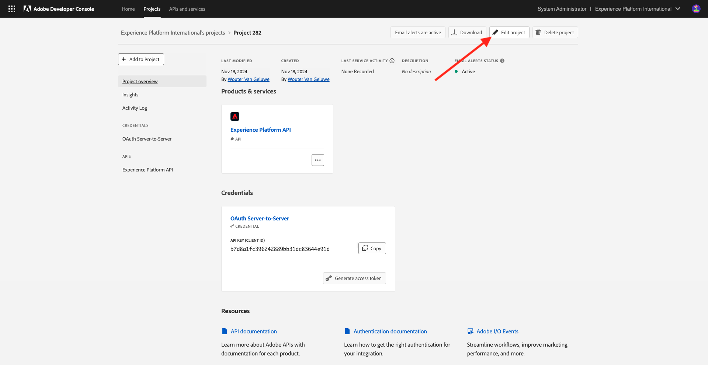
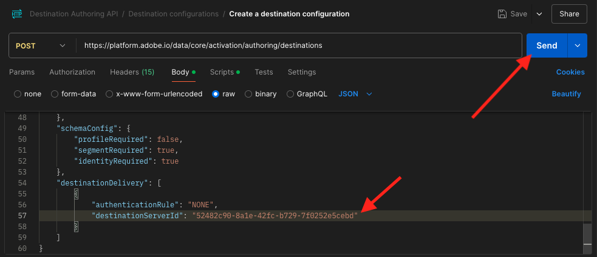

# 2.3.7目标SDK

## 2.3.7.1设置您的Adobe I/O项目

>[!IMPORTANT]
>
>如果您在2021年12月之后创建了Adobe I/O项目，则可以重复使用该项目，跳过本练习并立即转入练习6.7.2。
>
>如果您在2021年12月之前创建了Adobe I/O项目，请创建一个新项目以确保其与目标创作API兼容。

在本练习中，您将集中使用Adobe I/O来针对平台的API进行查询。 请按照以下步骤设置Adobe I/O。

转到[https://developer.adobe.com/console/home](https://developer.adobe.com/console/home)


请确保在屏幕右上角选择正确的Adobe Experience Platform实例。 您的实例为`--envName--`。


单击&#x200B;**新建项目**。

或


选择&#x200B;**+添加到项目**&#x200B;并选择&#x200B;**API**。


您随后将看到以下内容：


单击&#x200B;**Adobe Experience Platform**&#x200B;图标。


单击&#x200B;**Experience PlatformAPI**。


单击&#x200B;**下一步**。


您现在可以选择让Adobe I/O生成安全密钥对，或者上传现有密钥对。

选择&#x200B;**选项1 — 生成密钥对**。


单击&#x200B;**生成密钥对**。


你将会看到旋转图标约30秒。


您随后将看到此内容，并且生成的密钥对将下载为zip文件： **config.zip**。

在桌面上解压缩文件&#x200B;**config.zip**，您会看到它包含2个文件：


- **certificate_pub.crt**&#x200B;是您的公钥证书。 从安全角度来看，这是可自由用于设置与在线应用程序集成的证书。
- **private.key**&#x200B;是您的私钥。 这永远不应该和任何人分享。 私钥是您用于对API实施进行身份验证的密钥，它应该是机密。 如果您与任何人共享您的私钥，则他们可能会访问您的实施并滥用该API，将恶意数据摄取到Platform中，并提取Platform中的所有数据。


确保将&#x200B;**config.zip**&#x200B;文件保存在安全位置，因为您需要此文件以执行后续步骤以及将来访问Adobe I/O和Adobe Experience Platform API。

单击&#x200B;**下一步**。


您现在必须为集成选择&#x200B;**产品配置文件**。

选择所需的产品配置文件。

**仅供参考**：在您的Adobe Experience Platform实例中，产品配置文件将具有不同的命名。 您需要至少选择一个具有适当访问权限的产品配置文件，这些权限是在Adobe Admin Console中设置的。


单击&#x200B;**保存配置的API**。


你将会看到一个旋转图标几秒钟。


接下来，您将看到您的集成。


单击“下载Postman **”按钮，然后单击“**&#x200B;服务帐户(JWT)**”下载Postman环境（在下载环境之前等待，这可能需要几秒钟的时间）。**


向下滚动直到看到&#x200B;**服务帐户(JWT)**，您可以在其中找到用于配置与Adobe Experience Platform集成的所有集成详细信息。


您的IO项目当前具有通用名称。 您需要为集成提供一个友好名称。 按指示单击&#x200B;**项目1**（或类似名称）


单击&#x200B;**编辑项目**。



输入集成的“名称”和“说明”。 作为命名约定，我们将使用`AEP API --aepUserLdap--`。 将ldap替换为您的ldap。
例如，如果您的ldap是vangeluw，则集成的名称和描述将变为AEP API vangeluw。

输入`AEP API --aepUserLdap--`作为&#x200B;**项目标题**。 单击&#x200B;**保存**。


您的Adobe I/O集成现已完成。


## 2.3.7.2 Postman对Adobe I/O的身份验证

转到[https://www.getpostman.com/](https://www.getpostman.com/)。

单击&#x200B;**开始**。


接下来，下载并安装Postman。


安装Postman后，启动应用程序。

在Postman中，有2个概念：环境和收藏集。

- 环境包含所有比较一致或不太一致的环境变量。 在该环境中，您可以找到我们的Platform环境的IMSOrg等内容，以及您的私钥和其他安全凭据。 环境文件是您在上一个练习中的Adobe I/O设置过程中下载的文件，其名称如下： **service.postman_environment.json**。

- 收藏集包含大量您可以使用的API请求。 我们将使用2个收藏集
   - 1个用于AdobeI/0的身份验证的集合
   - 1本模块中的练习的集合
   - 用于Real-Time CDP模块中练习的1个集合，用于目标创作

请将文件[postman.zip](./../../../assets/postman/postman_profile.zip)下载到您的本地桌面。

在此&#x200B;**postman.zip**&#x200B;文件中，您将找到以下文件：

- `_Adobe I-O - Token.postman_collection.json`
- `_Adobe Experience Platform Enablement.postman_collection.json`
- `Destination_Authoring_API.json`

解压缩&#x200B;**postman.zip**&#x200B;文件，并将这3个文件以及从Adobe I/O下载的Postman环境存储在您桌面上的文件夹中。您需要在该文件夹中包含以下4个文件：


返回Postman。 单击&#x200B;**导入**。


单击&#x200B;**上载文件**。


导航到桌面上解压缩4个已下载文件的文件夹。 同时选择这4个文件，然后单击&#x200B;**打开**。


单击&#x200B;**打开**&#x200B;后，Postman将向您显示要导入的环境和收藏集的概述。 单击&#x200B;**导入**。


您现在拥有Postman中开始通过API与Adobe Experience Platform交互所需的一切。

首先要做的是确保您正确通过了身份验证。 要进行身份验证，您需要请求访问令牌。

在执行任何请求之前，请确保选择了正确的环境。 您可以通过验证右上角的环境下拉列表来检查当前选定的环境。

所选环境的名称应类似于以下名称：


单击&#x200B;**eye**&#x200B;图标，然后单击&#x200B;**编辑**&#x200B;以更新环境文件中的私钥。


你会看到这个。 已预填充所有字段，但字段&#x200B;**PRIVATE_KEY**&#x200B;除外。


私钥已在创建Adobe I/O项目时生成。 已下载为名为&#x200B;**config.zip**&#x200B;的zip文件。 将该zip文件提取到桌面。


打开文件夹&#x200B;**config**&#x200B;并使用您选择的文本编辑器打开文件&#x200B;**private.key**。


然后您会看到与此类似的内容，将所有文本复制到剪贴板。


返回Postman并将私钥粘贴到&#x200B;**INITIAL VALUE**&#x200B;和&#x200B;**CURRENT VALUE**&#x200B;列的变量&#x200B;**PRIVATE_KEY**&#x200B;旁边的字段中。 单击&#x200B;**保存**。


您的Postman环境和收藏集现已配置完毕，可正常使用。 您现在可以从Postman向Adobe I/O进行身份验证。

为此，您需要加载外部库，该库将负责通信的加密和解密。 要加载此库，必须执行名为&#x200B;**INIT：为RS256**&#x200B;加载加密库的请求。 在&#x200B;**_Request - Token集合**&#x200B;中选择此Adobe I/O，您将看到它显示在屏幕中央。


单击蓝色的&#x200B;**发送**&#x200B;按钮。 几秒钟后，您应该会在Postman的&#x200B;**Body**&#x200B;部分中看到一个响应：


现在加载加密库后，我们可以对Adobe I/O进行身份验证。

在&#x200B;**\_Request - TokenAdobe I/O**&#x200B;中，选择名为&#x200B;**IMS： JWT Generate + Auth**&#x200B;的请求。 同样，您会看到请求详细信息显示在屏幕中央。


单击蓝色的&#x200B;**发送**&#x200B;按钮。 几秒钟后，您应该会在Postman的&#x200B;**Body**&#x200B;部分中看到一个响应：


如果配置成功，您应该会看到包含以下信息的类似响应：

| 键 | 值 |
|:-------------:| :---------------:| 
| token_type | **持有人** |
| access_token | **eyJ4NXUiOiJpbXNfbmEx...QT7mqZkumN1tdsPEioOEl4087Dg** |
| expires_in | **86399973** |

Adobe I/O为您提供了&#x200B;**持有者** — 令牌，该令牌具有特定值（此很长的access_token）和到期窗口。

我们收到的令牌现在有24小时有效。 这意味着24小时后，如果您要使用Postman对Adobe I/O进行身份验证，则必须通过再次运行此请求来生成新令牌。

## 2.3.7.3定义端点和格式

在本练习中，您需要配置一个端点，以便在区段符合条件时，资格事件可以流式传输到该端点。 在本练习中，您将使用[https://webhook.site/](https://webhook.site/)的示例终结点。 转到[https://webhook.site/](https://webhook.site/)，您将在其中看到与此类似的内容。 单击&#x200B;**复制到剪贴板**&#x200B;以复制URL。 您需要在下一个练习中指定此URL。 此示例中的URL是`https://webhook.site/e0eb530c-15b4-4a29-8b50-e40877d5490a`。


至于格式，我们将使用标准模板，该模板将流区段资格或取消资格与客户标识符等元数据一起。 可以自定义模板以满足特定端点的期望，但在本练习中，我们将重用标准模板，这将产生类似于这样的有效负荷，并将其流式传输到端点。

```json
{
  "profiles": [
    {
      "identities": [
        {
          "type": "ecid",
          "id": "64626768309422151580190219823409897678"
        }
      ],
      "AdobeExperiencePlatformSegments": {
        "add": [
          "f58c723c-f1e5-40dd-8c79-7bb4ab47f041"
        ],
        "remove": []
      }
    }
  ]
}
```

## 2.3.7.4创建服务器和模板配置

在Adobe Experience Platform中创建自己的目标的第一步是创建服务器和模板配置。

为此，请转到&#x200B;**目标创作API**、**目标服务器和模板**，然后单击以打开请求&#x200B;**POST — 创建目标服务器配置**。 你会看到这个。 在&#x200B;**Headers**&#x200B;下，您需要手动更新键&#x200B;**x-sandbox-name**&#x200B;的值并将其设置为`--aepSandboxName--`。 选择值&#x200B;**{{SANDBOX_NAME}}**。


用`--aepSandboxName--`替换它。


接下来，转到&#x200B;**正文**。 选择占位符&#x200B;**{{body}}**。


您现在需要使用以下代码替换占位符&#x200B;**{{body}}**：

```json
{
    "name": "Custom HTTP Destination",
    "destinationServerType": "URL_BASED",
    "urlBasedDestination": {
        "url": {
            "templatingStrategy": "PEBBLE_V1",
            "value": "yourURL"
        }
    },
    "httpTemplate": {
        "httpMethod": "POST",
        "requestBody": {
            "templatingStrategy": "PEBBLE_V1",
            "value": "{\n    \"profiles\": [\n    \n        {\n            \"identities\": [\n            \n            \n                \n                {\n                    \"type\": \"{{ namespace }}\",\n                    \"id\": \"{{ identity.id }}\"\n                },\n                ,\n            \n            ],\n            \"AdobeExperiencePlatformSegments\": {\n                \"add\": [\n                \n                    \"{{ segment.key }}\",\n                \n                ],\n                \"remove\": [\n                {#- Alternative syntax for filtering segments by status: -#}\n                \n                    \"{{ segment.key }}\",\n                \n                ]\n            }\n        },\n    \n    ]\n}"
        },
        "contentType": "application/json"
    }
}
```

粘贴上述代码后，您需要手动更新字段&#x200B;**urlBasedDestination.url.value**，并且需要将其设置为您在上一步中创建的webhook的URL，在本例中为`https://webhook.site/e0eb530c-15b4-4a29-8b50-e40877d5490a`。


更新字段&#x200B;**urlBasedDestiantion.url.value**&#x200B;后，它应该如下所示。 单击&#x200B;**发送**。


单击&#x200B;**发送**&#x200B;后，将创建您的服务器模板，作为响应的一部分，您将看到名为&#x200B;**instanceId**&#x200B;的字段。 请记下它，因为您将在下一步中需要它。 在此示例中，**instanceId**为
`eb0f436f-dcf5-4993-a82d-0fcc09a6b36c`。


## 2.3.7.5创建目标配置

在Postman中的&#x200B;**目标创作API**&#x200B;下，转到&#x200B;**目标配置**&#x200B;并单击以打开POST **请求 — 创建目标配置**。 你会看到这个。 在&#x200B;**Headers**&#x200B;下，您需要手动更新键&#x200B;**x-sandbox-name**&#x200B;的值并将其设置为`--aepSandboxName--`。 选择值&#x200B;**{{SANDBOX_NAME}}**。


用`--aepSandboxName--`替换它。


接下来，转到&#x200B;**正文**。 选择占位符&#x200B;**{{body}}**。


您现在需要使用以下代码替换占位符&#x200B;**{{body}}**：

```json
{
    "name": "--aepUserLdap-- - Webhook",
    "description": "Exports segment qualifications and identities to a custom webhook via Destination SDK.",
    "status": "TEST",
    "customerAuthenticationConfigurations": [
        {
            "authType": "BEARER"
        }
    ],
    "customerDataFields": [
        {
            "name": "endpointsInstance",
            "type": "string",
            "title": "Select Endpoint",
            "description": "We could manage several instances across the globe for REST endpoints that our customers are provisioned for. Select your endpoint in the dropdown list.",
            "isRequired": true,
            "enum": [
                "US",
                "EU",
                "APAC",
                "NZ"
            ]
        }
    ],
    "uiAttributes": {
        "documentationLink": "https://experienceleague.adobe.com/docs/experience-platform/destinations/home.html?lang=en",
        "category": "streaming",
        "connectionType": "Server-to-server",
        "frequency": "Streaming"
    },
    "identityNamespaces": {
        "ecid": {
            "acceptsAttributes": true,
            "acceptsCustomNamespaces": false
        }
    },
    "segmentMappingConfig": {
        "mapExperiencePlatformSegmentName": true,
        "mapExperiencePlatformSegmentId": true,
        "mapUserInput": false
    },
    "aggregation": {
        "aggregationType": "BEST_EFFORT",
        "bestEffortAggregation": {
            "maxUsersPerRequest": "1000",
            "splitUserById": false
        }
    },
    "schemaConfig": {
        "profileRequired": false,
        "segmentRequired": true,
        "identityRequired": true
    },
    "destinationDelivery": [
        {
            "authenticationRule": "NONE",
            "destinationServerId": "yourTemplateInstanceID"
        }
    ]
}
```


粘贴上述代码后，您需要手动更新&#x200B;**destinationDelivery字段。 destinationServerId**，并且需要将其设置为在上一步中创建的目标服务器模板的&#x200B;**instanceId**，在本例中为`eb0f436f-dcf5-4993-a82d-0fcc09a6b36c`。 接下来，单击&#x200B;**发送**。



您随后将看到此响应。


现在，您的目标已在Adobe Experience Platform中创建。 我们到那里去检查一下。

转到[Adobe Experience Platform](https://experience.adobe.com/platform)。 登录后，您将登录到Adobe Experience Platform的主页。


在继续之前，您需要选择一个&#x200B;**沙盒**。 要选择的沙盒名为``--aepSandboxName--``。 您可以通过单击屏幕顶部蓝线中的文本&#x200B;**[!UICONTROL Production Prod]**&#x200B;来执行此操作。 选择适当的[!UICONTROL 沙盒]后，您将看到屏幕更改，现在您已经进入专用的[!UICONTROL 沙盒]。


在左侧菜单中，转到&#x200B;**目标**，单击&#x200B;**目录**，然后向下滚动到类别&#x200B;**流**。 您现在将看到您的目标在那里可用。


## 2.3.7.6将您的区段链接到目标

在&#x200B;**目标** > **目录**&#x200B;中，单击目标上的&#x200B;**设置**&#x200B;以开始向新目标添加区段。


输入虚拟持有者令牌，如&#x200B;**1234**。 单击&#x200B;**连接到目标**。


你会看到这个。 作为目标的名称，请使用`--aepUserLdap-- - Webhook`。 选择所选的端点，在此示例中为&#x200B;**EU**。 单击&#x200B;**下一步**。


您可以选择数据治理策略。 单击&#x200B;**下一步**。


选择您之前创建的名为`--aepUserLdap-- - Interest in PROTEUS FITNESS JACKSHIRT`的区段。 单击&#x200B;**下一步**。


你会看到这个。 确保将&#x200B;**SOURCE FIELD** `--aepTenantId--.identification.core.ecid`映射到字段`Identity: ecid`。 单击&#x200B;**下一步**。


单击&#x200B;**完成**。


您的目标现已上线，新的区段资格将立即流式传输到您的自定义webhook。


## 2.3.7.7测试区段激活

转到[https://builder.adobedemo.com/projects](https://builder.adobedemo.com/projects)。 使用Adobe ID登录后，您将看到此内容。 单击您的网站项目以将其打开。


您现在可以按照以下流程访问该网站。 单击&#x200B;**集成**。


在&#x200B;**集成**&#x200B;页面上，您需要选择在练习0.1中创建的数据收集属性。


随后您将看到您的演示网站已打开。 选择URL并将其复制到剪贴板。


打开一个新的无痕浏览器窗口。


粘贴您在上一步中复制的演示网站的URL。 然后，系统将要求您使用Adobe ID登录。


选择您的帐户类型并完成登录过程。


然后，您会看到您的网站已加载到无痕浏览器窗口中。 对于每个演示，您将需要使用新的无痕浏览器窗口来加载演示网站URL。


从&#x200B;**Luma**&#x200B;主页，转到&#x200B;**Men**，然后单击产品&#x200B;**PROTEUS FITNESS JACKSHIRT**。


您现在已访问&#x200B;**PROTEUS FITNESS JACKSHIRT**&#x200B;的产品页面，这意味着您现在有资格参加在此练习中之前创建的区段。


当您打开配置文件查看器并转到&#x200B;**区段**&#x200B;时，您将看到该区段符合条件。


现在，返回到[https://webhook.site/](https://webhook.site/)上打开的webhook，您应会看到一个新的传入请求，该请求源自Adobe Experience Platform并且包含区段鉴别事件。


下一步：[摘要和优点](./summary.md)

[返回模块2.3](./real-time-cdp-build-a-segment-take-action.md)

[返回所有模块](../../../overview.md)
