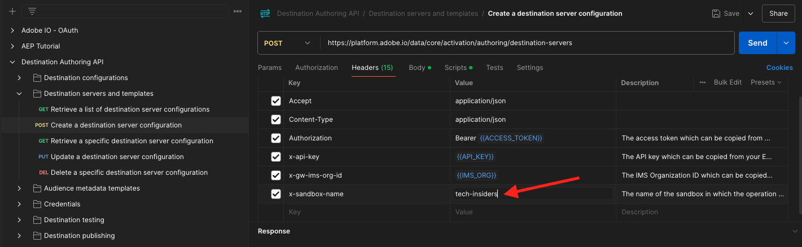
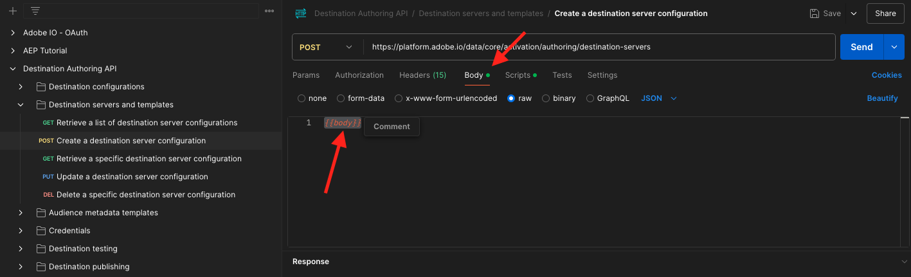
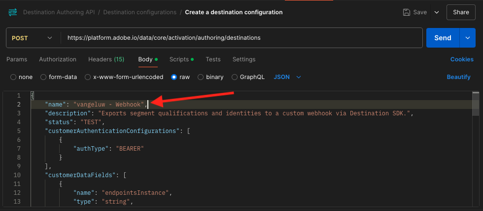
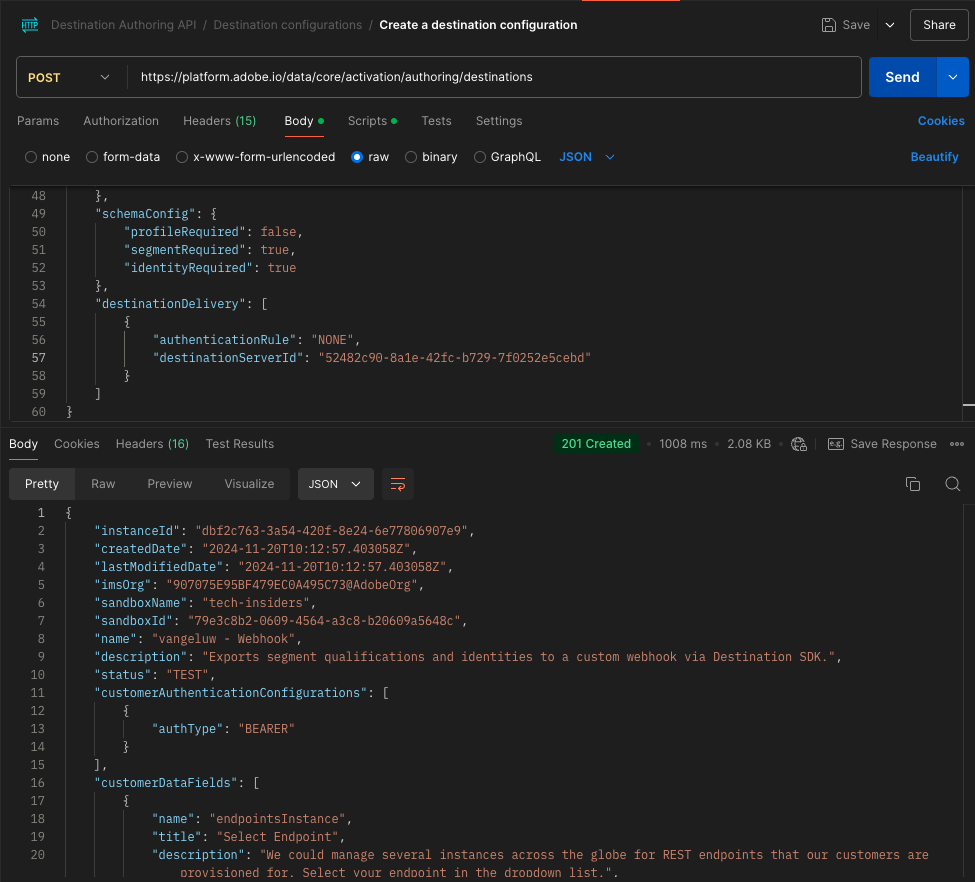

# 2.3.7目标SDK

## 设置您的Adobe I/O项目

在本练习中，您将再次使用Adobe I/O来查询Adobe Experience Platform的API。如果尚未配置Adobe I/O项目，请返回模块2.1](../module2.1/ex3.md)中的[练习3，然后按照其中的说明操作。

## 对Adobe I/O进行Postman身份验证

在本练习中，您将再次使用Postman来查询Adobe Experience Platform的API。如果尚未配置Postman应用程序，请返回模块2.1](../module2.1/ex3.md)中的[练习3，然后按照其中的说明操作。

## 定义端点和格式

在本练习中，您需要配置一个端点，以便在区段符合条件时，资格事件可以流式传输到该端点。 在本练习中，您将使用[https://webhook.site/](https://webhook.site/)的示例终结点。 转到[https://webhook.site/](https://webhook.site/)，您将在其中看到与此类似的内容。 单击&#x200B;**复制到剪贴板**&#x200B;以复制URL。 您需要在下一个练习中指定此URL。 此示例中的URL是`https://webhook.site/e0eb530c-15b4-4a29-8b50-e40877d5490a`。


至于格式，我们将使用标准模板，该模板将流区段资格或取消资格与客户标识符等元数据一起。 可以自定义模板以满足特定端点的期望，但在本练习中，我们将重用标准模板，这将产生类似于这样的有效负荷，并将其流式传输到端点。

```json
{
  "profiles": [
    {
      "identities": [
        {
          "type": "ecid",
          "id": "64626768309422151580190219823409897678"
        }
      ],
      "AdobeExperiencePlatformSegments": {
        "add": [
          "f58c723c-f1e5-40dd-8c79-7bb4ab47f041"
        ],
        "remove": []
      }
    }
  ]
}
```

## 创建服务器和模板配置

在Adobe Experience Platform中创建自己的目标的第一步是创建服务器和模板配置。

为此，请转到&#x200B;**目标创作API**、**目标服务器和模板**，然后单击以打开请求&#x200B;**POST — 创建目标服务器配置**。 你会看到这个。 在&#x200B;**Headers**&#x200B;下，您需要手动更新键&#x200B;**x-sandbox-name**&#x200B;的值并将其设置为`--aepSandboxName--`。 选择值&#x200B;**{{SANDBOX_NAME}}**。


用`--aepSandboxName--`替换它。



接下来，转到&#x200B;**正文**。 选择占位符&#x200B;**{{body}}**。



您现在需要使用以下代码替换占位符&#x200B;**{{body}}**：

```json
{
    "name": "Custom HTTP Destination",
    "destinationServerType": "URL_BASED",
    "urlBasedDestination": {
        "url": {
            "templatingStrategy": "PEBBLE_V1",
            "value": "yourURL"
        }
    },
    "httpTemplate": {
        "httpMethod": "POST",
        "requestBody": {
            "templatingStrategy": "PEBBLE_V1",
            "value": "{\n    \"profiles\": [\n    \n        {\n            \"identities\": [\n            \n            \n                \n                {\n                    \"type\": \"{{ namespace }}\",\n                    \"id\": \"{{ identity.id }}\"\n                },\n                ,\n            \n            ],\n            \"AdobeExperiencePlatformSegments\": {\n                \"add\": [\n                \n                    \"{{ segment.key }}\",\n                \n                ],\n                \"remove\": [\n                {#- Alternative syntax for filtering segments by status: -#}\n                \n                    \"{{ segment.key }}\",\n                \n                ]\n            }\n        },\n    \n    ]\n}"
        },
        "contentType": "application/json"
    }
}
```

粘贴上述代码后，您需要手动更新字段&#x200B;**urlBasedDestination.url.value**，并且需要将其设置为您在上一步中创建的webhook的URL，在本例中为`https://webhook.site/e0eb530c-15b4-4a29-8b50-e40877d5490a`。


更新字段&#x200B;**urlBasedDestiantion.url.value**&#x200B;后，它应该如下所示。 单击&#x200B;**发送**。


单击&#x200B;**发送**&#x200B;后，将创建您的服务器模板，作为响应的一部分，您将看到名为&#x200B;**instanceId**&#x200B;的字段。 请记下它，因为您将在下一步中需要它。 在此示例中，**instanceId**为
`eb0f436f-dcf5-4993-a82d-0fcc09a6b36c`。


## 创建目标配置

在Postman中的&#x200B;**目标创作API**&#x200B;下，转到&#x200B;**目标配置**&#x200B;并单击以打开POST **请求 — 创建目标配置**。 你会看到这个。 在&#x200B;**Headers**&#x200B;下，您需要手动更新键&#x200B;**x-sandbox-name**&#x200B;的值并将其设置为`--aepSandboxName--`。 选择值&#x200B;**{{SANDBOX_NAME}}**。


用`--aepSandboxName--`替换它。


接下来，转到&#x200B;**正文**。 选择占位符&#x200B;**{{body}}**。


您现在需要使用以下代码替换占位符&#x200B;**{{body}}**：

```json
{
    "name": "--aepUserLdap-- - Webhook",
    "description": "Exports segment qualifications and identities to a custom webhook via Destination SDK.",
    "status": "TEST",
    "customerAuthenticationConfigurations": [
        {
            "authType": "BEARER"
        }
    ],
    "customerDataFields": [
        {
            "name": "endpointsInstance",
            "type": "string",
            "title": "Select Endpoint",
            "description": "We could manage several instances across the globe for REST endpoints that our customers are provisioned for. Select your endpoint in the dropdown list.",
            "isRequired": true,
            "enum": [
                "US",
                "EU",
                "APAC",
                "NZ"
            ]
        }
    ],
    "uiAttributes": {
        "documentationLink": "https://experienceleague.adobe.com/docs/experience-platform/destinations/home.html?lang=en",
        "category": "streaming",
        "connectionType": "Server-to-server",
        "frequency": "Streaming"
    },
    "identityNamespaces": {
        "ecid": {
            "acceptsAttributes": true,
            "acceptsCustomNamespaces": false
        }
    },
    "segmentMappingConfig": {
        "mapExperiencePlatformSegmentName": true,
        "mapExperiencePlatformSegmentId": true,
        "mapUserInput": false
    },
    "aggregation": {
        "aggregationType": "BEST_EFFORT",
        "bestEffortAggregation": {
            "maxUsersPerRequest": "1000",
            "splitUserById": false
        }
    },
    "schemaConfig": {
        "profileRequired": false,
        "segmentRequired": true,
        "identityRequired": true
    },
    "destinationDelivery": [
        {
            "authenticationRule": "NONE",
            "destinationServerId": "yourTemplateInstanceID"
        }
    ]
}
```



粘贴上述代码后，您需要手动更新&#x200B;**destinationDelivery字段。 destinationServerId**，并且需要将其设置为在上一步中创建的目标服务器模板的&#x200B;**instanceId**，在本例中为`eb0f436f-dcf5-4993-a82d-0fcc09a6b36c`。 接下来，单击&#x200B;**发送**。


您随后将看到此响应。



现在，您的目标已在Adobe Experience Platform中创建。 我们到那里去检查一下。

转到[Adobe Experience Platform](https://experience.adobe.com/platform)。 登录后，您将登录到Adobe Experience Platform的主页。


在继续之前，您需要选择一个&#x200B;**沙盒**。 要选择的沙盒名为``--aepSandboxName--``。 您可以通过单击屏幕顶部蓝线中的文本&#x200B;**[!UICONTROL Production Prod]**&#x200B;来执行此操作。 选择适当的[!UICONTROL 沙盒]后，您将看到屏幕更改，现在您已经进入专用的[!UICONTROL 沙盒]。


在左侧菜单中，转到&#x200B;**目标**，单击&#x200B;**目录**，然后向下滚动到类别&#x200B;**流**。 您现在将看到您的目标在那里可用。


## 将您的区段链接到目标

在&#x200B;**目标** > **目录**&#x200B;中，单击目标上的&#x200B;**设置**&#x200B;以开始向新目标添加区段。


输入虚拟持有者令牌，如&#x200B;**1234**。 单击&#x200B;**连接到目标**。


你会看到这个。 作为目标的名称，请使用`--aepUserLdap-- - Webhook`。 选择所选的端点，在此示例中为&#x200B;**EU**。 单击&#x200B;**下一步**。


您可以选择数据治理策略。 单击&#x200B;**下一步**。


选择您之前创建的名为`--aepUserLdap-- - Interest in PROTEUS FITNESS JACKSHIRT`的区段。 单击&#x200B;**下一步**。


你会看到这个。 确保将&#x200B;**SOURCE FIELD** `--aepTenantId--.identification.core.ecid`映射到字段`Identity: ecid`。 单击&#x200B;**下一步**。


单击&#x200B;**完成**。


您的目标现已上线，新的区段资格将立即流式传输到您的自定义webhook。


## 测试区段激活

转到[https://builder.adobedemo.com/projects](https://builder.adobedemo.com/projects)。 使用Adobe ID登录后，您将看到此内容。 单击您的网站项目以将其打开。


您现在可以按照以下流程访问该网站。 单击&#x200B;**集成**。


在&#x200B;**集成**&#x200B;页面上，您需要选择在练习0.1中创建的数据收集属性。


随后您将看到您的演示网站已打开。 选择URL并将其复制到剪贴板。


打开一个新的无痕浏览器窗口。


粘贴您在上一步中复制的演示网站的URL。 然后，系统将要求您使用Adobe ID登录。


选择您的帐户类型并完成登录过程。


然后，您会看到您的网站已加载到无痕浏览器窗口中。 对于每个演示，您将需要使用新的无痕浏览器窗口来加载演示网站URL。


从&#x200B;**Luma**&#x200B;主页，转到&#x200B;**Men**，然后单击产品&#x200B;**PROTEUS FITNESS JACKSHIRT**。


您现在已访问&#x200B;**PROTEUS FITNESS JACKSHIRT**&#x200B;的产品页面，这意味着您现在有资格参加在此练习中之前创建的区段。


当您打开配置文件查看器并转到&#x200B;**区段**&#x200B;时，您将看到该区段符合条件。


现在，返回到[https://webhook.site/](https://webhook.site/)上打开的webhook，您应会看到一个新的传入请求，该请求源自Adobe Experience Platform并且包含区段鉴别事件。


下一步：[摘要和优点](./summary.md)

[返回模块2.3](./real-time-cdp-build-a-segment-take-action.md)

[返回所有模块](../../../overview.md)
