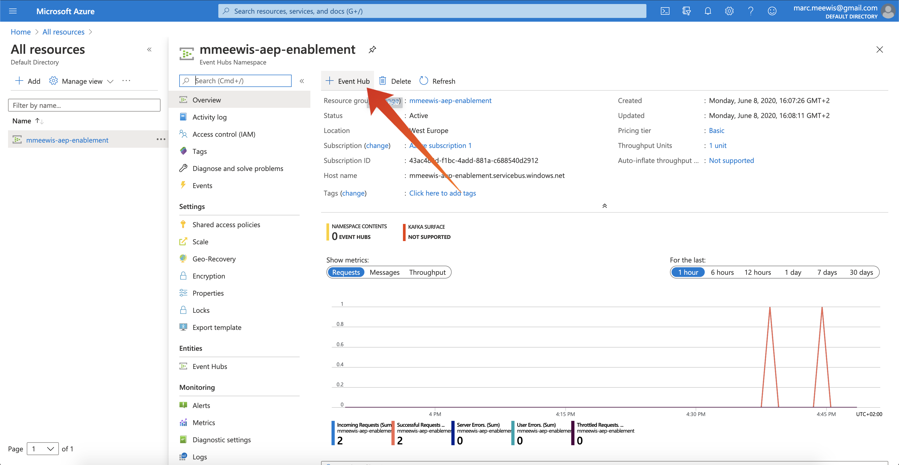
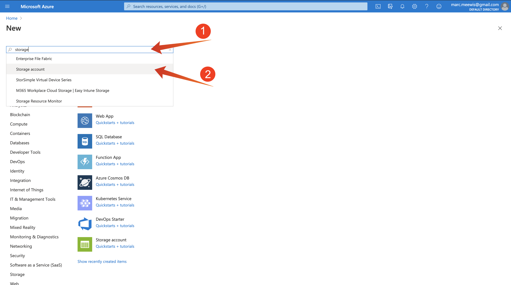

# 2.4.1配置Microsoft Azure EventHub环境

Azure事件中心是一种高度可扩展的发布 — 订阅服务，每秒可以摄取数百万个事件并将它们流式传输到多个应用程序中。 这使您能够处理和分析由连接的设备和应用程序产生的大量数据。

## 2.4.1.1什么是Azure事件中心？

Azure事件中心是一个大数据流式传输平台和事件摄取服务。 它每秒可以接收和处理数百万个事件。 发送到事件中心的数据可以使用任何实时分析提供程序或批处理/存储适配器进行转换和存储。

事件中心代表事件管道的&#x200B;**前门**，在解决方案体系结构中通常称为事件引入器。 事件摄取器是位于事件发布者(如Adobe Experience Platform RTCDP)和事件使用者之间的组件或服务，用于将事件流的生产与事件的消费分离。 事件中心提供了一个具有时间保留缓冲的统一流平台，将事件生成器与事件使用者分离。

## 2.4.1.2创建事件中心命名空间

转到[https://portal.azure.com/#home](https://portal.azure.com/#home)并选择&#x200B;**创建资源**。

在资源屏幕中，在搜索栏中输入&#x200B;**事件**，然后从下拉列表中选择&#x200B;**事件中心**：

单击&#x200B;**创建**：

如果这是您第一次在Azure中创建资源，则需要创建新的&#x200B;**资源组**。 如果您已经有一个资源组，则可以选择该资源组（或创建一个新资源组）。

选择&#x200B;**新建**，为您的组命名`--aepUserLdap---aep-enablement`。

完成字段的测试，如下所示：

- 命名空间：定义您的命名空间，命名空间必须是唯一的，请使用以下模式`--aepUserLdap---aep-enablement`
- 位置： **西欧**&#x200B;是指位于阿姆斯特丹的Azure数据中心
- 定价层： **基本**
- 吞吐量单位： **1**

单击&#x200B;**审阅+创建**。

单击&#x200B;**创建**。

资源组的部署可能需要1-2分钟，如果部署成功，您将看到以下屏幕：

## 2.4.1.3在Azure中设置事件中心

转到[https://portal.azure.com/#home](https://portal.azure.com/#home)并选择&#x200B;**所有资源**。

从资源列表中，选择您的`--aepUserLdap---aep-enablement`命名空间：

在`--aepUserLdap---aep-enablement`详细信息屏幕中，选择&#x200B;**事件中心**：

单击&#x200B;**+事件中心**。

使用`--aepUserLdap---aep-enablement-event-hub`作为名称，然后单击&#x200B;**创建**。

单击事件中心命名空间中的&#x200B;**事件中心**。 您现在应该会看到列出您的&#x200B;**事件中心**。 如果是这种情况，您可以继续进行下一个练习。

## 2.4.1.4设置您的Azure存储帐户

要在以后的练习中调试您的Azure事件中心函数，您需要在Visual Studio代码项目设置中提供Azure存储帐户。 您现在将创建该Azure存储帐户。

转到[https://portal.azure.com/#home](https://portal.azure.com/#home)并选择&#x200B;**创建资源**。

在搜索中输入&#x200B;**存储**，然后从列表中选择&#x200B;**存储帐户**。

选择&#x200B;**创建**。

指定您的&#x200B;**资源组**（在本练习开始时创建），使用`--aepUserLdap--aepstorage`作为存储帐户名称，并选择&#x200B;**本地冗余存储(LRS)**，然后单击&#x200B;**查看+创建**。

单击&#x200B;**创建**。

您的存储帐户创建将需要几秒钟的时间：

完成后，屏幕将显示&#x200B;**转到资源**&#x200B;按钮。

单击&#x200B;**Microsoft Azure**。

您的存储帐户现在显示在&#x200B;**最近的资源**&#x200B;下。

下一步： [2.4.2在Adobe Experience Platform中配置Azure事件中心目标](./ex2.md)

[返回模块2.4](./segment-activation-microsoft-azure-eventhub.md)

[返回所有模块](./../../../overview.md)
