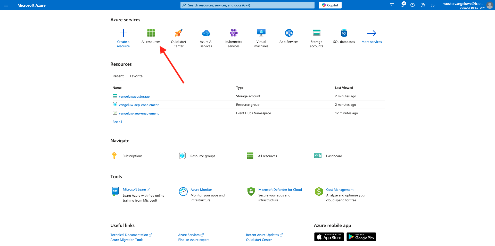
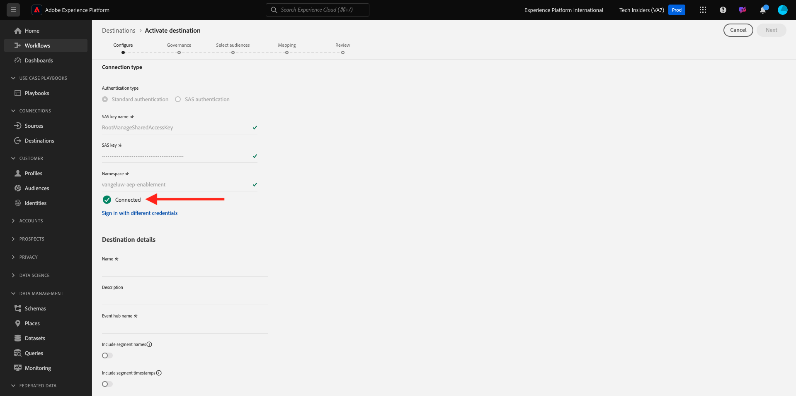
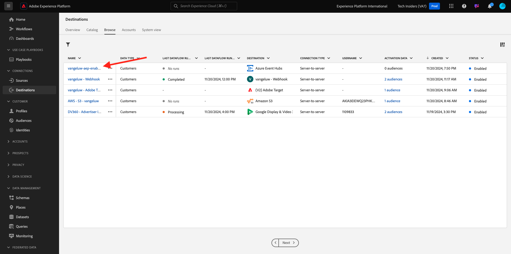

# 2.4.3在Adobe Experience Platform中配置Azure事件中心目标

## 标识所需的Azure连接参数

要在Adobe Experience Platform中配置事件中心目标，您需要执行以下操作：

- 事件中心命名空间
- 事件中心
- Azure SAS密钥名称
- Azure SAS密钥

在上一个练习中已定义事件中心和EventHub命名空间：[在Azure中设置事件中心](./ex2.md)

### 事件中心命名空间

要在Azure Portal中查找上述信息，请导航到[https://portal.azure.com/#home](https://portal.azure.com/#home)。 确保使用正确的Azure帐户。

单击Azure门户中的&#x200B;**所有资源**：

在列表中查找您的&#x200B;**事件中心命名空间**&#x200B;并单击它。

**事件中心命名空间**&#x200B;的名称现在清晰可见。 它应类似于`--aepUserLdap---aep-enablement`。

### 事件中心

在&#x200B;**事件中心命名空间**&#x200B;页上，单击&#x200B;**实体>事件中心**&#x200B;以获取在事件中心命名空间中定义的事件中心列表，如果遵循上一步练习中使用的命名约定，您将找到名为`--aepUserLdap---aep-enablement-event-hub`的事件中心。 记下它，您将在下一个练习中需要它。

### SAS密钥名称

在您的&#x200B;**事件中心命名空间**&#x200B;页面上，单击&#x200B;**设置>共享访问策略**。 您将看到共享访问策略的列表。 我们正在查找的SAS密钥是&#x200B;**RootManageSharedAccessKey**，即**SAS密钥名称。 写下来。

### SAS密钥值

接下来，单击&#x200B;**RootManageSharedAccessKey**&#x200B;以获取SAS密钥值。 按&#x200B;**复制到剪贴板**&#x200B;图标复制&#x200B;**主键**，在本例中为`pqb1jEC0KLazwZzIf2gTHGr75Z+PdkYgv+AEhObbQEY=`。

### 目标值摘要

此时，您应该已经确定了在Adobe Experience Platform Real-time CDP中定义Azure事件中心目标所需的所有值。

| 目标属性名称 | 目标属性值 | 示例值 |
|---|---|---|
| sasKeyName | SAS密钥名称 | RootManageSharedAccessKey |
| sasKey | SAS密钥值 | pqb1jEC0KLazwZzIf2gTHGr75Z+PdkYgv+AEhObbQEY= |
| 命名空间 | 事件中心命名空间 | `--aepUserLdap---aep-enablement` |
| eventHubName | 事件中心 | `--aepUserLdap---aep-enablement-event-hub` |

## 在Adobe Experience Platform中创建Azure事件中心目标

通过转到以下URL登录Adobe Experience Platform： [https://experience.adobe.com/platform](https://experience.adobe.com/platform)。

登录后，您将登录到Adobe Experience Platform的主页。

在继续之前，您需要选择一个&#x200B;**沙盒**。 要选择的沙盒名为``--aepSandboxName--``。 选择相应的沙盒后，您将看到屏幕变化，现在您位于专用沙盒中。

转到&#x200B;**目标**，然后转到&#x200B;**目录**。 选择&#x200B;**云存储**，转到&#x200B;**Azure事件中心**，然后单击&#x200B;**设置**。

选择&#x200B;**标准身份验证**。 填写您在上一个练习中收集的连接详细信息。 接下来，单击&#x200B;**连接到目标**。

如果凭据正确，您将看到确认：**已连接**。

您现在需要以`--aepUserLdap---aep-enablement`格式输入名称和描述。 输入&#x200B;**eventHubName**（参阅上一个练习，它看起来像这样： `--aepUserLdap---aep-enablement-event-hub`），然后单击&#x200B;**下一步**。

您可以选择数据管理策略。 单击&#x200B;**保存并退出**。

您的目标现已创建并可在Adobe Experience Platform中使用。

下一步：[2.4.4创建受众](./ex4.md)

[返回模块2.4](./segment-activation-microsoft-azure-eventhub.md)

[返回所有模块](./../../../overview.md)
